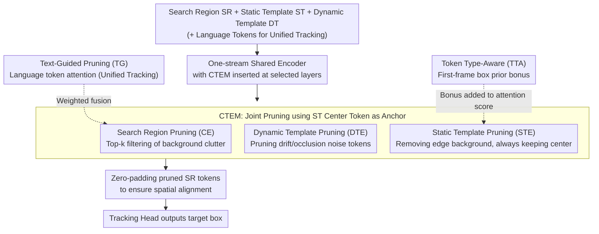

# UTPTrack: Towards Simple and Unified Token Pruning for Visual Tracking

**Conference**: CVPR2026  
**arXiv**: [2602.23734](https://arxiv.org/abs/2602.23734)  
**Code**: [EIT-NLP/UTPTrack](https://github.com/EIT-NLP/UTPTrack)  
**Area**: Video Understanding / Visual Object Tracking  
**Keywords**: token pruning, visual object tracking, one-stream transformer, multimodal tracking, unified tracking, attention-guided pruning

## TL;DR

Ours proposes UTPTrack, the first unified framework to **jointly prune tokens across three components: Search Region (SR), Dynamic Template (DT), and Static Template (ST)** within one-stream Transformer trackers. It achieves 65–67% visual token reduction in RGB and multimodal/language-guided tracking while maintaining 99.7%–100.5% of baseline performance.

## Background & Motivation

**One-stream Transformer trackers show superior performance but high computational cost**: Architectures like OSTrack and SUTrack jointly encode templates and search regions for stronger global representations. However, the quadratic complexity of Transformers combined with large video token counts makes real-time deployment difficult.

**Existing token pruning methods target only single components**: Prior work (e.g., CE in OSTrack, ProContEXT) focuses solely on pruning the search region or dynamic templates, ignoring the mutual dependencies between SR, DT, and ST.

**Isolated pruning leads to suboptimal decisions**: Redundancy levels vary across components. Processing them separately fails to capture cross-component relationships, potentially leading to the accidental deletion of useful tokens or retention of redundancy, compromising spatial consistency and semantic integrity.

**Issues are exacerbated in multimodal scenarios**: Unified tracking requires aligning RGB with depth, thermal, event, or language modalities. Isolated pruning could disrupt cross-modal alignment.

**External heuristics or auxiliary modules introduce extra overhead**: Methods like ToMe rely on bipartite soft matching, while DynamicViT requires additional MLPs for saliency prediction, introducing structural modifications and computational costs.

**Lack of a general efficiency solution for unified tracking**: Most existing efficient methods target single-modality RGB tracking. Whether a single pruning strategy can serve RGB, RGBD, RGBT, RGBE, and RGB-Language tasks simultaneously remains unexplored.

## Method

### Overall Architecture

UTPTrack aims to provide a general efficiency solution for one-stream Transformer trackers. It concatenates the Search Region (SR), Static Template (ST), Dynamic Template (DT), and optional language tokens into a shared encoder. Lightweight **CTEM (Candidate or Template Elimination Module)** units are inserted at selected encoding layers to calculate token importance scores directly from attention weights for pruning. Pruned SR tokens are zero-padded back to their original spatial positions to ensure spatial alignment for the tracking head. Unlike prior methods, it models redundancy across all three components jointly. Within CTEM, attention-guided pruning (CE / DTE / STE) is performed for SR, DT, and ST respectively, regulated by Token Type-Aware (TTA) box priors and Text-Guided (TG) language signals.

### Key Designs

**1. Search Region Pruning (CE): Filtering background clutter using template center as anchor**

Using the ST center token query and all SR token keys, the attention similarity is calculated as $\omega_x = \text{softmax}(Q_{sz'}K_x^T / \sqrt{d_k})$. Top-k tokens are retained while background clutter is removed.

**2. Dynamic Template Pruning (DTE): Pruning noise tokens introduced by drift or occlusion**

Similarly, the ST center token is used as an anchor to calculate DT token similarity $\omega_{dz}$, removing noise tokens resulting from drift, occlusion, or appearance changes.

**3. Static Template Pruning (STE): Removing template edge background while retaining the center**

ST internal token similarity to the center token $\omega_{sz}$ is calculated to remove edge background tokens, while the center token is always preserved.

**4. Token Type-Aware Strategy (TTA): Preventing foreground deletion via first-frame box priors**

To address cases where attention scores might misidentify foreground tokens, a binary mask is constructed from the first-frame target bounding box. Patch-level foreground scores are added as a bonus to attention scores. Three strategies are provided: full bonus (all pixels in box), soft bonus (average, default), and all bonus (any pixel in box).

**5. Text-Guided Pruning (TG): Integrating text signals for token retention in language tasks**

In RGB-Language tasks, language tokens (CLIP-L encoded) interact with visual tokens via bi-directional attention. Token importance is determined by a weighted sum of attention from both the ST center token and language tokens: $\omega_x = \phi(\text{softmax}(Q_{sz'}K_x^T/\sqrt{d_k}) + \text{softmax}(Q_tK_x^T/\sqrt{d_k}))$.

### Loss & Training

- **RGB Tracking**: $\mathcal{L}_{\text{RGB}} = \lambda_{\text{cls}}\mathcal{L}_{\text{cls}} + \lambda_{\text{giou}}\mathcal{L}_{\text{giou}} + \lambda_{L_1}\mathcal{L}_{L_1}$, where $\lambda_{\text{cls}}=1, \lambda_{\text{giou}}=2, \lambda_{L_1}=5$.
- **Unified Tracking**: Adds a task identification cross-entropy loss $\mathcal{L}_{\text{Unified}} = \mathcal{L}_{\text{RGB}} + \lambda_{\text{task}}\mathcal{L}_{\text{task}}$, where $\lambda_{\text{task}}=1$.

## Key Experimental Results

### Main Results

Evaluations were conducted on 10 benchmarks covering RGB (LaSOT, LaSOText, TrackingNet, GOT-10k) and multimodal (VOT-RGBD22, LasHeR, RGBT234, VisEvent, TNL2K, OTB99) tasks:

| Model | Baseline | Visual Token Reduction | MACs Reduction | Baseline Perf. Retention |
|------|------|:---:|:---:|:---:|
| UTPTrack-O384 | OSTrack-384 | 65.4% | 31.3% (78G→53G) | 99.7% |
| UTPTrack-S384 | SUTrack-B384 | 67.5% | 28.4% (67G→48G) | 100.5% |
| UTPTrack-O256 | OSTrack-256 | 64.8% | 30.7% | 99.7% |
| UTPTrack-S224 | SUTrack-B224 | 69.4% | 28.9% | 100.0% |

In Controlled-Budget experiments with fixed retention ratios (87.2%/75.5%/65.6%), UTPTrack outperformed CE, ToMe, EViT, and DynamicViT across all tiers.

### Ablation Study

| Configuration | Avg. Visual Tokens | MACs (G) | Avg. Perf. | Δ |
|------|:---:|:---:|:---:|:---:|
| Baseline (OSTrack256) | 384 | 34.5 | 100.0% | - |
| + CE | 217 | 27.0 | 99.3% | -0.7% |
| + DTE | 176 | 25.4 | 99.6% | +0.3% |
| + STE | 135 | 23.8 | 98.9% | -0.7% |
| + TTA | 135 | 23.8 | 99.7% | +0.8% |

Unified Tracking Ablation (SUTrack224): Progressively adding CE → DTE → STE → TTA → TG reduced tokens from 294 to 90 (69.4% reduction) while restoring performance to 100.0%.

### Key Findings

- **Pruning as Regularization**: Under moderate pruning, UTPTrack can exceed the baseline (100.5% for UTPTrack-S384), suggesting that removing redundancy/noise allows the model to focus on salient regions.
- **Significant Recovery from TTA**: The bounding box prior via soft bonus effectively prevents foreground deletion, recovering +0.8% on RGB and +0.4% on unified tracking.
- **TG Gain for Language Tasks**: For multimodal tasks involving language, text-guided pruning provides an additional +0.3% performance boost.
- **Advantage at High Compression**: At an extreme 64.6% reduction, UTPTrack maintains 99.3% performance (unified), whereas DynamicViT collapses to 14.7% and ToMe drops to 92.5%.

## Highlights & Insights

- **First Joint Three-Component Pruning**: Breaks the limitation of pruning only the search region or dynamic templates by modeling SR+DT+ST redundancy unifiedly.
- **Zero Extra Parameters/Modules**: Directly reuses Transformer attention weights for pruning without adding trainable parameters or modifying the core architecture.
- **Dual Priors (TTA + TG)**: TTA leverages spatial priors to protect the foreground, while TG utilizes semantic message passing to enhance multimodal pruning.
- **Strong Cross-Modal Generality**: A single framework serves RGB, RGBD, RGBT, RGBE, and RGB-Language tasks, validated across 10 benchmarks.

## Limitations & Future Work

- Limited actual GPU acceleration: While tokens are reduced by 65%, FPS gains are modest (e.g., OSTrack384 from 40 to 47 FPS) because zero-padding to restore spatial layout offsets some gains.
- Validated only on OSTrack and SUTrack; not yet extended to other tracking architectures (e.g., SeqTrack, ARTrack).
- TTA strategy for ST depends on the accuracy of the first-frame bounding box, which may be sensitive to noisy initial annotations.
- Language-guided pruning uses a single CLIP token for text, which may be too coarse for complex textual descriptions.

## Related Work & Insights

- **One-stream Trackers**: OSTrack (ECCV'22), SUTrack (ECCV'24), and MixFormerV2 jointly encode templates and search regions.
- **Token Pruning/Merging**: CE (OSTrack) and ProContEXT only prune SR; ToMe uses bipartite matching for merging; EViT retains tokens based on CLS attention; DynamicViT uses MLPs for saliency prediction.
- **Unified Multimodal Tracking**: UnTrack learns a shared low-rank latent space; SUTrack unifies five types of tasks; Parameter-Efficient Fine-Tuning (PEFT) methods like prompts/adapters inject modal information.

## Rating

- Novelty: ⭐⭐⭐⭐ — First joint three-component pruning with TTA and TG; well-motivated and practical.
- Experimental Thoroughness: ⭐⭐⭐⭐⭐ — 10 benchmarks, two baselines, three controlled budgets, and detailed progressive ablation analyses.
- Writing Quality: ⭐⭐⭐⭐ — Clear structure, complete mathematical derivation, and rich visualizations.
- Value: ⭐⭐⭐⭐ — Simple and universal method with strong reference value for one-stream tracker efficiency, though actual acceleration requires further optimization.

<!-- RELATED:START -->

## Related Papers

- [\[CVPR 2026\] An Efficient Token Compression Framework for Visual Object Tracking](an_efficient_token_compression_framework_for_visual_object_tracking.md)
- [\[CVPR 2025\] DivPrune: Diversity-Based Visual Token Pruning for Large Multimodal Models](../../CVPR2025/video_understanding/divprune_diversity-based_visual_token_pruning_for_large_multimodal_models.md)
- [\[ICML 2026\] Unified Multimodal Visual Tracking with Dual Mixture-of-Experts](../../ICML2026/video_understanding/unified_multimodal_visual_tracking_with_dual_mixture-of-experts.md)
- [\[CVPR 2026\] Drift-Resilient Temporal Priors for Visual Tracking](drift-resilient_temporal_priors_for_visual_tracking.md)
- [\[CVPR 2026\] Unified Spatiotemporal Token Compression for Video-LLMs at Ultra-Low Retention](unified_spatiotemporal_token_compression_for_video-llms_at_ultra-low_retention.md)

<!-- RELATED:END -->
