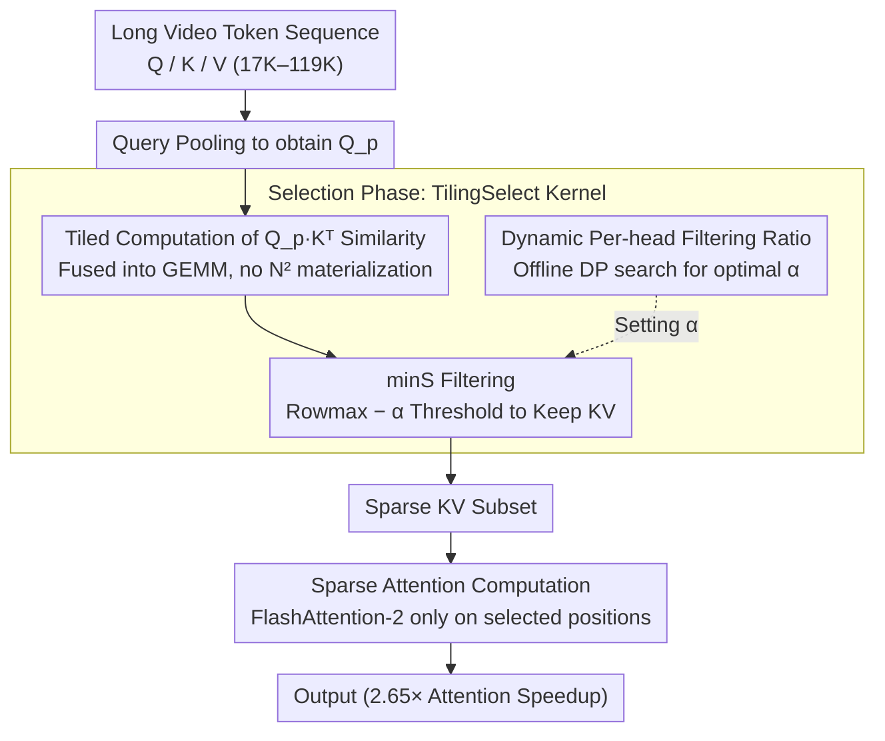

# VecAttention: Vector-wise Sparse Attention for Accelerating Long Context Inference

**Conference**: CVPR 2026  
**arXiv**: [2603.29494](https://arxiv.org/abs/2603.29494)  
**Code**: [https://github.com/anminliu/VecAttention](https://github.com/anminliu/VecAttention)  
**Area**: Video Understanding  
**Keywords**: Sparse Attention, Vector-wise Sparsity, Long Context Acceleration, Video Understanding, Video Generation

## TL;DR

This paper identifies a strong "vertical vector" sparsity pattern in video model attention maps and proposes VecAttention, a fine-grained vector-wise sparse attention framework. By implementing efficient important vector selection via TilingSelect + minS filtering, it achieves video understanding accuracy comparable to full attention at 78%+ sparsity, accelerating attention computation by 2.65x.

## Background & Motivation

1. **Background**: Video understanding and generation models process extremely long token sequences (17K-119K), making attention computation the primary inference bottleneck. Sparse attention methods (e.g., FlexPrefill, XAttention) accelerate inference by skipping unimportant attention computations.
2. **Limitations of Prior Work**: Existing methods use coarse-grained sparse patterns (e.g., block-level, row-level). While computationally simple, these sacrifice accuracy because important and unimportant tokens are often mixed within a single block or row, and coarse-grained skipping loses critical information.
3. **Key Challenge**: Finer granularity preserves more important information but incurs higher selection overhead—the communication and computation costs of token-wise selection can offset the speedup gains.
4. **Goal**: Identify the optimal sparsity granularity for the accuracy-efficiency trade-off and design corresponding efficient selection and computation kernels.
5. **Key Insight**: Systematic analysis of video attention maps reveals a "vertical vector" pattern—important KV tokens tend to remain important across all query heads, appearing as entire "bright" columns. This structural property allows efficient selection via query pooling.
6. **Core Idea**: Vector-wise granularity ($P_q=64$) + minS filtering (more efficient than topK) + TilingSelect (fusing selection into GEMM to reduce HBM access).

## Method

### Overall Architecture

VecAttention addresses the $O(N^2)$ computation bottleneck in video models with 17K–119K tokens, where existing block/row-level sparsity fails due to coarse granularity. Leveraging the "vertical vector" observation where important KV tokens are consistent across groups of queries, it first compresses queries and then selects KV "vectors" (defaulting to groups of 64 queries).

The inference process consists of two stages: first, **Selection**, where the full query sequence is pooled to obtain $Q_p$, and its similarity with K is filtered using minS (with per-head adaptive ratios $\alpha$ found offline) to identify necessary KV vectors via the TilingSelect kernel; second, **Computation**, where a FlashAttention-2 style sparse attention is performed only on the selected KV subset. This is a training-free, inference-only method.

### Key Designs

**1. minS Filtering: Replacing Row Sorting with Rowmax**

Fine-grained selection via topK on each similarity row is expensive (sorting is $O(N\log N)$). minS uses a different criterion: it calculates similarity $s_i$ between query pooling $Q_p$ and all K, uses the row maximum $m_i^s=\text{rowmax}(s_i)$ as a reference, and preserves KV tokens within a range $\alpha$ of the maximum:

$$M_i = \big(s_i \geq (m_i^s - \alpha)\big)$$

This selection requires only one rowmax pass and a threshold comparison, reducing complexity to $O(N)$ and natively supporting row-wise streaming.

**2. TilingSelect: Fusing Selection into GEMM to Eliminate $N^2$ Intermediate Tensors**

To avoid the memory bottleneck of materializing the $N^2$ similarity matrix for $Q_p\cdot K^T$ (which takes 18.3GB at N=64K), TilingSelect performs minS filtering on-the-fly during tiled GEMM. It accumulates rowmax across tiles and only stores indices of important elements. This reduces HBM access from $\Theta(N^2 P_q^{-1})$ to $\Theta(N^2 P_q^{-1}(1-\rho))$ where $\rho$ is sparsity, reducing selection latency by 2.42x.

**3. Dynamic Per-head Filtering Ratio: Head-specific $\alpha$**

Different heads exhibit varying sparsity patterns. Ours uses dynamic programming **offline** to find the optimal $\alpha$ for each head. By sampling head sparsity $\text{sp}_h(\alpha)$ and performance $\text{Perf}_h(\alpha)$, the DP maximizes overall performance under a target average sparsity $\rho_T$:

$$\text{DP}[h][\rho]=\max_{\alpha\ge 0}\{\text{DP}[h-1][\tfrac{\rho\cdot h-\text{sp}_h(\alpha)}{h-1}]+\text{Perf}_h(\alpha)\}$$

This allows aggressive filtering for "sparse" heads while preserving KV tokens for "dense" heads without increasing online inference overhead.

### Loss & Training

A training-free, inference-time method. Key hyperparameters include vector size $P_q=64$, K tile size $B_k=16$, and group size $G_k$ (16 for understanding, 8192 for generation).

## Key Experimental Results

### Main Results

| Method | Sparsity | VideoMME↑ | LongVideoBench↑ | VCRBench↑ | Avg↑ |
|------|--------|-----------|-----------------|-----------|-------|
| Full Attention | 0% | 65.7 | 59.4 | 32.9 | 52.7 |
| FlexPrefill | 76.5% | 52.3 | 59.0 | 30.0 | 47.1 |
| XAttention | 78.1% | 56.0 | 59.9 | 32.5 | 49.5 |
| AnchorAttention | 78.6% | 57.4 | 59.4 | 31.3 | 49.4 |
| **VecAttention** | **78.6%** | **60.6** | **59.0** | **33.8** | **51.1** |

### Ablation Study

| Config | Key Metric | Description |
|------|---------|------|
| Vector Size P_q=32 | Higher accuracy, higher overhead | Granularity too fine |
| Vector Size P_q=64 | Optimal balance | Default value |
| Vector Size P_q=128 | Accuracy drop | Granularity too coarse |
| minS vs topP | 3.77× Speedup | minS is more efficient |
| TilingSelect | 10.2× Memory Saving | 18.3GB→1.8GB |

### Key Findings

- At 78.6% sparsity, VecAttention averages 51.1%, only 1.6% lower than full attention (52.7%), significantly outperforming competitors at similar sparsity.
- Maximum usable sparsity reaches 93%, exceeding the 85-88% limit of prior works.
- Effective for video generation: achieves PSNR/SSIM comparable to full attention on Wan2.1-T2V at 52.3% sparsity.
- Accelerates attention by 2.65x and end-to-end TTFT by 1.17x.

## Highlights & Insights

- **Discovery of Vertical Vector Sparsity**: This observation provides the foundation for fine-grained sparsity—KV importance is highly consistent across queries.
- **minS Efficiency**: Reducing complexity from $O(N \log N)$ to $O(N)$ yielded a 3.77x practical speedup for selection.
- **Unified Applicability**: Effective on both VLM and DiT, suggesting vertical vector patterns are a general property of video attention.

## Limitations & Future Work

- Whether vertical vector patterns hold in other modalities (e.g., pure text, audio) remains unverified.
- Extra overhead for fine-grained selection might not be beneficial for shorter sequences.
- Evaluated primarily on video understanding and generation; complex reasoning tasks (e.g., Agent, RAG) were not tested.

## Related Work & Insights

- **vs FlexPrefill**: Block-level sparsity lags behind VecAttention (52.3% vs 60.6% on VideoMME) due to coarse granularity.
- **vs XAttention**: Also target video sparsity but shows lower accuracy on understanding tasks and limited maximum sparsity.
- **vs FlashAttention-2**: VecAttention's kernel is built on FlashAttention-2's tiling strategy, serving as a sparse extension.

## Rating

- Novelty: ⭐⭐⭐⭐ Vector-wise granularity and minS selection are innovative.
- Experimental Thoroughness: ⭐⭐⭐⭐⭐ Validated on video understanding and generation across multiple benchmarks and micro-benchmarks.
- Writing Quality: ⭐⭐⭐⭐ Systematically presented with clear logic from observation to implementation.
- Value: ⭐⭐⭐⭐⭐ Long video inference acceleration is a high-demand area; 2.65x speedup has direct industrial value.

<!-- RELATED:START -->

## Related Papers

- [\[ACL 2026\] APB-V: Accelerating Long-Video Understanding via Sequence-Parallelism-aware Approximate Attention](../../ACL2026/video_understanding/apb-v_accelerating_long-video_understanding_via_sequence-parallelism-aware_appro.md)
- [\[ICLR 2026\] VideoNSA: Native Sparse Attention Scales Video Understanding](../../ICLR2026/video_understanding/videonsa_native_sparse_attention_scales_video_understanding.md)
- [\[CVPR 2026\] Towards Sparse Video Understanding and Reasoning](towards_sparse_video_understanding_and_reasoning.md)
- [\[CVPR 2026\] Cluster-Wise Spatio-Temporal Masking for Efficient Video-Language Pretraining](cluster-wise_spatio-temporal_masking_for_efficient_video-language_pretraining.md)
- [\[CVPR 2026\] Neural-Centric Video Processing Pipeline for Unified Multi-Task Inference](neural-centric_video_processing_pipeline_for_unified_multi-task_inference.md)

<!-- RELATED:END -->
