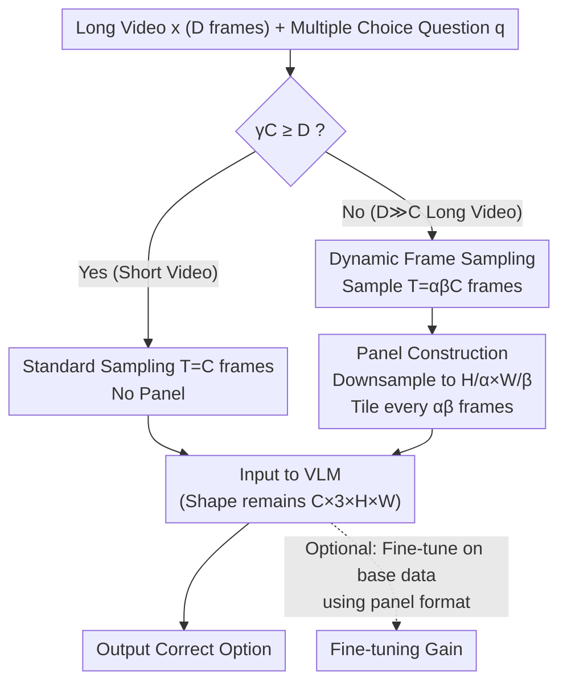

# Video Panels for Long Video Understanding

**Conference**: CVPR 2026  
**arXiv**: [2509.23724](https://arxiv.org/abs/2509.23724)  
**Code**: https://fedespu.github.io/Video-Panels  
**Area**: Video Understanding / Multimodal VLM  
**Keywords**: Long Video Understanding, Visual Prompting, Temporal Resolution, Training-free, Video QA

## TL;DR
The authors propose tiling multiple adjacent video frames together into a single "comic-style" panel image to trade spatial resolution for temporal resolution. This approach improves the long video understanding capabilities of existing VLMs—increasing VideoLLaMA 3's QA accuracy by 19.4% on the TimeScope (Long) benchmark—without modifying architectures, additional training, or adding parameters.

## Background & Motivation

**Background**: Video-Language Models (VLMs) have achieved high performance in image and short video tasks. The standard practice involves using a sampling function to extract $T$ frames for the model. however, as video length increases, performance drops significantly—for instance, Qwen2.5-VL shows a clear decline in accuracy for videos exceeding three minutes.

**Limitations of Prior Work**: The source of this problem is **insufficient temporal resolution**. VLMs have a limited context window $C$, which dictates the maximum number of frames they can "perceive." When video duration $D \gg C$, the sampling function $\phi$ must discard many frames to fit the window, preventing the model from scanning the entire video densely. Recent works either compress tokens per frame, extend LLM sequence lengths, or introduce memory/summary tokens, but these methods are generally **model-specific**, complex, and often fail to outperform clean base models.

**Key Challenge**: The authors identify an overlooked imbalance—VLMs are primarily trained on images and short videos where both spatial and temporal resolutions remain high after sampling. In long videos, however, **temporal resolution is severely compressed while spatial resolution remains untouched**. Consequently, the model's computational budget is disproportionately allocated to spatial relations, leaving the critical temporal information underserved.

**Goal**: To extract long video understanding capabilities through a simple, efficient, and universal method applicable to various existing VLMs without fine-tuning or adding modules.

**Key Insight**: Since the imbalance stems from "too much space, too little time," a portion of the spatial budget should be reallocated to time. Borrowing from visual prompting, the approach modifies the input rather than the model.

**Core Idea**: Consecutive frames are **downsampled and tiled into a single comic-like multi-panel image (panel)**. Sequences of these panels are then fed into the VLM. This exchanges minor spatial detail loss for $\alpha\beta$ times more frame coverage under the same token budget, effectively "projecting temporal information into the spatial dimension."

## Method

### Overall Architecture

The method is based on a simple observation: VLM visual encoders are robust at inferring relationships between elements within a single image. By tiling multiple frames into one image, the model can reason about "inter-frame temporal relations" as "intra-image spatial relations." The process consists of two steps: **dynamically determining frame sampling based on video duration, and downsampling/tiling these frames into panel images**. The final tensor shape sent to the VLM is identical to that of a single frame, allowing seamless integration with any off-the-shelf VLM. Besides zero-shot inference, the authors also provide an optional branch to fine-tune using the panel format on original training data.

Let the input video be $\mathbf{x}\in\mathbb{R}^{D\times 3\times H\times W}$ ($D$ frames), context window be $C$, and tiling factors in horizontal/vertical directions be $\alpha, \beta$ (default $\alpha=\beta=2$, totaling 4 frames per panel). $\gamma$ is a duration threshold for triggering paneling (defaulted to input video fps).

### Key Designs

**1. Dynamic Frame Sampling: Reallocating resolution only for long videos**

Short and long videos have different requirements. For short videos, spatial detail is sufficient, and tiling might cause unnecessary resolution loss. The authors use a piecewise function based on whether the context window can adequately cover the video:

$$T=\begin{cases} C, & \text{if } \gamma C \ge D,\\ \alpha\beta C, & \text{otherwise.}\end{cases}$$

If $\gamma C \ge D$ (video is short enough for dense sampling), the model samples $C$ frames without tiling. Only when $\gamma C < D$ (sampling intervals exceed $\gamma$ frames, causing information sparsity) is paneling triggered to sample $\alpha\beta C$ frames. This switch ensures details are preserved when possible, preventing performance degradation in short videos.

**2. Panel Construction: Tiling frames into standard-sized storyboard panels**

Once paneling is triggered, the $\alpha\beta C$ sampled frames are too numerous for the window. These frames are first downsampled to $\mathbf{x}'\in\mathbb{R}^{\alpha\beta C\times 3\times H/\alpha\times W/\beta}$, then **tiled into panel images every $\alpha\beta$ frames in a left-to-right, top-to-bottom order**. For a 2×2 configuration:

$$\mathbf{x}''_i=\begin{pmatrix}\mathbf{x}'_{4i} & \mathbf{x}'_{4i+1}\\ \mathbf{x}'_{4i+2} & \mathbf{x}'_{4i+3}\end{pmatrix}.$$

The final input $\mathbf{x}''\in\mathbb{R}^{C\times 3\times H\times W}$ returns to the standard shape expected by the visual encoder. This is critical for "seamless integration": the VLM is unaware it is receiving tiled images, and the token count remains unchanged, but the **temporal coverage is expanded by $\alpha\beta$ times**. It essentially folds the temporal dimension into the spatial dimension.

**3. Panel Format Fine-tuning: Superior representation for long videos**

While panels are effective in zero-shot settings, models were originally trained on standard frames. If compute is available, the model's **original** video-QA training data can be reformulated into the panel format (without adding new data) and fine-tuned by minimizing the negative log-likelihood of the correct option:

$$\ell_{FT}(\mathbf{x},q,y)=-\log p_\theta(y\mid \mathbf{x},q).$$

Results show that fine-tuning LLaVA-OneVision 7B on LLaVA-Video-178K using panels yields better results than standard fine-tuning and provides a 0.4–0.6 point boost over zero-shot paneling.

### Loss & Training
The zero-shot method **requires no loss function** (input-side modification only). Optional fine-tuning uses standard negative log-likelihood $\ell_{FT}=-\log p_\theta(y\mid\mathbf{x},q)$, updating only the projection layer (Proj) and the LLM with a batch size of 2, gradient accumulation of 4, for 1 epoch.

## Key Experimental Results

Evaluated on 5 long video QA benchmarks (VideoMME, TimeScope, MLVU, MF2, VNBench) across 8 VLMs (context window 8–180 frames, including GPT-4o-mini / GPT-4.1) using lmms-eval. Default: $\alpha=\beta=2$, $\gamma=$ fps, uniform sampling.

### Main Results

Average accuracy of models after adding panels (selected results, parentheses show relative gain over base):

| Model | Context Frames | base Avg | + panel Avg | Gain |
|------|---------|-----------|--------------|------|
| Video-LLaVA 7B | 8 | 33.8 | 34.8 | +1.0 |
| LLaVA-OV 7B | 32 | 52.8 | 56.2 | +3.4 |
| LLaVA-OV 72B | 32 | 49.4 | 52.5 | +3.1 |
| Qwen-2.5VL 7B | 32 | 51.9 | 55.3 | +3.4 |
| LLaVA-Video 7B | 64 | 56.6 | 60.7 | +4.1 |
| VideoLLaMA 3 7B | 180 | 58.2 | 60.9 | +2.7 |

The most significant gain occurs in **TimeScope (Long)** (longest videos): VideoLLaMA 3 7B moves from 39.1 → 46.7, a **+7.6 point (+19.4%) improvement**. For commercial models, GPT-4o-mini improved by +2.5 on VMME. Notably, LLaVA-Video 7B with panels at 64 frames (60.7) nearly matches or exceeds 180-frame long-context base models.

### Ablation Study

| Config | VMME overall | TimeScope Long | Description |
|------|--------------|----------------|------|
| 1×1 (No panel) | 58.5 | 30.2 | Baseline |
| **2×2** | **58.9** | **33.8** | Default, best for long videos |
| 3×3 | 58.7 | 33.8 | More frames but higher spatial loss |
| 4×4 | 58.4 | 30.9 | Excessive resolution loss |
| 2×1 / 1×2 (Asymmetric) | 58.1 / 58.6 | — | Worse than $\alpha=\beta$ |

### Key Findings
- **Frame-level tiling outperforms token pooling**: Comparing to average pooling of visual tokens (low-res, higher token count than panel), panels performed better across nearly all models.
- **Greater gains on longer videos**: The benefits are persistent across various durations in TimeScope and particularly prominent in "needle-in-a-haystack" tasks.
- **Computational efficiency**: LLaVA-OV 7B with 8 frames + panel achieves results comparable to 16 frames base, halving visual tokens.
- **Unexpected Strength**: On MLVU counting tasks, accuracy rose from 23.3% → 39.8%. Despite spatial loss, panels significantly improved temporal counting. The only consistent disadvantage was in ordering tasks (-1.2%) because panels do not explicitly encode temporal indices.

## Highlights & Insights
- **"Translating" temporal problems into spatial problems**: The core insight leverages the VLM's spatial reasoning strengths by folding temporal relations into a single image. This is an elegant "free lunch" as input shapes and token counts remain constant.
- **True Plug-and-Play**: Training-free, parameter-free, and model-agnostic. It works for everything from small 8-frame models to 180-frame long-context models and proprietary models like GPT-4.1.
- **Redefining the Baseline**: The work does not necessarily increase the VLM's "upper bound" of understanding but **raises the bar for what long video methods must surpass**. Any new complex module must now prove it is superior to "free tiling."
- **Transferability**: The strategy of folding dimensions to handle limited context could apply to other sequential inputs, such as long document screenshots or sensor data.

## Limitations & Future Work
- **No improvement to base model capability**: Panels optimize the use of existing VLMs without enhancing underlying intelligence; spatial loss remains a risk for fine-grained tasks.
- **Explicit temporal ordering is missing**: Models may not strictly know the sequence within a panel, affecting temporal ordering tasks.
- **Lacks universal prompt compatibility**: While describing panel structures in prompts helps specific models, no universal prompt was found across all models.
- **Hyperparameter tuning**: $\gamma$ can be sensitive to low-fps datasets, and the optimal $\alpha\beta$ varies based on the trade-off between NIAH and detail-oriented tasks.

## Related Work & Insights
- **vs. Token Compression/Resampling (Video-XL, VideoLLaMB)**: These operate at the **token level** and are often model-specific. Panels operate at the **input/frame level**, and ablation proves frame-level tiling is superior to token pooling.
- **vs. Long-context Extension (LongVA)**: These migrate LLM backbone long-context capabilities to multimodality via training. This work enables models to "effectively" handle context far beyond training limits without additional training.
- **vs. Visual Prompting (Red circles, bbox, NumPro)**: While prior work used geometric or numerical cues, this work advances visual prompting to project temporal sequences into a spatial representation for **long videos**.

## Rating
- Novelty: ⭐⭐⭐⭐ Simple but cleverly folds time into space specifically for long videos.
- Experimental Thoroughness: ⭐⭐⭐⭐⭐ Extensive coverage across 5 benchmarks and 8 models.
- Writing Quality: ⭐⭐⭐⭐ Clear motivation and concise logic.
- Value: ⭐⭐⭐⭐⭐ Zero-cost plug-and-play that serves as a new high-standard baseline for the community.

## Rating
- Novelty: To be evaluated
- Experimental Thoroughness: To be evaluated
- Writing Quality: To be evaluated
- Value: To be evaluated

<!-- RELATED:START -->

## Related Papers

- [\[CVPR 2026\] Efficient Frame Selection for Long Video Understanding via Reinforcement Learning](efficient_frame_selection_for_long_video_understanding_via_reinforcement_learnin.md)
- [\[CVPR 2026\] VirtueBench: Evaluating Trustworthiness under Uncertainty in Long Video Understanding](virtuebench_evaluating_trustworthiness_under_uncertainty_in_long_video_understan.md)
- [\[CVPR 2026\] META: Meta Evolution of Tool Trajectory Adaptation for Long-Video Understanding](meta_meta_evolution_of_tool_trajectory_adaptation_for_long-video_understanding.md)
- [\[CVPR 2026\] Wavelet-based Frame Selection by Detecting Semantic Boundary for Long Video Understanding](wavelet-based_frame_selection_by_detecting_semantic_boundary_for_long_video_unde.md)
- [\[ICLR 2026\] FOCUS: Efficient Keyframe Selection for Long Video Understanding](../../ICLR2026/video_understanding/focus_efficient_keyframe_selection_for_long_video_understanding.md)

<!-- RELATED:END -->
