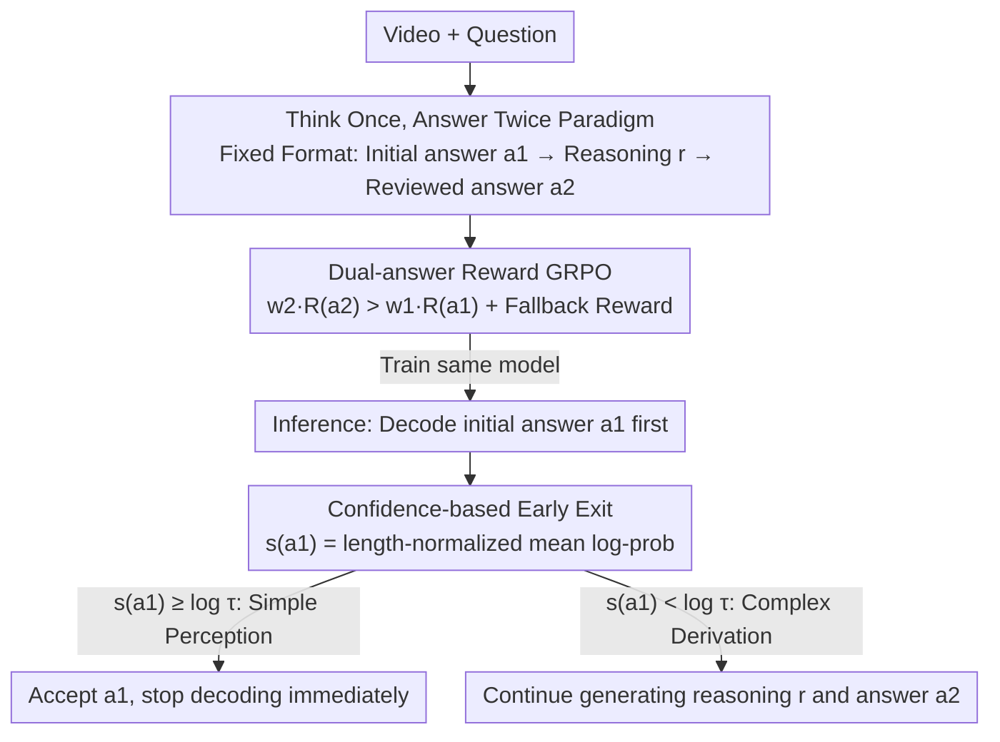

# VideoAuto-R1: Video Auto Reasoning via Thinking Once, Answering Twice

**Conference**: CVPR 2026  
**arXiv**: [2601.05175](https://arxiv.org/abs/2601.05175)  
**Code**: [https://ivul-kaust.github.io/projects/videoauto-r1](https://ivul-kaust.github.io/projects/videoauto-r1)  
**Area**: Video Understanding / LLM Reasoning  
**Keywords**: Video Reasoning, Adaptive Thinking, Chain-of-Thought, Reinforcement Learning, Inference Efficiency

## TL;DR
Ours proposes VideoAuto-R1, a video understanding framework for "on-demand reasoning": it adopts an "answer once, think once, answer twice" (answer→think→answer) paradigm during training, and during inference, it decides whether to trigger CoT reasoning based on the confidence of the first answer. It maintains SOTA accuracy while compressing the average response length from 149 to 44 tokens (approx. 3.3x compression).

## Background & Motivation

1. **Background**: Chain-of-Thought (CoT) has become the primary means to enhance the video understanding capabilities of multimodal large language models. Models like Video-R1, Time-R1, and VideoChat-R1 use GRPO reinforcement learning to enable step-by-step reasoning before answering. These methods are highly effective for symbolic tasks like mathematics and programming.

2. **Limitations of Prior Work**: (a) Video understanding is inherently more dependent on visual perception than step-by-step reasoning; once perception is accurate, subsequent symbolic reasoning is often shallow; (b) Forcing CoT reasoning for all samples results in massive redundant tokens (average 386 tokens for Video-R1), significantly increasing latency and cost; (c) Surprisingly, for RL-trained video reasoning models, direct answers perform as well as or even better than CoT on multiple benchmarks.

3. **Key Challenge**: CoT reasoning introduces computational overhead with limited gains in video understanding—it is redundant or even harmful (overthinking) in perception-intensive tasks (e.g., object/action recognition), only showing clear advantages in tasks requiring multi-step derivation (e.g., physics/math in VideoMMMU).

4. **Goal**: Design a video understanding model that can adaptively decide "whether reasoning is needed"—answering simple questions directly and triggering CoT only for complex ones.

5. **Key Insight**: The authors systematically demonstrated the performance variance between direct answering and CoT modes in existing video reasoning models (Video-R1, Time-R1, VideoChat-R1) (Table 1), finding that CoT even reduces accuracy on VideoMME and LongVideoBench. This finding provides strong motivation for "on-demand reasoning."

6. **Core Idea**: During training, the model is trained to generate both a direct answer and a post-reasoning answer (Dual-answer GRPO). During inference, the token confidence of the first answer determines whether to continue generating the reasoning chain, achieving adaptive auto-thinking.

## Method

### Overall Architecture
This paper addresses whether a video reasoning model should "think" for every question. The approach transforms the "to think or not" decision from a pre-labeled requirement into a signal exposed by the model during generation. During training, the model generates a fixed-format response for every question: `\boxed{a1}<think>r</think>\boxed{a2}`. It first provides an initial answer $a_1$ without any analysis, then writes the reasoning process $r$ in `<think>`, and finally gives the reviewed answer $a_2$. Both $a_1$ and $a_2$ are supervised by verifiable rewards. In contrast, during inference, the model decodes $a_1$ first and calculates its confidence: high confidence (simple perception) leads to an early exit at $a_1$, while low confidence (complex derivation) triggers the generation of the reasoning chain and $a_2$. Training focuses on "getting both answers right," while inference focuses on "how certain the first answer is," cleanly decoupling the two.

### Key Designs

**1. "Think Once, Answer Twice" Training Paradigm: Bypassing the think/no-think labeling problem**

The hardest part of adaptive reasoning is telling the model which samples require thinking during training, as per-sample labeling is expensive and prone to causing the model to collapse into "always thinking" or "never thinking." This paper avoids this by forcing all samples through the answer→think→answer path. The system prompt requires the first box to contain only the answer, followed by reasoning in `<think>`, and the reviewed answer in the final box. If the model cannot answer without thinking, it is allowed to output a fixed fallback string "Let's analyze the problem step by step" in the first box. This way, the model only learns to make both answers correct, and the "whether to think" decision is deferred to inference via confidence, requiring no switch tokens or cold-start SFT.

**2. Dual-answer Reward GRPO: Explicitly rewarding "better answers after thinking"**

Generating two answers is not enough; the reward must monitor both, otherwise, the model might optimize only one. The total reward is formulated as:

$$R = w_1 R_{\text{task}}^{(1)}(a_1) + w_2 R_{\text{task}}^{(2)}(a_2) + \lambda R_{\text{fmt}} + \alpha R_{\text{fallback}}$$

Crucially, $w_2 > w_1$ (Ours uses $w_1=0.9, w_2=1.1$). A higher weight for the reviewed answer tells the model that "correcting an answer through reasoning" is more valuable, encouraging actual reasoning for difficult problems. Meanwhile, $w_1>0$ ensures the initial answer is trained to be accurate, which is essential for early exit. $R_{\text{fallback}}$ provides an extra reward when the model uses the fallback string for $a_1$ but gets $a_2$ right after reasoning, preventing the model from guessing low-confidence answers for math-intensive problems. GRPO uses 16 rollouts per question at a temperature of 1.0.

**3. Confidence-based Early Exit: Deciding when to stop using the model's own token probabilities**

With a model that can answer twice, the only inference question is whether the first answer is trustworthy. This paper uses the length-normalized average log-probability of $a_1$ tokens as a confidence score:

$$s(a_1) = \frac{1}{L}\sum_{\ell=1}^L \log p_\theta(t_\ell \mid t_{<\ell}, q)$$

If $s(a_1) \geq \log \tau$ ($\tau=0.97$), $a_1$ is accepted and decoding terminates. Otherwise, it proceeds to generate the reasoning chain and $a_2$. The fallback string's confidence is forced to $-\infty$ to ensure reasoning continues. For example, in an action recognition task, the model might be certain about $a_1$, exiting after a few tokens. In a VideoMMMU physics derivation, $a_1$ confidence would fall below the threshold, triggering full CoT. This works because token-level confidence correlates strongly with answer correctness, and determining it for $a_1$ (usually <10 tokens) is nearly zero-cost.

### Loss & Training
- Base Models: Qwen2.5-VL-7B-Instruct and Qwen3-VL-8B-Instruct.
- Direct RL without cold-start SFT (Ours found SFT on Video-R1-CoT data actually reduced baseline performance).
- Training Data: 83K samples including text/image math and science, video QA, and temporal grounding.
- Visual encoder frozen; only training the projector and LLM.
- Approx. 35 hours on 32 H100 GPUs.
- Inference: Greedy decoding, max response 4096 tokens, $\tau=0.97$.

## Key Experimental Results

### Main Results (Video QA)

| Model | Inference Mode | Response Length | VideoMME | MVBench | VideoMMMU | MVP |
|------|---------|---------|----------|---------|-----------|-----|
| Qwen2.5-VL-7B | Direct | 3.0 | 66.0 | 67.1 | 54.7 | 36.5 |
| Video-R1 | Think-Only | 386 | 61.8 | 65.5 | 51.4 | 33.0 |
| VideoChat-R1.5 | Think-Only | 133 | 65.2 | 70.6 | 49.6 | 38.6 |
| **VideoAuto-R1 (2.5VL)** | **AutoThink** | **44** | **67.3** | **71.0** | **58.6** | **39.4** |
| **VideoAuto-R1 (Q3VL)** | **AutoThink** | **52** | **71.7** | **72.0** | **65.0** | **43.0** |

### Ablation Study (Temporal Grounding)

| Model | Charades-STA mIoU | ActivityNet mIoU | NExT-GQA Acc |
|------|------------------|-----------------|-------------|
| Qwen2.5-VL-7B | 52.9 | 26.9 | 53.3 |
| Time-R1 | 58.8 | 52.1 | - |
| VideoChat-R1.5 | 60.6 | 35.3 | - |
| **VideoAuto-R1 (2.5VL)** | **60.0** | **47.6** | **80.6** |
| **VideoAuto-R1 (Q3VL)** | **63.7** | **56.1** | **82.6** |

### Key Findings
- **Adaptive Think Ratio**: On the perception-heavy MVBench, the think ratio is only 25%, rising to 51% on the reasoning-heavy VideoMMMU, showing that the model learns on-demand reasoning. The Qwen3-VL version reaches a 53% think ratio on VideoMMMU.
- **Counter-intuitive CoT Findings**: Existing video reasoning models (Video-R1, Time-R1, VideoChat-R1) show that CoT reasoning actually decreases performance by 1-2 points on VideoMME and LongVideoBench, only consistently winning on VideoMMMU.
- **CoT not needed for Grounding**: On Charades-STA and ActivityNet, initial boxed answers are sufficiently precise; subsequent CoT mainly provides explanation, thus triggering early exit by default.
- **3.3x Efficiency Gain**: Average response length dropped from 386 tokens (Video-R1) to 44 tokens (Qwen2.5-VL version), significantly reducing latency.
- **Superiority of No-SFT RL**: Direct RL was more stable than starting with SFT on CoT data.

## Highlights & Insights
- **The "answer→think→answer" template is the core innovation**: By producing two answers in one generation, it elegantly solves the problem of how to label "think/no-think" samples during training. It requires no switch tokens, mode heads, or SFT initialization, making training simple and transferable.
- **Confidence early exit is simple yet effective**: Instead of training an external classifier, it leverages the model's own token log probabilities at nearly zero cost. This can be used for any LLM inference optimization.
- **Counter-intuitive insight in video CoT**: Systematically proving that CoT is unhelpful or even harmful for most perception tasks is a vital observation for the field—not every task requires System 2 thinking.

## Limitations & Future Work
- **Fixed Threshold $\tau$**: Currently uses a single $\tau=0.97$ for all benchmarks; dynamic thresholds per task might yield better results.
- **Training Token Consumption**: Dual-answer rollouts during GRPO require full sequences, making training more expensive than direct answering.
- **Simple Fallback Mechanism**: The current fallback string is a fixed text; a more flexible strategy (e.g., progressive reasoning depth) could be an improvement.
- **Generalization**: Only validated on Qwen2.5-VL/Qwen3-VL architectures.

## Related Work & Insights
- **vs Video-R1**: Video-R1 forces CoT for all, averaging 386 tokens and 61.8% on VideoMME; VideoAuto-R1 reaches 67.3% with only 44 tokens, winning in both efficiency and accuracy.
- **vs AdaptThink**: AdaptThink trains binary mode-switching for text-math tasks, requiring balanced data. VideoAuto-R1 avoids this with the dual-answer paradigm.
- **vs R-4B (Image domain auto-thinking)**: R-4B uses dual-mode policy optimization with SFT+RL; Ours is simpler as it does not require SFT.

## Rating
- Novelty: ⭐⭐⭐⭐⭐ The answer-think-answer paradigm is a fresh auto-thinking design.
- Experimental Thoroughness: ⭐⭐⭐⭐⭐ Covers Video QA, grounding, and image reasoning with detailed ablations.
- Writing Quality: ⭐⭐⭐⭐⭐ Strong motivation backed by counter-intuitive data (Table 1).
- Value: ⭐⭐⭐⭐⭐ Simultaneous breakthrough in efficiency and accuracy with a reusable paradigm.

<!-- RELATED:START -->

## Related Papers

- [\[CVPR 2026\] Thinking with Drafts: Speculative Temporal Reasoning for Efficient Long Video Understanding](thinking_with_drafts_speculative_temporal_reasoning_for_efficient_long_video_und.md)
- [\[NeurIPS 2025\] When Thinking Drifts: Evidential Grounding for Robust Video Reasoning](../../NeurIPS2025/video_understanding/when_thinking_drifts_evidential_grounding_for_robust_video_reasoning.md)
- [\[CVPR 2026\] CaST-Bench: Benchmarking Causal Chain-Grounded Spatio-Temporal Reasoning for Video Question Answering](cast-bench_benchmarking_causal_chain-grounded_spatio-temporal_reasoning_for_vide.md)
- [\[CVPR 2026\] Incentivizing Versatile Video Reasoning in MLLMs via Data-Efficient Reinforcement Learning](incentivizing_versatile_video_reasoning_in_mllms_via_data-efficient_reinforcemen.md)
- [\[CVPR 2026\] LongVideo-R1: Smart Navigation for Low-cost Long Video Understanding](longvideo-r1_smart_navigation_for_low-cost_long_video_understanding.md)

<!-- RELATED:END -->
