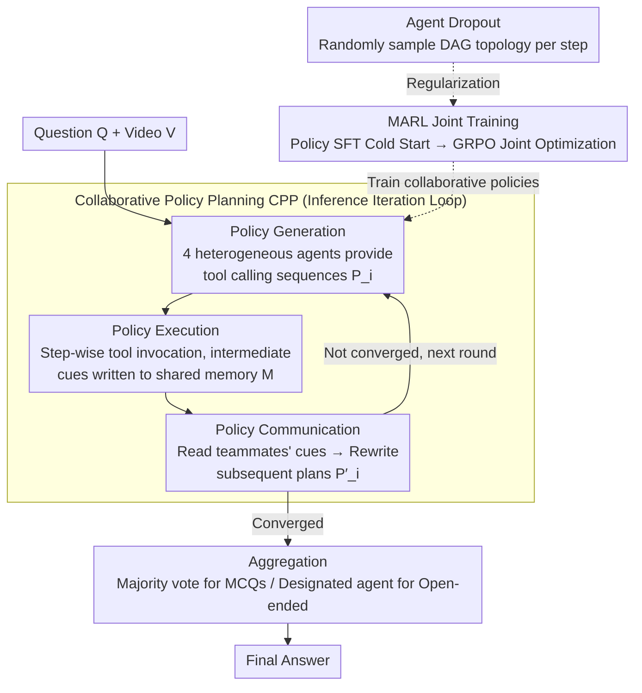

# VideoChat-M1: Collaborative Policy Planning for Video Understanding via Multi-Agent Reinforcement Learning

**Conference**: CVPR 2026  
**arXiv**: [2511.19524](https://arxiv.org/abs/2511.19524)  
**Code**: None  
**Area**: Video Understanding  
**Keywords**: Multi-Agent, Collaborative Policy Planning, MARL, GRPO, Video Understanding

## TL;DR

VideoChat-M1 proposes the Collaborative Policy Planning (CPP) paradigm and a Multi-Agent Reinforcement Learning (MARL) training method. By employing 4 heterogeneous VLM agents to dynamically generate and update tool-calling policies for video understanding, it outperforms Gemini 2.5 Pro by 3.6% and GPT-4o by 15.6% on LongVideoBench.

## Background & Motivation

**Limitations of Prior Work**: Current agent-based video understanding frameworks generally employ **static and non-learnable tool-calling policies** with predefined tool selection sequences that do not adapt to video content or specific questions. This restricts the discovery and utilization of diverse cues in spatio-temporally complex videos.

**Bottlenecks of Single Agents**: A single agent struggles to simultaneously handle perception, retrieval, and synthesis. Even when equipped with retrieval, memory, and search tools, universal designs limit effective integration and reasoning.

**Deficiencies of Training-free Multi-agent Systems**: Methods like LVAgent rely solely on static role assignment and fixed textual logic. They lack trainable collaborative policies and cannot adaptively adjust collaboration patterns through learning. Furthermore, existing RL methods are mostly limited to the unimodal text domain and fail to address the temporal and perceptual challenges of video.

**Core Problem**: How can multiple agents dynamically generate, execute, and coordinate tool-calling policies for complex video understanding tasks? How can multiple heterogeneous agents be jointly trained to learn effective collaboration?

## Method

### Overall Architecture

VideoChat-M1 consists of two core components: the **Collaborative Policy Planning (CPP)** inference paradigm and the **Multi-Agent Reinforcement Learning (MARL)** training method.

The system includes 4 heterogeneous policy agents (Qwen3-8B, Qwen3-4B, Qwen2.5-7B, Qwen2.5-3B, totaling ~37B parameters), a set of video perception tools $\mathcal{T}$ (including Global Sampling, Video Retrieval, Image Retrieval, Rough/Fine Browser, Spatial Tool, and Grounding Tool), and a shared memory buffer $\mathcal{M}$.

Inference flow: User question $\mathcal{Q}$ + Video $\mathcal{V}$ $\to$ Agents independently generate tool-calling plans $\to$ Step-wise tool execution with intermediate results exchanged via shared memory $\to$ Agents decide whether to update subsequent plans based on peer information $\to$ After multiple iterations, agents aggregate answers $\to$ Final answer via majority voting (MCQs) or designated agent aggregation (open-ended).

### Key Designs

**1. Collaborative Policy Planning (CPP): Replacing "one-shot tool sequencing" with an iterative generation-execution-communication loop**

In previous agent frameworks, tool-calling sequences were hardcoded. CPP decomposes policy planning into three alternating phases, allowing agents to adapt during execution. In the **Policy Generation** phase, each agent $i$ autonomously generates an initial sequence $\mathcal{P}_i = \{\mathcal{P}_{i,1} \to \mathcal{P}_{i,2} \to \cdots \to \mathcal{P}_{i,N}\}$. In the **Policy Execution** phase, tools are invoked step-by-step, where the $n$-th output depends on the previous result $\mathcal{A}_{i,n} = \mathcal{P}_{i,n}(\mathcal{V}, \mathcal{T}, \mathcal{A}_{i,n-1})$. In the **Policy Communication** phase, intermediate cues are written to the shared memory $\mathcal{M}$ after each step. Agents then decide whether to rewrite their subsequent plans:

$$\mathcal{P}'_i = \mathcal{G}_i(\mathcal{Q}, \mathcal{T}, \mathcal{M}, \mathcal{P}_i)$$

The core advantage is that heterogeneous agents generate diverse initial strategies and "observe" each other's findings. This "diverse generation + communication correction" covers video content diversity far better than a single fixed pipeline.

**2. Multi-Agent Reinforcement Learning (MARL): Learning collaboration through joint RL rather than temporary prompting**

The paper finds that even using GPT-4o within the CPP framework in a zero-shot manner yields only 56.2 points, far below the 60.5 achieved after training. This indicates that effective coordination patterns must be learned. MARL injects these patterns in two stages. The first stage, **Policy SFT**, performs a cold start using GPT-4o + DeepSeek-R1 to annotate high-quality policy data. Each agent is SFT'ed separately to learn valid plan generation. The second stage uses **GRPO joint optimization** to update all agents as a collective. Rewards include result reward $\mathcal{R}_{res}$, format reward $\mathcal{R}_{format}$, and collaborative reward $\mathcal{R}_{col}$. This is the first framework for video understanding that jointly trains multiple heterogeneous agents under a single RL objective.

**3. Agent Dropout: Preventing over-coadaptation via randomized communication topologies**

If all agents are fully connected during training, they may degenerate into "copying" specific teammates. Agent Dropout randomly samples a directed acyclic graph (DAG) as the communication topology for each training step. This forces agents to develop robust collaborative habits that do not rely on any specific teammate. It was proven to be the "most important regularizer," with its removal causing a 2.4-point drop on LongVideoBench (79.9 vs 82.3).

### Loss & Training

**SFT Phase**: Cross-entropy loss to maximize the likelihood of generating ground-truth policy plans. Learning rate 1e-6, batch size 32, 1 epoch.

**MARL Phase**: GRPO objective function consisting of a reward-seeking term and a KL-divergence regularization term:

$$\max_{\pi_\theta} \mathbb{E}_{o \sim \pi_{\theta_{\text{old}}}} \left[ \sum_{k=1}^{K} \frac{\pi_\theta(o_k)}{\pi_{\theta_{\text{old}}}(o_k)} \cdot A_R^{(k)} - \beta \, D_{KL}(\pi_\theta \| \pi_{\text{ref}}) \right]$$

Three reward signals: $\mathcal{R}_{res}$ (positive for correct answers, negative for incorrect), $\mathcal{R}_{format}$ (legality of tool calls), and $\mathcal{R}_{col}$ (GPT-4o evaluated trajectory quality; strong penalty for sequences exceeding 5 calls). Learning rate 1e-7, 4 rollouts, batch size 8, reaching optimal performance in 200 steps.

## Key Experimental Results

### Main Results

| Dataset | Metric | VideoChat-M1 (37B) | GPT-4o | Gemini 2.5 Pro | Qwen3-VL-235B | Best Agent Method |
|--------|------|:---:|:---:|:---:|:---:|:---:|
| LongVideoBench | Acc | **82.3** | 66.7 | 78.7 | - | 71.6 (DeepVideoDiscovery) |
| Video-MME (Avg) | Acc | **83.2** | 71.9 | 84.3 | 79.2 | 75.7 (VideoRAG-72B) |
| MLVU (M-avg/G-avg) | Acc | **84.2/76.7** | 70.3/65.3 | - | - | 72.9/73.1 (VideoRAG-72B) |
| VideoMMMU | Acc | **83.4** | 61.2 | 83.6 | 74.7 | 76.2 (VideoChat-A1) |
| Video-Holmes | Acc | **60.5** | 42.0 | 45.7 | - | - |

### Efficiency Comparison

| Model | Avg. Frames | Inference Time | LongVideoBench | Video-MME |
|------|:---:|:---:|:---:|:---:|
| Qwen2-VL-72B | 568 | 90.5s | 55.6 | 71.2 |
| GPT-4o | 384 | 153.6s | 66.7 | 71.9 |
| **VideoChat-M1** | **69.9** | **19.8s** | **82.3** | **83.2** |

### Ablation Study

**Agent Count and Combination (Table 3)**:

| Agent Count | Combination | Video-Holmes | LongVideoBench |
|:---:|------|:---:|:---:|
| 1 | Qwen3-8B | 31.2 | 61.9 |
| 4 | All 4 heterogeneous agents | **60.5** | **82.3** |

**Heterogeneous vs Homogeneous (Table 4)**:

| Configuration | Video-Holmes | LongVideoBench |
|------|:---:|:---:|
| 4× Qwen2.5-3B (Homogeneous) | 55.8 | 79.2 |
| Fully Heterogeneous (4 different models) | **60.5** | **82.3** |

**MARL Components (Table 6)**:

| $\mathcal{R}_{format}$ | $\mathcal{R}_{col}$ | $\mathcal{R}_{res}$ | Agent Dropout | Video-Holmes | LongVideoBench |
|:---:|:---:|:---:|:---:|:---:|:---:|
| ✓ | ✓ | ✓ | ✗ | 58.5 | 79.9 |
| ✓ | ✓ | ✓ | ✓ | **60.5** | **82.3** |

### Key Findings

- The result reward $\mathcal{R}_{res}$ is the most critical signal in MARL; its removal causes Video-Holmes to plummet from 60.5 to 32.4.
- Agent Dropout is the "most important regularizer," with LongVideoBench dropping 2.4 points without it.
- Heterogeneous agent groups significantly outperform homogeneous groups as architectural diversity leads to diverse reasoning.
- Zero-shot inference using GPT-4o agents (56.2/75.9) is inferior to the MARL-trained VideoChat-M1, indicating that MARL discovers coordination patterns that zero-shot prompting cannot.
- High efficiency: Reaches optimal performance using only 69.9 frames and 19.8s.

## Highlights & Insights

- **Novel CPP Paradigm**: The generation-execution-communication loop allows agents to dynamically modify policies based on peer information.
- **First Multi-agent Joint RL for Video**: Designs triple rewards (result/format/collaboration), specifically evaluating process quality via collaborative rewards.
- **Elegant Agent Dropout**: Randomized communication topologies effectively prevent co-adaptation.
- **Extreme Efficiency**: With 37B total parameters, it matches or exceeds 235B-scale models and GPT-4o while using fewer frames and less time.

## Limitations & Future Work

- **High Deployment Complexity**: Requires concurrent inference of 4 models plus tool models.
- **Training Cost**: Collaborative rewards depend on GPT-4o as a judge, introducing external dependencies and cost.
- **Fixed Tool Set**: Does not yet explore agents autonomously discovering or creating new tools.
- **Over-design**: The framework may be unnecessary for simple video tasks.

## Related Work & Insights

- **vs VideoChat-A1/VideoRAG**: These use fixed policies; VideoChat-M1 makes policies dynamic and learnable via CPP.
- **vs Video-R1/VideoChat-R1**: These optimize single models; VideoChat-M1 is the first multi-agent joint RL framework.
- **Insight**: The paradigm of multi-agent collaboration + RL is transferable to other multimodal tasks. Agent Dropout's randomized topology is a valuable concept for other multi-agent systems.

## Rating

- Novelty: ⭐⭐⭐⭐⭐ 
- Experimental Thoroughness: ⭐⭐⭐⭐⭐ 
- Writing Quality: ⭐⭐⭐⭐ 
- Value: ⭐⭐⭐⭐⭐ 

<!-- RELATED:START -->

## Related Papers

- [\[CVPR 2026\] Learning to Assist: Physics-Grounded Human-Human Control via Multi-Agent Reinforcement Learning](learning_to_assist_physics-grounded_human-human_control_via_multi-agent_reinforc.md)
- [\[CVPR 2026\] Efficient Frame Selection for Long Video Understanding via Reinforcement Learning](efficient_frame_selection_for_long_video_understanding_via_reinforcement_learnin.md)
- [\[CVPR 2026\] SVAgent: Storyline-Guided Long Video Understanding via Cross-Modal Multi-Agent Collaboration](svagent_storyline_guided_long_video_understanding_via_cross_modal_multi_agent_collaboration.md)
- [\[CVPR 2026\] Learning to Refuse: Refusal-Aware Reinforcement Fine-Tuning for Hard-Irrelevant Queries in Video Temporal Grounding](learning_to_refuse_refusal-aware_reinforcement_fine-tuning_for_hard-irrelevant_q.md)
- [\[CVPR 2026\] SARL-STG: A Spatially Aware Reinforcement Learning Framework for Refining MLLMs in Spatio-Temporal Video Grounding](sarl-stg_a_spatially_aware_reinforcement_learning_framework_for_refining_mllms_i.md)

<!-- RELATED:END -->
