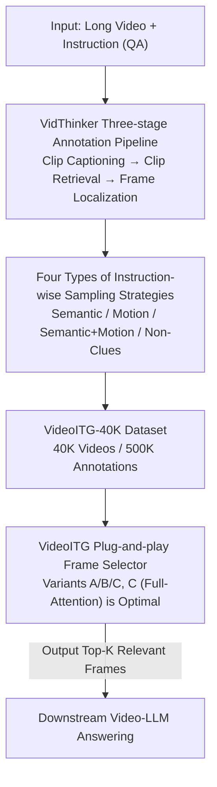

# VideoITG: Multimodal Video Understanding with Instructed Temporal Grounding

**Conference**: CVPR 2026  
**Paper**: [CVF Open Access](https://openaccess.thecvf.com/content/CVPR2026/html/Wang_VideoITG_Multimodal_Video_Understanding_with_Instructed_Temporal_Grounding_CVPR_2026_paper.html)  
**Code**: https://nvlabs.github.io/VideoITG/ (Project Page)  
**Area**: Video Understanding  
**Keywords**: Video-LLM, Frame Sampling, Instructed Temporal Grounding, Data Annotation Pipeline, Plug-and-play

## TL;DR
VideoITG reformulates "selecting frames based on user instructions" as a standalone temporal grounding task. By utilizing a GPT-4o-driven three-stage pipeline (VidThinker), it automatically annotates "which frames are relevant to an instruction" across 40K videos, generating 500K instruction-aligned annotations. A plug-and-play frame selector is then trained and prepended to various Video-LLMs, achieving or exceeding the performance of 64-frame uniform sampling using only 16–32 frames.

## Background & Motivation

**Background**: When processing long videos, Video-LLMs are constrained by memory and computation, preventing the ingestion of all frames. The most common practice is "uniform sampling"—extracting a frame at fixed intervals. To select more intelligently, existing works either compress spatio-temporal redundancy (pooling, similarity pruning, clustering), expand sequence lengths, or use "question-related" cues to retrieve frames (e.g., SeViLA using BLIP-2 for frame-by-frame scoring).

**Limitations of Prior Work**: Uniform sampling is simple but often misses key frames critical for semantic and temporal reasoning. Retrieval methods like SeViLA, which score frames independently, **lack cross-frame temporal modeling**, making them ineffective for "multi-event" or "time-sensitive" questions (e.g., "What did he do before getting into the car?"). More fundamentally, existing methods mostly support only **single descriptive queries** and fail to adapt to the diverse instruction types found in real-world scenarios.

**Key Challenge**: A significant performance gap exists between short and long video understanding. The root cause is the **lack of large-scale, instruction-guided temporal grounding data**—without such data, models cannot learn "which specific frames to focus on for a given instruction."

**Goal**: To enable frame sampling strategies to **adaptively change based on user instructions**. For the same video, the model should pick diverse representative frames for semantic questions, sample densely for motion questions, and cover the global scope for open-ended questions. This requires solving two problems: (1) How to obtain instruction-aligned annotation data? (2) What architecture can align instructions with visual evidence for frame selection?

**Key Insight**: The authors simulate the human process of finding information in long videos—skimming globally, locating question-related cues, and zooming into discriminative moments (a "needle in a haystack" process)—and automate this three-step reasoning flow.

**Core Idea**: Propose **Instructed Temporal Grounding (ITG)**—upgrading frame selection from uniform sampling to an instruction-driven discriminative task. An automated annotation pipeline, VidThinker, generates the data to train a plug-and-play frame selector that can be prepended to any Video-LLM.

## Method

### Overall Architecture

VideoITG consists of two main components: a data generation pipeline and a frame selection model:

1. **VidThinker Annotation Pipeline (Data Generation)**: Takes a long video and a QA pair (instruction) as input and outputs fine-grained annotations of "which frames are related to the instruction." It mimics human reasoning in three steps: segmenting the video into 5-second clips for instruction-conditioned captioning, using LLM chain-of-thought to retrieve relevant segments, and performing frame-by-frame binary classification to filter key frames. This produced **VideoITG-40K** (40K videos, 500K annotations) based on LLaVA-Video data.

2. **VideoITG Frame Selector (Model)**: A plug-and-play module placed before the Video-LLM. Given visual features $F$ and a query $q$, it outputs relevant frame indices $I_{rel}$, and the downstream Video-LLM answers using only the selected frames $F_{I_{rel}}$. The inference chain is $F=\text{ViT}(v)$, $I_{rel}=\text{VideoITG}(F,q)$, and $a=\text{VideoLLM}(F_{I_{rel}},q)$. The model is initialized from a pre-trained Video-LLM, exploring three attention/decoding variants (Generative / Anchor Causal Attention / Pooled Full Attention).

### Key Designs

**1. VidThinker Pipeline: Automating "Searching for Cues in Long Videos"**

The bottleneck is the absence of instruction-aligned temporal data, and manual frame-by-frame annotation for 40K videos is impractical. VidThinker uses an automated, interpretable pipeline to narrow the search space:

- **Instructed Clip Captioning**: The video is sliced into 5-second clips $\{v_i\}$. First, an LLM extracts key action phrases $k=\text{LLM}(q,a)$ from the QA (e.g., converting "What did the drummer do with his feet?" + "Moved feet" into "The drummer moved his feet while hitting the drums"). Then, a VLM generates descriptions $c_i=\text{VLM}(k,v_i)$ using $k$ as an attention cue. A crucial constraint: the VLM only adopts the cue if it is **visible in the current clip**, preventing hallucinations.
- **Instructed Clip Retrieval**: Clip descriptions are sequenced and fed to an LLM for **Chain-of-Thought (CoT)** reasoning. The LLM considers keyword matching and temporal relationships to output relevant clip indices $I_{rel\text{-}clip}=\text{LLM}(\{c_i\},q,a)$ directly, providing an interpretable selection basis.
- **Instructed Frame Localization**: Within the candidate clips, frame-level binary classification $y_i=\text{LLM}(f_i,q,a)\in\{\text{yes},\text{no}\}$ is performed. Only "yes" frames are kept as the final temporal grounding result, achieving high-precision selection.

**2. Four Instruction-wise Sampling Strategies: Different Questions Need Different Frames**

Selecting frames for "appearance" vs. "motion" requires different logic. The authors categorize instructions into four types with specific sampling strategies:

- **Semantic only**: Queries static appearance (people, objects, scenes). **Representative frames with high variance** are selected by calculating cosine similarity of CLIP features and keeping frames where similarity falls below a "scene change threshold."
- **Motion only**: Focuses on dynamic patterns (type, speed, direction). **Dense sampling at a fixed frequency** within the grounded segments ensures coverage of the full action (e.g., jump—flight—entry).
- **Semantic & Motion**: Requires both. Fixed-frequency sampling is performed in motion regions while maintaining frames with high semantic information.
- **Non-Clues**: Open-ended queries without specific anchors (e.g., "Describe this video"). A **compact yet diverse set of frames** (start, middle, end) is spread across the entire video to ensure global coverage with minimal redundancy.

**3. VideoITG Frame Selector Variants: Aligning Instructions and Visual Tokens**

Three implementations were compared to enhance visual-language token alignment and cross-frame context:

- **Variant A (Generative)**: Reformulates temporal grounding as next-token prediction, outputting "relevant frame" tokens sequentially. Despite aligning with native Video-LLM training, it performed the **worst** due to sparse supervision under teacher forcing and sequential dependency.
- **Variant B (Anchor Causal Attention)**: A discriminative approach performing binary classification on visual tokens. It uses causal attention but inserts an **anchor token** after the instruction to act as a "temporal mediator." For frame $t$, the anchor $A_t=\frac{1}{M}\sum_{i,j}F^t_{ij}$ bridges dependencies across frames.
- **Variant C (Pooled Full Attention)**: Removes the causal mask to allow **bidirectional full attention** between visual and text tokens. Visual tokens are average-pooled per frame before a classification head. This variant provides the largest receptive field and global temporal modeling, yielding the **best results**.

### Loss & Training
The visual encoder uses SigLIP, and the language model uses Qwen2, initialized from LLaVA-Video. Pre-training involves an MLP projector on image-text caption data (batch 256, lr $1\times10^{-3}$), followed by full-parameter fine-tuning on LLaVA-Video (64 frames, 16K sequence). Finally, the frame selector is trained on VideoITG-40K at 1 fps; LLM lr is $2\times10^{-5}$, classification head lr is $2\times10^{-4}$. During inference, a maximum of 512 frames are input, and the top-32 frames are selected.

## Key Experimental Results

### Main Results: Comparison of Frame Selection Methods

| Method | Answering LMM | Frames | LongVideoBench | MLVU | VideoMME-Avg |
|----------|---------------|------|----------------|------|--------------|
| Uniform | LLaVA-OneVision-7B | 8 | 54.2 | 58.9 | 54.9 |
| BOLT | LLaVA-OneVision-7B | 8 | 56.1 | 63.4 | 57.6 |
| Frame-VOYAGER | LLaVA-OneVision-7B | 8 | — | 65.6 | 59.5 |
| **Ours (VideoITG-8B)** | LLaVA-OneVision-7B | 8 | **60.1** | **68.7** | **61.6** |
| Uniform | LLaVA-Video-7B | 64 | 59.9 | 70.2 | 64.7 |
| **Ours (VideoITG-8B)** | LLaVA-Video-7B | 32 | **61.6** | **74.6** | **66.9** |

VideoITG improves LLaVA-OneVision-7B's average score from 54.9 to 61.6 (**+6.7** Gain). On LLaVA-Video-7B, it outperforms 64-frame uniform sampling using only 32 frames. On VideoMME, **16 frames with VideoITG $\approx$ 64 frames with uniform sampling**.

### Key Findings
- **Variant Selection**: Variant C (Full Attention) is superior as it allows all tokens to access the text query and enables global temporal relationship modeling.
- **Pipeline Components**: Removing "Instructed Clip Captioning" drops VideoMME-Long from 56.9 to 53.4, proving that informational diversity is critical for representation.
- **VL Alignment**: Training from pure text LLMs (without vision-language pre-training) leads to a significant performance collapse, emphasizing that alignment quality is more important than video context length.
- **Model Scaling**: InternVL2.5-8B + VideoITG (64.3) outperforms InternVL2.5-26B with uniform sampling (61.6), suggesting that **intelligent frame selection is more cost-effective than scaling model parameters.**

## Highlights & Insights
- **Elevating Frame Selection to a Supervised Task**: By creating 500K instruction-aligned annotations, VideoITG provides the first large-scale explicit supervision for "which frames to watch," leading to a performance leap.
- **Instruction Categorization**: The insight that different question types (Semantic vs. Motion) require different sampling strategies encodes human intuition into the data pipeline.
- **Leveraging Small-to-Large Gains**: The fact that an 8B model with VideoITG can beat a 26B model underscores the high ROI of optimizing the input side (information selection) rather than just the model side.

## Limitations & Future Work
- **Reliance on Closed-source LLMs**: VidThinker depends on GPT-4o for high-quality annotations, which involves high costs and potential error propagation from the teacher model.
- **Sampling Resolution**: VideoITG operates on low-resolution frames for selection; there is room to improve fine-grained content recognition.
- **Inference Overhead**: The frame selector is a separate Video-LLM. While it saves computation for the downstream model, the selector itself introduces an additional forward pass.

## Related Work & Insights
- **vs. SeViLA/Scoring Methods**: These lack cross-frame temporal modeling. VideoITG uses full attention for global temporal relationships and instruction-driven grounding.
- **vs. Traditional Temporal Grounding (DiDeMo/QVHighlights)**: Conventional datasets lack instruction-based properties and are 4$\times$ smaller than VideoITG-40K.
- **vs. Generative Models (TimeChat)**: VideoITG's experiments show that discriminative classification (Variant C) is significantly more effective than generative paradigms for frame selection tasks.

## Rating
- **Novelty**: ⭐⭐⭐⭐ Reformulating ITG as a task and the VidThinker pipeline are strong contributions.
- **Experimental Thoroughness**: ⭐⭐⭐⭐⭐ Extensive results across 6 Video-LLMs and multiple benchmarks.
- **Writing Quality**: ⭐⭐⭐⭐ Clear structure and intuitive explanations of the three-stage pipeline.
- **Value**: ⭐⭐⭐⭐⭐ High practical utility as a plug-and-play module and an open-source dataset.

<!-- RELATED:START -->

## Related Papers

- [\[CVPR 2026\] T2SGrid: Temporal-to-Spatial Gridification for Video Temporal Grounding](t2sgrid_temporal-to-spatial_gridification_for_video_temporal_grounding.md)
- [\[CVPR 2026\] HieraMamba: Video Temporal Grounding via Hierarchical Anchor-Mamba Pooling](hieramamba_video_temporal_grounding_via_hierarchical_anchor-mamba_pooling.md)
- [\[CVPR 2026\] CVA: Context-aware Video-text Alignment for Video Temporal Grounding](cva_context-aware_video-text_alignment_for_video_temporal_grounding.md)
- [\[CVPR 2026\] DeRVOS: Decoupling Consistent Trajectory Generation and Multimodal Understanding for Referring Video Object Segmentation](dervos_decoupling_consistent_trajectory_generation_and_multimodal_understanding_.md)
- [\[CVPR 2026\] OmniVTG: A Large-Scale Dataset and Training Paradigm for Open-World Video Temporal Grounding](omnivtg_a_large-scale_dataset_and_training_paradigm_for_open-world_video_tempora.md)

<!-- RELATED:END -->
