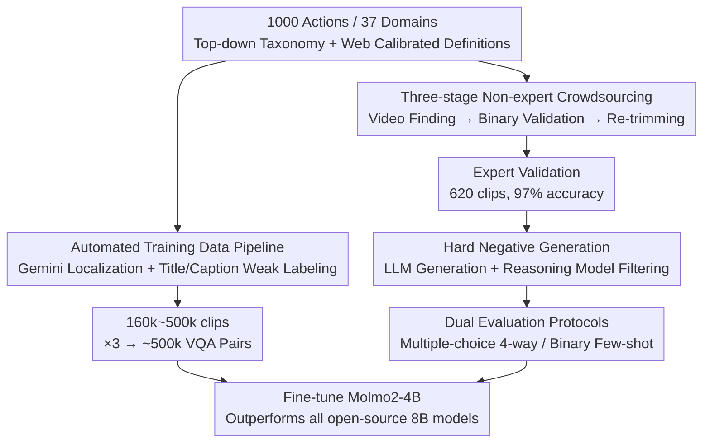

# VideoNet: A Large-Scale Dataset for Domain-Specific Action Recognition

**Conference**: CVPR 2026  
**arXiv**: [2605.02834](https://arxiv.org/abs/2605.02834)  
**Code**: https://tanu.sh/research/videonet (Project page, evaluation/annotation code pending release)  
**Area**: Video Understanding / Multimodal VLM  
**Keywords**: Action Recognition, Domain-Specific Actions, VLM Benchmark, Few-shot Learning, Hard Negatives

## TL;DR
VideoNet constructs a video action recognition benchmark covering 37 domains and 1,000 fine-grained "domain-specific actions" (offering both multiple-choice and binary few-shot protocols). Using a fully automated pipeline, it collects nearly 500,000 VQA training pairs, bringing the "forgotten task" of domain-specific action recognition back into the VLM evaluation spotlight. The results show that open-source 8B VLMs achieve less than 50% accuracy in multiple-choice, while a 4B model fine-tuned on this data outperforms all 8B open-source models.

## Background & Motivation

**Background**: Action recognition was once the flagship task of video understanding, but it has been largely marginalized in the VLM era. Existing action datasets fall into three categories: ① Coarse-grained labels like Kinetics and ActivityNet (e.g., one class for "rock climbing"), which foundation models have already saturated (InternVideo2 reaches 92.1% on Kinetics-400); ② Datasets like FineDiving and FineSports that cover only a few sports, failing to test generalization; ③ TemporalBench and ToMATo, which only test fine-grained temporal attributes like "object moving left or right," which real users rarely consult large models about.

**Limitations of Prior Work**: Domain-specific action data (e.g., figure skating "three flip jump," skateboarding "laser flip," pen spinning "thumbaround reverse") is extremely difficult to collect. Traditional methods rely on domain experts for item-by-item annotation, which is high-cost and narrow in coverage. The closest work, Ego-Exo4D, covers only 8 domains with poor visual diversity (728 bouldering videos from only 2 climbing gyms); ActionAtlas focuses only on sports, provides no training data, and is only 1/5 the size of VideoNet.

**Key Challenge**: Domain-specific actions test both **perception** (subtle action differences, e.g., using a toepick to distinguish a flip jump from a Salchow jump) and **compositional reasoning** (checking if all elements are present in the correct order). The lack of large-scale, cross-domain data with real-world application value leaves VLMs unable to be properly evaluated or trained.

**Goal**: The problem is decomposed into three sub-questions: (1) How to collect high-quality, cross-domain domain-specific action annotations **without hiring domain experts**? (2) Where exactly do existing VLMs fall short in these tasks, and can test-time few-shot learning bridge the gap? (3) Can post-training close this gap?

**Key Insight**: The authors found that the main barrier for non-expert crowdsourcing is that "k-way classification is too difficult," so they **reduce the dimensionality to binary anomaly detection**. They also observed that video titles and captions are naturally weak supervisory signals, allowing them to bypass the "using VLM to distill VLM" cycle (since VLMs themselves are not proficient at this task).

**Core Idea**: Use "non-expert crowdsourcing + web-search calibrated definitions + binary anomaly detection" to create a high-quality test set, and "Gemini localization + title/caption weak labeling" to create a large-scale training set, transforming domain-specific action recognition into an evaluable and trainable task for the VLM era.

## Method

### Overall Architecture
VideoNet is not a single model but a set of **data assets + evaluation protocols**, consisting of three pipelines. **Benchmark Construction Pipeline** (Manual, producing 5,000 refined test clips): Definitions are first created top-down and calibrated using web searches → Three-stage non-expert crowdsourcing collects "cleanly trimmed" clips → Expert validation is performed via sampling (97% accuracy) → 3 "hard negative" text labels are generated for each action → These are assembled into multiple-choice (4,000 test + 1,000 validation) and binary few-shot (4,000 test) evaluation sets. **Training Data Pipeline** (Fully automated, producing 160,000–500,000 clips): Videos are crawled by domain → Gemini 2.5 Flash performs action localization (capable of localization but not labeling) → WhisperX extracts word-level timestamps → Weak labeling and filtering are conducted using video titles/captions → 3 VQA pairs are generated per clip. **Training & Evaluation**: Molmo2-4B is fine-tuned on this data and evaluated against various open/closed-source VLMs and humans across both protocols.

The following diagram illustrates the two data pipelines (sharing the same action taxonomy):

### Key Designs

**1. Top-down Action Taxonomy + Web-search Calibrated Definitions: Enabling Non-experts to Annotate Correctly**

The first hurdle in domain-specific actions is that "annotators do not understand the domain." The authors first define 7 major categories **top-down** (covering daily life like food, professional knowledge like medical, and high frame rates like sports). Within each category, domains are selected based on the availability of online videos and credible expert content. Action lists are collected from expert-written sources (e.g., authoritative skateboarding blogs), expanded by LLMs, and filtered for videos with sufficient online presence, resulting in 1,000 actions. The key lies in **Action Definitions**: these serve as the primary reference for both humans and models to classify actions without prior expertise. Initially, LLMs generated definitions directly, but they often encoded outdated or incorrect knowledge in specialized areas. Thus, the authors used LLMs with **web search** capabilities to retrieve expert information from authoritative communities, cross-check, and correct errors. Final definitions focus on "visual cues + key differences from similar actions." Ablations show that providing definitions significantly improves non-expert annotation quality.

**2. Three-Stage Non-expert Crowdsourced Annotation Pipeline: Reducing k-way Classification to Binary Anomaly Detection**

This is the core strategy for bypassing domain experts. The pipeline has three stages, with each clip reviewed by 5 annotators: **(a) Video Collection**—Annotators are given action names, domains, and definitions and asked to find 7 clips from different videos (enforced to increase diversity); **(b) Clip Validation**—This is the highlight: whereas FineSports/MultiSports asks experts to identify which of $k$ actions a clip belongs to, this work **reduces it to binary choice**—simply asking non-experts "Does this clip contain the target action?" Since 5–6 out of 7 clips typically contain the action, the task becomes **anomaly detection** (picking out the 1 or 2 that don't), which is trivial for non-experts; a 3-person majority vote increases confidence. **(c) Clip Re-trimming**—Annotators are "trained" to become "experts" for a specific action using confirmed well-trimmed examples, then asked to correct the temporal boundaries of poorly trimmed clips. Each action finally obtains $\ge 5$ refined clips, totaling 5,000 (average/typical duration 12.2s / 5.0s), with a 5-minute upper limit to prevent context overflow during 3-shot.

**3. Hard Negative Generation: Pushing from "Scene-Cheating" to "True Action Observation"**

The difficulty of the benchmark is determined by how distractors are created for multiple-choice/binary tests. "Random negatives" (randomly selected actions from the same domain) have a fatal flaw: different actions often have different backgrounds/scenes/static cues, allowing models to cheat using the scene (e.g., alley-oop dunk vs. free throw have different backgrounds). The authors engineer **Hard Negatives**—actions highly similar to the positive sample with only subtle visual or motion differences (e.g., alley-oop dunk vs. put-back dunk). Candidates are first generated by an LLM (gpt-4.5-preview), then **iteratively refined by a reasoning model (o3)**: candidates likely to co-occur with the positive action or that are inherently ambiguous are filtered out, visual similarity diversity is increased, and the frequency of each action appearing as a hard negative is balanced. Experiments (Table 5) prove that moving from random to hard negatives causes significant performance drops for both humans and models, with **humans dropping more than models**, indicating that VideoNet's difficulty stems from fine-grained visual distinctions requiring expertise rather than data noise.

**4. Dual Evaluation Protocols: Multiple-choice for Core Recognition, Binary Few-shot for "Learning to Learn"**

Each action is paired with 5 refined clips and 3 hard negative labels. **Multiple-choice**: Each clip uses 1 correct label + 3 hard negative labels for a 4-way choice (random baseline slightly above 25%), totaling 5,000 questions (1,000 reserved for validation). **Binary Few-shot**: The first 3 clips of an action serve as in-context examples, the remaining 2 are positive test clips, and 2 hard negative labels are chosen with 2 clips each as negative test clips, forming a binary "does the video contain action X" judgment (random baseline 50%), totaling 4,000 questions. The significance of the binary setting is that multiple-choice few-shot would overflow the context of most models with 12 videos (4 actions $\times$ 3 examples); the binary setting cleanly measures the **visual in-context learning** capabilities of VLMs ($k \in \{1, 2, 3\}$).

**5. Automated Training Data Pipeline: Using Titles/Captions as Weak Labels to Bypass the "VLM Distillation" Loop**

The manual pipeline is high-quality but too expensive for training scales, and distilling labels directly from the strongest VLMs fails because VLMs themselves cannot label these actions accurately. Instead, the authors use **weak signals intrinsic to the video**—titles and captions. Processing 37 domains one by one: search terms are constructed from action lists (e.g., "laser flip" $\rightarrow$ "skateboarding laser flip") to crawl videos → Gemini 2.5 Flash acts as a **locator** (Gemini cannot accurately label the action but is excellent at cutting start/end timestamps where actions occur) → WhisperX extracts word-level timestamps. Three filtering/labeling strategies are used (increasing intensity): ① The action name appears in the caption within $\pm T = 1$ second of the localized clip; ② On top of ①, the action must also appear in the video title; ③ The action appears in the title, and only one clip is localized for the entire video. Total: 8 million videos crawled → 1.5 million localized videos → 6 million clips → filtered to 160,000–500,000 clips, with 3 VQA pairs generated per clip $\approx$ 500,000 training pairs.

### Loss & Training
The instruction-tuned Molmo2-4B (ViT + MLP connector + LLM) is fine-tuned. Frame sampling is set at $S = 4$ fps, with a maximum of $F = 64$ frames; if the video duration exceeds $F/S$ seconds, 64 frames are sampled uniformly. To preserve temporal information, the timestamp (in seconds) is encoded as text and fed to the LLM before each frame. Training involves 8,000 steps with a batch size of 128. The conclusion is that **data quality is more important than quantity**—strategy ③, the strictest filter, yielded the fewest samples but the highest accuracy; however, in long-tail domains, coverage becomes critical (for juggling, ① gave 1,582 clips while ③ gave only 348, making ① more accurate: 49.0% vs. 45.2%).

## Key Experimental Results

### Main Results

**Multiple-Choice Setting (4-way, random baseline ~25%)**

| Model | Type | MC Accuracy |
|------|------|-----------|
| Gemini 3.1 Pro | Closed-source | 69.9% |
| Qwen3-VL-8B | Open-source 8B | 45.0% |
| Best Existing Open-source 8B | Open-source 8B | 45.0% |
| **Ours: Fine-tuned Molmo2-4B** | Open-source 4B | **53.5% (+8.5pp over next best open-source)** |
| Random Baseline | — | ~25% |

**Binary 0-shot Setting (random baseline 50%)**

| Model | Type | Binary Accuracy |
|------|------|-----------|
| GPT-5 | Closed-source | 72.9% |
| Qwen3-VL-8B | Open-source 8B | 59.2% |
| **Ours: Fine-tuned Molmo2-4B** | Open-source 4B | **66.6% (outperforms all 8B models)** |
| Non-expert Human (with def) | Human | 69.1% |
| Random Baseline | — | 50% |

Open and closed-source models cluster into two groups: open-source 8B models are within 1pp of each other, and closed-source models are within 2.5pp, making it hard to distinguish if intra-cluster differences are due to capability or noise. The fine-tuned 4B model outperforms all open-source 8B models on both protocols, confirming that open-source models lack domain-specific training data.

### Ablation Study

| Configuration / Dimension | Key Metric | Description |
|------|---------|------|
| Single middle frame $\rightarrow$ Whole video | Open models show almost no gain | Open-source VLMs rely on static visual bias and do not ground actions in motion cues. |
| Single frame $\rightarrow$ Whole video (GPT/Ours) | Significant improvement | Strong models actually utilize video information. |
| Adding action definitions | Minimal gain (esp. for closed-source) | VLMs already possess action knowledge; the bottleneck is mapping knowledge to subtle motions. |
| Increasing FPS (e.g., to 4fps) | Diminishing returns | Even for motion-dense categories like Sports, higher temporal resolution isn't utilized. |
| Training Filter Strategy ③ (Strictest) | MC +11.5pp (vs. base model) | Quality > Quantity, though long-tail coverage remains important. |
| Hard $\rightarrow$ Random Negatives | Human/Model gains (Human more) | Hard negatives are the true source of benchmark difficulty. |

**Few-shot Performance (Binary, $k \in \{1, 2, 3\}$)**

| Subject | 0 $\rightarrow$ 3-shot Change |
|------|--------------|
| Non-expert Human (with def) | 69.1% $\rightarrow$ 82.7% (**+13.6pp**) |
| Qwen3-VL-8B | 59.3% $\rightarrow$ 66.2% (+6.9pp, best case) |
| Gemini 3.1 Pro | 72.0% $\rightarrow$ 67.2% (**−4.8pp**, worst case) |
| Gemini 3 Flash | 70.3% $\rightarrow$ 75.0% (+4.7pp, outperforms the newer Pro) |
| Model Average | +2.95pp |

### Key Findings
- **Humans are far superior visual few-shot learners compared to VLMs**: In 3-shot, humans improve by 13.6pp to 82.7%, while models average only +2.95pp, with some frontier models (Gemini 3.1 Pro) even **regressing**. This suggests current VLMs have not yet learned to "learn from visual examples," the most critical diagnostic finding of this paper.
- **Nearly all models see the largest jump at $k=0 \rightarrow 1$**, with additional examples being nearly useless, implying models cannot effectively utilize multiple visual examples.
- **Human performance drops most sharply from random to hard negatives**: Humans score 94.4% on positive samples but only 71.9% on hard negatives, proving VideoNet's difficulty lies in genuine fine-grained professional distinctions.
- **The Food category yields high scores for everyone**: Many actions (like Air-Frying) can be recognized via object detection, making it hard to create true hard negatives. The authors suggest a "hard subset" for the future.

## Highlights & Insights
- **The "k-way classification $\rightarrow$ binary anomaly detection" reduction is the key trick for bypassing domain experts**: By asking non-experts "does it contain X" and utilizing the statistical prior that "5-6 out of 7 clips contain it," the task becomes cheap and accurate (97% expert validation rate, exceeding the 85.4% for MMLU-Pro experts). This logic can be transferred to any "hard to annotate but easy to verify" crowdsourcing scenario.
- **The "Locator vs. Labeler Decoupling" is clever**: Knowing Gemini cannot label actions accurately, they use its "localization" capability for slicing, leaving the "labeling" to weak signals from video titles/captions—avoiding the dead end where VLM distillation fails for this task.
- **Few-shot diagnostics reveal the true VLM bottleneck**: Successfully decoupling "lack of domain knowledge" from "lack of visual in-context learning capability," the study found that adding definitions or visual examples has little effect. The bottleneck is "mapping existing knowledge to subtle motion"—a strong directional guide for designing next-generation video VLMs.

## Limitations & Future Work
- **Training data relies on weak title/caption labels and is inherently noisy**: "Clickbait" titles, misaligned captions, or "how to X" videos that don't actually demonstrate X introduce mislabeling. The paper does not provide the label accuracy for the training set itself.
- **Categories like Food are hard to generate true hard negatives for**, making some domains too easy and inflating overall performance without truly testing video understanding.
- **Expert validation only covers 1 domain per 7 categories (620 clips)**; the assumption that "accuracy is similar across domains in the same category" is underdeveloped, and long-tail domains (e.g., suturing, crochet) lack independent validation.
- **The benchmark focuses on "what the action is" and does not touch on action quality analysis** (e.g., is the squat form correct, is the lutz jump good?)—which the authors identify as the "killer app." This work is only a precursor.

## Related Work & Insights
- **vs Ego-Exo4D**: Ego-Exo4D covers only 8 domains with poor visual diversity (filmed in the same gym); VideoNet covers 37 domains with high diversity from web sources and $30\times$ more training data.
- **vs ActionAtlas**: Similar in style but only focuses on sports (56 items), provides no training data, and is 1/5 the size of VideoNet. VideoNet generalizes across daily life, medicine, sports, and crafts.
- **vs Kinetics/ActivityNet (Coarse-grained)**: Their labels are too coarse; foundation models have already hit 92%+. VideoNet embeds fine-grained motion into real application scenarios, widening the performance gap between models.
- **vs ToMATo/TemporalBench (Fine-grained temporal)**: They ask about details like "object moving left/right" that users don't consult models for, testing only perception. VideoNet actions inherently contain fine-grained motion with real-world value and test compositional reasoning.
- **Insights**: ① The "k-way $\rightarrow$ binary anomaly detection" crowdsourcing paradigm can be extended to fine-grained image/audio annotation; ② "Using a strong model's specific capability (localization) + weak signals for labeling" is a universal recipe for low-cost large-scale data creation; ③ Visual few-shot learning is a clear weakness in current VLMs, warranting specifically designed perception mechanisms.

## Rating
- Novelty: ⭐⭐⭐⭐ The task "resurrects" an old one, but the two data pipelines and the few-shot diagnostics offer tangible methodological innovation.
- Experimental Thoroughness: ⭐⭐⭐⭐⭐ Extremely comprehensive coverage across closed/open models, MC/binary/few-shot protocols, vision/text ablations, human baselines, and training strategies.
- Writing Quality: ⭐⭐⭐⭐ Clear logic with a progressive narrative (MC $\rightarrow$ Binary $\rightarrow$ Few-shot $\rightarrow$ Training).
- Value: ⭐⭐⭐⭐⭐ Provides an evaluable and trainable domain-specific action benchmark with nearly 500,000 training pairs, diagnosing the "VLM few-shot" weakness as high-value infrastructure for the video VLM community.

<!-- RELATED:START -->

## Related Papers

- [\[CVPR 2026\] OmniVTG: A Large-Scale Dataset and Training Paradigm for Open-World Video Temporal Grounding](omnivtg_a_large-scale_dataset_and_training_paradigm_for_open-world_video_tempora.md)
- [\[CVPR 2026\] OpenMarcie: Dataset for Multimodal Action Recognition in Industrial Environments](openmarcie_dataset_for_multimodal_action_recognition_in_industrial_environments.md)
- [\[CVPR 2026\] DarkAct: A RGB-Thermal Dataset and Fusion Framework for Multimodal Low-Light Action Recognition](darkact_a_rgb-thermal_dataset_and_fusion_framework_for_multimodal_low-light_acti.md)
- [\[CVPR 2026\] Seeing Motion Through Polarity for Event-based Action Recognition](seeing_motion_through_polarity_for_event-based_action_recognition.md)
- [\[ECCV 2024\] SemTrack: A Large-Scale Dataset for Semantic Tracking in the Wild](../../ECCV2024/video_understanding/semtrack_a_large-scale_dataset_for_semantic_tracking_in_the_wild.md)

<!-- RELATED:END -->
