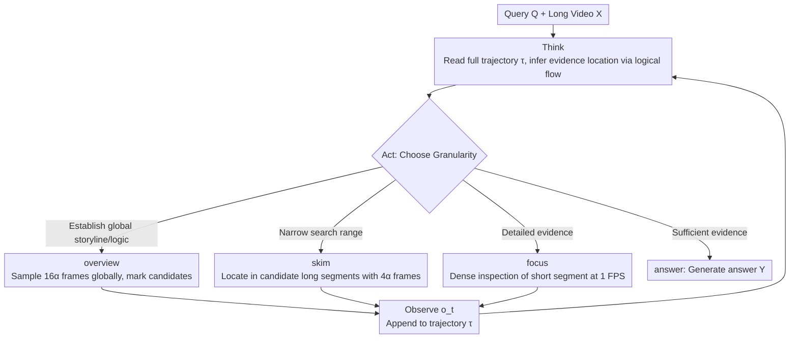

# VideoSeek: Long-Horizon Video Agent with Tool-Guided Seeking

**Conference**: CVPR 2026  
**arXiv**: [2603.20185](https://arxiv.org/abs/2603.20185)  
**Code**: [https://github.com/jylins/videoseek](https://github.com/jylins/videoseek)  
**Area**: Video Understanding / Agent  
**Keywords**: Video Agent, Long Video Understanding, Tool-use, Logical Flow, think-act-observe

## TL;DR
VideoSeek proposes a long-horizon video agent that utilizes video logical flow to actively "seek" key evidence rather than exhaustively parsing all frames. Through a think-act-observe loop and a multi-granularity toolkit (overview/skim/focus), it achieves a 10.2-point improvement over the base GPT-5 model on LVBench while reducing frame usage by 93%.

## Background & Motivation
1. **Background**: Video-language understanding has advanced rapidly due to progress in LMMs. However, mainstream methods (including Qwen2.5-VL, GPT-4o, etc.) still employ a single-inference paradigm—generating answers directly after inputting a fixed number of frames—which struggles in long video and complex reasoning scenarios. Video agent methods (e.g., DrVideo, DVD) introduce iterative reasoning but rely heavily on dense video preprocessing.
2. **Limitations of Prior Work**: Existing video agents sample densely at 0.2-2 FPS and generate detailed textual descriptions or structured memories for every frame, leading to computational costs that scale linearly with video length. For example, DVD and MR.Video both process 8074 frames on LVBench. However, over 80% of questions in LVBench can be answered by viewing less than 5% of the video; exhaustive parsing is extremely wasteful.
3. **Key Challenge**: Detailed video preprocessing improves accuracy but is costly and unscalable. The challenge is to achieve or exceed the performance of dense parsing under an extremely sparse visual budget.
4. **Goal**: To design an efficient video agent that answers video questions by actively seeking key evidence instead of brute-force exhaustive search.
5. **Key Insight**: Humans do not watch videos frame-by-frame to answer questions—they leverage temporal and causal structures to infer where useful evidence might appear, quickly establishing a rough storyline, checking promising segments, and only watching carefully when details are needed.
6. **Core Idea**: Employ a ReAct-style think-act-observe loop with three granularities of tools (global overview → rough skimming → fine focusing) to actively navigate to answer-critical frames based on video logical flow.

## Method

### Overall Architecture
VideoSeek reformulates "answering a long video question" from a single-step inference into a long-range exploration problem. Instead of forcing the model to process a fixed number of frames at once, an agent is allowed to scan for a storyline, skip to suspicious segments, and finally focus on key moments. Given query $\mathbf{Q}$ and video $\mathbf{X}$, the agent produces a think-act-observe triplet $\langle z_t, a_t, o_t \rangle$ at each reasoning step $t$: thinking ($z_t$), calling a tool to observe ($a_t$), and obtaining a new observation ($o_t$). These triplets form a trajectory $\tau$, and the final answer is generated by $p(\mathbf{Y}\mid\mathbf{X}, \mathbf{Q}, \tau)$. The framework aims to concentrate the exploration process $p(\tau\mid\mathbf{X}, \mathbf{Q})$ on a few high-information observations. The agent uses GPT-5 as the thinking LLM with a maximum of $N=20$ reasoning turns, requiring no additional training.

### Key Designs

**1. Multi-granularity Toolkit: Decomposing "Watching" into Three Coarse-to-Fine Actions**

The primary waste in video agents stems from indiscriminate dense sampling. VideoSeek instead provides three tools operating at different temporal granularities, allowing the agent to decide the appropriate "view" for each step. `<overview>` samples $16\alpha$ frames uniformly from the entire video (e.g., 64 frames for $\alpha=4$ in LVBench) to generate a rough storyline and identify interesting intervals. This is usually called once at the start to provide a cognitive map. `<skim>` samples $4\alpha$ frames from a candidate long segment to determine where query-related moments might reside, allowing iterative narrowing of the search range. `<focus>` performs dense inspection at 1 FPS on a short segment (max $4\alpha$ seconds) for details like reading text, counting objects, or identifying faces. These tools are complementary; removing `<overview>` leads to a 13.3-point drop in performance.

**2. Think-Act-Observe Loop: Dynamic Decision-Making on Full Trajectories**

VideoSeek implements adaptive behavior using the ReAct architecture. At each step, the thinking LLM reads the complete trajectory (all historical thoughts, actions, and observations) to output a new reasoning $z_t$ and a tool call $a_t$. If $a_t$ is `<answer>`, the agent generates the result and stops; otherwise, it executes the tool and appends the new observation $o_t$ to the trajectory. The focus is on the agent deciding where to look and at what granularity based on accumulated observations, rather than following a predefined "coarse-to-fine" script. Unlike prior works that pre-build databases or maintain fixed memory buffers (like DrVideo or DVD), reasoning on the dialogue history allows the agent to backtrack and correct earlier misjudgments.

**3. Utilizing Video Logical Flow: Inferring Evidence via Temporal-Causal Structure**

Videos possess an inherent logical flow consisting of scene causality, temporal order, and character relationships. VideoSeek leverages this to infer where answers might appear. When subtitles are available, this logical flow is explicitly exposed as a textual storyline, allowing the agent to jump directly to relevant segments. In the absence of subtitles, a rough logic flow is constructed via `<overview>` visual summaries. The explicit exposure of logical flow significantly impacts navigation efficiency—on LVBench, adding subtitles reduces frame usage from 92.3 to 27.2 while increasing accuracy from 68.4 to 76.7.

### A Complete Example

Consider answering "To whom did the protagonist hand the trophy at the award ceremony at the end?" in a one-hour video. The agent first calls `<overview>` to establish a storyline and identifies candidate intervals: opening, middle conflict, and end ceremony. Reasoning that an "award ceremony" should be in the later part, the agent calls `<skim>` on the last quarter to confirm the ceremony's location and narrow it down to the "protagonist on stage" segment. Finally, it calls `<focus>` on these few seconds to watch at 1 FPS, identifying the recipient's name from their badge. The agent then outputs `<answer>`. The entire process takes approximately 4 turns and 92.3 frames on average, compared to the thousands of frames required by exhaustive methods.

### Loss & Training
VideoSeek is a training-free (model-agnostic) agent framework. It leverages the off-the-shelf reasoning and tool-use capabilities of GPT-5. Visual observations returned by tools are also interpreted by GPT-5, with no parameter updates required.

## Key Experimental Results

### Main Results

| Method | Type | LVBench (No Subtitles) | Frames | LVBench (With Subtitles) | Frames |
|------|------|-----------------|------|-----------------|------|
| GPT-5 (Base) | LMM | 60.1 | 384 | 66.5 | 384 |
| Gemini 1.5 Pro | LMM | 33.1 | 3600 | - | - |
| DVD | Agent | 74.2 | 8074 | 76.0 | 8074 |
| MR. Video | Agent | 60.8 | 8074 | - | - |
| **VideoSeek** | **Agent** | **68.4** | **92.3** | **76.7** | **27.2** |

VideoMME Long (With Subtitles): VideoSeek 81.2% / 15.9 frames vs GPT-5 78.1% / 384 frames.
LongVideoBench Long: VideoSeek 73.5% / 29.6 frames vs GPT-5 64.5% / 384 frames.

### Ablation Study

| Configuration | LVBench (No Subtitles) | Description |
|------|-----------------|------|
| Full toolkit | **68.4** | Full model |
| w/o overview | 55.1 (-13.3) | Loss of global perspective |
| w/o skim | 62.4 (-6.0) | Loss of intermediate granularity |
| w/o focus | 63.7 (-4.7) | Loss of fine inspection |

| Thinking LLM | Frames | Turns | LVBench |
|--------------|------|------|---------|
| GPT-5 | 92.3 | 4.42 | **68.4** |
| o4-mini | 112.6 | 5.08 | 58.5 (-9.9) |
| GPT-4.1 | 74.2 | 2.99 | 53.0 (-15.4) |

### Key Findings
- **overview is the most critical tool** (13.3-point drop if removed) as it provides the global storyline and logical flow necessary for subsequent navigation.
- **Reasoning capability determines the ceiling**: GPT-4.1 (a non-thinking model) tends to stop reasoning prematurely (2.99 turns) with insufficient evidence; o4-mini explores more but with lower reasoning quality.
- **Subtitles = Explicit Logical Flow**: Adding subtitles reduces frame usage by 70% while improving accuracy by 8.3 points, proving that textual storylines greatly simplify evidence search.
- **Comparison vs DVD**: VideoSeek outperforms DVD when subtitles are present (76.7 vs 76.0) using only 0.3% of the frames (27.2 vs 8074).
- On the Video-Holmes complex reasoning benchmark, VideoSeek (47.3%) outperforms Gemini 2.5 Pro (45.0%) using 1/4 of the frames.

## Highlights & Insights
- **Paradigm shift from "Exhaustive Parsing" to "Active Seeking"**: This is the core contribution. VideoSeek proves that in long video understanding, intelligent navigation is more effective than brute-force dense sampling, achieving comparable results with 1% of the frames.
- **Hierarchical Tool Design**: The overview/skim/focus hierarchy mirrors human "scan → flip → scrutinize" behavior, which is simple yet effective. The value of the global overview exceeds expectations.
- **Thinking models as the core engine**: Non-thinking models cannot effectively utilize this framework; true reasoning is required to judge evidence sufficiency and determine the next search location.

## Limitations & Future Work
- Heavy reliance on closed-source models (GPT-5) limits open-source reproducibility and deployment in cost-sensitive scenarios.
- Performance may decline for sudden or highly localized critical moments (e.g., anomaly detection) where logical flow does not predict the event.
- High API call costs since every tool call requires visual interpretation by the LMM.
- Future work could explore distilling this agent framework into smaller open-source models.
- Tool hyperparameters (e.g., $\alpha$) require adjustment for different benchmarks.

## Related Work & Insights
- **vs DVD Agent**: DVD builds a multi-granularity database requiring 8074 frames of preprocessing. VideoSeek explores on-demand, reducing frames by two orders of magnitude with similar or better performance.
- **vs DrVideo**: DrVideo converts videos to long documents at 0.2 FPS, following the exhaustive paradigm. VideoSeek proves exhaustive sampling is unnecessary.
- **vs Single-inference LMMs**: GPT-5 achieves 60.1% with 384 frames; VideoSeek elevates the same model to 68.4%/76.7%, demonstrating how the agent paradigm unlocks the potential of base models.

## Rating
- Novelty: ⭐⭐⭐⭐ (Valuable "seeking vs exhaustive" concept, though ReAct core is established)
- Experimental Thoroughness: ⭐⭐⭐⭐⭐ (Deep analysis across four benchmarks with varied ablation)
- Writing Quality: ⭐⭐⭐⭐⭐ (Fluid narrative, clear Figure 1, and illustrative case studies)
- Value: ⭐⭐⭐⭐ (Important for efficiency in video agents, though limited by closed-source dependency)

<!-- RELATED:START -->

## Related Papers

- [\[CVPR 2026\] SVAgent: Storyline-Guided Long Video Understanding via Cross-Modal Multi-Agent Collaboration](svagent_storyline_guided_long_video_understanding_via_cross_modal_multi_agent_collaboration.md)
- [\[CVPR 2026\] META: Meta Evolution of Tool Trajectory Adaptation for Long-Video Understanding](meta_meta_evolution_of_tool_trajectory_adaptation_for_long-video_understanding.md)
- [\[CVPR 2026\] LongVT: Incentivizing "Thinking with Long Videos" via Native Tool Calling](longvt_incentivizing_thinking_with_long_videos_via_native_tool_calling.md)
- [\[CVPR 2026\] A Multi-Agent Perception-Action Alliance for Efficient Long Video Reasoning](a_multi-agent_perception-action_alliance_for_efficient_long_video_reasoning.md)
- [\[CVPR 2026\] Question-guided Visual Compression with Memory Feedback for Long-Term Video Understanding](question-guided_visual_compression_with_memory_feedback_for_long-term_video_unde.md)

<!-- RELATED:END -->
