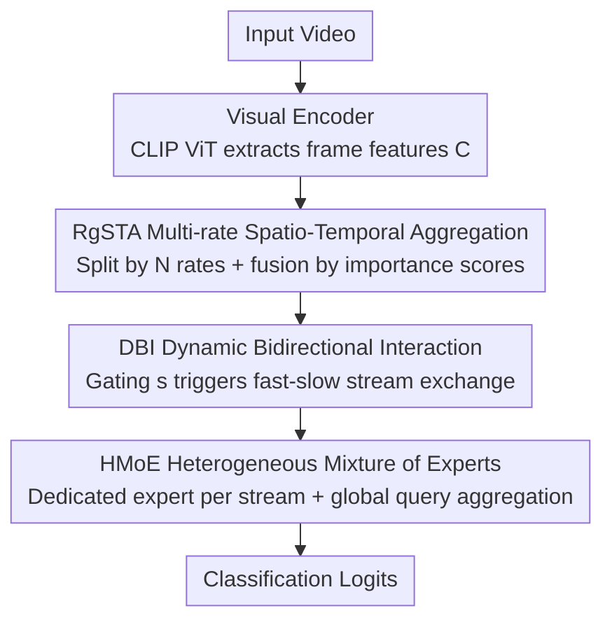

# VidPrism: Heterogeneous Mixture of Experts for Image-to-Video Transfer

**Conference**: CVPR 2026  
**Paper**: [CVF Open Access](https://openaccess.thecvf.com/content/CVPR2026/html/Lin_VidPrism_Heterogeneous_Mixture_of_Experts_for_Image-to-Video_Transfer_CVPR_2026_paper.html)  
**Code**: https://github.com/Lrrrr549/VidPrism.git  
**Area**: Video Understanding / Image-to-Video Transfer  
**Keywords**: Image-to-Video Transfer, Heterogeneous Mixture of Experts, Multi-rate Sampling, Temporal Modeling, CLIP Adaptation  

## TL;DR
VidPrism transforms the Mixture-of-Experts in Image-to-Video (I2V) transfer from a "group of homogeneous generalists" into "heterogeneous experts specialized by temporal resolution." By utilizing content-aware multi-rate sampling to feed different rhythms of video streams to each expert and dynamic bidirectional interaction for information exchange between fast/slow paths, it achieves new SOTA results on K400/UCF-101/HMDB-51/SSv2 with lower computational costs.

## Background & Motivation
**Background**: Adapting large-scale Vision-Language Models (VLMs, e.g., CLIP) for video understanding, known as "Image-to-Video (I2V) transfer," has become the mainstream paradigm. While CLIP-like models possess strong zero-shot/few-shot capabilities from image-text pre-training, they naturally lack temporal modeling. Recent effective approaches involve adding trainable temporal modules to frozen image encoders, with state-of-the-art work (e.g., MoTE) using Mixture-of-Experts (MoE) as temporal modules to enhance temporal specialization via conditional routing.

**Limitations of Prior Work**: Traditional MoE applied to video suffers from **expert homogenization**. In standard MoE, all experts consume the same undifferentiated input stream, forcing each expert to become a redundant "generalist" learning overlapping features. The paper highlights this via attention visualization (Figure 1): the homogeneous MoTE baseline shows flat and diffuse inter-frame attention in a dunking video, failing to recognize key moments like "jumping—dunking—landing." An ideal model should exhibit distinct attention peaks at these instants.

**Key Challenge**: "Static scene content" and "temporal evolution" in videos are inherently different types of information requiring different computational paths. Homogeneous MoE forces the same input onto all experts, failing to construct specialized paths and wasting compute on redundant learning.

**Key Insight**: The authors borrow the "two-stream hypothesis" from neuroscience—the existence of parallel "what (spatial)" and "how (temporal)" pathways in the brain. They generalize this fixed dual-pathway idea into a more flexible **multi-pathway** framework: instead of just 2 paths, it employs $N$ paths at different time scales, each bound to a functionally specialized set of heterogeneous experts.

**Core Idea**: Construct a heterogeneous temporal MoE. Using a content-aware mechanism, the video is split into multiple streams ranging from "semantically rich slow streams" to "motion-dense fast streams." These are fed into heterogeneous experts specialized in spatial reasoning versus motion modeling. Bidirectional interaction allows collaboration, finally aggregating into a unified video representation. Implementing this requires answering: ① How to provide the most relevant input to each expert? ② How can these experts collaborate and share information effectively?

## Method

### Overall Architecture
VidPrism takes a video as input and outputs classification logits through four steps: ① Visual encoder (CLIP ViT) extracts frame-level features $C \in \mathbb{R}^{T \times B \times D}$; ② **Multiple RgSTA modules** split frame features into $N$ parallel streams based on different rates $r_i$, each with independent spatio-temporal resolution (slow streams have fewer frames but high semantics; fast streams have more frames for dense motion); ③ **DBI modules** perform selective bidirectional information fusion across these multi-rate streams; ④ **HMoE modules** assign a dedicated expert for internal temporal modeling to each stream, using a global learnable query to aggregate all expert outputs into a single video-level vector for the classifier.

Mechanism: Replace "one input for all experts" with "multi-rate stream split + heterogeneous expert specialization + pathway interaction," allowing experts to manage different time scales without being isolated.

### Key Designs

**1. RgSTA (Rate-guided Spatio-Temporal Aggregation): Tailored input streams rather than frame dropping**

Conventional fixed-rate sampling often misses critical temporal information. RgSTA addresses "Challenge 1: how to provide the most relevant input." It partitions features $C$ by rate $r_i$ into $c_i \in \mathbb{R}^{T_i \times B \times D}$ ($T_i = T/r_i$). Instead of dropping frames, it performs "importance-aware merging."

The importance score uses a **hybrid mechanism**: one path is a learnable prediction score $s_{pred,i} = \text{ScoreHead}(\text{LN}(\text{MetricProj}(c_i)))$; the other is an intrinsic property $s_{norm,i} = \|c_i\|_2$ (higher L2 norm indicates richer signals). These are fused via:

$$s_{mix,i} = \alpha \cdot s_{pred,i} + (1-\alpha) \cdot s_{norm,i}$$

Highest-scoring features are kept ($kept\ set$), while others enter the $rest\ set$. Crucially, the **rest set is not discarded**: the cosine similarity $S_{rest \to kept} = Z_{rest} Z_{kept}^T$ is computed and converted to attention weights $A_{norm}$ (via Softmax with temperature $\tau$). Information from the rest set is then weighted and merged back: $C'_{kept} = C_{kept} + \delta (A_{norm})^T C_{rest}$. This ensures sequence compactness while preserving valuable information from "dropped" frames.

**2. DBI (Dynamic Bidirectional Interaction): On-demand communication between fast and slow paths**

DBI addresses "Challenge 2: how experts collaborate." It follows the principle of **deciding whether to communicate before deciding how**: for any two paths $(i,j)$, global summary vectors $g_k = \frac{1}{T_k}\sum_t F_{k,t}$ are pooled. An interaction score is generated via an MLP and Sigmoid:

$$s_{i \leftrightarrow j} = \sigma(\text{MLP}_{i \leftrightarrow j}([g_i; g_j]))$$

This $s_{i \leftrightarrow j} \in [0,1]$ acts as a gate with a threshold—triggering bidirectional interaction only when the score is sufficient, ensuring sparse and efficient connections. Two complementary flows are used: **Slow-to-Fast** injects high-level context into the fast stream (linear interpolation + $1\times1$ convolution); **Fast-to-Slow** injects fine-grained motion into the slow stream (temporal convolution with stride $S = R_j/R_i$). This allows slow streams to gain motion details and fast streams to gain global structure.

**3. HMoE (Heterogeneous Mixture of Experts): Temporal scale specialization**

HMoE assigns a **dedicated expert to each input stream**. Each expert is a standard Transformer layer (MHSA + FFN) and is **trained only on a single specific rate**, forcing functional heterogeneity: the rate=2 expert specializes in fine-grained motion, while the rate=16 expert specializes in global semantics.

The **Combination mechanism** uses a learnable **global query vector** $q_{global} \in \mathbb{R}^{1 \times D}$. All expert outputs are concatenated in the temporal dimension as $F_{concat}$. Multi-head cross-attention is performed: $V_{fused} = \text{MHA}(q_{global}, F_{concat})$. This query learns how to aggregate the most critical task information from all experts based on dynamic similarity.

### Loss & Training
The total loss is a weighted sum of four components: $L_{total} = L_{cls} + \lambda_{rank}L_{rank} + \lambda_{div}L_{div} + \lambda_{gate}L_{gate}$.

- **Classification Loss $L_{cls}$**: Standard cross-entropy applied to $V_{fused}$ as the primary supervision.
- **Ranking Loss $L_{rank}$**: Supervises the RgSTA ScoreHead using KL divergence to match a target distribution based on norms and intra-window similarities.
- **Diversity Loss $L_{div}$**: Maximize the distance between different expert output features to force complementarity.
- **Gating Balance Loss $L_{gate}$**: $L_{gate} = N \sum_i C_i^2$, where $C_i$ is the average contribution of expert $i$, preventing the model from relying on a subset of experts.

## Key Experimental Results

### Main Results
Kinetics-400 Closed-set Recognition (Per-view GFLOPs, input: frames×crops×clips):

| Method | Input | Top-1(%) | GFLOPs | Notes |
|------|------|----------|--------|------|
| MoTE-B/16 (Baseline) | 8×4×3 | 83.0 | 141 | Homogeneous MoE |
| FocusVideo-B/16 | 8×4×3 | 84.1 | 204 | Strong previous baseline |
| **VidPrism-B/16** | 8×4×3 | **84.0** | 162 | +1.0% over MoTE, much lower GFLOPs than FocusVideo |
| **VidPrism-B/16** | 32×4×3 | **85.1** | 721 | Surpasses MoTE/FocusVideo |
| MoTE-L/14 | 8×4×3 | 86.8 | 649 | |
| **VidPrism-L/14** | 8×4×3 | **87.4** | 632 | +0.6% over MoTE with similar compute |

Few-shot Recognition (HMDB51 / UCF101 / SSv2, VidPrism-C uses CLIP, VidPrism-M uses VideoMAEv2):

| Dataset | Setup | MoTE | Best Ours | Note |
|--------|------|------|----------|------|
| HMDB51 | K=16 | 68.2 | **74.1** (VidPrism-C) | New SOTA |
| UCF101 | K=16 | 93.6 | **96.6** (VidPrism-M) | Dominates all setups |
| SSv2 | K=16 | 12.2 | **18.3** (VidPrism-M) | Sets new record |

### Ablation Study

| Dimension | Config | UCF-101 | HMDB-51 | Note |
|------|------|---------|---------|------|
| Expert Count | 1 (rate 4) | 94.8 | 74.3 | Single-scale baseline |
| Expert Count | 2 (2,8) | 95.3 | 73.9 | Dual-scale gain |
| Expert Count | **4 (2,4,8,16)** | **95.9** | **76.3** | Optimal configuration |
| Aggregation | Hard/Avg/Max | 94.7~95.2 | 75.0~75.5 | Direct sampling/pooling |
| Aggregation | **RgSTA** | **95.9** | **76.3** | Merge instead of drop |
| Interaction | **DBI (Bidirectional)** | **95.9** | **76.3** | Best performance |
| Aggregation Head| **GlobalAttn** | **95.9** | **76.3** | Global long-range dependency |

### Key Findings
- **Expert count isn't "more is better"**: Moving from 1 to 2 helps, but 3 causes a slight dip (redundancy/optimization difficulty). 4 experts (2,4,8,16) are optimal, proving temporal diversity is more important than raw count.
- **Gating balance loss is crucial**: $L_{gate}$ provided the largest single-item gain, ensuring functional division of labor.
- **Bidirectional interaction is mandatory**: Unidirectional interaction (Slow2Fast or Fast2Slow) is less effective or even harmful compared to bidirectional exchange.
- **Expert activation visualization**: Correctly classified samples show stable expert activation patterns aligned with action categories. Misclassifications are often caused by "selecting the wrong expert."

## Highlights & Insights
- **Functional Heterogeneity**: Instead of relying on random routing, VidPrism forces experts to specialize via multi-rate inputs and diversity losses.
- **"Merge instead of Drop" Sampling**: RgSTA redefines sequence compression by weighting information from dropped frames into kept tokens, a trick applicable to any long-sequence task.
- **Sparse, On-demand Communication**: DBI uses a gate to filter interactions, saving compute while preventing noise pollution from meaningless communication.
- **Efficiency-Performance Pareto Front**: VidPrism-B/16 matches FocusVideo using significantly fewer GFLOPs, demonstrating that structural specialization is a more efficient learning strategy.

## Limitations & Future Work
- **Heuristic Expert Selection**: The combination of expert counts and rates requires grid searching; there is no adaptive mechanism to decide the optimal configuration.
- **Task Scope**: Primarily validated on classification. The design (aggregating into a single vector) might struggle with dense temporal tasks like localization or video QA.
- **SSv2 Performance**: Absolute accuracy on "heavy temporal" datasets like SSv2 remains low (18.3%), indicating inherent gaps in the I2V transfer paradigm for fine-grained action sequencing.

## Related Work & Insights
- **vs MoTE**: MoTE uses homogeneous experts on the same input. VidPrism fixes this "homogenization" issue by diversifying inputs and expert training, yielding +0.6~1.0% gains on K400.
- **vs SlowFast**: While SlowFast uses fixed dual rates, VidPrism generalizes this to content-adaptive multiple streams with gated expert interactions.
- **vs ST-Adapter/AIM**: VidPrism replaces generic temporal adapters with a "Heterogeneous MoE" structure, achieving higher precision with similar or lower compute.

## Rating
- Novelty: ⭐⭐⭐⭐ Translates neuroscience hypotheses into architectural mechanisms for MoE; clean and verifiable.
- Experimental Thoroughness: ⭐⭐⭐⭐ Extensive benchmarks (K400, HMDB, UCF, SSv2) and thorough ablations.
- Writing Quality: ⭐⭐⭐⭐ Logical flow supported by clear visualizations and established neural hypotheses.
- Value: ⭐⭐⭐⭐ Solid I2V transfer framework with reusable tricks like RgSTA; code availability is a strong plus.

<!-- RELATED:START -->

## Related Papers

- [\[CVPR 2026\] Joint Learning of General and Diverse Patterns with Mixture of Memory Experts for Weakly-Supervised Video Anomaly Detection](joint_learning_of_general_and_diverse_patterns_with_mixture_of_memory_experts_fo.md)
- [\[CVPR 2026\] M4-SAM: Multi-Modal Mixture-of-Experts with Memory-Augmented SAM for RGB-D Video Salient Object Detection](m4-sam_multi-modal_mixture-of-experts_with_memory-augmented_sam_for_rgb-d_video_.md)
- [\[ICLR 2026\] Exposing and Defending the Achilles' Heel of Video Mixture-of-Experts](../../ICLR2026/video_understanding/exposing_and_defending_the_achilles_heel_of_video_mixture-of-experts.md)
- [\[ECCV 2024\] R²-Tuning: Efficient Image-to-Video Transfer Learning for Video Temporal Grounding](../../ECCV2024/video_understanding/r2tuning_efficient_imagetovideo_transfer_learning_for_video.md)
- [\[ICML 2026\] Unified Multimodal Visual Tracking with Dual Mixture-of-Experts](../../ICML2026/video_understanding/unified_multimodal_visual_tracking_with_dual_mixture-of-experts.md)

<!-- RELATED:END -->
