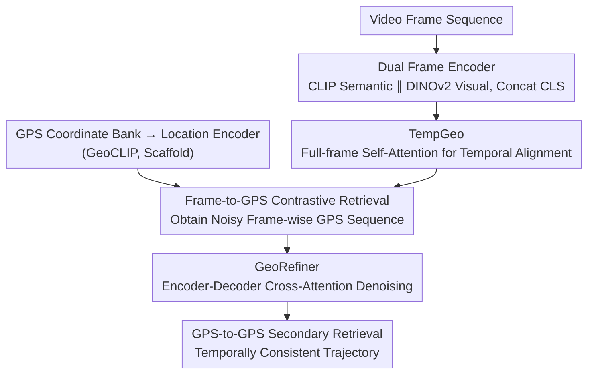

# VidTAG: Temporally Aligned Video to GPS Geolocalization

**Conference**: CVPR 2026  
**arXiv**: [2604.12159](https://arxiv.org/abs/2604.12159)  
**Code**: [https://parthpk.github.io/vidtag_webpage](https://parthpk.github.io/vidtag_webpage)  
**Area**: Video Understanding / Geolocalization  
**Keywords**: Video geolocalization, frame-to-GPS retrieval, temporal consistency, trajectory prediction, denoising

## TL;DR

Ours proposes VidTAG, a dual-encoder (CLIP+DINOv2) frame-to-GPS retrieval framework that achieves inter-frame temporal alignment via the TempGeo module and refines GPS predictions through the GeoRefiner encoder-decoder module, enabling temporally consistent frame-by-frame video geolocalization at a global scale.

## Background & Motivation

**Background**: Image geolocalization primarily follows two paradigms: classification (dividing the Earth into regions to predict labels) and retrieval (matching against a georeferenced gallery). GeoCLIP implements direct GPS retrieval by embedding images and GPS in a shared space.

**Limitations of Prior Work**: Existing classification methods only provide coarse-grained city-level localization. Image retrieval methods require massive image galleries, which are infeasible at a global scale. For video, applying image methods frame-by-frame results in "jittery" trajectories; in the worst case, the predicted paths span across continents. CityGuessr, the only global video method, performs inference at the video level and does not support frame-by-frame localization.

**Key Challenge**: How to obtain precise and temporally consistent frame-by-frame trajectories at a global scale.

**Goal**: (1) Propose a new paradigm for frame-to-GPS retrieval; (2) Resolve temporal inconsistency in video predictions.

**Key Insight**: Building a GPS coordinate library (instead of an image library) is simple and inexpensive, making frame-to-GPS retrieval feasible at a global scale.

**Core Idea**: Utilize TempGeo for inter-frame temporal alignment + GeoRefiner for denoising refinement to achieve temporally consistent frame-by-frame GPS predictions.

## Method

### Overall Architecture

VidTAG reformulates video geolocalization as "frame-by-frame to GPS coordinate retrieval": instead of maintaining a global image gallery for matching, each frame is encoded and nearest neighbors are retrieved directly in a GPS coordinate embedding space to output the latitude and longitude of that frame. The process is trained in two phases. Phase I trains the front-end feature path—the dual-frame encoder (CLIP+DINOv2) encodes each frame into an embedding, TempGeo performs temporal alignment between frames, and contrastive alignment is performed in a shared space with GPS embeddings output by a location encoder (following GeoCLIP, acting as a scaffold). This results in a base model for frame-by-frame GPS retrieval. Phase II freezes Phase I and trains the GeoRefiner independently, treating the noisy frame-by-frame GPS sequences from the first stage as "dirty input" for denoising refinement. During inference, a video passes through "Dual-frame Encoder → TempGeo → Initial Retrieval → GeoRefiner → Secondary Retrieval" to obtain a temporally consistent frame-by-frame trajectory.

### Key Designs

**1. Dual Frame Encoder: Complementary descriptions of each frame using two sets of features**

A single encoder struggles to capture both "what kind of place this is" and "what this place looks like" simultaneously. CLIP excels in language-aligned semantics, disambiguating landmarks, identifying signs, and scene types. DINOv2 excels in self-supervised visual features, describing global appearance textures and being more robust to domain shifts. VidTAG concatenates the CLS tokens of both into a frame representation $\mathbf{z}_t = [\mathbf{f}_{clip} \| \mathbf{f}_{dino}]$, allowing semantic and visual cues to enter the retrieval path simultaneously. Ablations show that single CLIP or DINOv2 have shortcomings, and performance only peaks after concatenation, confirming that the two sets of features are complementary rather than redundant.

**2. TempGeo: Letting adjacent frames correct each other before retrieval, rather than smoothing post-hoc**

Independent frame-by-frame localization generates "jittery" trajectories—if a frame is blurry or the scene is generic, it might be retrieved to the wrong continent, causing the entire path to jump. TempGeo uses a lightweight Transformer encoder to perform full self-attention across all frames of a video with temporal positional encoding, allowing each frame to borrow context from neighbors or even distant frames. An uncertain frame is pulled back into consensus by surrounding certain frames, and isolated anomalous predictions are suppressed. The key difference is that it operates before retrieval—cross-frame context directly shapes frame embeddings for contrastive learning, rather than post-processing smoothing after retrieving coordinates. Thus, temporal consistency is "learned into the representation" rather than being externally applied.

**3. GeoRefiner: Treating the noisy predictions of the first stage as dirty data for in-domain denoising in the GPS domain**

Even with TempGeo, Phase I outputs still exhibit typical failure modes: sequence shifts, collapsing to a single point, or random jitter. GeoRefiner uses an encoder-decoder structure to address this: the encoder takes frame embeddings from TempGeo, and the decoder uses GPS embeddings as queries, aligning the GPS sequence to corresponding visual tokens via cross-attention. A clever trick in training is not using Phase I predictions directly as input but instead injecting simulated noise (specifically modeling the aforementioned failure modes) into ground-truth GPS coordinates. This teaches the decoder to pull dirty coordinates back to the correct positions using visual context. This avoids distribution shift caused by using predictions for both training and inference, allowing refinement to be completed within the GPS domain.

### Loss & Training

Phase I uses contrastive loss: aligning the similarity matrix of frame embeddings and GPS embeddings to an identity matrix, essentially a frame-by-frame cross-entropy retrieval goal. Phase II uses a weighted Hinge loss, constraining alignment quality at both frame and video levels.

## Key Experimental Results

### Main Results

| Model | Frame@1km↑ | Frame@5km↑ | Median Error↓ | Video@1km↑ | DFD↓ | MRD↓ |
|------|---------|---------|-----------|----------|------|------|
| GeoCLIP-ZS | 2.7% | 22.9% | 11.54km | 3.8% | 24.94 | 2.83 |
| GeoCLIP-FT | 22.5% | 63.0% | 2.97km | 18.6% | 22.52 | 2.82 |
| DINOv2-Cls | 18.1% | 58.2% | 3.86km | 18.4% | 4.28 | 1.60 |
| **Ours** | **41.0%** | **76.7%** | **1.35km** | **39.8%** | **3.87** | **1.07** |

### Ablation Study

| Configuration | @1km | Median Error | DFD |
|------|------|---------|-----|
| CLIP only | 32.5% | 1.85km | 8.42 |
| DINOv2 only | 28.3% | 2.15km | 5.12 |
| Dual Encoder | 35.2% | 1.62km | 6.78 |
| + TempGeo | 38.1% | 1.48km | 4.25 |
| + GeoRefiner (Full) | **41.0%** | **1.35km** | **3.87** |

### Key Findings

- VidTAG exceeds GeoCLIP by 20 percentage points at @1km on MSLS and outperforms SOTA by 25% on CityGuessr68k.
- TempGeo and GeoRefiner significantly improve trajectory quality (DFD, MRD).
- The complementarity of the dual encoder is verified through ablation.

## Highlights & Insights

- Frame-to-GPS retrieval is an elegant problem reformulation: GPS libraries are cheap to build, making global-scale frame-by-frame localization possible.
- The denoising training strategy for GeoRefiner is clever: injecting simulated noise instead of using Phase I predictions avoids training-inference distribution mismatch.

## Limitations & Future Work

- Reliance on a uniform-grid GPS library; the library's resolution directly bounds precision.
- Performance may decrease in regions with sparse geographical coverage.
- Additional information such as OCR (street signs, text) is not utilized.
- Integration with Multimodal Large Language Models (MLLMs) could further reason about geographical cues.

## Related Work & Insights

- **vs GeoCLIP**: GeoCLIP is image-level only; VidTAG extends to video frame-level and resolves temporal consistency.
- **vs CityGuessr**: CityGuessr only performs video-level city prediction; VidTAG achieves frame-by-frame localization and trajectory mapping.

## Rating

- Novelty: ⭐⭐⭐⭐ First global-scale frame-level video geolocalization method.
- Experimental Thoroughness: ⭐⭐⭐⭐⭐ Multiple datasets, metrics, and baseline comparisons.
- Writing Quality: ⭐⭐⭐⭐ Clear problem definition and method description.
- Value: ⭐⭐⭐⭐ Practical applications in forensics, social media, etc.

<!-- RELATED:START -->

## Related Papers

- [\[CVPR 2026\] VidTAG: Temporally Aligned Video to GPS Geolocalization with Denoising Sequence Prediction at a Global Scale](vidtag_temporally_aligned_video_to_gps_geolocalization_with_denoising_sequence_p.md)
- [\[CVPR 2026\] VideoChat-M1: Collaborative Policy Planning for Video Understanding via Multi-Agent Reinforcement Learning](videochatm1_collaborative_policy_planning_for_vide.md)
- [\[CVPR 2026\] Video Panels for Long Video Understanding](video_panels_for_long_video_understanding.md)
- [\[CVPR 2026\] An Empirical Study on How Video-LLMs Answer Video Questions](an_empirical_study_on_how_video-llms_answer_video_questions.md)
- [\[CVPR 2026\] Video-CoE: Reinforcing Video Event Prediction via Chain of Events](video-coe_reinforcing_video_event_prediction_via_chain_of_events.md)

<!-- RELATED:END -->
