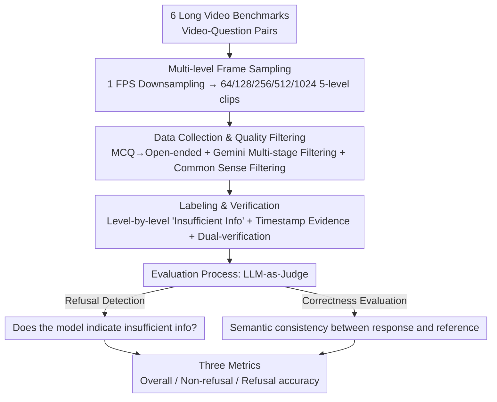

# VirtueBench: Evaluating Trustworthiness under Uncertainty in Long Video Understanding

**Conference**: CVPR 2026  
**arXiv**: [2603.07071](https://arxiv.org/abs/2603.07071)  
**Code**: None  
**Area**: Video Understanding  
**Keywords**: Video Understanding Benchmark, Trustworthiness under Uncertainty, Long Video Understanding, Refusal Behavior Evaluation, VLM Evaluation

## TL;DR
This paper proposes VirtueBench, the first long video understanding benchmark evaluating VLM trustworthiness under uncertainty. By constructing multi-level frame sampling for each video and labeling answerable/unanswerable ground truths, it reveals a widespread tendency among existing models to guess rather than honestly refuse.

## Background & Motivation
Vision-Language Models (VLMs) have made significant progress in multi-modal understanding tasks, yet long video understanding evaluation remains unreliable.

**Key Challenge**: Due to input frame constraints (typically 256-512 frames), keyframes of long videos may not be included in the model input. Under existing evaluation protocols:
- Models that honestly refuse to answer ("insufficient video information") are penalized as incorrect.
- Models that happen to guess the answer correctly receive inflated accuracy.
- This **encourages guessing over honest refusal**, resulting in misleading evaluation results.

**Specific Example**: When testing a 64-frame subset on VideoEval-Pro, Qwen2.5-VL-72B honestly stated information was insufficient (marked incorrect), while LLaVA-Video-72B guessed the answer correctly (marked correct)—though the latter did not actually see the keyframes required to answer the question.

**Limitations of Prior Work**:
1. Standard long video benchmarks (Video-MME, MLVU, etc.) use the answer for the full video as the ground truth for all frame settings, disregarding the actual frame range visible to the model.
2. Video hallucination benchmarks (VideoHallucer, VIDHALLUC) diagnose specific types of hallucinations but do not evaluate the honest refusal capability when information is insufficient.
3. Multiple-choice formats further exacerbate the guessing problem.

**Core Idea**: Construct a benchmark that provides different ground truths for each frame sampling level—when frames do not contain key information, the correct answer is "insufficient information," and models are correct only if they honestly refuse.

## Method

### Overall Architecture
VirtueBench addresses a long-ignored bias in long video evaluation: models actually see limited frames, but evaluations use "full video" answers as standards, thus penalizing honest "insufficient info" statements and rewarding blind guesses. The approach explicitly incorporates "visible frames" into evaluation—collecting video-question pairs from existing benchmarks, extracting 5-level clips of 64/128/256/512/1024 frames for each video, and **labeling ground truth for each level separately**: a deterministic answer is provided if key info is in those frames; otherwise, "insufficient information" itself is the ground truth. The pipeline consists of four steps: multi-level frame sampling, cleaning data into unguessable open-ended questions, level-by-level manual labeling with dual-verification, and LLM-as-Judge scoring that separates "refusal" from "correctness."

### Key Designs

**1. Multi-level Frame Sampling: Making "Answerability" Dynamic Rather Than Fixed**

Traditional benchmarks have one standard answer per question, using it for scoring whether the model sees 64 or 1024 frames. This is the root cause of penalizing models when keyframes are missed. VirtueBench first downsamples every video to 1 FPS, then uniformly samples them into 64/128/256/512/1024 frame clips. The visual content for the same question varies across levels—sparse sampling might miss keyframes, making it "insufficient information," while dense sampling contains the required frames. Providing independent GT for each level allows the evaluation to distinguish whether a model *should* be able to answer at that level.

**2. Data Collection & Quality Filtering: Cleaning Questions to be "Unguessable"**

Questions are gathered from six benchmarks (MLVU, LVBench, LongVideoBench, MovieChat, Video-MME, ALLVB), initially totaling 3,042 videos and 33,400 questions. However, the original data contains noise where questions can be guessed without watching the video. First, all multiple-choice questions (MCQs) are converted to open-ended QA with the correct option as the reference—MCQs provide a shortcut for guessing, whereas open-ended formats force generation, suppressing the guessing space. Next, Gemini-2.5-Flash performs multi-stage filtering: removing questions with answers over 6 words, those relying on option context/timestamps/subtitles, or subjective judgments. Most importantly, **common sense filtering**—a random single frame is given to Gemini-2.5-Flash; if it can answer correctly, the question does not require video understanding and is discarded. This leaves ~2,500 open-ended QA pairs truly dependent on video content.

**3. Labeling & Verification: Per-level "Insufficient Info" Labeling with Timestamp Evidence**

With clips and questions ready, each question must be labeled for each frame level, with the difficulty being the judgment of whether the frames are sufficient. The process involves Gemini-2.5-Pro generating initial reference answers across frame levels, followed by manual annotators reviewing each clip. Annotators finalize labels using both the original full-video answer and AI references; if required keyframes are absent from the clip, it is labeled as "The video does not provide enough information." To ensure traceability, annotators must provide timestamp evidence supporting the answer, preventing "impression-based" labeling. Quality is maintained via dual-verification: at least two annotators per entry (primary + review/correction), discarding disputed items, and performing random audits, resulting in 1,328 high-quality instances.

**4. Evaluation Process: Using LLM-as-Judge to Decouple "Refusal" and "Correctness"**

Open-ended answers cannot be scored via string matching, and the goal is to evaluate not just correctness but also whether the model refuses when it should. Thus, evaluation uses GPT-4o for a two-stage judgment: first, **refusal detection**—judging if the model indicated insufficient information; second, **correctness evaluation**—verifying semantic consistency with reference answers for answerable questions, while for "insufficient info" GT, the model is correct only if it successfully refused. Based on these, VirtueBench provides three complementary metrics: **Overall accuracy** (total accuracy including refusal judgment), **Non-refusal accuracy** (accuracy on the subset where deterministic answers exist), and **Refusal accuracy** (percentage of correct refusals in the "insufficient info" subset). These are further split by Perception/Reasoning.

## Key Experimental Results

### Data Statistics
- 1,328 instances, 901 original videos.
- 767 Perception + 561 Reasoning questions (balanced coverage).
- Proportion of unanswerable frames: 64 frames ~50% → 1024 frames ~25% (decreasing with frame count).
- Uniform instance distribution: from entirely unanswerable to entirely answerable.

### Main Results — Overall Accuracy (64 frames)

| Model | Overall | P/R |
|------|---------|-----|
| Gemini-2.5-Flash | **58.96** | 63.60/54.70 |
| GPT-4o | 55.43 | 59.81/49.74 |
| Qwen3VL-32B | 50.83 | 53.00/48.01 |
| Qwen2.5VL-72B | 49.32 | 52.86/44.71 |
| GPT-5 | 50.30 | 51.40/48.87 |
| Mimo-VL-7B-RL | 39.98 | 42.74/36.40 |
| LLaVA-Video-72B | 25.53 | 29.83/19.93 |

### Key Findings — Refusal Behavior Analysis

| Model Type | Refusal Accuracy Performance |
|---------|--------------|
| Qwen-VL Series | Strongest open-source refusal capability (>50%) |
| Gemini-2.5-Flash | Best among commercial models |
| LLaVA-Video | Nearly zero refusal behavior |
| GPT-5 | Performance improves as frame count increases |

### Ablation Study — Impact of Honesty Instructions in Prompt

| Model | With Honesty Prompt | Without Honesty Prompt | Change in Refusal Accuracy |
|------|----------|----------|--------------|
| Most Models | Capable of refusal | Refusal nearly vanishes | ~50% Decrease |

### Key Findings
- **Accuracy decreases as frame count increases**: This contradicts the traditional "more frames are better" intuition—because VirtueBench provides independent GT per level, denser sampling means fewer unanswerable questions, but the reasoning tasks for answerable questions become inherently harder.
- **Refusal behavior is highly prompt-dependent**: Removing honesty instructions caused refusal accuracy to plummet by nearly half for most models—suggesting refusal is triggered by prompts rather than being an intrinsic model quality.
- **Perception outperforms Reasoning**: Reasoning tasks require cross-frame information integration and high-order inference, making them significantly more difficult.
- Gemini-2.5-Flash is optimal and stable across all frame levels.
- Open-source Qwen3-VL-32B significantly closed the gap with closed-source models.
- **LLaVA-Video series has nearly 0% refusal rate**—the model is trained to always provide an answer.

## Highlights & Insights
- **Problem definition is a major contribution**: For the first time, it clearly identifies the evaluation bias in long video benchmarks—where guessing is rewarded and honesty is penalized.
- The multi-level frame sampling + level-by-level GT labeling scheme is simple yet effective.
- Common sense filtering (discarding questions answerable via a single frame) ensures evaluation fairness.
- MCQ-to-open-ended conversion further reduces the guessing space.
- Reveals a deep issue: **Current VLM training paradigms (RLHF, SFT) encourage models to "always provide an answer" rather than "know what they don't know."**

## Limitations & Future Work
- The scale of 1,328 instances is relatively limited; domain coverage may not be fully comprehensive.
- The reliability of LLM-as-Judge (GPT-4o) itself has not been fully validated.
- The definition of "honest refusal" might be too strict—models might express uncertainty vaguely rather than through explicit refusal.
- Frame sampling uses a uniform strategy; intelligent sampling (e.g., keyframe detection) might change the conclusions.
- Evaluates only the binary behavior of refusal/non-refusal, missing fine-grained uncertainty expressions like confidence calibration.
- Does not explore how to improve model refusal capability through training.

## Related Work & Insights
- VideoEval-Pro: Identifies guessing issues in MCQs; this paper further addresses evaluation bias when information is insufficient.
- Video Hallucination Benchmarks (VideoHallucer, etc.): Diagnose hallucination types vs. this paper's evaluation of honesty under uncertainty.
- Insights for VLM Evaluation: Any benchmark requiring inference from limited input should consider evaluations for "insufficient information" scenarios.
- Insights for Model Training: "Honest refusal" needs to be incorporated into RLHF reward functions, rather than optimizing for accuracy alone.

## Rating
- Novelty: ⭐⭐⭐⭐⭐ First systematic definition and evaluation of VLM trustworthiness under uncertainty; highly insightful problem definition.
- Experimental Thoroughness: ⭐⭐⭐⭐⭐ 25 models (including commercial ones) + 5-level frame sampling + refusal behavior analysis + prompt ablation.
- Writing Quality: ⭐⭐⭐⭐⭐ Clear motivation, excellent illustrations, and in-depth experimental analysis.
- Value: ⭐⭐⭐⭐⭐ Significant impact on correcting biases in long video understanding evaluation and promoting trustworthy VLM development.

<!-- RELATED:START -->

## Related Papers

- [\[CVPR 2026\] Video Panels for Long Video Understanding](video_panels_for_long_video_understanding.md)
- [\[CVPR 2026\] Efficient Frame Selection for Long Video Understanding via Reinforcement Learning](efficient_frame_selection_for_long_video_understanding_via_reinforcement_learnin.md)
- [\[CVPR 2026\] META: Meta Evolution of Tool Trajectory Adaptation for Long-Video Understanding](meta_meta_evolution_of_tool_trajectory_adaptation_for_long-video_understanding.md)
- [\[CVPR 2026\] Thinking with Drafts: Speculative Temporal Reasoning for Efficient Long Video Understanding](thinking_with_drafts_speculative_temporal_reasoning_for_efficient_long_video_und.md)
- [\[CVPR 2026\] VideoARM: Agentic Reasoning over Hierarchical Memory for Long-Form Video Understanding](videoarm_agentic_reasoning_over_hierarchical_memory_for_long-form_video_understa.md)

<!-- RELATED:END -->
