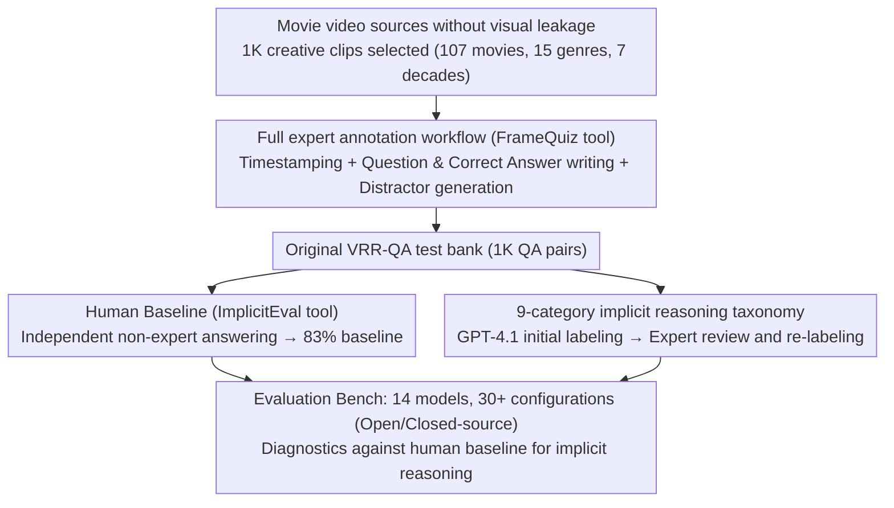

# VRR-QA: Visual Relational Reasoning in Videos Beyond Explicit Cues

**Conference**: CVPR 2026  
**arXiv**: [2506.21742](https://arxiv.org/abs/2506.21742)  
**Code**: Available (Dataset and data collection framework open-sourced)  
**Area**: Video Understanding  
**Keywords**: Video Question Answering, Implicit Reasoning, Visual Relational Reasoning, Benchmark, Multimodal Understanding

## TL;DR
This paper introduces the VRR-QA benchmark, containing 1K meticulously annotated video question-answer pairs specifically designed to test model capabilities in reasoning about implicit visual relations (e.g., off-screen events, cross-frame causality, and spatial inference). It reveals that current state-of-the-art VideoQA models (including GPT-O3) exhibit significant deficiencies in implicit reasoning—the best model achieves only 64% accuracy, far below the human performance of 83%.

## Background & Motivation

1.  **Background**: Video Question Answering (VideoQA) has made significant progress recently by aligning visual and textual modalities through multimodal learning. Existing benchmarks (e.g., MVBench, TempCompass, VideoMME) primarily target "explicitly visible" questions—identifying directly observable visual content such as actions, objects, and events.

2.  **Limitations of Prior Work**: When humans understand videos, they do not only see "what appears on the screen" but also infer relationships implied but not directly presented. For instance, one might infer a bullet's trajectory from a character's running direction, even if the bullet and the target never appear in the same frame. However, existing benchmarks rarely cover such "implicit reasoning" tasks.

3.  **Key Challenge**: Existing models rely heavily on surface-level visual cues and perform poorly when required to infer spatial relations, causal chains, or social dynamics that are not explicitly shown across frames. There is a lack of a systematic benchmark to quantify this capability gap.

4.  **Goal**: To build the first VideoQA benchmark focused on "implicit visual relational reasoning," systematically evaluating existing models' capabilities on this task and defining a taxonomy of 9 reasoning dimensions.

5.  **Key Insight**: Movies and animations are selected as video sources. These creative works naturally employ narrative techniques (such as suggesting causality, off-screen actions, and perspective shifts) that embed "implicit reasoning" within content understanding, while avoiding the leakage of explicit cues.

6.  **Core Idea**: Construct a benchmark that truly tests implicit reasoning capabilities in videos by using movie clips where answers must be inferred rather than directly observed.

## Method

### Overall Architecture
VRR-QA is essentially an engineering effort in "test generation": it aims to create video questions that cannot be answered by direct observation alone but require reasoning, then uses them to measure the gap between current models and humans. The construction process proceeds in four steps: first, 1K creative clips with narrative tension are selected from diverse movies; then, CV experts use the self-developed FrameQuiz tool to perform frame-by-frame inspections, annotate time segments, and write questions and options; next, non-expert annotators not involved in question creation use the ImplicitEval tool to answer independently and establish a human baseline; finally, GPT-4.1 performs initial question categorization, followed by expert review of each reasoning category. The final 1K QA pairs cover 107 movies across 15 genres and 7 decades. Based on this test bank, the paper evaluates 30+ model configurations: from open-source LLaVA series, Qwen2-VL, InternVL3, and Gemma 3, to closed-source GPT-O3, GPT-5.2, Gemini 3 Flash, and Claude 4.5 Sonnet, while systematically varying parameter scales and input frames to identify factors influencing implicit reasoning.

> ⚠️ Some model names (e.g., GPT-5.2, Gemini 3 Flash, Claude 4.5 Sonnet, GPT-O3) are based on the original text; refer to the paper for specific versions.

### Key Designs

**1. Movie video sources "without visual leakage": Hiding answers outside the frame via narrative tension**

To make reasoning a necessity for answering, the material itself must deliberately omit direct depictions. Cinematic narrative techniques inherently satisfy this requirement. Consequently, all 1K clips are sourced from 107 movies (15 genres, including 3D animation and live-action), prioritizing scenes where key information is omitted, left blank, or scattered across multiple frames. A typical example: a bullet flies toward a princess, but the bullet and Mario are never in the same frame—the model cannot directly see their relative positions and must infer the bullet's displacement relative to Mario based on the princess's running direction and the bullet's trajectory. This design, where "key information is never directly presented," turns implicit reasoning from an optional bonus into a hard requirement for understanding, while avoiding the explicit cue leakage common in ego-centric or instructional videos.

**2. Full expert annotation workflow (FrameQuiz tool): Maintaining "implicitness" through manual expert creation**

The greatest risk for an implicit reasoning benchmark is "information leakage"—once a question can be answered via explicit cues in the frame, it regresses to a standard perception test. Many benchmarks use template-based generation or LLM-assisted annotation (e.g., Cinepile, TempCompass), which are prone to this pitfall. VRR-QA takes the opposite approach: all 1K questions are written and cross-validated by the authors (CV experts). Through the self-developed FrameQuiz tool, experts perform three tasks: marking timestamps, writing questions and correct answers, and crafting plausible distractors. The tool supports frame-by-frame stepping, pausing, and post-save review, ensuring each question is precisely bound to a specific clip. Having vision experts personally oversee the process ensures each question truly probes "relationships that need inference" rather than "facts displayed on screen."

**3. 9-category implicit reasoning taxonomy: Deconstructing "invisible relations" into diagnostic dimensions**

Simply stating that "models cannot perform implicit reasoning" is too vague to locate specific weaknesses. After the test bank was established, VRR-QA used GPT-4.1 to assign initial category labels, followed by expert review to re-label each entry. Implicit visual reasoning is divided into 9 complementary dimensions: Horizontal Spatial Reasoning (inferring relative left-right positions), Vertical Spatial Reasoning (up-down relations), Relative Depth and Distance, Perspective and Visibility (inferring who can see what), Motion and Trajectory Dynamics, Causal and Motivational Reasoning, Implicit Counting (aggregating visual evidence scattered across frames), Physical and Environmental Context, and Social Interaction and Relationships. The value of this system lies in transforming evaluation results from a single score into a capability map—enabling experiments to pinpoint that implicit counting and horizontal spatial reasoning are the weakest links with the largest gaps compared to humans.

## Key Experimental Results

### Main Results

| Model | Total Accuracy | Macro Average | Horizontal Spatial | Motion Trajectory | Motivation | Implicit Counting |
|------|-----------|--------|---------|---------|---------|---------|
| Human Baseline | 83.0% | 85.6% | 85.4% | 91.9% | 94.4% | 65.9% |
| GPT-O3 | 64.1% | 68.6% | 50.3% | 71.4% | 85.4% | 39.5% |
| Gemini 3 Flash | 61.8% | 67.6% | 52.8% | 73.6% | 86.6% | 48.3% |
| GPT-4.1 | 54.3% | 58.6% | 42.9% | 59.3% | 82.9% | 41.9% |
| InternVL 3 (7B) | 43.3% | 50.2% | 34.8% | 51.7% | 64.6% | 34.9% |
| LLaVA-Video (7B) | 42.1% | 46.3% | 36.0% | 60.4% | 62.2% | 14.0% |

### Key Findings

| Analysis Dimension | Findings |
|---------|------|
| Reasoning vs Non-reasoning Models | Reasoning model GPT-O3 outperforms GPT-4.1 by 9.8%, indicating deep reasoning is vital for implicit understanding. |
| Model Scaling Effects | Large-scale versions of GPT-4.1 significantly outperform smaller variants; in open-source models, Qwen2.5-VL-32B only marginally outperforms the 7B version. |
| Impact of Frame Count | More frames do not necessarily lead to improvement, suggesting the issue lies in reasoning capability rather than insufficient visual information. |
| Hardest Categories | Implicit counting and horizontal spatial reasoning are the weakest segments for models, showing the largest gap with humans. |
| Textual Diversity | VRR-QA shows a question MPS (Mean Cosine Similarity) of 0.161, lower than all comparison benchmarks, indicating the highest diversity. |

- No open-source model exceeds 50% total accuracy on VRR-QA.
- Reasoning-heavy models (GPT-O3) perform best across all categories but still lag far behind humans in horizontal spatial reasoning and implicit counting.
- Even the strongest closed-source models are approximately 19 percentage points below the human baseline.
- Model performance varies significantly across categories—social interaction and motivational reasoning are relatively easier (GPT-O3 reaches 85-86%), while implicit counting is extremely difficult (GPT-O3 only 39.5%).

## Highlights & Insights
- **Benchmark design filling a critical gap**: VRR-QA is the first benchmark focused on implicit reasoning in VideoQA. Its design philosophy (movie content selection, expert annotation, implicit question construction) provides a valuable reference for future benchmark development.
- **Fine-grained taxonomy**: The definition of 9 reasoning dimensions provides a clear capability map for future research, allowing for precise diagnosis of where models fail in implicit reasoning.
- **Validation of reasoning model advantages**: Experiments clearly demonstrate the critical role of "thinking" capabilities (e.g., O3's reasoning) in implicit understanding, pointing toward future architecture designs for VideoQA models.

## Limitations & Future Work
- Small data scale (only 1K QA pairs) may be insufficient to support large-scale training or fine-grained statistical analysis.
- Focus on movie videos excludes implicit reasoning in practical scenarios like instructional or surveillance videos.
- The multiple-choice format may not fully reflect the open-ended reasoning capabilities of models.
- Absence of a training set or fine-tuning scheme; it serves only as an evaluation benchmark.
- Future directions: Constructing larger-scale implicit reasoning training data or designing pre-training strategies based on implicit reasoning.

## Related Work & Insights
- **vs MVBench**: MVBench aggregates explicit questions from existing datasets; VRR-QA focuses on original implicit reasoning questions.
- **vs VideoMME**: VideoMME tests multimodal inputs (including subtitles/audio); VRR-QA is vision-only and focuses on implicit reasoning.
- **vs TempCompass**: TempCompass tests temporal understanding through algorithmic editing; VRR-QA uses natural movie content to test deep reasoning.

## Rating
- Novelty: ⭐⭐⭐⭐ Fills the gap in implicit reasoning evaluation for VideoQA with a well-designed taxonomy.
- Experimental Thoroughness: ⭐⭐⭐⭐⭐ Comprehensive evaluation across 30+ model configurations with thorough multi-dimensional analysis.
- Writing Quality: ⭐⭐⭐⭐ Clear structure, vivid examples, and a persuasive motivation.
- Value: ⭐⭐⭐⭐ Reveals fundamental flaws in current VideoQA models and provides a clear direction for community improvement.

<!-- RELATED:START -->

## Related Papers

- [\[CVPR 2026\] Beyond Explicit Language: Plug-and-Play Visual-to-Linguistic Modeling Toward General Object Tracking](beyond_explicit_language_plug-and-play_visual-to-linguistic_modeling_toward_gene.md)
- [\[CVPR 2026\] CineSRD: Leveraging Visual, Acoustic, and Linguistic Cues for Open-World Visual Media Speaker Diarization](cinesrd_leveraging_visual_acoustic_and_linguistic_cues_for_open-world_visual_med.md)
- [\[CVPR 2026\] Learning Transferable Temporal Primitives for Video Reasoning via Synthetic Videos](learning_transferable_temporal_primitives_for_video_reasoning_via_synthetic_vide.md)
- [\[CVPR 2026\] Towards Sparse Video Understanding and Reasoning](towards_sparse_video_understanding_and_reasoning.md)
- [\[CVPR 2026\] Beyond Caption-Based Queries in Video Moment Retrieval](beyond_caption-based_queries_in_video_moment_retrieval.md)

<!-- RELATED:END -->
