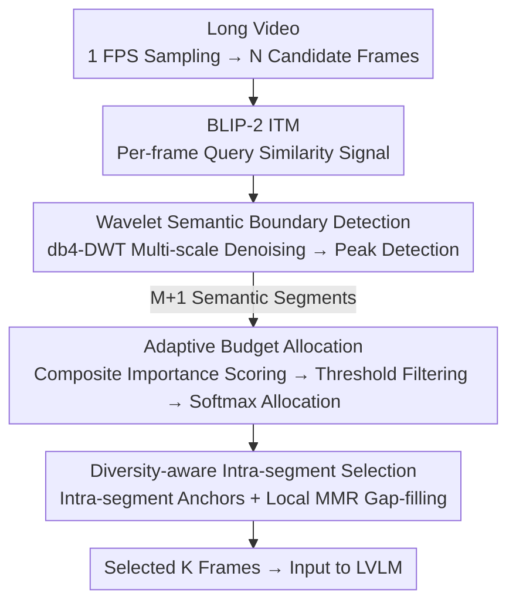

# Wavelet-based Frame Selection by Detecting Semantic Boundary for Long Video Understanding

**Conference**: CVPR2026  
**arXiv**: [2603.00512](https://arxiv.org/abs/2603.00512)  
**Code**: [MAC-AutoML/WFS-SB](https://github.com/MAC-AutoML/WFS-SB)  
**Area**: Video Understanding  
**Keywords**: Frame Selection, Long Video Understanding, Wavelet Transform, Semantic Boundary Detection, Large Vision-Language Models, Training-free

## TL;DR

WFS-SB is proposed as a training-free frame selection framework that utilizes wavelet transforms to detect semantic boundaries within query-frame similarity signals. By partitioning videos into semantically coherent segments, it adaptively allocates frame budgets and performs diversity-aware sampling, significantly outperforming SOTA methods on VideoMME, MLVU, and LongVideoBench.

## Background & Motivation

1.  **Severe redundancy in long videos**: Long videos typically contain thousands of frames, whereas LVLMs have limited context windows and computational resources. Directly processing all frames is infeasible, making frame selection a critical preprocessing step for deploying LVLMs.
2.  **Neglect of narrative structure in existing methods**: Mainstream frame selection methods primarily select frames with the highest relevance to the query. The resulting frame sets are often discrete and unordered, failing to capture causal relationships and process development (e.g., in a makeup tutorial, selecting only scattered "eye" frames loses the sequence of eyeliner before eyebrow shaping).
3.  **Semantic transitions are key**: Effective video understanding requires not only "which frames are relevant" but also capturing "when the story shifts"—specifically, the key transition moments at semantic boundaries.
4.  **Noisy similarity signals**: Query-frame ITM scores are plagued by model uncertainty, cross-modal ambiguity, and visual artifacts (lighting changes, occlusion, camera motion), where high-frequency noise severely interferes with direct semantic boundary detection.
5.  **Non-stationary and multi-scale signals**: Dynamic video content causes the statistical properties of similarity signals to change drastically over time. Furthermore, semantic segments vary from a few frames to hundreds. Traditional global analysis tools like Fourier transforms fail to capture both temporal location and frequency information simultaneously.
6.  **Limitations of alternative solutions**: Extending context windows is computationally expensive, video-to-text summarization loses critical visual details, and training-based frame selection requires massive data with poor transferability.

## Method

### Overall Architecture

WFS-SB addresses the contradiction where "long videos have too many frames, yet selection only focuses on relevance and loses narrative flow." The core idea is to arrange the matching scores of each frame with the query into a temporal signal, identify semantic boundaries where the "story turns," and partition the video into coherent segments based on these boundaries. Frame budgets are then adaptively allocated and representative frames are selected per segment. The pipeline consists of: 1 FPS sampling for candidate frames → computing query-frame similarity signals via BLIP-2 → peak detection after wavelet de-noising for semantic boundary detection → adaptive budget allocation based on segment importance → intra-segment selection using local MMR to balance relevance and diversity. The entire process is training-free, essentially applying "signal processing" to existing similarity scores.

### Key Designs

**1. Wavelet Semantic Boundary Detection: Identifying narrative shifts from noisy signals**

Standard frame selection picks frames "most similar to the query," leading to discrete, unordered frames. WFS-SB posits that the moments where semantics shift are what truly matter. However, detecting transitions directly on similarity signals fails because ITM scores are contaminated by high-frequency noise from model uncertainty and visual artifacts. Moreover, signals are non-stationary and multi-scale (semantic segments vary in length), making global tools like Fourier analysis unsuitable for simultaneous time-frequency localization. Wavelet transform is selected specifically for its ability to localize analysis in both time and frequency dimensions.

Specifically, for $N$ frames sampled at 1 FPS, matching scores $s_t = \mathcal{M}(q, f_t)$ are calculated using the BLIP-2 ITM head to form a temporal signal. Discrete Wavelet Transform (DWT) using Daubechies-4 (db4) is applied, with decomposition levels adaptively set to $J = \max(1, \lfloor \log_2 N \rfloor - l)$ ($l=3$). Deeper decomposition is used for long videos to focus on coarse trends, while temporal details are preserved for short videos. Crucially, only the coarsest scale detail coefficients $d_J$ are retained (others zeroed) before Inverse DWT (IDWT) reconstructs a clean semantic transition signal $\tilde{s}_t$—since fine-scale coefficients carry high-frequency noise, discarding them provides natural denoising. Finally, peak detection with an adaptive threshold is performed on change intensity $c_t = |\tilde{s}_t|$, where peak indices $\mathcal{B} = \{b_1, \ldots, b_M\}$ partition the video. Replacing this with local minima detection causes a 3.3% drop in MLVU, proving that multi-scale denoising, rather than simple extrema finding, is key.

**2. Adaptive Budget Allocation: Concentrating resources on critical segments**

After segmentation, uniform frame allocation would allow redundant transition segments to consume the budget of critical ones. WFS-SB computes a composite importance score for each segment, integrating duration, average relevance, peak relevance, and internal diversity:

$$\text{Imp}(\mathcal{G}_i) = w_d \cdot \frac{|\mathcal{G}_i|}{N} + w_a \cdot \bar{s}_i + w_m \cdot s_i^{\max} + w_v \cdot \frac{\sigma_i^2}{\sigma_{\text{global}}^2}$$

With weights $(w_d, w_a, w_m, w_v)=(0.4, 0.2, 0.3, 0.1)$, duration and peak relevance are prioritized. Segments with low importance are pruned using a statistical threshold $\tau = \text{mean}(\text{Imp}) - 1.2 \cdot \text{std}(\text{Imp})$, concentrating budget on salient content. Remaining segments share the total budget $K$ via softmax-proportional allocation, ensuring resources lean toward "high story density" areas.

**3. Diversity-aware Intra-segment Selection: Picking representative frames independently**

Once a segment is allocated its frame quota, selecting only the top-K relevant frames leads to visual redundancy. WFS-SB first picks the most relevant frame as an anchor, then iteratively fills the quota using localized Maximal Marginal Relevance (MMR):

$$t^* = \arg\max_{t \in \mathcal{G}_i \setminus \mathcal{T}_i} \big[\lambda \cdot s_t - (1-\lambda) \cdot \max_{t' \in \mathcal{T}_i} \text{sim}(f_t, f_{t'})\big]$$

Setting $\lambda = 0.5$ balances query relevance and visual diversity equally. The "localized" aspect is vital—MMR is restricted within segments to prevent visually similar frames in different segments from suppressing each other, ensuring each segment contributes its own representative frames.

### A Full Example

For a long video with $N=300$ and budget $K=8$: 300 ITM scores form the signal. The decomposition level is $J = \max(1, \lfloor\log_2 300\rfloor - 3) = 5$. After denoising and peak detection, 4 semantic boundaries are found, creating 5 segments. Importance scores are calculated; one non-essential transition segment falls below $\tau$ and is discarded. The remaining 4 segments split the 8-frame budget (e.g., 3/2/2/1) via softmax. Finally, local MMR picks frames within each segment; for the 3-frame segment, the top-relevance anchor is picked first, followed by two frames that minimize visual similarity with previously selected frames to avoid repetition. The final 8 frames cover all 4 semantic phases while maintaining diversity within each.

### Loss & Training

Ours is completely training-free and involves no loss functions. All hyperparameters are fixed as default across all LVLM backbones, benchmarks, and budgets: db4 wavelet, drift factor $l=3$, importance weights $(0.4, 0.2, 0.3, 0.1)$, filtering factor $\eta=1.2$, and MMR parameter $\lambda=0.5$. Sensitivity analysis shows VideoMME fluctuates by only 0.4% when $\lambda \in [0.3, 0.7]$, demonstrating high robustness.

## Key Experimental Results

### Main Results: Comparison Across Benchmarks and Models

| Model | Method | Frames | VideoMME (Δ) | MLVU (Δ) | LVB (Δ) |
|------|------|------|-------------|----------|---------|
| LLaVA-Video-7B | AKS | 8 | 60.1 (+3.9) | 64.2 (+6.8) | 59.6 (+4.7) |
| LLaVA-Video-7B | **WFS-SB** | 8 | **61.7 (+5.5)** | **66.9 (+9.5)** | **61.1 (+6.2)** |
| Qwen2.5-VL-7B | A.I.R. | ≤32 | 65.0 (+4.2) | 67.5 (+8.2) | 61.4 (+3.3) |
| Qwen2.5-VL-7B | **WFS-SB** | 32 | **64.4 (+3.2)** | **70.4 (+10.7)** | **64.4 (+5.5)** |
| InternVL3-8B | A.I.R. | ≤32 | 68.2 (+2.6) | 74.5 (+6.1) | 62.8 (+4.5) |
| InternVL3-8B | **WFS-SB** | 32 | 67.4 (+1.8) | **74.8 (+6.4)** | **62.9 (+4.4)** |

Average improvement across 4 LVLMs: VideoMME +3.9%, MLVU +8.8%, LVB +5.4%.

### Ablation Study

| Configuration | VideoMME | MLVU |
|------|----------|------|
| Uniform Sampling | 57.7 | 56.2 |
| **WFS-SB (Full)** | **61.9** | **67.9** |
| w/o DWT (Local Minima) | 60.8 | 64.6 (-3.3) |
| w/o DWT (Gradient) | 61.2 | 66.8 |
| w/o Adaptive Budget (Uniform) | 61.6 | 67.4 |
| w/o MMR (topK) | 60.9 | 66.7 |
| w/o MMR (Uniform Sampling) | 59.2 | 62.7 |

- Wavelet transform is most critical for MLVU (3.3% drop if replaced by local minima), supporting the core hypothesis of multi-scale decomposition for noise suppression.
- Model scale ablation (Qwen2.5-VL 3B→72B): Stable gains (+2.2% to +4.3%) across all scales, showing the benefits are orthogonal to model size.
- Wavelet family robustness: Db4/Db8/Sym4/Bior3.3 all achieve ~61.9% on VideoMME. Only Haar is slightly lower (61.3%), indicating multi-scale decomposition itself is more important than the specific basis.

### Key Experimental Results (Budget Sensitivity)

On VideoMME with 4 backbones tested at $K \in \{8, 16, 32, 64\}$, WFS-SB consistently outperforms uniform sampling (+1.2% to +5.5%). Gains are more pronounced at small budgets ($K=8, 16$), proving semantic boundary awareness is most valuable when frame resources are scarce.

## Highlights & Insights

- **Novel Perspective**: Shifts frame selection from "choosing the most relevant frames" to "detecting semantic transitions," redefining the problem through a signal processing lens.
-  **Precise Signal Analysis**: Analyzes ITM signals through non-stationarity, multi-scale structure, and low SNR, logically deriving the necessity of wavelet transforms.
- **Training-free and Plug-and-play**: Requires no fine-tuning or architecture changes, serving as an external preprocessing module compatible with various backbones.
- **Unified Hyperparameters**: Uses the same default parameters across all experiments without task-specific tuning, ensuring high practicality.
- **Significant Gains at Low Budgets**: The +9.5% improvement on MLVU at $K=8$ proves that capturing narrative structure is vital when resources are limited.

## Limitations & Future Work

- **ITM Computation Bottleneck**: Extracting BLIP-2 ITM signals takes 79% of total time (19.4s), which is still heavy for real-time use; could be optimized via quantization or distillation.
- **Dependency on External VLMs**: Semantic signal quality depends on the ITM model's capability (CLIP-VIT-B is weaker than BLIP).
- **Fixed 1 FPS Sampling**: Static pre-sampling might generate too many candidates for extremely long videos (hours) or miss details in fast-action clips.
- **Query-driven limitation**: Boundary detection depends on a single query, which may not generalize well to multi-turn dialogues or generic summarization without a query.
- **Audio modality ignored**: Only visual-text matching is used; audio information (speech, music shifts) could further refine semantic boundary detection.

## Related Work & Insights

- **vs. KFC/BOLT/AKS**: These focus on frame-level relevance and ignore narrative structure. WFS-SB consistently outperforms them (e.g., vs. AKS: +1.6% on VideoMME, +2.7% on MLVU).
- **vs. Training-based Methods (Frame-Voyager/FrameOracle)**: WFS-SB requires no training data or labels, offers better generalization, and has lower deployment costs.
- **vs. Iterative Inference (A.I.R.)**: A.I.R. requires multiple LVLM inference rounds with higher cost; WFS-SB achieves better performance on MLVU/LVB with a single forward pass.
- **vs. Sequential Decision (MDP3)**: WFS-SB outperforms MDP3 by over 4% on MLVU/LVB, proving that semantic segmentation is superior to sequential decision modeling.

## Rating

- Novelty: ⭐⭐⭐⭐ — Using wavelets to detect semantic boundaries for frame selection is a fresh perspective.
- Experimental Thoroughness: ⭐⭐⭐⭐⭐ — Covers 4 LVLMs, 3 benchmarks, multiple budgets/scales/wavelets/scorers.
- Writing Quality: ⭐⭐⭐⭐ — Clear motivation derived from signal characteristics (non-stationarity, etc.).
- Value: ⭐⭐⭐⭐ — Training-free, plug-and-play, and effective for deploying long video understanding.
- Overall: ⭐⭐⭐⭐ — An elegant and robust method where the core insight (boundaries > relevance) is thoroughly validated.

<!-- RELATED:START -->

## Related Papers

- [\[CVPR 2026\] Efficient Frame Selection for Long Video Understanding via Reinforcement Learning](efficient_frame_selection_for_long_video_understanding_via_reinforcement_learnin.md)
- [\[CVPR 2026\] DIvide, then Ground: Adapting Frame Selection to Query Types for Long-Form Video Understanding](divide_then_ground_adapting_frame_selection_to_query_types_for_long-form_video_u.md)
- [\[ICLR 2026\] FOCUS: Efficient Keyframe Selection for Long Video Understanding](../../ICLR2026/video_understanding/focus_efficient_keyframe_selection_for_long_video_understanding.md)
- [\[CVPR 2026\] Video Panels for Long Video Understanding](video_panels_for_long_video_understanding.md)
- [\[CVPR 2026\] GIFT: Global Irreplaceability Frame Targeting for Efficient Video Understanding](gift_global_irreplaceability_frame_targeting_for_efficient_video_understanding.md)

<!-- RELATED:END -->
