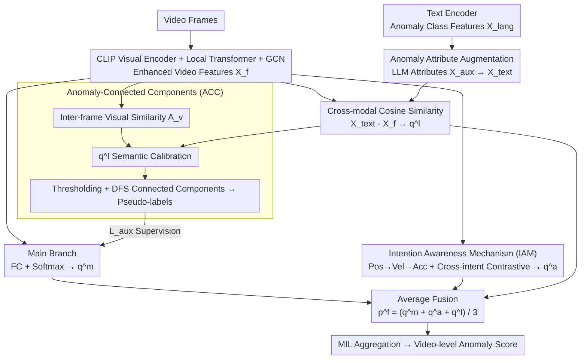

# Weakly Supervised Video Anomaly Detection with Anomaly-Connected Components and Intention Reasoning

**Conference**: CVPR 2026  
**arXiv**: [2603.00550](https://arxiv.org/abs/2603.00550)  
**Code**: None  
**Area**: Video Understanding  
**Keywords**: Weakly Supervised Video Anomaly Detection, Connected Components, Intention Reasoning, CLIP, Multi-Instance Learning

## TL;DR

The LAS-VAD framework is proposed, utilizing an Anomaly-Connected Components (ACC) mechanism to group video frames into semantically consistent clusters for pseudo-label generation to mitigate the lack of frame-level annotations. It further incorporates an Intention Awareness Mechanism (IAM) leveraging position-velocity-acceleration features to distinguish between normal and abnormal behaviors with similar appearances, achieving 89.96% AP (I3D) on XD-Violence.

## Background & Motivation

**Background**: Weakly Supervised Video Anomaly Detection (WS-VAD) relies solely on video-level labels to identify abnormal temporal segments through Multi-Instance Learning (MIL). Prevailing methods typically employ a pipeline of pre-trained feature extraction followed by a classifier.

**Limitations of Prior Work**:  
- **Insufficient Semantic Information**: The absence of frame-level annotations makes it difficult for models to learn semantic representations of anomalies, forcing reliance on indirect learning via MIL top-K strategies.
- **Ambiguous Action Distinction**: Normal and abnormal behaviors often share high appearance similarity (e.g., "taking an item" vs. "stealing an item"), making them indistinguishable based on appearance features alone.

**Key Challenge**: Missing frame-level labels $\leftrightarrow$ Requirement for frame-level semantic understanding; Similar appearances $\leftrightarrow$ Divergent intentions.

**Key Insight**:  
- Semantic issue: Utilize inter-frame similarity to construct connected component graphs where frames in the same group share semantics $\rightarrow$ Pseudo-labels.
- Intention issue: Abnormal behaviors often exhibit anomalous velocity or acceleration (e.g., stealing is faster than picking up), which can be addressed by reasoning with kinematic features.

**Core Idea**: Learning anomaly semantics = Spatial Semantic Grouping (ACC) + Kinematic Intention Reasoning (IAM) + Anomaly Attribute Augmentation.

## Method

### Overall Architecture

LAS-VAD addresses a critical contradiction in weakly supervised anomaly detection: only video-level labels are available, yet frame-level judgments are required for actions that often look identical to normal ones. The framework first extracts shared enhanced visual features and then branches into three prediction paths alongside an auxiliary pseudo-label generation module. Specifically, a CLIP encoder obtains frame-level features $X_\text{video} \in \mathbb{R}^{T \times D}$, which are processed by a local Transformer and GCN to model temporal dependencies, resulting in enhanced features $X_f$.  
Above $X_f$, three branches exist: the main branch uses a Fully Connected layer and Softmax for direct category prediction $q^m$; the IAM branch infers the underlying "intent" from a kinematic perspective to derive $q^a$; and the text branch utilizes a text encoder for anomaly class features $X_\text{lang}$ supplemented by an LLM providing attribute descriptions $X_\text{aux}$ to form $X_\text{text}$. The cross-modal similarity between $X_\text{text}$ and $X_f$ yields $q^l$. Simultaneously, the ACC module clusters frames into semantic connected components to generate frame-level pseudo-labels to supervise $q^m$ (using $q^l$ for semantic calibration), providing the missing fine-grained supervision. Finally, the branches are fused via $p^f = \frac{1}{3}(q^m + q^a + q^l)$ and aggregated into a video-level anomaly score via MIL.

### Key Designs

**1. Anomaly-Connected Components (ACC): Generating Frame-level Supervision without Labels**

The fundamental dilemma of weak supervision is the lack of per-frame labels, forcing the model to rely on noisy MIL signals. ACC shifts the perspective: instead of labeling every frame, it identifies which frames "belong to the same event." It first calculates inter-frame visual similarity $\mathcal{A}_v = \frac{X_f \cdot X_f^T}{\|X_f\| \cdot \|X_f\|}$. Since pure visual similarity might mistakenly group frames with similar backgrounds but different semantics, it applies cross-modal semantic calibration: $\hat{\mathcal{A}}_w[i,j] = \mathcal{A}_v[i,j] \cdot (1 + \eta \cdot \max_c \min(q^l[i,c], q^l[j,c]))$. This amplifies edge weights for frames that are semantically consistent in the text space. The calibrated similarity is thresholded by $\tau$ into an adjacency matrix $\mathcal{A} = (\hat{\mathcal{A}} > \tau)$, and connected components $B_1, B_2, \dots, B_r$ are identified via DFS. Frames within a component share the same semantic label. For example, in a fighting video, adjacent frames with similar visuals and high "fighting" semantic scores are linked into a single component, receiving identical pseudo-labels. This converts coarse video-level signals into fine-grained supervision for continuous segments, bypassing the need for manual frame-level annotation.

**2. Intention Awareness Mechanism (IAM): Distinguishing Actions via Kinematics**

Many anomalies are visually similar to normal actions—"picking up a product" and "stealing a product" are nearly identical in a single frame. The difference lies in the speed and force of the movement. IAM extracts position features $X_p$ from $X_f$ and computes successive differences to obtain velocity $X_v$ and acceleration $X_a$, explicitly encoding the kinematic profile. To mitigate noise from differencing, a gating mechanism is applied to velocity: $X_v = \text{Sigmoid}(\text{Conv}(X_v^\text{diff})) \times X_v^\text{diff}$, allowing the network to suppress jitter. These features are concatenated into an intention feature $X_\text{int} \in \mathbb{R}^{T \times D}$. The model maintains momentum-updated intention prototypes $Z \in \mathbb{R}^{(C+1) \times D}$ as anchors. To push apart samples with similar appearances but different intentions, IAM utilizes cross-intent contrastive learning, treating the most dissimilar samples of the same class as positive pairs and the most similar samples of different classes as negative pairs (hard pairs) using infoNCE:

$$\mathcal{L}_\text{cst} = -\frac{1}{T}\sum_{t=1}^T \log \frac{\exp(X_\text{int}^t \cdot S_\text{pos}^t)}{\sum_{i=1}^M \exp(X_\text{int}^t \cdot S_\text{neg}^t)}$$

By constraining these boundary samples, the intention space is tightened, allowing theft to be identified based on its characteristic higher velocity.

**3. Anomaly Attribute Augmentation: Using LLMs for Textual Priors**

Standard class features $X_\text{lang}$ based on single names (e.g., "Explosion") are semantically thin. This design utilizes an LLM to generate attribute descriptions—expanding "Explosion" into visible features like "fire, thick smoke"—which are encoded as $X_\text{aux}$. These are concatenated to form $X_\text{text} = [X_\text{lang}; X_\text{aux}]$. Cross-modal cosine similarity with video features then yields the text branch prediction $q^l$. This injects prior knowledge of what anomalies "look like" into the detector automatically. Notably, $q^l$ is also used to calibrate visual similarity in the ACC module, meaning attribute augmentation supports both independent prediction and semantic grouping.

### Loss & Training

$$\mathcal{L}_\text{all} = \mathcal{L}_\text{ags} + \mathcal{L}_\text{fg} + \mathcal{L}_\text{aux} + \lambda \mathcal{L}_\text{reg}$$

- $\mathcal{L}_\text{ags}$: Binary cross-entropy (coarse anomaly/normal).
- $\mathcal{L}_\text{fg}$: Multi-class cross-entropy (fine-grained anomaly categories).
- $\mathcal{L}_\text{aux}$: L1 loss for ACC pseudo-labels.
- $\mathcal{L}_\text{reg}$: Consistency regularization between coarse and fine predictions.

## Key Experimental Results

### Main Results

| Dataset | Feature | Metric | LAS-VAD | Prev. SOTA | Gain |
|--------|------|------|---------|---------|------|
| XD-Violence | I3D | AP(%) | **89.96** | LEC-VAD 88.47 | +1.49 |
| XD-Violence | CLIP | AP(%) | **87.92** | LEC-VAD 86.56 | +1.36 |
| UCF-Crime | I3D | AUC(%) | **91.05** | π-VAD 90.33 | +0.72 |
| UCF-Crime | CLIP | AUC(%) | **90.86** | LEC-VAD 89.97 | +0.89 |

Fine-grained mAP (XD-Violence, avg IoU 0.1-0.5):

| Method | 0.1 | 0.2 | 0.3 | 0.4 | 0.5 | AVG |
|------|-----|-----|-----|-----|-----|-----|
| LEC-VAD | 19.65 | 17.17 | 14.37 | 9.45 | 7.18 | 13.56 |
| **LAS-VAD** | **22.07** | **19.96** | **16.18** | **11.24** | **8.64** | **15.62** |

### Ablation Study

| ATT | ACC | IAM | mAP AVG | Description |
|-----|-----|-----|---------|------|
| ✗ | ✗ | ✗ | 24.24 | Baseline |
| ✓ | ✗ | ✗ | 26.50 | Attribute augmentation effective |
| ✓ | ✓ | ✗ | 29.78 | ACC contributes most (+3.28) |
| ✓ | ✓ | ✓ | **29.98** | IAM provides further improvement |

### Key Findings
- ACC (Connected Components) is the most significant module, providing critical supervision via pseudo-labels for frame-level learning.
- IAM's intention reasoning shows notable effects in visually similar scenarios, though the overall gain is relatively smaller (+0.20).
- Anomaly attribute descriptions (LLM-generated) provide meaningful semantic supplements (+2.26).
- SOTA performance is achieved across two datasets and three feature extractors (C3D/I3D/CLIP).

## Highlights & Insights
- **Connected Components for Frame Grouping**: Borrowing graph theory concepts for video frame semantic grouping is simple and effective. The cross-modal calibration is key, as it corrects biases in pure visual similarity.
- **Kinematic Intention Encoding**: Designing features based on position, velocity, and acceleration is intuitive—theft is indeed usually faster than normal picking. The gating mechanism for noise filtering is a robust addition.
- **LLM Attributes as Textual Priors**: Using GPT-4 to generate anomaly descriptions is a highly effective way to gain prior knowledge without manual prompt engineering.

## Limitations & Future Work
- The ACC threshold $\tau$ requires manual tuning (0.9) and may be sensitive to different video types.
- The kinematic feature extraction in IAM (FC + differencing) is relatively simple and may not capture highly complex motion patterns.
- Dependency on GPT-4 for attribute generation introduces reliance on external models.
- Momentum updating of intention prototypes might be unstable during early training stages.
- The method has not been validated on larger-scale datasets like the anomaly subset of Kinetics-700.

## Rating
- Novelty: ⭐⭐⭐⭐ The combination of ACC and IAM is innovative; using connected components for frame grouping is a highlight.
- Experimental Thoroughness: ⭐⭐⭐⭐ Comprehensive comparisons across datasets and features with full ablations.
- Writing Quality: ⭐⭐⭐ Motivation description is somewhat lengthy with many mathematical symbols.
- Value: ⭐⭐⭐⭐ Represents a steady advancement in the field of weakly supervised VAD.

<!-- RELATED:START -->

## Related Papers

- [\[CVPR 2026\] Learning from Noisy Supervision: A Denoising-Debiasing Framework for Weakly Supervised Video Anomaly Detection](learning_from_noisy_supervision_a_denoising-debiasing_framework_for_weakly_super.md)
- [\[CVPR 2026\] Joint Learning of General and Diverse Patterns with Mixture of Memory Experts for Weakly-Supervised Video Anomaly Detection](joint_learning_of_general_and_diverse_patterns_with_mixture_of_memory_experts_fo.md)
- [\[CVPR 2026\] The Road Less Seen: Segment Exploration for Weakly Supervised Video Anomaly Detection](the_road_less_seen_segment_exploration_for_weakly_supervised_video_anomaly_detec.md)
- [\[AAAI 2026\] Learning to Tell Apart: Weakly Supervised Video Anomaly Detection via Disentangled Semantic Alignment](../../AAAI2026/video_understanding/learning_to_tell_apart_weakly_supervised_video_anomaly_detection_via_disentangle.md)
- [\[AAAI 2026\] RefineVAD: Semantic-Guided Feature Recalibration for Weakly Supervised Video Anomaly Detection](../../AAAI2026/video_understanding/refinevad_semantic-guided_feature_recalibration_for_weakly_supervised_video_anom.md)

<!-- RELATED:END -->
