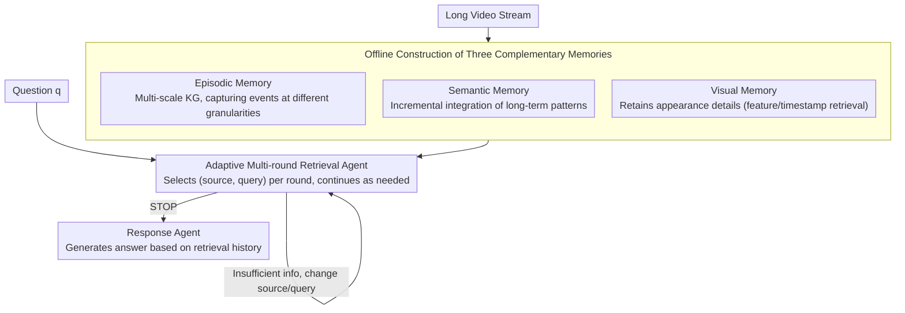

# WorldMM: Dynamic Multimodal Memory Agent for Long Video Reasoning

**Conference**: CVPR 2026  
**arXiv**: [2512.02425](https://arxiv.org/abs/2512.02425)  
**Code**: [https://worldmm.github.io](https://worldmm.github.io)  
**Area**: Video Understanding / LLM Agent / Long Video Reasoning  
**Keywords**: Multimodal Memory, Long Video Understanding, Adaptive Retrieval, Knowledge Graph, Multi-time-scale

## TL;DR
This paper proposes WorldMM, a video reasoning agent based on multimodal memory. It constructs three complementary types of memory: episodic memory (multi-time-scale textual knowledge graph), semantic memory (continuously updated relational knowledge graph), and visual memory (frame-level retrieval library). Through an adaptive multi-round retrieval agent, it dynamically selects the most relevant memory sources and temporal granularities, outperforming the previous SOTA by an average of 8.4% across five long-video QA benchmarks.

## Background & Motivation

1. **Background**: Video LLMs have demonstrated strong capabilities in short video understanding, but extending them to long videos spanning hours or even days remains extremely challenging. Existing memory-augmented methods (e.g., EgoRAG, M3-Agent) mitigate context capacity limitations by performing external memory retrieval on textual summaries of video segments.
2. **Limitations of Prior Work**: Two core limitations exist—(a) Over-reliance on textual representation: almost all existing methods convert events into textual descriptions for retrieval and reasoning, losing critical information such as attribute recognition and spatial reasoning that require visual details. Even if M3-Agent uses visual input during memory construction, it primarily relies on text during reasoning. (b) Fixed-scale retrieval: "Where were the glasses placed?" might only require a few seconds of video, whereas "What happened in the second half?" requires a longer time range. Existing methods retrieve segments of predefined lengths (e.g., three 30-second clips), failing to adapt flexibly to different queries.
3. **Key Challenge**: The multimodality of information in long videos (text cannot fully express visual details) and multi-scale nature (different events span different time ranges) require memory and retrieval systems to possess modality and scale adaptivity, areas where existing methods remain static.
4. **Goal**: (1) How to simultaneously utilize textual and visual memory to support reasoning? (2) How to retrieve information across multiple time scales? (3) How to allow the model to autonomously decide when to look at text, when to look at images, and when to stop?
5. **Key Insight**: By analogy to the human memory system—where episodic memory stores specific events, semantic memory stores abstract knowledge, and visual memory retains sensory details—this work constructs three complementary memory types and combines them dynamically via an iterative retrieval agent.
6. **Core Idea**: Three complementary multimodal memories (Episodic + Semantic + Visual) combined with an adaptive multi-round retrieval agent to achieve reasoning that selects information modality and temporal granularity on demand in long videos.

## Method

### Overall Architecture
WorldMM decomposes long video understanding into three phases: "Memory Construction → Memory Retrieval → Question Answering." **Phase 1** constructs three complementary memories offline from the video stream: episodic memory (factual events), semantic memory (high-level concepts), and visual memory (appearance details). **Phase 2** involves an online retrieval agent that adaptively decides "which memory to query and what to query" over multiple rounds until sufficient information is gathered. **Phase 3** delivers the retrieval history along with the original question to a response agent to generate the final answer. The core mechanism uses three heterogeneous memories to cover the information needs of "what specifically happened / what are the long-term patterns / what does it look like," scheduled by the agent as needed.

### Key Designs

**1. Episodic Memory: Multi-scale KG for capturing events at different granularities**

A single time scale cannot accommodate both "second-level actions" and "hour-level narratives." Episodic memory therefore indexes events at **multiple temporal resolutions**: first, the video is segmented at the finest scale $t_0$ where a Video LLM generates captions. Then, a set of scales $\mathcal{T} = \{t_0, t_1, ..., t_N\}$ (e.g., 30s/3min/10min/1h) is defined. At each scale, captions are converted into factual triplets (entity-action-entity) to construct a knowledge graph $G_{t_i}$, resulting in a set of multi-scale graphs $\mathcal{M}_e = \{G_{t_0}, ..., G_{t_N}\}$. Retrieval follows a **coarse-to-fine** approach: Personalized PageRank (PPR) identifies top-k candidates from each scale graph, followed by LLM-based cross-scale reranking to select the most relevant time range and content.

**2. Semantic Memory: Incremental integration of "long-term patterns"**

Episodic memory consists of independent events and fails to distill high-level knowledge across scenes, such as "the user typically uses kitchen wipes." Semantic memory segments the video at a coarser scale $t_s$, generating triplets focused on **concepts** rather than specific events. These are continuously merged into an evolving semantic graph via `Consolidate`: embedding similarity identifies overlapping or conflicting triplets, and an LLM determines outdated information $T_{remove}$ to be deleted and new/updated information $T_{update}$:

$$Consolidate(G_{t_s}^k, T_{t_s}^{k+1}) = (G_{t_s}^k \setminus T_{remove}) \cup T_{update}$$

This step allows the memory to "forget the old and remember the new," rather than accumulating data blindly.

**3. Visual Memory: Retaining appearance details beyond text**

For questions like "What was that baked item?" or "What color is the object?", textual descriptions are often imprecise. Visual memory provides two access modes: (a) **Feature Retrieval**—segmenting the video into short clips and encoding them with a multimodal encoder (VLM2Vec-V2) into $\mathcal{M}_v^f = \{f_v^1, ..., f_v^L\}$, matched against text queries via cosine similarity; (b) **Timestamp Retrieval**—storing each frame with a timestamp $\mathcal{M}_v^I = \{(t_i, I_i)\}$, directly retrieving frames once the episodic memory has locked onto a specific time segment. The former handles "semantic-based image search," while the latter handles "time-based frame extraction."

**4. Adaptive Multi-round Retrieval Agent: Deciding whom to query and when to stop**

The three memories are not queried simultaneously. Instead, they are scheduled by the retrieval agent $\mathcal{R}$. Taking the question $q$ and historical retrieval results $r_{<i}$ as input, it outputs a (memory source $m_i$, query $q_i$) pair or a STOP command in each round, iterating for a maximum of $N$ rounds. Each result is merged into the history for the next round—if unsatisfied with the first round, the agent can switch sources or refine the query. This is the source of the "dynamic" nature: fixed retrieval strategies cannot handle diverse questions.

### A full walkthrough ("What color were the oven mitts I used last time?")
1. **Round 1**: The Agent determines this requires "finding a specific event + observing appearance." It queries **Episodic Memory** first—PPR retrieves the "using oven mitts" event in multi-scale graphs, and cross-scale reranking pinpoints approximately the 38th minute.
2. **Round 2**: The time segment is known, but the color is missing from the text. The Agent switches to **Visual Memory** timestamp retrieval to fetch frames around the 38th minute.
3. **Round 3**: Visual discrimination on the retrieved frames yields "red." With sufficient info, the Agent issues STOP.
4. **Response**: The Response Agent generates "Red" based on the retrieval history.

If the question were "Where do I usually put the mitts?", the first round would instead query **Semantic Memory** to retrieve the consolidated habit triplets—demonstrating the Agent's ability to switch memory sources based on question type.

### Training Strategy
WorldMM is an inference-time framework and **requires no additional training**. Memory construction utilizes GPT-5-mini, while the retrieval and response agents use GPT-5 or Qwen3-VL-8B.

> ⚠️ Data Note: The backbone names (e.g., GPT-5 / GPT-5-mini) in the original text have not been independently verified and are subject to the original paper's claims.

## Key Experimental Results

### Main Results

| Model | EgoLifeQA | Ego-R1 Bench | HippoVlog | LVBench | Video-MME(L) | Avg. |
|------|-----------|-------------|-----------|---------|-------------|------|
| GPT-5 (base) | 48.6 | 46.3 | 75.7 | 60.4 | 74.3 | 61.1 |
| HippoRAG | 59.6 | 56.0 | 63.2 | 54.0 | 52.1 | 57.0 |
| M3-Agent | 53.5 | 52.0 | 65.5 | 49.3 | 55.3 | 55.1 |
| HippoMM | 54.6 | 53.0 | 71.9 | 38.2 | 41.6 | 51.8 |
| WorldMM-8B | 56.4 | 52.0 | 69.7 | 55.4 | 66.0 | 59.9 |
| **WorldMM-GPT** | **65.6** | **65.3** | **78.3** | **61.9** | **76.6** | **69.5** |

### Ablation Study
Effects of different memory combinations:

| Configuration | EgoLifeQA | Ego-R1 | HippoVlog | LVBench | Video-MME | Avg. |
|------|-----------|--------|-----------|---------|-----------|------|
| E only | 62.6 | 57.0 | 73.6 | 60.6 | 72.7 | 64.9 |
| V only | 37.2 | 34.2 | 51.3 | 47.4 | 64.2 | 44.9 |
| E+S | 63.4 | 61.0 | 73.8 | 58.8 | 74.1 | 66.8 |
| E+V | 63.3 | 63.0 | 75.2 | 59.8 | 76.0 | 66.9 |
| **E+S+V** | **65.6** | **65.3** | **78.3** | **61.9** | **76.6** | **69.5** |

### Key Findings
- **Complementarity of Multimodal Memory**: All three memories contribute—episodic memory is the foundation (64.9 alone vs. visual 44.9), visual memory significantly improves EntityLog/EventRecall questions, and semantic memory significantly boosts HabitInsight (+23%) and RelationMap questions.
- **Necessity of Adaptive Retrieval**: Significant differences exist in memory utilization across question categories—EntityLog uses more visual memory, while HabitInsight uses more semantic memory, indicating the model dynamically selects the most relevant source.
- **Multi-round Retrieval Gain**: Allowing up to 5 rounds of retrieval improves EgoLifeQA by 9.3% over single-round retrieval, as the model can correct strategies if the first round is sub-optimal.
- **Superior Temporal Localization**: WorldMM achieves a tIoU of approximately 10%, far exceeding the 2-4% of other methods, indicating that multi-scale retrieval significantly improves temporal segment localization.
- **Efficiency Advantages**: Through adaptive termination and selective retrieval, WorldMM outperforms all baselines in the latency-accuracy trade-off.

## Highlights & Insights
- **Design Inspired by Human Memory**: The division into episodic, semantic, and visual memory directly corresponds to psychological memory classification. This design is theoretically elegant and experimentally proven to show unique contributions from each. It is transferable to any AI agent system requiring long-term memory management.
- **Exquisite Multi-scale Episodic Memory**: Different scales of KGs provide event information at various granularities. The coarse-to-fine retrieval strategy naturally supports information acquisition from macro to micro levels. This approach can be transferred to document understanding (paragraph/sentence/word-level retrieval).
- **Incremental Consolidation for Semantic Memory**: Implementing continuous knowledge updates through embedding matching + LLM adjudication effectively solves long-term knowledge maintenance in a concise and efficient manner.

## Limitations & Future Work
- Visual memory performs poorly when used alone (Avg 44.9), indicating that current visual indexing and retrieval techniques remain a bottleneck.
- The memory construction phase relies on GPT-5-mini, leading to high costs and latency.
- For questions requiring precise temporal reasoning, even multi-scale memory tIoU is only about 10%, leaving significant room for improvement.
- The consolidation quality of semantic memory depends on LLM judgment accuracy, risking error propagation.
- Exploring the introduction of RL or feedback mechanisms during the memory construction phase to improve quality has not yet been attempted.

## Related Work & Insights
- **vs EgoRAG**: EgoRAG uses only hierarchical textual memory. WorldMM adds visual and semantic memories and introduces adaptive retrieval, improving EgoLifeQA from 52.0 to 65.6.
- **vs M3-Agent**: M3-Agent builds entity-centric long-term memory and supports iterative reasoning but relies solely on textual representation. WorldMM achieves massive gains (55.1→69.5) under similar conditions via multimodal memory.
- **vs HippoMM**: HippoMM proposes dual-process memory (semantic summary + multimodal cues), but visual utilization is limited. WorldMM's adaptive retrieval strategy is more flexible and significantly more powerful (51.8→69.5).

## Rating
- Novelty: ⭐⭐⭐⭐ The multimodal memory framework design is innovative, though the RAG + LLM agent paradigm is becoming mature.
- Experimental Thoroughness: ⭐⭐⭐⭐⭐ Five benchmarks (from hours to weeks), extensive ablation studies, memory utilization analysis, and efficiency analysis.
- Writing Quality: ⭐⭐⭐⭐ Clear structure and intuitive conceptual diagrams, though notation is slightly dense.
- Value: ⭐⭐⭐⭐⭐ Provides an effective framework paradigm for long video understanding and AI agent memory management.

<!-- RELATED:START -->

## Related Papers

- [\[CVPR 2026\] VideoSeek: Long-Horizon Video Agent with Tool-Guided Seeking](videoseek_long-horizon_video_agent_with_tool-guided_seeking.md)
- [\[CVPR 2026\] SVAgent: Storyline-Guided Long Video Understanding via Cross-Modal Multi-Agent Collaboration](svagent_storyline_guided_long_video_understanding_via_cross_modal_multi_agent_collaboration.md)
- [\[ICML 2026\] Video-MTR: Reinforced Multi-Turn Reasoning for Long Video Understanding](../../ICML2026/video_understanding/video-mtr_reinforced_multi-turn_reasoning_for_long_video_understanding.md)
- [\[CVPR 2026\] Video Panels for Long Video Understanding](video_panels_for_long_video_understanding.md)
- [\[CVPR 2026\] Question-guided Visual Compression with Memory Feedback for Long-Term Video Understanding](question-guided_visual_compression_with_memory_feedback_for_long-term_video_unde.md)

<!-- RELATED:END -->
