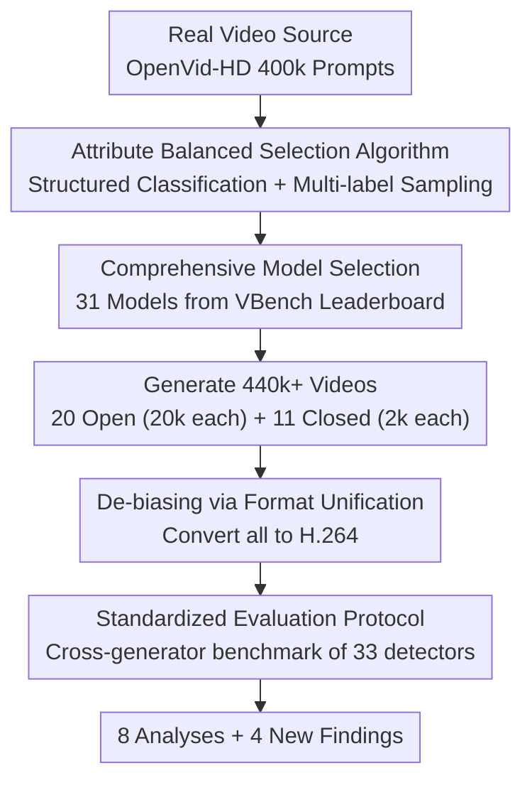

# Your One-Stop Solution for AI-Generated Video Detection

**Conference**: CVPR 2026  
**Paper**: [CVF Open Access](https://openaccess.thecvf.com/content/CVPR2026/html/Ma_Your_One-Stop_Solution_for_AI-Generated_Video_Detection_CVPR_2026_paper.html)  
**Code**: https://github.com/LongMa-2025/AIGVDBench  
**Area**: Video Understanding / AI-Generated Video Detection / Multimedia Forensics  
**Keywords**: AIGC Detection, Video Forensics, Benchmark, Attribute Balancing, Cross-Generator Generalization  

## TL;DR
The authors construct AIBD-Bench—a large-scale benchmark for AI-generated video detection covering 31 latest video generation models and 440k+ videos. They provide a standardized data construction pipeline features "attribute balancing + comprehensive selection + de-biased preprocessing." By conducting over 1,500 evaluations on 33 detectors, they extract 8 analyses and 4 new findings (crucially: "higher generation quality $\neq$ harder to detect").

## Background & Motivation
**Background**: From 2024 to 2025, text-to-video models like Sora, Veo, and Kling have made AI videos indistinguishable from reality, leading to widespread "synthetic skepticism" in society. Detection research is migrating from early deepfake face-swapping and AI image recognition toward "full-video AI detection," yet the sub-field of AI-Generated Video Detection (AIGVD) lags significantly in scale and depth.

**Limitations of Prior Work**: The authors identify two major flaws. **Dataset side**: Existing datasets (GVD, GVF, GenVideo, GenBuster, etc.) generally rely on outdated or narrow generation models, have small video volumes (mostly 4k–110k), and focus on quantity while neglecting semantic diversity, scene coverage, and technical representativeness. Direct random sampling from source videos also inherits the distribution bias of the original datasets. **Benchmark side**: Most works stop at "creating a dataset," leaving fundamental questions unexamined: Should detection be segment-based or frame-by-frame? Why are videos from certain models easier to catch? Does training on higher-quality samples improve robustness and generalization? Does the continuous advancement of generation technology inevitably render existing detectors obsolete?

**Key Challenge**: Progress in detection research is bottlenecked by the lack of a benchmark that is both comprehensive and representative while supporting in-depth analysis. Insufficient data scale/diversity leads to unreliable conclusions, and the lack of systematic analysis leaves researchers without a clear direction.

**Goal**: ① Provide a reproducible, representative data construction pipeline; ② Create a high-quality benchmark an order of magnitude larger, covering the latest models; ③ Systematically evaluate unresolved questions based on this benchmark to guide future work.

**Key Insight**: Instead of creating another "randomly sampled larger dataset," one should first solve sampling bias—categorizing prompts via a structured attribute system and using a balanced selection algorithm to pick a distribution-stable subset. Simultaneously, models should be systematically selected using the VBench leaderboard, and low-level artifacts like compression formats should be unified.

**Core Idea**: Deconstruct the "high-quality benchmark" into three actionable tasks—**prompt attribute balancing, comprehensive model selection, and low-level bias removal**—integrated through a standardized pipeline to create AIGVDBench, followed by large-scale cross-evaluations of 33 detectors.

## Method

### Overall Architecture
The "method" is essentially a **dataset construction + evaluation analysis pipeline** aimed at producing an AIGVD benchmark that is large, balanced, and free of pseudo-correlated cues. The pipeline consists of four steps: First, from the OpenVid-HD dataset, 400k prompts are categorized using a structured attribute system, and 20k balanced prompts are selected via an **attribute balanced selection algorithm**. Second, 31 generation models (20 open-source + 11 closed-source) are **comprehensively selected** based on the VBench leaderboard to generate 440k+ videos. Third, **compression format unification** (converting all to H.264) is applied to eliminate systematic encoding differences. Finally, under a unified **evaluation protocol**, 33 detectors across four categories undergo cross-generator training and testing for over 1,500 evaluations.

### Key Designs

**1. Attribute Balanced Selection Algorithm: Extracting balanced prompts from biased sources**
Random sampling from large-scale datasets like OpenVid-HD inherits inherent content biases (certain themes/actions being overrepresented), distorting detector evaluations. The difficulty lies in the **multi-label** nature of prompts—a single prompt may contain multiple attributes like "person" and "animal." The authors categorized prompts into 9 spatial content types, 3 spatial attributes, 4 temporal content types, and 3 temporal attributes.

A four-stage balanced selection algorithm (Algorithm 1) was used: The prompt set $P$ is split into four disjoint subsets $P_1,\dots,P_4$ based on attribute complexity. Each subset $P_i$ is further divided into $N_i=\prod_{j=1}^{k}\mathrm{Num}(\mathrm{CLS}(j))$ categories (where $k$ is the number of attributes). Prompts are labeled as "Single" (one category) or "Multi" (multiple). Selection proceeds greedily starting from the **minimum category count $m$**: "Single" prompts are prioritized, followed by "Multi" to fill quotas. Once a "Multi" prompt is selected, it is removed from other categories to prevent over-sampling of frequent attributes. The result is a subset $P_B$ of 20,000 balanced prompts.

**2. Comprehensive Model Selection: Covering latest and representative technologies**
Representative gaps in old benchmarks often stem from outdated models. The authors selected **31 models: 20 open-source + 11 closed-source**, covering Text-to-Video (T2V, 23 models), Image-to-Video (I2V, 6 models), and Video-to-Video (V2V, 2 models). Open-source selection considered VBench rank, inference speed, and multi-task capability (e.g., LTX, EasyAnimate). Closed-source models (including Sora, Veo, Kling via official/community samples) provide unconstrained content for reality pressure testing. This combination makes AIGVDBench significantly more robust than prior datasets.

**3. Compression Format Unification: Removing the "encoding cheat" shortcut**
Deepfake detection history shows that detectors often learn low-level compression cues (e.g., PNG vs JPEG) rather than actual generative artifacts. The authors transcoded all videos to **H.264** to eliminate systematic encoding differences. This step ensures that a detector's high performance is not simply based on identifying file formats.

**4. Standardized Evaluation Protocol: Quantifying open questions**
The authors benchmarked detectors across **four paradigms**: Video classification (I3D, TimeSformer, VideoMAE), Image-based detection (CNNSpot, UnivFD, Effort, ForgeLens), Video-specific detection (DeMamba, DeCoF), and Multimodal Large Language Models (Qwen2.5-VL, InternVL, DeepSeek-VL). The protocol uses a cross-generator setup (training on one, testing on others) to measure out-of-distribution generalization.

## Key Experimental Results

### Main Results
The benchmark scale provides a significant generational leap:

| Dataset | Latest Model Year | # Models | Open/Closed | # Gen Videos | Balanced Content |
|--------|------|------|------|------|------|
| GVD | 2024.2 | 11 | 3/8 | 11.6k | No |
| GVF | 2024.6 | 9 | 4/5 | 4.2k | Semi-auto |
| GenVideo | 2024.3 | 20 | 14/6 | 100k | No |
| GenWorld | 2025.1 | 10 | 10/0 | 89.4k | No |
| **AIGVDBench (Ours)** | 2025.3 | **31** | **20/11** | **422k+** | **Auto** |

Cross-generator detection AUC (Average on open-source generators, selected detectors):

| Detector Category | Method | Open AVG AUC | Closed AVG AUC |
|--------|------|------|------|
| Image-based | ForgeLens1 | 91.82 | 85.03 |
| Image-based | Effort | 87.49 | **94.05** |
| Video Classify | I3D | 82.99 | 61.18 |
| Video Classify | TimeSformer | 81.50 | 86.50 |
| Video-specific | DeCoF | 82.56 | 72.90 |
| Video-specific | DeMamba | 80.99 | 69.43 |

VLM Accuracy (ACC, 50 represents random guessing): Most VLMs (LLaVA-1.5, DeepSeek-VL-7B) hover near 50. DeepSeekVL2 reached 75.35 on closed-source, which the authors analyze in the appendix.

### Key Findings
- **Finding-1: All four paradigms still have significant room for improvement.** Image-based detectors (Effort, ForgeLens) are strongest by discarding irrelevant features. Temporal artifact methods (DeCoF/DeMamba) show potential but were likely limited by prior data quality.
- **Finding-2 (Counter-intuitive): Higher generation quality does not guarantee harder detection, nor better generalization when used for training.** Using cross-generator matrices, results show that training performance varies greatly between generators and is **not positively correlated with generation quality**. The "best training model" differs for each detector type.
- **Finding-1.1 / 1.2**: Generation tasks (T2V/I2V/V2V) significantly impact performance. Currently, VLMs lack reliable GVD capabilities.
- **De-biasing is critical**: Standardizing compression and sampling is essential to ensure evaluation conclusions are not contaminated by low-level cues.

## Highlights & Insights
- **Engineering deconstruction of "High-quality"**: Instead of just "bigger is better," the paper defines success through prompt balancing, systematic model selection, and format de-biasing.
- **Attribute Balancing for Multi-label Data**: The greedy strategy (Single-first + Multi-deduplication) effectively manages prompt attribute correlations.
- **Finding-2 Debunks Intuition**: The realization that "high-quality training data" is relative to the specific detector architecture provides direct guidance for selecting training sources.
- **Closed-source Stress Tests**: Using unconstrained, multi-resolution closed-source samples reveals the dramatic performance drop in existing detectors when facing real-world complexity.

## Limitations & Future Work
- **Limitations**: Newer closed models like Veo3 or Sora2 were not included due to access restrictions. The closed-source volume (2k per model) is smaller than open-source (20k).
- **Benchmark focus**: The paper focuses on benchmarking and analysis rather than proposing a new SOTA detection algorithm.
- **Future Directions**: Developing adaptive attribute systems, introducing temporal-level de-biasing, and designing detectors that specifically leverage the discovered "temporal vs spatial artifact" trade-offs.

## Related Work & Insights
- **vs GenVideo/GenBuster**: These use outdated models or random sampling. Ours uses 2025.3 models, attribute balancing, and a 440k+ scale.
- **vs DeCoF/DeMamba**: These propose suppressing spatial artifacts to use temporal artifacts. This paper provides the large-scale clean data needed to validate and advance these ideas.
- **vs Image-based Detectors**: Adapting image forensic methods (CNNSpot/UnivFD) shows that feature decoupling is more robust in video detection than previously thought.

## Rating
- Novelty: ⭐⭐⭐⭐ The benchmark construction pipeline and the counter-intuitive Finding-2 offer significant insight.
- Experimental Thoroughness: ⭐⭐⭐⭐⭐ 31 models, 440k videos, 33 detectors, 1500+ evaluations—unparalleled scale in this field.
- Writing Quality: ⭐⭐⭐⭐ Clear problem-driven organization.
- Value: ⭐⭐⭐⭐⭐ Likely to become the standard benchmark for AIGVD, providing foundational infrastructure for the field.

<!-- RELATED:START -->

## Related Papers

- [\[CVPR 2026\] CoCoVideo: The High-Quality Commercial-Model-Based Contrastive Benchmark for AI-Generated Video Detection](cocovideo_the_high-quality_commercial-model-based_contrastive_benchmark_for_ai-g.md)
- [\[CVPR 2026\] MoVie: Broaden Your Views with Human Motion for Action Detection](movie_broaden_your_views_with_human_motion_for_action_detection.md)
- [\[CVPR 2026\] Envisioning the Future, One Step at a Time](envisioning_the_future_one_step_at_a_time.md)
- [\[CVPR 2026\] Stay in your Lane: Role Specific Queries with Overlap Suppression Loss for Dense Video Captioning](stay_in_your_lane_role_specific_queries_with_overlap_suppression_loss_for_dense_.md)
- [\[CVPR 2026\] Building a Precise Video Language with Human-AI Oversight](building_a_precise_video_language_with_human-ai_oversight.md)

<!-- RELATED:END -->
