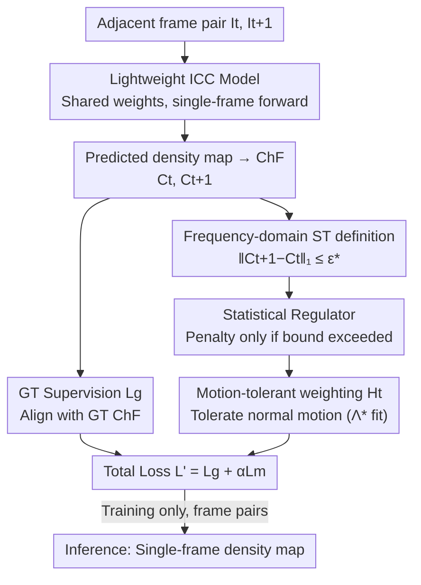

# Adapting Lightweight Image-based Counting Models for Video Crowd Counting

**Conference**: CVPR 2026  
**Paper**: [CVF Open Access](https://openaccess.thecvf.com/content/CVPR2026/html/Shu_Adapting_Lightweight_Image-based_Counting_Models_for_Video_Crowd_Counting_CVPR_2026_paper.html)  
**Code**: https://github.com/wbshu/SR (Paper states "will be available", ⚠️ subject to official release)  
**Area**: Model Compression / Efficient Inference  
**Keywords**: Video Crowd Counting, Lightweight, Statistical Regulator, Characteristic Function, Spatiotemporal Consistency

## TL;DR
This paper avoids adding any temporal modules to Video Crowd Counting (VCC). Instead, it analytically formulates the spatiotemporal prior—that "crowd count changes between adjacent frames should be bounded"—as a frequency-domain statistical regulator based on the Characteristic Function (ChF). This regulator constrains a lightweight Image Crowd Counting (ICC) model only during training, while inference remains single-frame. It achieves SOTA accuracy across six datasets while reaching an inference frame rate of 99.5 fps.

## Background & Motivation
**Background**: The mainstream approach for video crowd counting is to "extract spatiotemporal (ST) information from neighboring frames and fuse it into the current frame's prediction." This involves using extra modules like optical flow networks, Transformers, or ConvLSTMs to extract and fuse features from adjacent frames, leveraging temporal cues to improve counting accuracy.

**Limitations of Prior Work**: These ST modules introduce three practical issues: (1) Extraction and fusion rely on deep networks, making "how ST information helps counting" neither interpretable nor controllable; (2) Extra modules significantly increase storage and computational overhead, making it difficult to meet the real-time requirements of VCC; (3) Predicting the current frame using neighboring frames requires caching multiple frames and their features during inference. Consequently, these models are difficult to deploy in real-world scenarios with limited computing power and strong real-time demands.

**Key Challenge**: VCC practitioners desire the accuracy gains brought by temporal information, but this gain comes at the cost of making models heavy, slow, and dependent on multi-frame buffering—accuracy and efficiency are locked in a trade-off dictated by temporal modules. In contrast, truly lightweight and real-time deployable models are ICC models, which inherently lack temporal capabilities.

**Goal**: Can a lightweight ICC model acquire VCC capabilities **without introducing any extra modules, without increasing inference overhead, and by looking at only a single frame during inference**? This requires answering two sub-questions: theoretically, how far is single-frame inference from optimal multi-frame estimation (when is ICC sufficient for VCC?); and engineering-wise, how to inject temporal priors into training without altering the architecture.

**Key Insight**: The authors notice that ChF (Characteristic Function, the frequency-domain representation of a density map) was previously used only as a static representation for single images. By observing its **evolution over time**, one finds that the temporal variations of ChF are highly structured and mathematically tractable. Thus, ST information does not need to be "guessed" by a network; it can be analytically defined and directly linked to the counting task.

**Core Idea**: By bounding the L1 variation of ChF between adjacent frames, spatiotemporal consistency is formulated as an inequality estimable from data. This is then implemented as a **statistical regulator** to constrain training—replacing modules with regularization, allowing a lightweight ICC model to learn temporally consistent solutions with controlled complexity.

## Method

### Overall Architecture
During training, a pair of adjacent frames $I_t, I_{t+1}$ is independently fed into **the same lightweight ICC model** (shared weights) to obtain two predicted density maps $D_t, D_{t+1}$, which are then converted into their respective characteristic functions $C_t, C_{t+1}$. The loss consists of two parts: a standard ground-truth supervision $L_g$ (aligning each frame's ChF with the GT ChF) and the proposed **statistical regulator** $L_c$ (constraining the temporal variation of predicted ChFs within a data-driven upper bound $\epsilon^*$). This is further upgraded to a **motion-tolerant version** $L_m$ (using frequency-domain weights $H_t$ to tolerate variations caused by normal human motion). Two key hyperparameters, $\epsilon^*$ and $\Lambda^*$, are reformulated as statistical inference problems and automatically estimated once from the training set without manual tuning. **The inference stage completely reverts to single-frame mode**: the regulator only takes effect during training; during deployment, it is a standard image counting model with no buffering or extra structures.

### Key Designs

**1. Frequency-domain analytical definition of ST information: Turning "spatiotemporal consistency" into a data-calculable inequality**

The pain point of prior methods is that ST information is only "indirectly" related to the counting task (e.g., low-level optical flow) and must be extracted by networks. The authors seek a definition that is **directly aligned with counting and model-agnostic**. Intuitively, as a video represents the temporal evolution of a scene, the crowd distribution in adjacent frames should not mutate arbitrarily and should satisfy bounded local count changes $|f(t+1)-f(t)|\le\epsilon$. However, defining "consistency" directly in the pixel/density map space is unreliable (discontinuities appear even with slow motion after point-map convolution), and local region sizes/shapes are hard to choose. The authors bypass the spatial domain, using ChF as a frequency-domain carrier, and prove two theorems to solidify the approach: Theorem 1 shows that while pixel-level density maps jump even under smooth motion, **ChF evolves in a "time-locally linear" manner** over time; $C_{t+\Delta t}(w)-C_t(w)$ changes linearly with human displacement, with the magnitude bounded by $\|A_{t,w}\|_2\le Q\|w\|_2$. Theorem 2 further proves that as long as $\|C_{t+1}-C_t\|_1\le\epsilon$, the average local count change in **any region of any shape or size** satisfies $\Delta_R(t,t+1)\le(2\pi)^{-2}\epsilon$, solving the problem of "how to choose local regions." Thus, spatiotemporal consistency is unified in frequency-domain form:

$$\|C_{t+1}-C_t\|_1=\int|C_{t+1}(w)-C_t(w)|\,dw\le\epsilon^*.$$

The upper bound $\epsilon^*$ is not manually tuned but is statistically derived from GT ChFs: $\epsilon^*=\max_{k}\max_{i}\|C^{(k)}_{i+1}-C^{(k)}_{i}\|_1$ (a slightly modified version robust to outlier frames is used in practice). Since this bound is calculated purely from GT density maps without any network, the extracted ST information is an **inherent property of the dataset itself, independent of specific models**, and is **calculated only once** (prior methods extract ST features at every training step), significantly improving training efficiency.

**2. Statistical Regulator: Injecting ST constraints into training via a loss term instead of modules**

Prior methods feed ST information as "extra features" for the model to fit, which is the source of complexity and inference overhead. The authors take the opposite approach—formulating the inequality above as a **regularization term** that constrains model complexity rather than increasing input. The training loss for a pair of adjacent frames is:

$$L=\underbrace{\|C_t-C^{[g]}_t\|_2+\|C_{t+1}-C^{[g]}_{t+1}\|_2}_{L_g}+\alpha\underbrace{\mathbb{1}(\|C_{t+1}-C_t\|_1>\epsilon^*)\,\|C_{t+1}-C_t\|_2}_{L_c},$$

where $\mathbb{1}(\cdot)$ is the indicator function, $\alpha$ is the balancing factor, and the L2 norm is used for stable training. The mechanism is straightforward: the regulator only penalizes when the L1 temporal change of the predicted ChFs **exceeds** the data upper bound $\epsilon^*$; if it falls within the statistical boundary, it remains inactive. This effectively tells the model, "The change in people count you predict between adjacent frames must not be more unreasonable than what has been seen in the real data distribution," thereby constraining the solution to a **complexity-controlled and temporally consistent** region—without introducing any modules or changing the inference process.

**3. Motion-tolerant weighting and data-driven estimation of Λ\*: Distinguishing "human motion" from "model jitter"**

The basic regulator has a risk: local count variations in adjacent predictions come from two sources—(a) inconsistencies between predictions (should be penalized) and (b) normal human movement between frames (should not be penalized). Indiscriminate penalization would harm normal motion. The authors re-weight the regulator using a frequency-domain weight function $H_t(w)$: $L_m=\mathbb{1}(\|C_{t+1}-C_t\|_1>\epsilon^*)\,\|H_t*(C_{t+1}-C_t)\|_2$ (where $*$ denotes element-wise multiplication). The design of $H_t$ is based on Theorem 3: assuming each individual's motion follows a distribution with covariance $\Lambda$, the standard deviation of $C_{t+1}(w)-C_t(w)$ induced by normal motion is $\sqrt{Q(1-\exp(-w^T\Lambda w))}\exp(-w^T\Sigma w)$. $H_t$ takes the inverse of this standard deviation (see Eq. 7-8), thus **giving high weights to frequencies that should be stable even if people move, and low weights to frequencies that naturally change due to normal motion**, forcing the regulator to focus only on "unjustified inconsistencies." The key parameter $\Lambda$ is not manually tuned or based on motion labels (most VCC datasets lack point correspondence) but is treated as a **statistical inference problem**: the empirical normalized variance of ChF differences $S(w)$ is first calculated (Eq. 11, with the denominator removing scale effects), then a theoretical variance function $h_\Lambda(w)$ is fitted to $S(w)$ to find $\Lambda^*=\arg\min_{\Lambda\succeq0}\int|h_\Lambda(w)-S(w)|^2dw$. This way, $\Lambda$ is inferred in the frequency domain in a purely data-driven manner, requiring no motion tracking while retaining the statistical semantics of motion covariance; the final training loss is $L'=L_g+\alpha L_m$.

**4. Theoretical characterization of ICC↔VCC sufficiency: A quantifiable criterion for "Is single-frame enough?"**

This is not a module in the pipeline but a theoretical foundation for "why single-frame can be used." The authors compare two types of optimal mean square estimators—$\mathcal{F}_{img}$ using only a single frame and $\mathcal{F}^{(l,r)}_{vid}$ using a temporal window—defining the theoretical gap $\Delta_{l,r}=\mathbb{E}\big[(\mathbb{E}[C_t\mid I_{t-l},\dots,I_{t+r}]-\mathbb{E}[C_t\mid I_t])^2\big]$ (Theorem 4). $\Delta_{l,r}$ measures "how much additional reduction in uncertainty VCC can theoretically squeeze out compared to ICC"; it vanishes under three conditions: temporal redundancy (neighboring frames provide no new info), single-frame complete observability, or target determinism (the single frame already uniquely determines $C_t$). A counter-intuitive conclusion is that the third condition does not require perfect scenes without occlusion; it only fails when occlusion or blur is "information-theoretically complete" (all visible evidence of a person is gone). In reality, residual contours and shadows are usually sufficient for a single frame to be a statistically sufficient representation. The practical takeaway is clear—when computing power is limited, **increasing single-frame information (higher image quality, better perspective, multi-camera) is more cost-effective than stacking temporal model complexity**, as the former directly lowers $\Delta_{l,r}$.

### Loss & Training
The ICC backbone follows the VGG19-based models from [31, 37], trained with the motion-tolerant version $L'$ (Eq. 13) using a balancing factor $\alpha=0.8$. Ground-truth density maps are generated with a Gaussian kernel of 8-pixel bandwidth. Data augmentation includes random cropping (prob 1.0) and random horizontal flipping (prob 0.5). The optimizer is Adam with a learning rate of 1e-5 and weight decay of 1e-4, and a batch size of 8 (i.e., 4 frame pairs). Integral approximation follows [37] with a frequency range of $[-0.3,0.3]^2$ and a Riemann sum granularity of 0.01. $\epsilon^*$ and $\Lambda^*$ are estimated once from the data before training and are not involved in hyperparameter tuning.

## Key Experimental Results

Six benchmarks (UCSD / MALL / FDST / VENICE / DRONECROWD / VSCROWD) cover three types of perspectives: surveillance, handheld camera, and aerial. DRONECROWD is the most challenging (small targets, low resolution, significant training/testing domain gap). Metrics are MAE / MSE. The method is denoted as SR.

### Main Results: Comparison with SOTA VCC Methods (Selected from Table 5)
Note: "Tr/Inf" indicates input type for training/inference, I=Single frame, V=Video/Multi-frame. SR is the only method using **video for training and single-frames for inference** (V/I).

| Dataset | Metric | SR (Ours, V/I) | Representative Video Methods | Description |
|--------|------|------|------|------|
| VENICE | MAE / MSE | **8.2 / 10.5** | DACM 11.1 / 14.3 | Significant advantage on small data |
| FDST | MAE / MSE | **1.27 / 1.61** | DACM 1.31 / 1.75 | Surveillance view, best |
| DRONECROWD | MAE / MSE | **14.1** / 19.9 | CLRNet 17.3 / 23.4 | Hardest aerial view, MAE best, MSE 2nd |
| VSCROWD | MAE / MSE | **5.4 / 9.5** | DACM 7.1 / 14.7 | Large dataset, MAE leads significantly |
| UCSD | MAE / MSE | 0.75 / 0.97 | CLRNet 0.72 / 0.94 | Second best |

SR achieves the best MAE & MSE on MALL / VENICE / FDST / VSCROWD, second on UCSD, and the best MAE on DRONECROWD. Notably, on the largest datasets (DRONECROWD, VSCROWD), its MAE significantly outperforms existing video methods, all of which rely on multi-frame inference.

### Efficiency Comparison (Table 6, FDST, RTX3090 Ti, Input 640×360)

| Method | Training per epoch | Single-frame Inf. | fps |
|------|------|------|------|
| EPF | 49 min | 0.043 s | 23.5 |
| STGN | 476.1 s | 0.017 s | 58.5 |
| DACM | 435.3 s | 0.016 s | 61.3 |
| **SR (Ours)** | **85.5 s** | **0.010 s** | **99.5** |

Single-frame inference allows the frame rate to far exceed multi-frame methods. Training acceleration becomes more pronounced as the dataset grows, and inference acceleration increases with input resolution.

### Ablation Study
**Regulator Form (Table 3, DRONECROWD)**

| Configuration | MAE | MSE | Description |
|------|-----|-----|------|
| baseline ($\alpha=0$, pure ICC) | 18.1 | 26.5 | No ST constraints |
| + Basic Regulator (Eq. 5) | 15.3 | 22.7 | Adds only ST consistency constraint |
| + Motion-tolerant Regulator (Eq. 13) | **14.1** | **19.9** | Full SR |

**Balancing factor $\alpha$ (Table 2, DRONECROWD)**: MAE for $\alpha=0/0.6/0.8/1.0/3.0$ is 18.1 / 15.1 / **14.1** / 15.2 / 16.5. $\alpha=0.8$ is optimal—too small is insufficient for constraint, too large suppresses the supervision signal.

**Generalizability across backbones (Table 4, DRONECROWD, MAE/MSE)**

| Backbone | w/o SR | w/ SR |
|------|--------|-------|
| MCNN | 34.7 / 42.5 | 30.6 / 38.5 |
| CSRNet | 19.8 / 25.6 | 17.1 / 24.5 |
| CAN | 22.1 / 33.4 | 16.9 / 22.3 |
| VGG19 (ChfL) | 18.1 / 26.5 | 14.1 / 19.9 |
| MAN | 18.7 / 23.4 | 14.9 / 21.7 |

### Key Findings
- **Motion tolerance is a net gain**: Moving from the basic regulator (15.3) to the motion-tolerant version (14.1) further reduces MAE by 1.2, proving that "tolerating normal motion while penalizing unjustified jitter" is indeed effective rather than optional.
- **Regulator decouples from backbones**: Adding SR consistently lowers MAE across five lightweight backbones (including the older MCNN), with CAN dropping from 22.1→16.9. This proves SR is a portable training scheme not tied to a specific architecture.
- **Greater advantage on small data**: On VENICE, where training data is relatively scarce, SR reduces MAE from the SOTA 11.1 to 8.2—the role of statistical regularization in suppressing overfitting/complexity is more prominent on small datasets.

## Highlights & Insights
- **Paradigm shift of "Regularization instead of Modules"**: By reframing spatiotemporal information from "extra input features" to a "regularization term constraining model complexity," the method eliminates extra modules, multi-frame buffers, and inference overhead while achieving SOTA accuracy. This "aha" moment suggests its applicability to any task seeking temporal/structural priors without increasing model weight.
- **First mining of ChF's temporal dimension**: While previous work used ChF only as a static single-image representation, this paper proves it evolves linearly in the time-local sense (Theorem 1), allowing spatiotemporal consistency to be rigorously defined at the frequency level independent of the model. This is a brilliant example of finding new utility in an old representation.
- **Hyperparameters as statistics instead of knobs**: $\epsilon^*$ is obtained in closed-form and $\Lambda^*$ by fitting data variance, making the process parameter-free and self-adaptive across datasets—highly friendly for industrial deployment.
- **Theoretical criterion for "Is single-frame enough?"**: $\Delta_{l,r}$ quantifies the gap between ICC and optimal VCC, suggesting that improving single-frame information is more efficient than stacking temporal complexity in resource-constrained settings.

## Limitations & Future Work
- The authors clarify that the analysis "does not claim single-frame inference is always sufficient in practice" but rather maps out the information-theoretic boundaries where temporal info loses value; when occlusion or blur is information-theoretically complete, single-frame is indeed insufficient, and SR provides no additional compensation for such extreme scenarios.
- ⚠️ Theorem 3 relies on the assumption that individual motion is sampled from an asymptotic global motion distribution with covariance $\Lambda$. In scenes with highly non-stationary motion or strong group correlations (e.g., sudden stampedes, counter-flows), a single covariance $\Lambda$ might be inaccurate, potentially leading to a mismatch in $H_t$ (refer to original text).
- The framework still requires frame pairs for training and relies on GT ChF/density map supervision; how to remain robust to sparsely annotated or varying frame-rate data is not fully explored.
- Future directions: Extending the single $\Lambda$ to scene/time-adaptive multi-modal motion covariances, or making $\epsilon^*$ and $H_t$ update online to adapt to distribution shifts in long videos.

## Related Work & Insights
- **vs Optical Flow/Transformer VCC (EPF / STGN / DACM etc.)**: These rely on extra modules to extract and fuse neighbor ST features during multi-frame inference. This paper uses an analytical ST definition as a single regulator for single-frame inference. The difference lies in "whether ST info is treated as a feature or a constraint"—this paper gains 99.5 fps and portability at the cost of higher mathematical requirements for formulating priors.
- **vs ChfL [37] (Static use of ChF)**: ChfL uses ChF as a frequency representation for image counting. This paper adopts its ChF/VGG19 backbone but is the **first to analyze ChF temporal dynamics**, extending the static representation into a spatiotemporal consistency constraint to upgrade an ICC method to VCC.
- **vs Multi-branch/Heavy ICC Models**: This paper explicitly chooses a subset of lightweight backbones (CSRNet/CAN/MCNN etc.), advocating that under computational constraints, "increasing single-frame info + statistical regularization" is superior to stacking model complexity—contrasting the mainstream narrative that "bigger/heavier is better."

## Rating
- Novelty: ⭐⭐⭐⭐⭐ Reframing ST info from "module features" to "frequency statistical regularization" and uniquely mining ChF temporal dynamics is highly innovative.
- Experimental Thoroughness: ⭐⭐⭐⭐☆ Covers six benchmarks, five backbones, and detailed efficiency/ablation; however, efficiency comparisons are limited to models with available code and lack validation on larger backbones.
- Writing Quality: ⭐⭐⭐⭐☆ Theoretical derivations (4 theorems) are well-connected to engineering motivations, and Fig. 1 clearly illustrates the framework; some theorem details require supplemental material.
- Value: ⭐⭐⭐⭐⭐ Real-time single-frame inference plus a plug-and-play regulator with zero-tuning hyperparameters offers high deployment value and provides a quantifiable criterion for ICC↔VCC sufficiency.

<!-- RELATED:START -->

## Related Papers

- [\[CVPR 2026\] MM-SeR: Multimodal Self-Refinement for Lightweight Image Captioning](mm-ser_multimodal_self-refinement_for_lightweight_image_captioning.md)
- [\[CVPR 2026\] OmniZip: Learning a Unified and Lightweight Lossless Compressor for Multi-Modal Data](omnizip_learning_a_unified_and_lightweight_lossless_compressor_for_multi-modal_d.md)
- [\[CVPR 2026\] LIFT and PLACE: A Simple, Stable, and Effective Knowledge Distillation Framework for Lightweight Diffusion Models](lift_and_place_a_simple_stable_and_effective_knowledge_distillation_framework_fo.md)
- [\[CVPR 2026\] Accelerating Streaming Video Large Language Models via Hierarchical Token Compression](accelerating_streaming_video_large_language_models_via_hierarchical_token_compre.md)
- [\[CVPR 2026\] Differentiable Vector Quantization for Rate-Distortion Optimization of Generative Image Compression](differentiable_vector_quantization_for_rate-distortion_optimization_of_generativ.md)

<!-- RELATED:END -->
