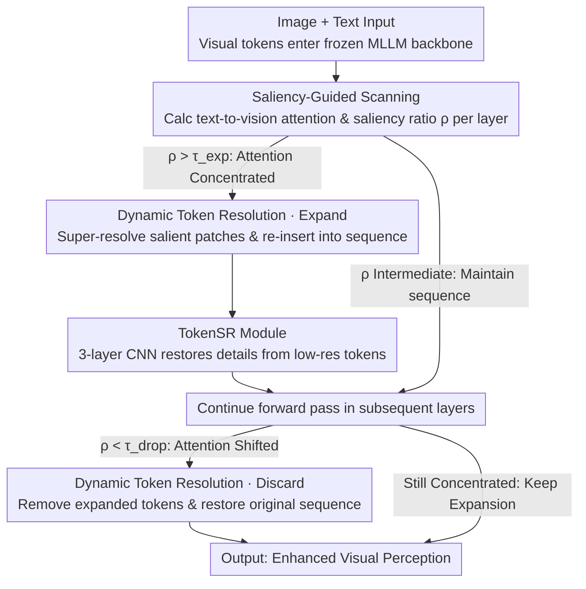

# Blink: Dynamic Visual Token Resolution for Enhanced Multimodal Understanding

**Conference**: CVPR 2026  
**arXiv**: [2512.10548](https://arxiv.org/abs/2512.10548)  
**Code**: None  
**Area**: Multimodal Large Language Models / Image Restoration (Perception Enhancement)  
**Keywords**: Visual token resolution, dynamic attention, Multimodal Large Language Models, saliency-guided, token super-resolution

## TL;DR
The Blink framework is proposed to adaptively enhance visual perception in a single forward pass by dynamically expanding and discarding visual tokens across different Transformer layers of MLLMs (mimicking human "rapid-blink" scanning), improving LLaVA-1.5 performance across multiple multimodal benchmarks.

## Background & Motivation
**Background**: Multimodal Large Language Models (MLLMs), such as LLaVA and Qwen-VL, have made significant progress in vision-language tasks, yet their visual perception remains insufficient, often leading to hallucinations.

**Limitations of Prior Work**: Existing MLLMs utilize traditional LLM architectures for visual inputs without explicit exploitation of salient visual regions; post-processing methods (e.g., identifying salient regions followed by cropping and secondary inference) are inefficient and typically focus only on a single region.

**Key Challenge**: Humans perceive visual scenes through a dynamic "scan-focus-shift" process, whereas MLLMs treat all visual tokens equally and lack the capability for cross-layer attention shifts.

**Goal**: How to dynamically enhance the visual perception capabilities of MLLMs during a single forward pass?

**Key Insight**: A pilot study revealed two critical insights: (a) different layers attend to different visual regions, and (b) increasing computation for high-attention tokens improves perceptual ability. Based on these, a dynamic framework was designed.

**Core Idea**: Leveraging the non-uniform distribution of attention maps, the framework dynamically decides whether to expand (super-resolution enhancement) or discard visual tokens at each layer, simulating the human cognitive process of "scan-focus-shift."

## Method

### Overall Architecture

Blink aims to dynamically enhance MLLM visual perception in one forward pass. Its starting point is derived from two findings in a pilot study: different Transformer layers focus on different regions in an image, and allocating more computation to high-attention tokens indeed improves perception. Thus, Blink inserts a "scan-focus-shift" loop into the standard forward pass. In selected layers, a saliency map is calculated first; if attention is sufficiently concentrated, TokenSR is used to expand tokens in the salient region via super-resolution. Once attention shifts elsewhere, these expanded tokens are discarded. The entire process mimics human "rapid-blink" visual scanning while keeping the backbone model frozen.

### Key Designs

**1. Saliency-Guided Scanning: Judging enhancement based on attention concentration**

To simulate "focus," the model must first determine where it is looking and how confident it is. At each participating layer $L$, Blink calculates the attention of the last text token on all visual tokens $S_v^{(L)} = q_{t_n}^{(L)} (k_v^{(L)})^\top$. Visual tokens are reshaped into an $H \times W$ grid, aggregated into $p \times p$ patches, and the saliency ratio is characterized by $\rho^{(L)} = \frac{\mathcal{S}_{r_{\max}}^{(L)}}{\sum_i \mathcal{S}_{r_i}^{(L)}}$. A larger $\rho$ indicates the model is "confidently" staring at a specific region, making it an ideal time for enhancement—this directly corresponds to the pilot study observation that attention distributions vary significantly across layers.

**2. Dynamic Token Resolution: Expanding for concentration and discarding for shifts**

Identifying saliency is insufficient; computation must be actively allocated and reclaimed. When $\rho^{(L)} > \tau_{\text{exp}}$, Blink uses TokenSR to perform super-resolution enhancement on salient patches $hs_{SR}^{(L)} = \text{TokenSR}^{(L)}(hs_{LR}^{(L)})$ and inserts the enhanced tokens into the sequence $[hs_s; hs_v; hs_{SR}; hs_t]$. When attention shifts in subsequent layers ($\rho^{(L)} < \tau_{\text{drop}}$), the previously expanded tokens are removed to restore the original sequence. Expansion allows the model to spend more computation on salient regions, while discarding prevents low-information tokens from interfering with subsequent reasoning. Replacing this module with a fixed cycle in ablation studies caused the largest performance drop (-41.07), identifying it as the core of the framework.

**3. TokenSR Module: Restoring details from low-res tokens via lightweight convolution**

Expanding salient tokens requires a component capable of truly "magnifying" features. TokenSR is a lightweight module consisting of three layers of 2D convolution + ReLU. During training, it magnifies tokens of salient regions from the full image and minimizes the KL divergence with tokens from the corresponding cropped image as a reference. The MLLM backbone is frozen throughout, and only TokenSR is trained. This effectively applies the image super-resolution concept to tokens—restoring details from low-resolution tokens without breaking semantic consistency, allowing for plug-and-play functionality.

### Loss & Training

The training objective for TokenSR is to minimize the KL divergence between the enhanced tokens and the reference tokens of the cropped image. Training data is sourced from the LLaVA-1.5 training set (COCO + GQA + OCR-VQA + TextVQA + VisualGenome). All expansion/cropping operations are executed before Layer Normalization to ensure the Transformer correctly processes sequences of varying lengths.

## Key Experimental Results

### Main Results (LLaVA-1.5-7B)

| Benchmark | Vanilla | Blink-interp | Blink | Gain |
|------|---------|-------------|-------|------|
| MME Perception | 1505.72 | 1514.08 | **1519.74** | +14.02 |
| MME Cognition | 357.86 | 353.21 | **361.79** | +3.93 |
| GQA | 61.93 | 61.93 | **61.98** | +0.05 |
| MMBench | 64.60 | **64.69** | **64.69** | +0.09 |
| MMBench-CN | 58.08 | 58.51 | **58.59** | +0.51 |
| POPE | 85.17 | 85.17 | **85.23** | +0.06 |
| ScienceQA | 69.46 | 69.51 | **69.66** | +0.20 |
| MM-Vet | 32.20 | 31.70 | **33.40** | +1.20 |

### Ablation Study

| Configuration | MME Total | Change | Description |
|------|-----------|------|------|
| Blink Full | **1881.53** | — | Optimal |
| w/o SGS (Random) | 1879.38 | -2.15 | Saliency-guided is necessary |
| w/o DTR (Fixed) | 1840.46 | -41.07 | Dynamic resolution adjustment is critical |
| w/o Drop | 1884.03 | +2.50 | Slight improvement without dropping in Blink |
| High $\tau_{\text{exp}}$ | 1865.54 | -15.99 | Excessive threshold limits effective expansion |

### Key Findings
- The removal of the DTR module caused the most significant performance decrease (-41.07), proving it is the framework core.
- Blink-interp (interpolation without training) also improved MME Perception by 8.36 points, proving the value of the dynamic inference pipeline itself.
- Fully-trained Blink consistently outperformed or matched the baseline across all benchmarks.
- The layer range selection (layers 12-18) corresponds to the "middle layers with correct attention" identified in the pilot study.

## Highlights & Insights
- The two findings from the pilot study (cross-layer attention shift + effectiveness of increasing salient token computation) provide a solid empirical foundation for the method design.
- "Dynamic scan-focus" mimics the human visual cognitive process, offering an elegant conceptual approach.
- Plug-and-play design—only requires training the lightweight TokenSR module while the backbone remains completely frozen.
- The Blink-interp variant demonstrates that the inference pipeline provides benefits even without specific training.

## Limitations & Future Work
- The absolute improvement magnitude is modest (MME total score +17.95), though the direction is promising.
- Validated only on LLaVA-1.5-7B; larger models and newer architectures remain to be tested.
- Thresholds $\tau_{\text{exp}}$ and $\tau_{\text{drop}}$ require manual tuning; adaptive learning could be considered.
- Currently, only one salient patch is selected per layer; scenarios with multiple salient regions may require expansion.

## Related Work & Insights
- Post-processing magnification methods (e.g., LLaVA-HR) require multiple forward passes and are inefficient.
- Visual token pruning (FastV, LLaVA-PruMerge) is a complementary approach—Blink "enhances the important" rather than "removing the unimportant."
- Insight: The internal attention distribution of MLLMs contains rich visual perception signals that warrant further exploitation.

## Rating
- Novelty: ⭐⭐⭐⭐ The idea of dynamic token resolution adjustment is novel; the pilot study provides strong motivation.
- Experimental Thoroughness: ⭐⭐⭐⭐ Covered 7 benchmarks + detailed ablations + visualization analysis.
- Writing Quality: ⭐⭐⭐⭐ Clear logical chain from findings to method.
- Value: ⭐⭐⭐⭐ Provides a new direction for enhancing MLLM visual perception with plug-and-play capability.

<!-- RELATED:START -->

## Related Papers

- [\[CVPR 2026\] When Token Pruning is Worse than Random: Understanding Visual Token Information in VLLMs](when_token_pruning_is_worse_than_random_understanding_visual_token_information_i.md)
- [\[CVPR 2026\] Dynamic Token Reweighting for Robust Vision-Language Models](dynamic_token_reweighting_for_robust_vision-language_models.md)
- [\[CVPR 2026\] MoDES: Accelerating Mixture-of-Experts Multimodal Large Language Models via Dynamic Expert Skipping](modes_accelerating_mixture-of-experts_multimodal_large_language_models_via_dynam.md)
- [\[CVPR 2026\] VQRAE: Representation Quantization Autoencoders for Multimodal Understanding, Generation and Reconstruction](vqrae_representation_quantization_autoencoders_for_multimodal_understanding_gene.md)
- [\[ICCV 2025\] Dynamic-VLM: Simple Dynamic Visual Token Compression for VideoLLM](../../ICCV2025/vlm_efficiency/dynamic-vlm_simple_dynamic_visual_token_compression_for_videollm.md)

<!-- RELATED:END -->
