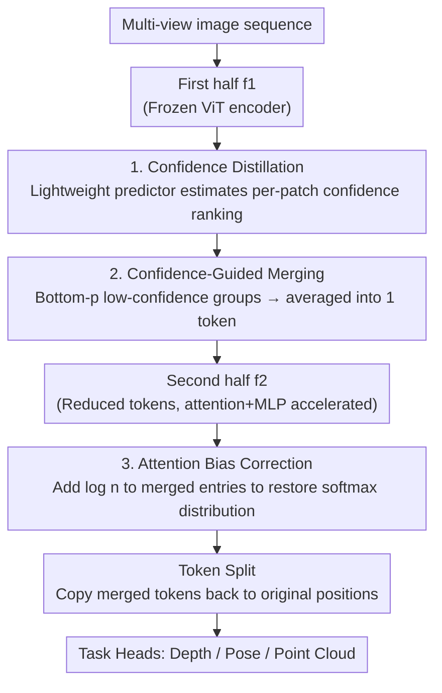

# Co-Me: Confidence Guided Token Merging for Visual Geometric Transformers

**Conference**: CVPR 2026  
**Paper**: [CVF Open Access](https://openaccess.thecvf.com/content/CVPR2026/html/Chen_Co-Me_Confidence_Guided_Token_Merging_for_Visual_Geometric_Transformers_CVPR_2026_paper.html)  
**Code**: https://co-me-tokens.github.io  
**Area**: Model Compression  
**Keywords**: token merging, visual geometric Transformer, inference acceleration, confidence distillation, 3D reconstruction  

## TL;DR
Co-Me equips visual geometric Transformers like VGGT and π3 with a lightweight "confidence predictor." It merges patch tokens that the network deems unimportant (low confidence) into a single token before passing them into the latter half of the network. This accelerates both attention and MLP without retraining or altering the backbone structure, achieving up to 21.5× speedup on VGGT with negligible accuracy loss.

## Background & Motivation
**Background**: Visual geometric Transformers such as VGGT, π3, MapAnything, and DepthAnything 3 can regress camera poses, intrinsics, depth, and point clouds from a set of multi-view images in a single forward pass, transforming traditional iterative 3D reconstruction into a feed-forward process. However, these are typically 1B-parameter ViTs where attention complexity is $O(n^2 d)$ relative to the token count $n$. They become too slow for real-time deployment when sequences are long (dozens to hundreds of frames).

**Limitations of Prior Work**: Existing token acceleration methods are ill-suited for these **dense geometric tasks**. ① Token pruning (e.g., DynamicViT, A-ViT) directly discards tokens; the lost context is precisely what 3D reconstruction requires, leading to continuous performance degradation and requiring retraining—which is impractical for 1B-parameter foundation models. ② Heuristic token merging like ToMe (using feature similarity) or FastVGGT (using feature norm + cosine similarity) only merges tokens within **global attention**. Within FlashAttention-optimized medium-length sequences, global attention occupies only a fraction of runtime, resulting in limited practical speedup; FastVGGT requires nearly 1000 frames to show significant benefits.

**Key Challenge**: The models actually **predict confidence maps themselves** (high confidence corresponds to stable textures and multi-view consistency; low confidence corresponds to sky, reflections, or occlusions that downstream tasks discard). However, during inference, computational power is allocated uniformly to all tokens, spending equal computation on "reliable regions" and "useless background regions."

**Key Insight**: The authors leverage the intuition of human **foveal vision**—high-precision processing for key regions and coarse perception for the periphery. A key observation is that high-confidence regions predicted by the network strongly correspond to areas the ViT "values"; low-confidence regions only provide blurry contextual cues, and merging them minimally affects geometric predictions in high-confidence areas.

**Core Idea**: A distilled lightweight confidence predictor is used to estimate the confidence ranking of each patch early in the inference process. **Selectively merging low-confidence tokens** reduces the computational load for both attention and MLP layers while keeping the backbone model entirely frozen.

## Method

### Overall Architecture
Co-Me splits the backbone network $F$ into two halves, $F = f_2 \circ f_1$ (with the predictor inserted in the middle of the encoder). The process consists of two stages. **Stage 1 (Offline Distillation)**: The backbone is frozen, and a lightweight predictor $f'$ is trained to replicate the **token-level ranking** of the final confidence map $C$ using only intermediate features from $f_1$. **Stage 2 (Inference)**: Input image sequences pass through $f_1$, and the predictor estimates per-patch confidence. A binary merging mask is generated based on these scores; low-confidence token groups are averaged into a single token before entering $f_2$ (reducing token count → accelerating both attention and MLP). Inside $f_2$, attention bias correction is performed. After $f_2$ finishes, tokens are restored (split) to their original shapes for the task heads.

The pipeline speedup stems from "computing fewer tokens." Three contribution nodes correspond to the key designs below. Additionally, an engineering implementation (variable-length FlashAttention kernels, index-based mapping to avoid expensive `Cat` operations, and TensorRT plugins) keeps the additional merging/restoration overhead to approximately 2% of the total network runtime.

### Key Designs

**1. Confidence Distillation: Obtaining "unimportant token" signals early in inference**

Token merging faces a chicken-and-egg problem: determining which token to merge requires confidence scores, but these scores are normally only available after full network inference. The solution is as follows: since intermediate encoder features already contain rich confidence cues, a lightweight network $f'$ is distilled to estimate a per-patch confidence map $C'$ from $f_1$ features, approximating the rank of the final output $C$. **The backbone remains frozen without gradient backpropagation; only $f'$ is trained.** The predictor consists of three modules: an MLP for compact latent space projection, single-head attention for cross-frame patch interaction, and a Conv2D head to suppress spatial noise.

Given the limited capacity of the predictor, authors **train it to learn relative ranking rather than exact values**, which is sufficient for identifying low-confidence tokens. A logistic ranking loss is used instead of MSE:

$$\mathcal{L}(C', C) = \frac{1}{|P|}\sum_{(i,j)\in P} \log\!\big(1 + \exp(C'_j - C'_i)\big), \quad P \sim \text{UniformSubset}(\{(i,j)\mid C_i > C_j\})$$

Pairs of patches where "ground truth $C_i > C_j$" are sampled, and reversals in the predicted ranking are penalized. Training is **completely self-supervised** (using the backbone's own confidence as labels). It converges in ~2000 steps on TartanAir (500k+ images) in under an hour on a single H100 and generalizes to unseen data without fine-tuning.

**2. Confidence-Guided Token Merging & Splitting: Averaging low-confidence groups**

Given a merging ratio $p$, tokens are divided into fixed-size groups (default $3\times3=9$ tokens). The average confidence for each group is calculated. If it falls below the **$p$-th percentile** of all groups in the entire sequence, it is marked for merging. Calculating the percentile over the **entire sequence** allows the merging ratio to vary across frames—frames with high information density undergo less merging, while empty frames are merged more aggressively.

The merging operator is straightforward: for a group $G_i$ of $n$ tokens, if the merge flag $m_i$ is true, the tokens are replaced by their average; otherwise, they are preserved:

$$\text{MergeGrp}(G_i, m_i) = \begin{cases} \frac{1}{n}\sum_{x\in G_i} x & \text{if } m_i \\ G_i & \text{otherwise}\end{cases}$$

This process reduces tokens for $f_2$, accelerating both attention and MLP. After $f_2$, a symmetric **Split** is performed: unmerged groups are returned as-is, while merged tokens are replicated $n$ times back into their original spatial positions. This replication (inspired by ToMeSD) ensures the output shape matches the original network, making it **plug-and-play** for downstream heads. Ablations (H3) show that "averaging" is significantly more robust (over 10× less performance drop) than "random sampling" (Pick-one) or "dropping" (Drop-all).

**3. Attention Bias Correction: Realigning the distorted softmax distribution**

Merging introduces a risk: when $n$ tokens are merged into one, the attention weight originally spread across $n$ entries is compressed into **a single entry**. After softmax normalization, this entry's weight is suppressed, distorting the distribution. An elegant correction is applied: a bias of $\log n$ is added to the attention logit $a_i$ of the merged group, giving $\tilde{a}_i = a_i + \log n$. Because softmax is exponential, adding $\log n$ scales the weight by $n$, recovering the mass contributed by the $n$ original logits:

$$\text{softmax}(\tilde{a}_i) = \frac{e^{a_i + \log n}}{\sum_j e^{a_j}} \approx \sum_{k\in G_i}\frac{e^{a_k}}{\sum_j e^{a_j}}$$

This realigns the merged attention distribution with the original. To minimize overhead, the authors implemented a **variable-length FlashAttention** kernel supporting per-key bias correction, deployed via TensorRT plugins.

## Key Experimental Results

Evaluation spans four backbones (VGGT, π3, MapAnything, DepthAnything 3), three tasks (depth/pose/point cloud), and five datasets. Baselines include an enhanced VGGT⋆ (FlashAttention + FastVGGT memory optimization), ToMeSD, and FastVGGT.

### Main Results: Depth Estimation (Selected from Tab. 1, Latency in ms)

| Backbone/Method | Dataset (frames) | Speedup | L1↓ | δ1.25↑ |
|------|------|------|------|------|
| VGGT | NYUd-v2 (1) | 1.00× | 0.186 | 0.940 |
| ToMeSD0.5 | NYUd-v2 (1) | 0.48× (slower) | 0.221 | 0.925 |
| **Co-Me** | NYUd-v2 (1) | **1.09×** | 0.225 | 0.918 |
| VGGT | KITTI (48) | 1.00× | 4.647 | 0.562 |
| FastVGGT | KITTI (48) | 3.82× | 4.611 | 0.562 |
| **Co-Me** | KITTI (48) | **9.94×** | 4.727 | 0.558 |
| MA | DTU-MVS (32) | 1.00× | 4.59 | 0.965 |
| **Co-Me** | DTU-MVS (32) | **13.3×** | 6.80 | 0.884 |

In single-frame scenarios, where baselines often fail to provide gains, Co-Me still achieves ~1.1× speedup; in multi-view scenarios, Co-Me provides the highest speedup with comparable accuracy.

### Pose and Point Cloud (Selected from Tab. 2/Tab. 3)

| Task | Backbone | Dataset (frames) | Speedup | Key Metric |
|------|------|------|------|------|
| Pose | VGGT | RE10K (128) | **16.2×** | AUCt10 0.903→0.869 |
| Pose | π3 | RE10K (128) | **14.8×** | AUCt10 0.944→0.892 |
| Point Cloud | VGGT | DTU (32) | **7.71×** | Comp. 0.31→0.40, Acc. 0.30→0.31 |
| Point Cloud | π3 | ETH3D (16) | **4.12×** | Accuracy improved over original π3 |

### Ablation Study (Hypotheses H1–H6)

| Hypothesis | Conclusion |
|------|------|
| H1 Speedup grows with sequence length | Reaches 21.5× on VGGT at 512 frames; gains also exist for single frames. |
| H2 vs Similarity merging | At equal speedup, Co-Me has lower error; trade-off curve dominates Merge-by-Sim. |
| H3 Merge vs Drop/Pick | Average-merging degrades performance 10× less than Pick-one/Drop-all. |
| H4 Attention Bias Correction | Without it, DTU depth $\Delta$L1 error increases 4×; correction is critical for accuracy. |
| H5 Edge Deployment | 1.5× speedup (3.5 FPS) on Jetson Thor with MA, approaching real-time. |
| H6 MLP as new bottleneck | With SDPA optimized, MLP dominates runtime; Co-Me accelerates both with ~2% overhead. |

### Key Findings
- **Speedup scales with sequence length**: By saving on $O(n^2)$ attention, returns increase with length, reaching 21.5× on VGGT and 20.4× on π3 at 512 frames.
- **Dataset variance stems from redundancy**: NYUd-v2 and DTU have high multi-view overlap and redundant tokens, leading to negligible loss. KITTI has less spatial overlap, causing more information loss. On ETH3D, Co-Me actually **improved** accuracy by removing low-confidence tokens that introduce noise in wide-baseline reconstruction.
- **MLP is the true bottleneck**: Once attention is optimized via FlashAttention, linear layers consume a significant ratio of runtime. Co-Me reduces tokens for both attention and MLP, explaining its superior speedup over FastVGGT.

## Highlights & Insights
- **"Recycling" internal confidence**: By distilling internal confidence signals that already exist within the model and are discarded downstream anyway, Co-Me provides a signal more aligned with "geometric importance" than ToMe's feature similarity.
- **$\log n$ bias correction is the masterstroke**: Merging violates softmax normalization; adding $\log n$ uses exponential properties to precisely recover the lost mass, reducing error by 4× with a single formula.
- **Training-free and Plug-and-play**: Distillation involves a tiny module trained in < 1 GPU hour, while the backbone remains frozen. Since output shapes are preserved, it applies directly to SOTA geometric backbones.

## Limitations & Future Work
- **Redundancy dependency**: Speedup and accuracy are highly dependent on input redundancy; KITTI-like scenarios with minimal frame overlap suffer more.
- **Limited gains on DA3**: For shallow architectures like DepthAnything 3, speedup is only 2.2–2.7×, suggesting the method is most effective for "deep networks + long sequences."
- **Biased confidence**: Distillation relies on the backbone's own confidence estimates; if the backbone is overconfident in wrong areas (e.g., reflections), Co-Me will inherit this bias.

## Related Work & Insights
- **vs ToMe / ToMeSD**: These rely on cosine similarity for classification; Co-Me uses distilled confidence for 3D reconstruction. H2 shows Co-Me has lower error at equal speedup.
- **vs FastVGGT**: FastVGGT only merges in global attention and needs 1000 frames for significant gains. Co-Me merges for both attention and MLP, providing large gains for medium sequences.
- **vs Pruning (e.g., DynamicViT)**: Pruning drops tokens and lacks robustness for dense tasks while requiring retraining. Co-Me preserves spatial coverage and requires no retraining.

## Rating
- Novelty: ⭐⭐⭐⭐ (Distilling internal confidence + $\log n$ correction; a clever improvement on token merging)
- Experimental Thoroughness: ⭐⭐⭐⭐⭐ (4 backbones, 3 tasks, 5 datasets, 6 ablation hypotheses, edge deployment)
- Writing Quality: ⭐⭐⭐⭐ (Clear structure, excellent diagrams, well-explained motivation)
- Value: ⭐⭐⭐⭐⭐ (Enables 1B-parameter geometric Transformers to approach real-time performance through non-intrusive acceleration)

<!-- RELATED:START -->

## Related Papers

- [\[CVPR 2026\] Saliency-Driven Token Merging for Vision Transformers](saliency-driven_token_merging_for_vision_transformers.md)
- [\[CVPR 2026\] MeToM: Metadata-Guided Token Merging for Efficient Video LLMs](metom_metadata-guided_token_merging_for_efficient_video_llms.md)
- [\[CVPR 2026\] HTTM: Head-wise Temporal Token Merging for Faster VGGT](httm_head-wise_temporal_token_merging_for_faster_vggt.md)
- [\[CVPR 2026\] LiteVGGT: Boosting Vanilla VGGT via Geometry-aware Cached Token Merging](litevggt_boosting_vanilla_vggt_via_geometry-aware_cached_token_merging.md)
- [\[CVPR 2026\] Merge3D: Efficient 3D Multimodal LLMs via Joint 2D-3D Token Merging](merge3d_efficient_3d_multimodal_llms_via_joint_2d-3d_token_merging.md)

<!-- RELATED:END -->
