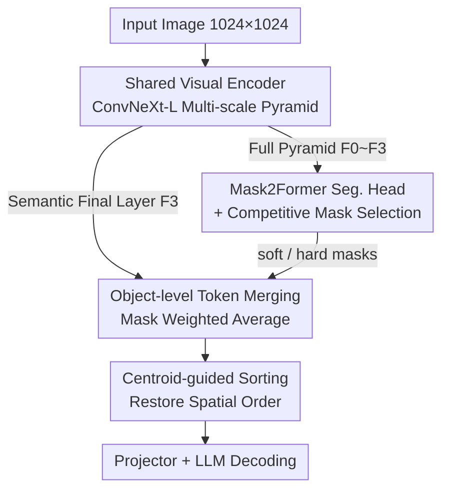

# CORE: Compact Object-centric REpresentations as a New Paradigm for Token Merging in LVLMs

**Conference**: CVPR 2026  
**Paper**: [CVF Open Access](https://openaccess.thecvf.com/content/CVPR2026/html/Lei_CORE_Compact_Object-centric_REpresentations_as_a_New_Paradigm_for_Token_CVPR_2026_paper.html)  
**Code**: https://github.com/jingyulei/CORE  
**Area**: Model Compression  
**Keywords**: Visual Token Compression, Object-centric Representation, LVLM Acceleration, Token Merging, Centroid Sorting  

## TL;DR
CORE shifts the visual token compression of LVLMs from "merging individual tokens by feature similarity" to "merging by objects." By utilizing a built-in segmentation head to generate masks for each object, it performs weighted averaging of tokens within the same object into a single compact token, combined with centroid sorting to preserve spatial order. It achieves SOTA performance in fixed-rate compression across six benchmarks; under extreme compression, it maintains 97.4% of the baseline performance while retaining only 2.2% of tokens.

## Background & Motivation
**Background**: Large Vision-Language Models (LVLMs) split images into patches for ViT input, where the number of tokens grows quadratically with resolution (a 1024×1024 image with 16×16 patches yields 4096 tokens). Since self-attention has $O(N^2)$ complexity, the computational and memory overhead for downstream LLMs becomes unbearable, leading to various visual token compression methods.

**Limitations of Prior Work**: The authors categorize existing methods as **token-centric** and point out their lack of a "high-level semantic perspective": ① Similarity-based methods (e.g., ToMe) merge by feature affinity, often incorrectly merging semantically different regions with similar textures and causing "boundary overflow" (mixing object edges with backgrounds); ② Attention-based methods retain tokens based on attention scores, but the remaining tokens may still be redundant, and decoder-side pruning requires access to attention scores that FlashAttention does not explicitly compute; ③ Query-based methods filter tokens using text queries, which may lose full scene context and fail with ambiguous queries.

**Key Challenge**: Compression decisions occur at the "pixel/patch level," whereas the units that truly carry semantics are "objects." Merging at the wrong granularity leads to either incorrect merging of different objects or redundant tokens within the same object, making it difficult to balance accuracy and compression rate.

**Goal**: To find a compression granularity that significantly reduces tokens without destroying semantic and spatial structures.

**Key Insight**: Mimic human perception—humans understand scenes "object by object." Collapsing each object into a single compact token eliminates intra-object redundancy and naturally avoids inter-object mis-merging.

**Core Idea**: Use a built-in segmentation prior to decompose an image into object masks, perform **object-centric token merging**, and then use centroid sorting to restore spatial sequence—replacing "feature similarity" with "semantic identity" as the merging criterion.

## Method

### Overall Architecture
CORE is an end-to-end architecture following the LLaVA-NeXT paradigm but modifies the visual side to use "one shared encoder + one segmentation head + one language head." For an input image: the shared ConvNeXt-L encoder extracts a multi-scale feature pyramid; the full pyramid is fed into a Mask2Former segmentation head to generate object masks, while the semantically richest final-layer feature $F_3$ is reserved as the visual input for the language side; masks undergo competitive filtering to guide the per-object merging of $F_3$, resulting in a set of object-centric tokens; these tokens are spatially sorted by their centroids and passed through a projector to the LLM for autoregressive answer generation. The key design is that the **visual encoder is shared across two paths**, keeping the overhead of segmentation very low.

### Key Designs

**1. End-to-End Architecture with Shared Visual Encoder: Making Segmentation Almost Free**

Naively, "segmenting before compressing" would require an independent segmentation backbone, effectively adding another heavy model to the LVLM. CORE uses **one ConvNeXt-L to serve both segmentation and language tasks concurrently**. There is a technical conflict: the original LLaVA-NeXT uses CLIP ViT-L/14, which outputs a single-scale feature map, while Mask2Former requires a multi-scale pyramid. CORE replaces ViT with OpenCLIP’s ConvNeXt-L—as a hierarchical CNN, it naturally outputs a pyramid of $F_0,\dots,F_3$ (1/4 to 1/32 resolution, channels 192/384/768/1536) and is pre-trained with CLIP contrastive objectives, meaning its features are already aligned with text embedding spaces. The full pyramid goes to the segmentation head, and $F_3$ goes to the language side. Efficiency analysis confirms this: the entire visual module of CORE (ConvNeXt backbone 1.44T + Mask2Former head 0.30T = 1.74T FLOPs) is cheaper than the original CLIP ViT-L/14 (1.91T), with parameters reduced from 303M to 237M.

**2. Object-level Token Merging + Competitive Mask Selection: Collapsing "One Object" into "One Token"**

This is the core of CORE. Mask2Former uses $N$ learnable object queries in $L=9$ Transformer decoder layers to identify objects, outputting probability masks after a sigmoid function. Instead of standard confidence thresholds + NMS, CORE uses a **pixel-wise competition strategy**: for each pixel position, it identifies the mask with the highest probability; only queries that achieve the highest probability for at least one pixel are retained as valid masks. This filters two types of outputs: ① A set of overlapping soft masks (retaining original probabilities), ② A set of mutually exclusive hard masks (each pixel hard-assigned to the query with the highest probability).

Given the valid mask set $\mathcal{P}_{\text{valid}}=\{P_1,\dots,P_N\}$, the semantic final layer $F_3$ is flattened into $F\in\mathbb{R}^{HW\times C}$ where each token is $f_i\in\mathbb{R}^C$. For each mask $P_n$, it is flattened into a weight vector $\omega_n\in\mathbb{R}^{HW}$, and a **weighted average** is performed across the feature map to obtain a single token for the object:

$$t_n=\frac{\sum_{i=1}^{HW}\omega_{n,i}\cdot f_i}{\sum_{i=1}^{HW}\omega_{n,i}}$$

With soft masks, $\omega_{n,i}\in[0,1]$ represents probability, gently handling ambiguous boundaries and overlaps. With hard masks, $\omega_{n,i}\in\{0,1\}$, and merging simplifies to an arithmetic mean of selected features, resulting in clear, mutually exclusive "one-object-one-token" mapping. Hard masks consistently outperform soft masks in experiments because their mutual exclusivity prevents confusion in counting and spatial relationship tasks.

**3. Centroid-guided Sorting: Don't Lose Spatial Order after Merging**

Merging objects into discrete tokens causes the "sequence" to no longer correspond to spatial positions, which hurts the LLM's spatial reasoning. CORE calculates a **centroid position** for each mask and sorts tokens in ascending order of their centroids:

$$c_n=\frac{\sum_{i=1}^{HW}\omega_{n,i}\cdot i}{\sum_{i=1}^{HW}\omega_{n,i}}$$

where $i$ is the token index in raster scan order (top-to-bottom, left-to-right). Thus, $c_n$ is the weighted average of pixel positions, or the "center of gravity in the scanning sequence." Sorting the merged tokens $T'$ by $\{c_1,\dots,c_N\}$ yields a spatially coherent final representation $T$ for the projector.

**4. Constant Rate Merging Strategy: Fixed-length Output via Area Sorting**

The previous steps yield a token count that varies with the number of objects (adaptive rate). For scenarios requiring **fixed token counts** (batch processing or fair comparison), CORE uses a strategy based on hard masks: assuming objects with more tokens (larger area) have higher redundancy, it merges large objects first by sorting them in **descending order of area**. Within each object, tokens are merged in raster scan order until the target token count is reached.

### Loss & Training
Training follows the two-stage LLaVA paradigm. The **visual perception module (ConvNeXt-L + Mask2Former) remains frozen throughout**, initialized with OMG-Seg weights. Stage 1 (Feature Alignment): Backbone, seg-head, and LLM are frozen; only the projector is trained using the LLaVA 558K dataset with standard autoregressive loss $\mathcal{L}_{\text{text}}$. Stage 2 (Visual Instruction Tuning): The LLM is fine-tuned via LoRA ($r=512$, $\alpha=256$, dropout 0.05) alongside the projector using LLaVA-NeXT high-quality instruction data. InternLM2-7B is used as the language decoder, and the projector is a two-layer GELU MLP (1536→4096).

## Key Experimental Results

### Main Results
Fixed-rate compression comparison across six benchmarks (POPE / MME / MMBench-CN / ScienceQA-IMG / SEED-IMG / MMMU). Baseline is the full-token CORE (1024 tokens, 100%).

| Method | tokens | POPE | MME | MMB-CN | SQA-I | SEED-I | MMMU |
|------|--------|------|-----|--------|-------|--------|------|
| LLaVA-NeXT-7B | 2880 | 86.8 | 1511.8 | 57.3 | 67.5 | 70.2 | 35.1 |
| CORE (vanilla) | 1024 | 86.4 | 1626.7 | 61.0 | 68.3 | 69.6 | 36.8 |
| VisionZip | 640 | 86.0 | 1493.4 | 58.1 | 68.1 | 66.7 | 34.7 |
| DivPrune | 640 | 86.9 | 1469.7 | 57.3 | 67.8 | 67.6 | 36.9 |
| **CORE** | 640 | **86.9** | **1521.6** | **60.0** | **69.2** | 67.6 | **38.3** |
| VisionZip | 160 | 74.9 | 1327.8 | 50.4 | 67.9 | 58.3 | 36.1 |
| DivPrune | 160 | 80.0 | 1356.6 | 53.7 | 67.1 | 62.5 | 36.4 |
| **CORE** | 160 | **86.0** | **1405.3** | **56.7** | **69.8** | **64.7** | **36.6** |

The fewer the tokens, the more pronounced CORE's advantage. At 160 tokens, CORE scores 86.0 on POPE compared to VisionZip's 74.9. Notably, on ScienceQA-IMG, CORE (160/320/640) exceeds the full-token baseline, which the authors attribute to the "regularization effect" of object-centric merging.

### Acceleration / Efficiency
Total inference time for the POPE dataset (single A800):

| Method | tokens | Total Time ↓ | Speedup ↑ | POPE Score ↑ |
|------|--------|---------|--------|------------|
| LLaVA-NeXT-7B | 2880 | 2293s | – | 86.8 |
| FastV | 160 | 1792s | 1.28× | 66.5 |
| SparseVLM | 160 | 1895s | 1.21× | 76.6 |
| **CORE** | 160 | **1122s** | **2.04×** | **86.0** |

Efficiency gains are even more significant under adaptive compression (avg tokens reduced from 2880 to 63.1):

| Config | tokens | FLOPs ↓ | KV Cache ↓ | GPU Memory ↓ | POPE ↑ |
|------|--------|---------|-----------|-----------|--------|
| LLaVA-NeXT-7B | 2880 | 41.7T | 1440.0MB | 16.7GB | 86.8 |
| CORE-FP16 | 63.1 | 2.6T | 7.9MB | 15.1GB | 85.9 |
| CORE-4bit | 63.1 | 2.6T | 7.9MB | **5.5GB** | 85.6 |

FLOPs are reduced to 1/16, and KV Cache is reduced by ~182×.

### Ablation Study
**soft vs hard masks** (Dynamic adaptive task, compared with other object-centric VLMs like Slot-MLLM):

| Method | POPE | MME | MMB-CN | SQA-I | SEED-I | MMMU |
|------|------|-----|--------|-------|--------|------|
| Slot-MLLM | 79.8 | 1202.6 | – | – | 47.4 | 28.0 |
| CORE (soft mask) | 83.6 | 1339.1 | 53.6 | 69.0 | 60.3 | 37.0 |
| **CORE (hard mask)** | **85.6** | **1396.7** | **55.3** | **69.9** | **63.1** | **38.7** |

### Key Findings
- **Hard masks are consistently superior to soft masks**: Soft masks allow the same object to be represented by multiple tokens, introducing ambiguity for the LLM.
- **Object-centric merging provides regularization**: CORE often outperforms its full-token baseline by forcing the model to focus on semantically coherent objects.
- **Robustness in extreme compression**: The adaptive mode maintains 97.4% baseline performance while using only 2.2% of tokens.
- **Conservative degradation for OOD/Occlusion**: When encountering unknown objects or occlusions, CORE tends to preserve more tokens rather than merging incorrectly, trading bits for information integrity.

## Highlights & Insights
- **Shifting granularity from patch to object** is the most significant contribution; it bypasses the "semantic blindness" of token-centric methods.
- **The shared encoder is a critical engineering decision**: Using one ConvNeXt-L for both paths makes high-quality segmentation virtually free.
- **Centroid sorting is a elegant design**: It restores spatial reasoning capacity to unordered token sets at near-zero cost.
- **Competitive mask selection** eliminates the need for manual thresholding/NMS and naturally produces hard/soft mask options.

## Limitations & Future Work
- **Computational bottlenecks**: Despite lower theoretical FLOPs, memory bandwidth bottlenecks in the visual module prevent real-world speedup from reaching theoretical maximums; future work will involve CUDA kernel optimization.
- **Predefined categories as a glass ceiling**: Mask2Former is limited to 133 classes; OOD objects are decomposed into known "parts," which might affect reliability in open-world scenarios.
- **Cascaded errors**: Merging quality depends entirely on the frozen segmentation head; segmentation errors propagate directly to the LLM.

## Related Work & Insights
- **vs ToMe (Similarity-based)**: ToMe merges by feature affinity, causing boundary overflow; CORE uses semantic identity, performing better in low-light or dense multi-object scenes.
- **vs VisionZip / FastV (Attention-based)**: These rely on attention scores but often retain redundant tokens within objects; CORE eliminates intra-object redundancy natively.
- **vs CDPruner / MMTok (Query-based)**: Query-based filtering may lose context; CORE preserves a compact object-centric representation of the full scene.
- **vs Slot-MLLM (Object-centric counterpart)**: CORE's hard mask variant significantly outperforms Slot-MLLM across all benchmarks.

## Rating
- Novelty: ⭐⭐⭐⭐⭐ Standard-shifting perspective by elevating compression granularity from patches to objects.
- Experimental Thoroughness: ⭐⭐⭐⭐⭐ Comprehensive coverage across metrics, compression rates, and efficiency analyses.
- Writing Quality: ⭐⭐⭐⭐ Clear motivation and methodology; some algorithm details are deferred to supplements.
- Value: ⭐⭐⭐⭐⭐ High practical value for deployment, especially with the 182× reduction in KV Cache.

<!-- RELATED:START -->

## Related Papers

- [\[CVPR 2026\] Saliency-Driven Token Merging for Vision Transformers](saliency-driven_token_merging_for_vision_transformers.md)
- [\[CVPR 2026\] MeToM: Metadata-Guided Token Merging for Efficient Video LLMs](metom_metadata-guided_token_merging_for_efficient_video_llms.md)
- [\[CVPR 2026\] HTTM: Head-wise Temporal Token Merging for Faster VGGT](httm_head-wise_temporal_token_merging_for_faster_vggt.md)
- [\[CVPR 2026\] Co-Me: Confidence Guided Token Merging for Visual Geometric Transformers](co-me_confidence_guided_token_merging_for_visual_geometric_transformers.md)
- [\[CVPR 2026\] LiteVGGT: Boosting Vanilla VGGT via Geometry-aware Cached Token Merging](litevggt_boosting_vanilla_vggt_via_geometry-aware_cached_token_merging.md)

<!-- RELATED:END -->
