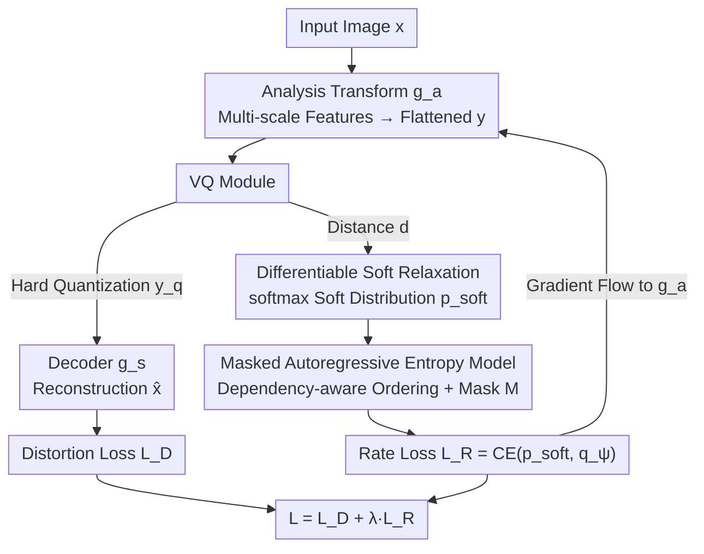

# Differentiable Vector Quantization for Rate-Distortion Optimization of Generative Image Compression

**Conference**: CVPR 2026  
**Paper**: [CVF Open Access](https://openaccess.thecvf.com/content/CVPR2026/html/Jiang_Differentiable_Vector_Quantization_for_Rate_Distortion_Optimization_of_Generative_Image_Compression_CVPR_2026_paper.html)  
**Code**: https://github.com/CVL-UESTC/RDVQ  
**Area**: Model Compression / Generative Image Compression  
**Keywords**: Vector Quantization, Rate-Distortion Optimization, Differentiable Relaxation, Entropy Model, Ultra-low Bitrate Compression  

## TL;DR
RDVQ replaces the non-differentiable nearest neighbor indexing in vector quantization with a "distance-aware soft distribution," allowing rate loss gradients to flow back to the encoder. This achieves the first end-to-end rate-distortion joint optimization for VQ compression. Combined with a masked autoregressive entropy model, it obtains superior perceptual quality at ultra-low bitrates with less than 20% of the parameters of similar methods (saving up to 75.71% bitrate in DISTS on DIV2K-val compared to RDEIC).

## Background & Motivation
**Background**: The standard paradigm for learned image compression is the "transform autoencoder + quantizer + entropy model" triplet, trained end-to-end by minimizing the Rate-Distortion (RD) Lagrangian $\mathcal{L}=\lambda R + D(x,\hat{x})$. At ultra-low bitrates, Generative Image Compression (GIC) introduces generative priors like GANs or diffusion to ensure reconstructed images "look real" rather than blurred. Quantizers follow two paths: Scalar Quantization (SQ), which rounds elements individually, and Vector Quantization (VQ), which maps groups of features to discrete atoms in a codebook.

**Limitations of Prior Work**: The advantage of SQ is its inherent differentiability—using noise or Straight-Through Estimators (STE) allows gradients from both rate and distortion objectives to backpropagate to the encoder. however, it quantizes element-wise, ignoring inter-channel dependencies and leading to structural degradation under aggressive compression. Conversely, VQ codebook atoms can encode joint structural and semantic patterns, offering better perceptual fidelity for ultra-low bitrates. However, its nearest neighbor assignment $y_{ind}(b,l)=\arg\min_k\|y_{b,l}-\mathcal{C}_k\|^2$ is discrete and non-differentiable.

**Key Challenge**: The rate term $R=\mathbb{E}_{\hat{y}}[-\log_2 q_\psi(\hat{y})]$ is defined on discrete indices. The path from the encoder output $y$ to $R$ is truncated by the non-differentiable $\arg\min$ of the nearest neighbor search. Consequently, the latent distribution (prior $p$) induced by the encoder is nearly unconstrained by the bitrate. The entropy model $q_\psi$ only passively fits a fixed distribution and cannot inversely shape it—representation learning and entropy modeling are completely decoupled, preventing true end-to-end RD optimization. Previous VQ methods relied on indirect heuristics for rate control, such as adjusting codebook size, selective transmission, or uniform coding, which yield suboptimal results.

**Core Idea**: During training, replace the hard assignment in the "rate calculation" branch with a **differentiable, distance-aware soft distribution**, while keeping standard hard VQ for reconstruction and entropy coding. This allows the rate gradient to flow directly back to the encoder, enabling the entropy loss to optimize both the prior $p$ and the entropy model $q$. This transforms the traditionally implicit/uniform VQ prior into a learnable, entropy-aware prior.

## Method

### Overall Architecture
The core design of RDVQ is the **decoupling of the "reconstruction/encoding path" and the "rate optimization path" during training**. Standard hard vector quantization is used for reconstruction and entropy coding, while a differentiable soft relaxation branch is introduced only for rate estimation.

The process is as follows: The analysis transform $g_a$ extracts multi-scale latent features from the input image and flattens them into a unified sequence $y=g_a(x)$. The VQ module simultaneously produces three outputs $y_q, y_{ind}, p_{\text{soft}}=\mathrm{VQ}(y,\mathcal{C})$—the hard quantized embedding $y_q$ is used for reconstruction, the discrete index $y_{ind}$ for entropy coding, and the relaxed distribution $p_{\text{soft}}$ **only during training** for rate estimation. The decoder reconstructs $\hat{x}=g_s(y_q)$. The rate loss is calculated as the cross-entropy between the relaxed distribution $p_{\text{soft}}$ and the entropy model prediction $q_\psi$, enabling gradients to flow back to the encoder $g_a$. The entropy model itself is a masked Transformer that serves for rate estimation/entropy coding and acts as a generative predictor to support test-time index completion (rate control). During inference, the relaxation is removed, reverting to standard hard VQ.

### Key Designs

**1. Differentiable Soft Relaxation: Connecting the Truncated rate→encoder Gradient Path**

This is the central contribution of the paper. Standard VQ uses $\arg\min$ for hard assignment, where the gradient is truncated. RDVQ first calculates the squared distances $d_{b,l,k}=\|y_{b,l}-\mathcal{C}_k\|^2$ between the encoder output $y\in\mathbb{R}^{B\times L\times C}$ and each atom in the codebook $\mathcal{C}\in\mathbb{R}^{K\times C}$, then converts these into a soft posterior distribution with a tunable temperature:

$$p_{\text{soft}}(b,l,k)=\operatorname{softmax}_k\!\left(-\frac{d_{b,l,k}}{\tau}\right)$$

As $\tau\to 0$, $p_{\text{soft}}$ converges to a one-hot hard assignment, but it remains differentiable for finite $\tau$. A proxy rate (relaxed rate) for training is defined based on this:

$$R_{\text{soft}}=\mathbb{E}_{b,l}\!\left[-\sum_{k=1}^{K}p_{\text{soft}}(b,l,k)\,\log q_\psi(b,l,k)\right]$$

Crucially, $\partial R_{\text{soft}}/\partial y\neq 0$—this soft cross-entropy acts as a differentiable proxy for the actual coding cost, allowing the rate objective to **directly shape the encoder representation**, encouraging features that are more predictable under the entropy model. Removing this relaxation (w/o Relaxation) in the ablation study causes the rate signal to be weak and unstable, leading to a performance collapse at higher bitrates.

**2. Dual-path Decoupling: Hard Quantization for Reconstruction, Soft Distribution for Rate**

While soft relaxation is beneficial, using it for reconstruction would destroy the structural fidelity provided by VQ discretization and create a mismatch during inference. RDVQ decouples these paths: reconstruction **always** uses the hard quantized embedding $y_q$, and entropy coding uses discrete indices $y_{ind}$. The soft distribution $p_{\text{soft}}$ **only** participates in rate estimation during training. This ensures that the relaxation is purely a training proxy, maintaining consistency between training and deployment.

**3. Masked Autoregressive Entropy Model: Dependency-Aware Ordering**

To make $R_{\text{soft}}$ effective, the entropy model must accurately characterize the conditional distribution of codebook indices. Encoder features are multi-scale, possessing both spatial dependencies within scales and hierarchical dependencies across scales. RDVQ constructs a **dependency-aware token order**: spatial ordering within each scale and "coarse-to-fine" ordering across scales. This ensures fine-scale tokens are conditioned on preceding coarse-scale tokens, forming a unified sequence vector $o$.

An attention mask $M=(o>o^\top)$ is constructed based on $o$, allowing each token to attend only to its valid predecessors. The prediction probability $q_\psi$ serves three roles: rate estimation during training, entropy coding during inference, and **autoregressively completing remaining indices** given a prefix. This last point allows RDVQ to support test-time bitrate adjustment by varying the prefix length without retraining.

### Loss & Training
The total loss is the RD Lagrangian $\mathcal{L}=L_D+\lambda\cdot L_R$, where $L_D$ uses standard perceptual objectives (GAN + LPIPS) and $L_R=\mathrm{CE}(p_{\text{soft}},q_\psi)$. The autoencoder is modified from LlamaGen’s VQ-VAE. Training proceeds in three stages: (i) pre-training the autoencoder and codebook on ImageNet using reconstruction loss; (ii) pre-training the entropy model with the rate objective; (iii) joint fine-tuning of the entire model, followed by high-resolution adaptation on OpenImage/DF2K. RDVQ is **trained from scratch** and does not rely on massive pre-trained backbones.

## Key Experimental Results

### Main Results
Evaluations were conducted on Kodak, CLIC2020-test, and DIV2K-val. Perceptual metrics include DISTS, LPIPS, FID (referenced), and CLIPIQA (no-reference). RDVQ achieved SOTA results in DISTS and CLIPIQA across all datasets.

| Dimension | RDVQ | Base Baseline | Note |
|-----------|------|---------------|------|
| Bitrate savings vs RDEIC (DISTS, DIV2K-val) | Max −75.71% | RDEIC | Significant bitrate reduction at same DISTS |
| Bitrate savings vs RDEIC (LPIPS, DIV2K-val) | Max −37.63% | RDEIC | Significant bitrate reduction at same LPIPS |
| Parameters | 251.9M | StableCodec / DLF, etc. | < 20% of most baselines |
| 2K Inference Speed | 1.3 s (RTX 4090) | — | Balanced lightweight and speed |
| Training Dependency | From scratch (GAN+LPIPS) | Most rely on Diffusion/ViT | No large pre-trained backbones |

### Ablation Study
Comparison on DIV2K-val (Lower is better for DISTS / LPIPS / FID):

| Configuration | bpp ↓ | DISTS ↓ | LPIPS ↓ | FID ↓ | Note |
|---------------|-------|---------|---------|-------|------|
| RDVQ (full) | 0.0247 | 0.1005 | 0.2321 | 19.96 | Full model |
| w/o Relaxation | 0.0464 | 0.2147 | 0.5031 | 86.93 | No relaxation; performance collapses even at higher bitrate |
| K-means VQ | 0.0247 | 0.1253 | 0.2831 | 28.08 | Heuristic rate control via codebook size; worse quality |

### Key Findings
- **Soft relaxation is vital**: Removing it results in a comprehensive degradation of DISTS/LPIPS/FID (FID 19.96 → 86.93), as the rate gradient can only backpropagate weakly through the entropy model.
- **Joint RD Optimization > Heuristic Rate Control**: K-means VQ performs worse at the same bpp, showing that adjusting codebook size cannot fully eliminate redundancy in index distributions.
- **RD Optimization Reshapes Representations**: As the bitrate decreases, encoder features prioritize smooth low-frequency structures and suppress high-frequency details; codebook usage concentrates on representative atoms.
- **Stable Test-time Bitrate Adjustment**: RDVQ-Adj uses prefix transmission and autoregressive completion, maintaining a smooth RD curve across 0.02–0.32 bpp.

## Highlights & Insights
- **Relaxing only the rate branch is an elegant solution**: It bypasses the VQ non-differentiability problem without modifying the hard quantization needed for reconstruction and coding, resulting in zero train-test gap.
- **Triple-role entropy model**: The same masked Transformer handles rate estimation, entropy coding, and prefix completion. Because the predictor is coupled with the RD-optimized index distribution, entropy calibration is inherently better.
- **Dependency-aware ordering**: Explicitly encoding multi-scale structures into the order $o$ and mask $M$ is a valuable technique for any autoregressive token modeling that seeks to preserve spatial/scale causality.
- **Lightweight efficiency**: With only 251.9M parameters and no reliance on diffusion/ViT pre-training, RDVQ outperforms foundation-model methods in DISTS/CLIPIQA, proving the value of explicit rate modeling.

## Limitations & Future Work
- Test-time bitrate adjustment is only smooth within a **limited range** (approx. 0.02–0.32 bpp). Rates outside this range may require retraining.
- Soft relaxation is used only for training; the sensitivity of the temperature parameter $\tau$ and its approximation error relative to hard quantization require further exploration (detailed in the supplement).
- The evaluation focuses on perceptual quality for natural images; performance on distortion-oriented metrics (PSNR) and non-natural images (documents, UI) is less discussed.
- Future work could apply this framework to transform existing VQ image tokenizers into efficient compression models by adding entropy-aware learning.

## Related Work & Insights
- **vs SQ methods (MS-ILLM / StableCodec)**: SQ is differentiable but lacks structural modeling. RDVQ retains VQ's structural encoding while gaining SQ's differentiable rate optimization.
- **vs Hybrid SQ-VQ (DLF / RDEIC)**: These use parallel SQ branches for rate modeling. RDVQ achieves this within the VQ framework itself, making it more lightweight.
- **vs Heuristic VQ Rate Control (K-means VQ / UIGC)**: Heuristics do not allow the rate objective to differentiably shape the encoder. RDVQ makes the prior learnable and entropy-aware, leading to superior quality at identical bitrates.

## Rating
- Novelty: ⭐⭐⭐⭐⭐ Cleanly solves VQ non-differentiability by relaxing only the rate estimation branch.
- Experimental Thoroughness: ⭐⭐⭐⭐ Strong results across multiple datasets, though PSNR-oriented metrics are omitted.
- Writing Quality: ⭐⭐⭐⭐⭐ Clear explanations of the gradient path and path decoupling.
- Value: ⭐⭐⭐⭐⭐ Outperforms foundation models with a lightweight, from-scratch design; bridges tokenization and compression.

<!-- RELATED:START -->

## Related Papers

- [\[ICLR 2026\] Mixing Importance with Diversity: Joint Optimization for KV Cache Compression in Large Vision-Language Models](../../ICLR2026/vlm_efficiency/mixing_importance_with_diversity_joint_optimization_for_kv_cache_compression_in_.md)
- [\[CVPR 2026\] Adapting Lightweight Image-based Counting Models for Video Crowd Counting](adapting_lightweight_image-based_counting_models_for_video_crowd_counting.md)
- [\[CVPR 2026\] MM-SeR: Multimodal Self-Refinement for Lightweight Image Captioning](mm-ser_multimodal_self-refinement_for_lightweight_image_captioning.md)
- [\[CVPR 2026\] VQRAE: Representation Quantization Autoencoders for Multimodal Understanding, Generation and Reconstruction](vqrae_representation_quantization_autoencoders_for_multimodal_understanding_gene.md)
- [\[CVPR 2026\] Curvature-Aware Zeroth-Order Optimization for Memory-Efficient Test-Time Adaptation](curvature-aware_zeroth-order_optimization_for_memory-efficient_test-time_adaptat.md)

<!-- RELATED:END -->
