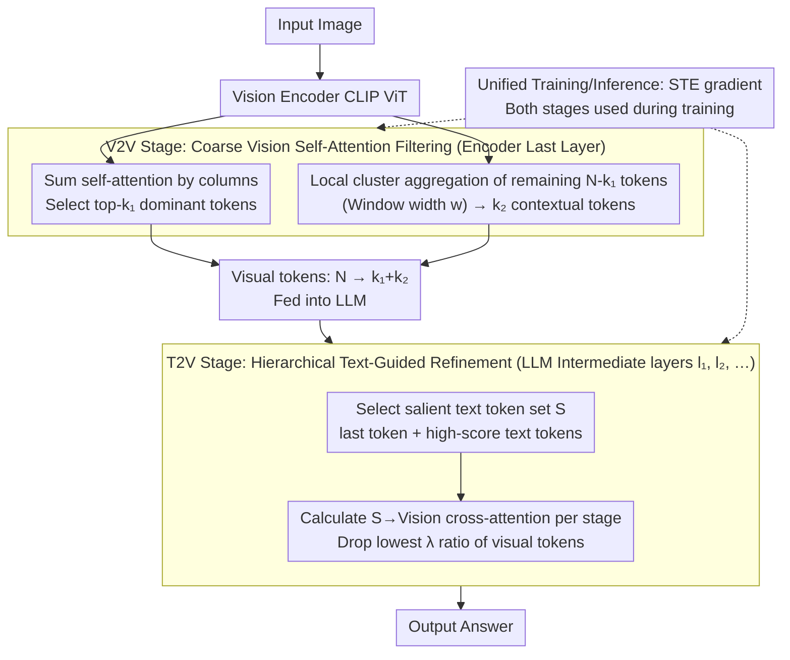

# DUET-VLM: Dual Stage Unified Efficient Token Reduction for VLM Training and Inference

**Conference**: CVPR2026  
**arXiv**: [2602.18846](https://arxiv.org/abs/2602.18846)  
**Code**: [https://github.com/AMD-AGI/DUET-VLM](https://github.com/AMD-AGI/DUET-VLM)  
**Area**: Multimodal VLM  
**Keywords**: VLM token compression, visual token redundancy, dual-stage token pruning, attention-guided aggregation, hierarchical pruning

## TL;DR
The DUET-VLM framework introduces a dual-stage visual token compression approach: the first stage selects dominant tokens within the vision encoder via V2V self-attention and aggregates the remaining tokens into contextual tokens using attention-guided local clustering; the second stage performs hierarchical pruning of visual tokens within the LLM using T2V cross-attention. On LLaVA-1.5-7B, it achieves 67% token reduction while maintaining 99%+ accuracy, 89% reduction with 97%+ accuracy, and reduces training time by 31%.

## Background & Motivation

1. **Background**: VLMs (e.g., LLaVA, InternVL) rely on a large number of visual tokens to transfer image information to the LLM. However, visual tokens exhibit significant redundancy, as many tokens correspond to background or repetitive texture areas rather than semantic cores.
2. **Limitations of Prior Work**: Existing token compression methods are **one-sided**, focusing either only on the vision encoder side (VisionZip, HiRED) or only on the LLM side (FastV, PyramidDrop), failing to utilize information from both sides for optimal compression.
3. **Key Challenge**: Vision-only methods lack text-guided signals and cannot identify which visual tokens are truly relevant to the current query; language-only methods perform post-processing within the LLM, already wasting computational resources in the initial layers.
4. **Goal**: To design a unified dual-stage framework for complementary token compression both within the vision encoder and the LLM, applicable to both training and inference.
5. **Key Insight**: Coarse-grained compression is performed using self-attention between visual tokens (V2V), followed by fine-grained pruning using cross-attention from text to vision (T2V).
6. **Core Idea**: The V2V stage preserves spatial context through attention-guided local cluster aggregation (clustering within a fixed width $w$ instead of global averaging); the T2V stage gradually drops low-relevance visual tokens through hierarchical pruning.

## Method

### Overall Architecture
DUET-VLM addresses visual token redundancy by employing a complementary approach across both the vision and language components rather than focusing on a single side. The pipeline consists of two stages: images first enter the vision encoder (e.g., CLIP ViT), where the first V2V (Vision-to-Vision) compression stage occurs in the final layer to reduce the original $N$ patch tokens. After these tokens enter the LLM, a second T2V (Text-to-Vision) compression stage is performed across several intermediate decoder layers, further pruning visual tokens unrelated to the query based on textual guidance. Both stages utilize the model's inherent attention mechanisms without introducing extra networks, allowing the same logic to be applied to both training and inference (using a straight-through estimator to enable end-to-end training of discrete selection operations).

### Key Designs

**1. V2V Stage: Coarse Filtering inside the Vision Encoder via Self-Attention**

The first compression stage occurs in the final layer of the vision encoder. The goal is to remove redundant background and repetitive texture tokens without relying on text signals. Visual tokens are categorized into two types. The first are **dominant tokens**: by summing the columns of the self-attention matrix to determine the "attention received" by each token, the top-$k_1$ tokens are retained as global semantic landmarks. The remaining $N-k_1$ tokens are not simply discarded but merged into $k_2$ **contextual tokens** via **attention-guided local cluster aggregation**. This uses cluster centers as anchors to perform weighted averaging of neighbors within a fixed window width $w$. Restricting aggregation to a local window ensures that merged tokens are spatially and semantically similar, preventing information dilution seen in global averaging methods like VisionZip. The token count is reduced from $N$ to $k_1+k_2$.

**2. T2V Stage: Hierarchical Refinement inside the LLM via Text-to-Vision Attention**

Tokens entering the LLM still contain redundancy relative to the specific "question being asked." DUET-VLM selects a set $S$ of **salient text tokens**, including the sequence's last token (acting as an attention sink) and tokens with high attention scores. In designated intermediate layers ($l_1, l_2, \ldots$) of the LLM, the model progressively prunes visual tokens. Each stage calculates the T2V cross-attention scores between text tokens in $S$ and current visual tokens, dropping the lowest $\lambda$ proportion. This multi-stage approach avoids premature pruning in shallow layers where token relationships are not yet fully resolved.

**3. Unified Training and Inference Token Reduction**

Unlike methods that only compress during inference (e.g., FastV, PyramidDrop), DUET-VLM applies the same dual-stage compression during training. By reducing the number of tokens fed into the LLM, it lowers FLOPs and memory consumption. To handle the non-differentiable nature of discrete token selection, a straight-through estimator (STE) is used, allowing gradients to flow back to both selected and discarded tokens, supporting end-to-end training and achieving a 31% reduction in training time.

### Loss & Training
- Standard autoregressive language modeling loss, consistent with LLaVA.
- Dual-stage token compression is applied directly during training without extra distillation or auxiliary losses.
- Parameters $k_1, k_2, w$ for V2V and $\lambda$ and pruning layers for T2V are treated as hyperparameters.

## Key Experimental Results

### Main Results — LLaVA-1.5-7B Inference

| Method | Token Reduction | Accuracy Maintenance | Remarks |
|------|-------------|---------|------|
| FastV | 50%↓ | ~98% | LLM-only pruning |
| PyramidDrop | 50%↓ | ~98% | LLM-only hierarchical |
| VisionZip | 67%↓ | ~97% | Vision-only |
| HiRED | 67%↓ | ~96% | Vision-only hierarchical |
| FitPrune | 67%↓ | ~98% | Training-aware pruning |
| **Ours (DUET-VLM)** | **67%↓** | **99%+** | Dual-stage |
| **Ours (DUET-VLM)** | **89%↓** | **97%+** | Dual-stage extreme |

### Training-time Dual-stage Compression

| Reduction Rate | Accuracy Maint. | Training Time Saved |
|--------|---------|-------------|
| 67%↓ | 99.7% | ~31% |
| 89%↓ | 97.6% | ~31% |

### Video-LLaVA-7B

| Reduction Rate | Accuracy Maint. | Remarks |
|--------|---------|------|
| 53.1%↓ | 100%+ (Exceeds baseline) | Gain after compression |
| 93.4%↓ | 97.6% | Extreme compression |

### Key Findings
- **Dual-stage > Single-sided**: Combining V2V and T2V outperforms using either alone, confirming complementary information.
- **Local Clustering > Global Averaging**: Local cluster aggregation with fixed width $w$ significantly outperforms global contextual token strategies.
- **Video Scenarios Benefit More**: Video-LLaVA shows improved accuracy at 53.1% reduction, suggesting that token redundancy is more severe in video and compression can act as a denoiser.
- **Feasible Training Compression**: Applying 67% reduction during training results in only a 0.3% accuracy loss while saving 31% training time.
- **Outperforms Existing Methods**: DUET-VLM exceeds VisionZip, FastV, PyramidDrop, HiRED, and FitPrune across all benchmarks at equivalent reduction rates.

## Highlights & Insights
- **Complementary Dual-stage Philosophy**: V2V performs coarse filtering using internal visual information (independent of text), while T2V refined the selection using textual guidance. This approach covers information blind spots inherent in single-sided methods.
- **Simplicity and Effectiveness of Local Clustering**: Using a fixed width $w$ for local clustering avoids complex algorithms like k-means and yields results superior to global averaging with minimal overhead.
- **Unified Training and Inference**: Most methods target inference only; DUET-VLM’s applicability during training provides significant engineering value for large-scale VLM development.
- **Gain on Video Baseline**: Accuracy improvement at 53.1% reduction suggests that redundant tokens in video data can introduce noise that hinders performance.

## Limitations & Future Work
- Evaluation is limited to LLaVA-1.5-7B and Video-LLaVA-7B; performance on larger models (e.g., 13B/34B) remains to be verified.
- V2V parameters ($k_1, k_2, w$) are fixed hyperparameters and may require adaptive adjustment for different images or tasks.
- Compatibility with latest architectures like InternVL2 or Qwen-VL has not been tested.
- Salient text token selection in T2V relies on the attention sink hypothesis, and robustness to non-standard prompt formats is unknown.
- Detailed analysis of attention pattern changes post-compression is lacking.

## Related Work & Insights
- **vs. VisionZip**: VisionZip performs dominant + contextual selection at the encoder side, but its global averaging for contextual tokens dilutes information. DUET-VLM improves this with local clustering and adds the T2V stage.
- **vs. FastV/PyramidDrop**: These methods perform attention-based pruning at the LLM side but lack an initial vision-side filter. DUET-VLM’s V2V stage reduces the complexity for the T2V stage.
- **vs. FitPrune**: FitPrune uses training-aware optimization for pruning but remains single-sided. DUET-VLM applies dual-stage compression for both training and inference.
- **vs. HiRED**: HiRED focuses on hierarchical attention-based compression within the vision encoder only. DUET-VLM performs hierarchical compression on both sides.

## Rating
- Novelty: ⭐⭐⭐⭐ The V2V+T2V framework and local cluster aggregation are effective and novel.
- Experimental Thoroughness: ⭐⭐⭐⭐ Covers image/video and training/inference with complete ablation.
- Writing Quality: ⭐⭐⭐⭐ Clear motivation, detailed method, and intuitive illustrations.
- Value: ⭐⭐⭐⭐⭐ A practical VLM compression solution with significant (31%) training acceleration.

<!-- RELATED:START -->

## Related Papers

- [\[CVPR 2026\] VLM-Pruner: Buffering for Spatial Sparsity in an Efficient VLM Centrifugal Token Pruning Paradigm](vlm-pruner_buffering_for_spatial_sparsity_in_an_efficient_vlm_centrifugal_token_.md)
- [\[CVPR 2026\] VLM-PTQ: Efficient Post-Training Quantization for Large Vision-Language Models](vlm-ptq_efficient_post-training_quantization_for_large_vision-language_models.md)
- [\[CVPR 2026\] SegMo: Co-Designing Content-Aware Sparsity and Locally-Cohesive Segment Parallelism for Efficient VLM Inference](segmo_co-designing_content-aware_sparsity_and_locally-cohesive_segment_paralleli.md)
- [\[ICCV 2025\] SparseVILA: Decoupling Visual Sparsity for Efficient VLM Inference](../../ICCV2025/vlm_efficiency/sparsevila_decoupling_visual_sparsity_for_efficient_vlm_inference.md)
- [\[ICLR 2026\] Nüwa: Mending the Spatial Integrity Torn by VLM Token Pruning](../../ICLR2026/vlm_efficiency/nüwa_mending_the_spatial_integrity_torn_by_vlm_token_pruning.md)

<!-- RELATED:END -->
