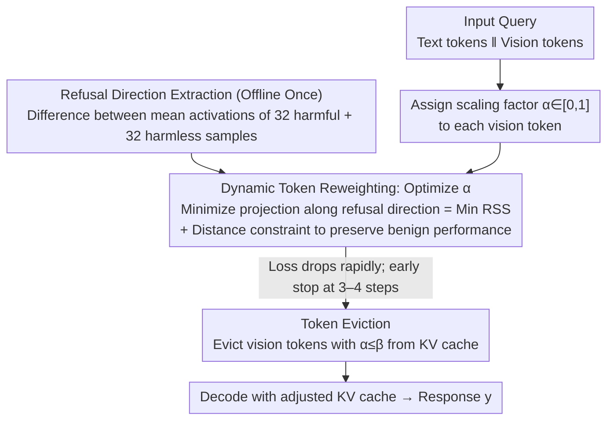

# Dynamic Token Reweighting for Robust Vision-Language Models

**Conference**: CVPR 2026  
**arXiv**: [2505.17132](https://arxiv.org/abs/2505.17132)  
**Code**: [GitHub](https://github.com/TanqiuJiang/DTR)  
**Area**: Multimodal VLM  
**Keywords**: VLM safety, jailbreak defense, KV cache optimization, token reweighting, refusal direction

## TL;DR
This paper proposes Dtr (Dynamic Token Reweighting), the first inference-time defense method that optimizes the VLM's KV cache to counter multimodal jailbreak attacks. By defining "Reverse Safety Shift" (RSS), Dtr identifies vision tokens that cause safety degradation and dynamically adjusts their weights to restore safety alignment while maintaining performance on benign tasks.

## Background & Motivation

**Background**: Large Vision-Language Models (VLMs) achieve powerful multimodal reasoning by integrating visual and linguistic capabilities. However, the introduction of the visual modality brings new security vulnerabilities, as multimodal jailbreak attacks exploit vision-text interactions to bypass safety guardrails.

**Limitations of Prior Work**: Fine-tuning solutions (such as RLHF safety alignment) are computationally expensive and depend on annotated data. Inference-stage solutions either require iterative prompting (high overhead) or rely on image-to-text conversion (significant information loss). Recent distribution shift correction methods (e.g., ShiftDC, CoCA) require a safety reference, which is typically obtained through lossy image-to-text processes.

**Key Challenge**: Accurately quantifying the "safety shift" caused by the visual modality requires comparing the state with and without the image. However, obtaining an accurate text-only counterpart is inherently a process prone to information loss.

**Goal**: To design an inference-time jailbreak defense that requires no safety reference data, no image-to-text conversion, and incurs extremely low computational overhead.

**Key Insight**: Instead of measuring "how much shift occurred after adding the image," this work measures "how much of the shift can be pushed back by adjusting vision token weights." This "Reverse Safety Shift" (RSS) can directly distinguish jailbreak queries from benign queries.

**Core Idea**: Jailbreak attacks optimize a query from "refused" to "accepted," making the process inherently reversible. In contrast, benign queries do not exhibit this reversibility.

## Method

### Overall Architecture
Dtr aims to address the safety breach opened by the visual modality in VLMs, where jailbreak images "influence" harmful queries—which should be rejected—into being accepted. Previous inference-time defenses relied on image-to-text (lossy) or iterative prompting (high cost). Dtr instead adjusts the "influence" of vision tokens without altering the image content. It first computes a "refusal direction" $\mathbf{d}_{ref}$ offline using 32 harmful and 32 harmless prompts as a safety metric axis. During inference, given a query $\mathbf{x} = \mathbf{x}_{txt} \| \mathbf{x}_{img}$, a scaling factor $\alpha_i \in [0,1]$ is assigned to each vision token. These factors are optimized via gradient descent to minimize the projection of the final layer activation onto the refusal direction (minimizing RSS) while constrained by a distance penalty to ensure benign activations do not drift. Optimization typically stops early (3-4 steps), and tokens with weights below a threshold $\beta$ are evicted from the KV cache. The adjusted cache is then used for decoding. This mechanism only modifies the KV cache and not the weights, making it a pure inference-time method.

### Key Designs

**1. Reverse Safety Shift (RSS): Measuring Reversibility Instead of Absolute Shift**

To quantify the safety shift brought by the visual modality, the standard approach is to compare the "image-present" and "image-absent" states. However, text-only counterparts created via lossy image-to-text are inaccurate. Dtr defines the Reverse Safety Shift as $\Delta^*_{safe}(\mathbf{x}) = \max_{\alpha} \frac{(f(\mathbf{x}) - f(\mathbf{x}(\alpha))) \cdot \mathbf{d}_{ref}}{\|\mathbf{d}_{ref}\|}$, which represents the maximum distance an activation can be pushed back along the refusal direction $\mathbf{d}_{ref}$ by adjusting vision token weights. The key observation is that jailbreak attacks are products of optimizing a query from "refused" to "accepted," making them naturally reversible (high RSS). Benign queries were never so optimized, making them difficult to "push back" (low RSS). Thus, RSS serves as a criterion to distinguish jailbreak from benign queries without extra VLM calls or information loss. This creates a dilemma for attackers: increasing adversarial token influence improves the jailbreak but significantly increases RSS, making detection easier.

**2. Dynamic Token Reweighting: Balancing Safety Recovery and Performance Preservation**

Simply pushing back the safety shift is insufficient, as purely minimizing the projection along the refusal direction might degrade performance on benign visual tasks. Dtr formulates the optimization objective as a trade-off between two terms:

$$\alpha^* = \arg\min_{\alpha} \left[\frac{f(\mathbf{x}(\alpha)) \cdot \mathbf{d}_{ref}}{\|\mathbf{d}_{ref}\|} + \lambda \|f(\mathbf{x}) - f(\mathbf{x}(\alpha))\|_2 \right]$$

The first term suppresses activations along the refusal direction to restore safety alignment. The second term is a distance constraint that penalizes adjusted activations for straying too far from original activations, preserving benign performance. For jailbreak queries, the first term drives $\alpha$ to suppress adversarial tokens. For benign queries, where there is little safety shift to suppress, the distance constraint ensures $\alpha$ remains near 1, minimizing impact.

**3. Early Stopping + Token Eviction: Enhancing Efficiency**

While inference-time methods are often criticized for overhead, Dtr leverages efficiency. First, the loss for jailbreak queries drops sharply in the first few steps, allowing for early stopping (default 3-4 steps). Second, vision tokens with weights below the threshold $\beta$ are evicted from the KV cache after optimization. Since vision tokens are highly redundant, removing low-weight tokens does not hurt performance but reduces cache size and accelerates subsequent decoding. Consequently, inference with defense can be faster than the baseline without it.

**4. Robust Extraction of Refusal Direction: Efficiency with 32 Samples**

The mechanism relies on a reliable refusal direction $\mathbf{d}_{ref}$. Dtr extracts this at a very low cost: it subtracts the mean activation of 32 harmful prompts (from AdvBench) from the mean activation of 32 harmless prompts (from AlpacaEval). This works with small samples because the refusal direction captures intrinsic model properties rather than dataset-specific artifacts, remaining consistent across languages, attack types, and datasets.

### Loss & Training
This is entirely an inference-time method requiring no training. It uses the AdamW optimizer with a learning rate of 0.01, $\lambda=0.1$, and 3-4 steps of gradient descent by default.

## Key Experimental Results

### Main Results

**Attack Success Rate on LLaVA-LLaMA2-7B (ASR↓, Lower is Better)**

| Defense Method | HADES-S | HADES-S+A | HADES-S+T+A | MM-Safety-S | MM-Safety-T | JailBreak-Style |
| :--- | :--- | :--- | :--- | :--- | :--- | :--- |
| No Defense | 31.4% | 44.9% | 56.9% | 70.0% | 72.7% | 34.0% |
| AdaShield | 7.5% | 5.5% | 17.6% | 8.2% | 4.5% | 8.5% |
| ShiftDC | 20.0% | 32.9% | 16.8% | 10.9% | 5.5% | 25.5% |
| CoCA | 23.6% | 20.8% | 35.7% | 24.3% | 26.3% | 8.5% |
| **Dtr** | **8.9%** | **4.8%** | **15.9%** | **3.6%** | **3.6%** | **6.4%** |

### Ablation Study

| Configuration | ASR↓ | MM-Vet↑ | Inference Time |
| :--- | :--- | :--- | :--- |
| Dtr Full | ~5% | ~35 | ~7s |
| w/o distance constraint ($\lambda=0$) | ~3% | ~28 | ~7s |
| w/o token eviction | ~5% | ~35 | ~9s |
| Eviction only (no reweighting) | ~15% | ~34 | ~5s |
| Baseline (No Defense) | ~45% | ~35 | ~6s |

### Key Findings
- Dtr achieves the lowest ASR across almost all attack types, notably reducing MM-Safety-S from 70% to 3.6%.
- Dtr maintains or even improves inference efficiency because token eviction reduces the KV cache size.
- The distance constraint $\lambda$ is critical for benign performance; without it, the MM-Vet score drops from 35 to 28.
- The refusal direction is stable with only 32 sample pairs and exhibits strong cross-domain generalization.
- Attackers face a fundamental dilemma: strengthening adversarial tokens increases RSS, making them easier to detect.

## Highlights & Insights
- **Attacker's Dilemma**: This is a profound contribution—it proves a fundamental trade-off between attack success and detectability rather than just playing an arms race.
- **First work using KV cache optimization for safety**: It unifies efficiency optimization (token eviction) and safety defense (token reweighting) into a single framework.
- **RSS as a replacement for image-to-text**: Measuring reversibility instead of absolute shift elegantly bypasses the information loss problem.

## Limitations & Future Work
- While fast, 3-4 gradient optimization steps per inference still incur some overhead.
- The refusal direction assumes safety concepts are linear in the activation space, which might not hold for extremely complex scenarios.
- It has only been verified on image+text VLMs; performance on video/audio multimodal scenarios remains unknown.
- The eviction threshold $\beta$ requires manual tuning.

## Related Work & Insights
- **vs AdaShield**: AdaShield uses iterative prompts to check safety, which is computationally heavy; Dtr operates directly at the KV cache level.
- **vs ShiftDC**: ShiftDC requires image-to-text for safety references, leading to information loss; Dtr bypasses this with RSS.
- **vs CoCA**: CoCA corrects shifts at the decoding logit level; Dtr operates at the lower KV cache level with better results.

## Rating
- **Novelty**: ⭐⭐⭐⭐⭐ The RSS concept and KV cache safety optimization are pioneering; the analysis of the attacker's dilemma is insightful.
- **Experimental Thoroughness**: ⭐⭐⭐⭐⭐ Extensive testing across 5 VLMs, 3 attack benchmarks, multiple attack types, and comprehensive ablation studies.
- **Writing Quality**: ⭐⭐⭐⭐⭐ Clear logical progression from problem definition to theoretical analysis and experimental validation.
- **Value**: ⭐⭐⭐⭐⭐ Directly applicable to safe VLM deployment and opens a new direction for KV cache-based safety.

<!-- RELATED:START -->

## Related Papers

- [\[CVPR 2026\] OmniZip: Audio-Guided Dynamic Token Compression for Fast Omnimodal Large Language Models](omnizip_audio-guided_dynamic_token_compression_for_fast_omnimodal_large_language.md)
- [\[CVPR 2026\] Hybrid Token Compression for Vision-Language Models](hybrid_token_compression_for_vision-language_models.md)
- [\[CVPR 2026\] Blink: Dynamic Visual Token Resolution for Enhanced Multimodal Understanding](blink_dynamic_visual_token_resolution_for_enhanced_multimodal_understanding.md)
- [\[CVPR 2026\] Rethinking Token Reduction for Large Vision-Language Models](rethinking_token_reduction_for_large_vision-language_models.md)
- [\[CVPR 2026\] SCoRe: Salience-Coverage Reduction for Vision Token Pruning in Vision-Language Models](score_salience-coverage_reduction_for_vision_token_pruning_in_vision-language_mo.md)

<!-- RELATED:END -->
