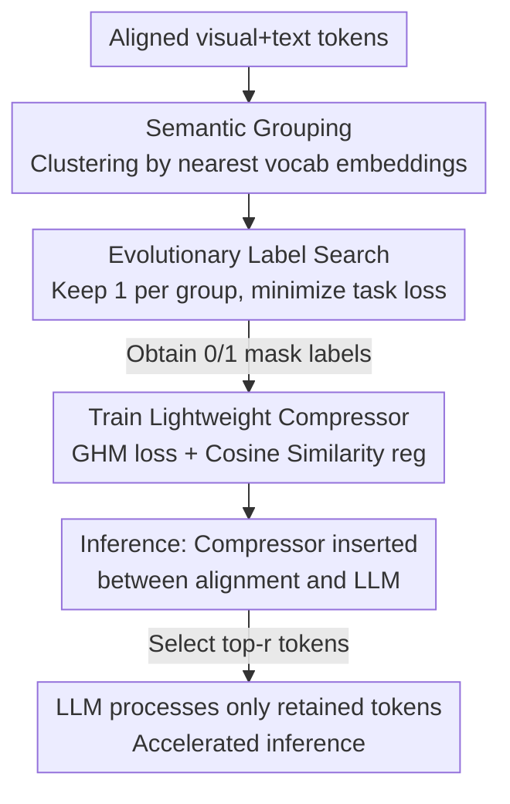

# EvoComp: Learning Visual Token Compression for Multimodal Large Language Models via Semantic-Guided Evolutionary Labeling

**Conference**: CVPR 2026  
**arXiv**: [2604.17087](https://arxiv.org/abs/2604.17087)  
**Code**: None (Not provided in the paper)  
**Area**: Multimodal VLM / LLM Efficiency / Visual Token Compression  
**Keywords**: Visual token compression, evolutionary search labeling, MLLM inference acceleration, GHM loss, edge deployment

## TL;DR
EvoComp inserts a lightweight compressor between the MLLM's alignment module and the LLM. It is trained using supervision labels generated via an "evolutionary algorithm that finds the token subset minimizing task loss." This approach maintains 99.3%–94.9% of original accuracy under 3×–9× compression and achieves up to 2.0× speedup on mobile NPUs.

## Background & Motivation

**Background**: High-resolution images, multiple images, and video inputs generate hundreds or thousands of visual tokens in MLLMs. Due to the quadratic complexity of attention, inference latency and memory overhead increase sharply, which is critical for edge/mobile deployment. A widely accepted observation is that visual representations are highly redundant—a few tokens carry most of the semantics—making "visual token compression" a main branch for acceleration.

**Limitations of Prior Work**: Existing compression methods fall into three categories, each with drawbacks. ① Attention-score-based methods (FastV, HiRED, GlobalCom²) suffer from positional bias and are incompatible with efficient operators like FlashAttention. ② Similarity-filtering-based methods (ToMe, DART, VisionZip) focus on redundancy rather than "importance," potentially retaining many diverse but useless tokens. ③ Text-conditional methods (SparseVLM, PyramidDrop, MustDrop) introduce prompts but remain attention-based heuristics and **do not directly align with model output correctness**.

**Key Challenge**: All these methods use "proxy metrics" (attention, similarity) to guess which tokens are important, lacking a direct causal link between the proxy and whether the MLLM answers correctly after token retention. What is missing is a "token-level importance label," which is not available in standard VL datasets.

**Goal**: ① Generate token retention labels for each image without relying on heuristics, directly targeting "minimal task loss." ② Train a plug-and-play compressor that requires no changes to the original MLLM parameters using these labels.

**Key Insight**: Since labels do not exist, they should be **searched**. For each sample, a 0/1 mask is searched such that the LLM's loss on the ground truth is minimized when only looking at the retained visual tokens + all text tokens. This search does not require backpropagation and naturally supports various constraints.

**Core Idea**: Evolutionary algorithms are used to align "token selection" directly with "MLLM output loss" to generate supervision labels. These labels are then distilled into a lightweight compressor to achieve a three-in-one solution: output-oriented, text-aware, and redundancy-free.

## Method

### Overall Architecture
EvoComp consists of offline and online phases. **Offline Phase (Label Generation)**: For each sample in the training set, visual tokens are grouped by semantics. Then, evolutionary search finds a binary mask within the "retain one per group" constraint space that minimizes task loss. This mask serves as the token retention label. **Training Phase**: These masks act as supervision to train a compressor composed of a single-layer encoder-only transformer + linear classifier. The compressor outputs retention probabilities for each visual token, optimized via GHM loss and cosine similarity regularization. **Inference Phase**: The compressor is placed between the alignment module and the LLM. It computes retention probabilities in one forward pass and selects the top-r tokens based on the target compression rate. The original MLLM components (Vision Encoder, Alignment, LLM) remain frozen and unmodified.

### Key Designs

**1. Plug-and-Play Lightweight Compressor: A Gateway Between Alignment and LLM**

Existing methods either modify internal LLM layers (limited to mid-layer pruning, requiring fine-grained hardware support) or rely on attention scores (conflicting with FlashAttention). EvoComp treats compression as an external module: it receives aligned visual + text embeddings and outputs a retention probability $\{p_i\}_{i=1}^{n}$ for each visual token. Its structure is a single-layer transformer (using **bidirectional attention** instead of causal attention, with a skip connection) followed by a linear classifier. Bidirectional attention allows it to model relationships between visual tokens and between vision and text, determining if a token is both "informative" and "relevant to the current prompt." Since selection occurs before tokens enter the LLM, pruning can be applied flexibly at any layer—`l=0` (pruning before LLM) for maximum speed, or `l=2` (pruning after the second layer) for higher accuracy—without fine-tuning the original MLLM.

**2. Evolutionary Labeling: Aligning Token Selection Directly to Task Loss**

This is the core innovation, addressing the disconnect between proxy metrics and output correctness. For a sample, let aligned visual tokens be $\bm{V}=\{\bm{v}_i\}_{i=1}^{n}$ and text tokens be $\bm{T}$ (including ground truth). The goal is to find a binary mask $\bm{m}\in\{0,1\}^n$ that minimizes the LLM's task loss $\mathcal{L}(\bm{m})$ on the answer tokens given the retained visual tokens and all text tokens. This ensures token retention is **governed by output quality** rather than indirect measures. The search uses an evolutionary algorithm: $q$ candidate masks are randomly initialized, LLM losses are calculated in parallel, and the top-$p$ lowest-loss candidates are selected as parents. Crossover (0.9 probability, combining partial masks from different parents) and mutation (0.2 probability, shifting the "1" in a sub-mask) generate a new population. After $L$ iterations, the mask with the lowest loss is used as the label. The paper sets $q=48,\,p=12,\,L=10$. Each mask evaluation is an independent inference, allowing massive parallelization across GPUs without backpropagation.

**3. Semantic Grouping: Reducing Search Space via Vocab Embedding Anchors**

Searching a $2^n$ mask space directly on $n$ tokens is infeasible and prone to selecting redundant semantics. EvoComp observes that visual tokens often cluster around LLM vocabulary embeddings $\bm{E}=\{\bm{e}_i\}_{i=1}^{c}$. Tokens closest to the same $\bm{e}_i$ are semantically similar. Thus, $\bm{V}$ is partitioned into disjoint subsets based on the "nearest vocab embedding"—two tokens $\bm{v}_i,\bm{v}_k$ are in the same group if and only if $\arg\max_j S_{ij}=\arg\max_j S_{kj}$, where $S_{ij}=\frac{\bm{v}_i\cdot\bm{e}_j}{\|\bm{v}_i\|_2\|\bm{e}_j\|_2}$. **A constraint is applied to retain only one token per group** (making sub-masks one-hot). The global mask is a concatenation of these sub-masks. This step achieves two goals: it reduces the search space from individual token decisions to group-level selections and naturally ensures semantic diversity in the retained tokens. It avoids hyperparameter tuning required by clustering methods like DPC-KNN.

**4. Optimized Loss with GHM + Cosine Similarity: Handing Extremes in Imbalance and Difficulty**

Using searched masks for supervision encounters severe class and difficulty imbalance: retained "positive" samples are few, while redundant "negative" samples (mostly simple and easy to classify) are many. Additionally, some tokens are **extremely hard to classify** because their visual semantics are highly variable (crucial in one image, useless in another). EvoComp adopts the Gradient Harmonized Mechanism (GHM) from object detection: defining gradient norm $g_i=|p_i-y_i|$ and gradient density $GD(g_i)$ (the number of tokens in local regions of $g_i$), it applies inverse density weighting $\mathcal{L}_{\text{GHM-C}}=\frac{1}{n}\sum_i \frac{n}{GD(g_i)}\ell(g_\psi(\bm{h}^v_i),y_i)$ to down-weight the contributions of easy negative and outliers. Furthermore, a cosine similarity regularization $\mathcal{L}_{\text{CS}}=\frac{1}{|\mathcal{I}_0||\mathcal{I}_1|}\sum_{i\in\mathcal{I}_0,j\in\mathcal{I}_1}\frac{\bm{h}^v_i\cdot\bm{h}^v_j}{\|\bm{h}^v_i\|_2\|\bm{h}^v_j\|_2}$ penalizes similarity between retained and discarded tokens. This is coupled with semantic grouping: the retained token in a group is visually similar to its discarded peers, but contributes more to accuracy; this term forces the classifier to pull their decision boundaries apart. Total loss $\mathcal{L}=\mathcal{L}_{\text{GHM-C}}+\alpha\mathcal{L}_{\text{CS}}$.

### Loss & Training
- Label Construction: Uses a subset of the LLaVA-1.5 instruction-tuning mixture; specific labels are generated for each target MLLM.
- Compressor: Single-layer transformer (bidirectional attention + skip connection) + linear classifier; Total loss $\mathcal{L}_{\text{GHM-C}}+\alpha\mathcal{L}_{\text{CS}}$, where $\alpha$ balances the terms.
- Inference: Single pass for retention probabilities, select top-r by compression rate; pruning layer $l$ is flexible (`l=0` for speed, `l=2` for accuracy).

## Key Experimental Results

### Main Results
Average accuracy on LLaVA-1.5-7B relative to the uncompressed 100% baseline:

| Retained tokens | Compression Ratio | EvoComp(l=2) | EvoComp(l=0) | Next Best Method |
|:---|:---|:---|:---|:---|
| 192 | ↓66.7% | **99.3%** | 98.7% | VisionZip 98.8% |
| 128 | ↓77.8% | 98.0% | **97.8%** | DART 97.5% |
| 64 | ↓88.9% | 93.9% | **94.9%** | VisionZip 94.2% |

Extreme compression for high-resolution (LLaVA-NeXT-7B, 2880→160 tokens, ↓94.4% / approx. 18×):

| Method | Avg. Accuracy |
|:---|:---|
| Vanilla (Upper Bound) | 100% |
| DART | 89.6% |
| SparseVLM | 89.7% |
| **EvoComp(l=0)** | **92.1%** |

On-device acceleration (LLaVA-1.5-7B + Phone NPU, GQA sample):

| Retained tokens | Total Latency (ms) | Speedup |
|:---|:---|:---|
| 576 (Original) | 1154 | 1.0× |
| 192 | 726 | 1.6× |
| 64 | 569 | **2.0×** |

On A100 for LLaVA-NeXT-7B (POPE): Prefill latency 175→43 ms (**4.1×**), overall latency 246→93 ms (**2.6×**).

### Ablation Study (LLaVA-1.5-7B, MMB / MMB-CN, Retained 128/64)

| Configuration | MMB(128) | MMB(64) | Description |
|:---|:---|:---|:---|
| Random Labeling | 60.3 | 58.4 | Same grouping, random selection per group |
| EvoComp w/ DPC-KNN | 61.3 | 58.4 | Replaced grouping with DPC-KNN clustering |
| EvoComp w/o text input | 61.3 | 60.0 | Compressor ignores text tokens |
| w/ $\mathcal{L}_{\text{CE}}+\mathcal{L}_{\text{CS}}$ | 62.4 | 59.1 | GHM replaced by Cross-Entropy |
| w/ $\mathcal{L}_{\text{GHM-C}}$ only | 63.1 | 60.4 | Removed cosine regularization |
| w/ $\mathcal{L}_{\text{FL}}+\mathcal{L}_{\text{CS}}$ | 62.9 | 60.5 | GHM replaced by Focal Loss |
| w/ $\mathcal{L}_{\text{CE}}$ only | 60.6 | 56.2 | Cross-Entropy only (worst performing) |
| **EvoComp (Full)** | **63.1** | **61.9** | — |

### Key Findings
- **Evolutionary labeling is the foundation of accuracy**: Replacing it with Random Labeling drops MMB(64) from 61.9 to 58.4, proving that labels searched via task loss are superior to random or similarity-only clusters.
- **GHM loss is more critical than cosine regularization**: Removing cosine regularization still keeps MMB(64) at 60.4, but replacing GHM with CE (w/ CE only) causes a crash to 56.2; MMB-CN(64) collapses from 55.1 to 41.3. GHM is central to handling difficulty imbalance.
- **Textual context matters**: Removing text input drops MMB(64) from 61.9 to 60.0, indicating that bidirectional attention helps pick tokens relevant to the prompt.
- **Impressive cross-model transfer**: Token indices selected for LLaVA-1.5-7B yield 94.4% accuracy when reused for the 13B version, outperforming methods trained specifically for 13B. Reusing the compressor for the heterogeneous Qwen2.5-VL-7B remains competitive without retraining.
- **`l=0` is often superior to `l=2`**: Pruning before entering the LLM (`l=0`) maintains higher accuracy in extreme compression scenarios and allows the LLM to run shorter sequences from the first layer, maximizing speedup.

## Highlights & Insights
- **"Label Searching" replaces "Importance Guessing"**: By generating missing token-level supervision through direct task loss optimization, the paper bypasses the limitations of attention/similarity heuristics.
- **Two-birds-one-stone Semantic Grouping**: Using LLM vocab embeddings for clustering reduces the search space and ensures diversity, while also providing hard negative samples for the cosine similarity regularization.
- **Cross-domain transfer of GHM Loss**: Applying GHM from object detection to token classification is a precise analogy (few positives, many easy negatives), which can be generalized to any sparse selection task with extreme difficulty imbalance.
- **Decoupling provides deployment dividends**: Separating the compressor from the LLM internals allows for scenarios like "small models selecting tokens for large models" or "one compressor across multiple architectures," which is practical for multi-model edge deployment.

## Limitations & Future Work
- Offline evolutionary labeling requires approximately $q\times(L+1)$ LLM forward passes per sample (~500 inferences/sample). While parallelizable, the total compute cost for generating labels is significant and not fully detailed.
- Each target MLLM requires its own labels and compressor. Although transferability was shown, a gap remains between transferred and native training (e.g., Qwen transfer was only "competitive").
- Benchmarking focused on 6 VL understanding tasks; performance on generative long-form answers, OCR, or fine-grained grounding—which are more sensitive to token loss—remains to be validated.
- Semantic grouping relies on the assumption that visual tokens cluster near vocab embeddings; its effectiveness for models with weak alignment between visual encoder and LLM vocab was not discussed.

## Related Work & Insights
- **vs FastV / HiRED / GlobalCom² (Attention-based)**: These use attention scores which have positional bias and conflict with FlashAttention; EvoComp uses task loss labels and an independent compressor to avoid these biases.
- **vs ToMe / VisionZip / DART (Similarity-based)**: These focus on redundancy rather than importance; EvoComp ensures importance through loss-minimization and diversity through grouping constraints. EvoComp significantly outperforms DART in the `l=0` setting.
- **vs SparseVLM / PyramidDrop / MustDrop (Text-conditional)**: These use prompts but still rely on layer-wise attention pruning; EvoComp models text-vision interaction once via bidirectional attention and prioritizes output correctness over intermediate attention.
- **vs PruMerge (Importance + Diversity)**: PruMerge uses class token attention and key similarity heuristics; EvoComp optimizes both via explicit labels and grouping constraints. At 128 tokens, PruMerge reaches 90.7% while EvoComp achieves 98.0%.

## Rating
- Novelty: ⭐⭐⭐⭐⭐ Direct alignment of token supervision to task loss via evolutionary search is a paradigm shift from heuristic methods.
- Experimental Thoroughness: ⭐⭐⭐⭐ Covers multiple compression ratios, models, GPU/NPU platforms, and transfer learning, though lacks OCR-specific tasks and detailed labeling cost analysis.
- Writing Quality: ⭐⭐⭐⭐ Clear motivation, complete algorithms/formulas, and a well-explained three-stage pipeline.
- Value: ⭐⭐⭐⭐⭐ Plug-and-play and requires no original model modifications; 2.0× speedup with 99% accuracy on mobile devices provides high deployment value.

<!-- RELATED:START -->

## Related Papers

- [\[CVPR 2026\] OmniZip: Audio-Guided Dynamic Token Compression for Fast Omnimodal Large Language Models](omnizip_audio-guided_dynamic_token_compression_for_fast_omnimodal_large_language.md)
- [\[ICLR 2026\] Task-Related Token Compression in Multimodal Large Language Models from an Explainability Perspective](../../ICLR2026/vlm_efficiency/task-related_token_compression_in_multimodal_large_language_models_from_an_expla.md)
- [\[CVPR 2026\] CoIn: Coverage and Informativeness-Guided Token Reduction for Efficient Large Multimodal Models](coin_coverage_and_informativeness-guided_token_reduction_for_efficient_large_mul.md)
- [\[CVPR 2026\] Hybrid Token Compression for Vision-Language Models](hybrid_token_compression_for_vision-language_models.md)
- [\[CVPR 2026\] GroundVTS: Visual Token Sampling in Multimodal Large Language Models for Video Temporal Grounding](groundvts_visual_token_sampling_in_multimodal_large_language_models_for_video_te.md)

<!-- RELATED:END -->
