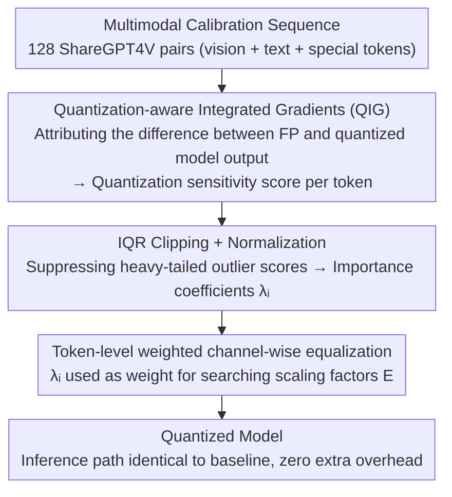

# Fine-Grained Post-Training Quantization for Large Vision Language Models with Quantization-Aware Integrated Gradients

**Conference**: CVPR 2026  
**arXiv**: [2603.17809](https://arxiv.org/abs/2603.17809)  
**Code**: [https://github.com/ucas-xiang/QIG](https://github.com/ucas-xiang/QIG)  
**Area**: Multimodal VLM  
**Keywords**: Post-training quantization, LVLM compression, token-level sensitivity, integrated gradients, model acceleration

## TL;DR
This paper proposes Quantization-aware Integrated Gradients (QIG), advancing the sensitivity analysis of LVLM quantization from the modality level to the token level. By utilizing axiomatic attribution principles, it precisely quantifies the contribution of each token to the quantization error. This approach significantly improves the accuracy of quantized models under W4A8 and W3A16 settings with almost no additional computational overhead.

## Background & Motivation
**Background**: LVLMs (e.g., LLaVA, InternVL, Qwen-VL) demonstrate excellent performance in multimodal tasks, but their large model size and slow inference necessitate Post-Training Quantization (PTQ) for acceleration.

**Limitations of Prior Work**: Existing LVLM quantization methods (e.g., MBQ) only measure token sensitivity at the modality level (vision vs. text), ignoring complex cross-token interactions and variations in quantization sensitivity between tokens.

**Key Challenge**: As tokens interact layer-by-layer within the model, modality boundaries blur, and different tokens within the same modality exhibit significant differences in quantization sensitivity (manifested as massive activations, layer heterogeneity, sub-layer divergence, and token variability).

**Goal**: How to accurately estimate quantization sensitivity at the token level and use this information to guide more refined channel-wise equalization.

**Key Insight**: Starting from axiomatic attribution in mechanistic interpretability, this work utilizes integrated gradients to quantify the sensitivity of each token relative to the quantization error from a reference to the actual input.

**Core Idea**: Replace modality-level sensitivity estimation with Quantization-aware Integrated Gradients (QIG) to guide quantization calibration at the token level.

## Method

### Overall Architecture
QIG addresses a specific limitation: existing LVLM quantization methods only distinguish between "visual tokens and text tokens" without identifying which specific tokens within a modality are more sensitive to quantization, leading to uniform scaling factor allocation during calibration. QIG calculates a quantization sensitivity score for each token without altering the main quantization process and integrates this score as a weight into the existing calibration objective.

The pipeline is integrated into the calibration phase of standard PTQ: a batch of multimodal calibration sequences (vision + text + special tokens) is fed into the model. First, QIG scores are computed for each token to measure its contribution to the quantization error. These scores are then processed using IQR to remove extreme values and normalized into importance coefficients $\lambda_i$. Finally, $\lambda_i$ is used as a weight in the channel-wise equalization (CWE) optimization objective to search for scaling factors that are more favorable to sensitive tokens. Once quantization is complete, the inference path is identical to the baseline, and all additional computation occurs during the one-time calibration phase.

### Key Designs

**1. Quantization-aware Integrated Gradients (QIG): Aligning Sensitivity Directly with Quantization Error**

Prior importance metrics relied on proxies like gradients or attention, which reflect a token's impact on the final prediction rather than its sensitivity to quantization error. Measuring the actual error by perturbing tokens individually is prohibitively expensive. QIG modifies the attribution target: while classic integrated gradients attribute the prediction of a full-precision model, QIG attributes the **output difference** between the full-precision model and the quantized model. Specifically, it integrates the gradient of this difference along a straight path from the quantized input $x^q$ to the actual input $x$:

$$QIG(x) = (x - x^q) \int_0^1 \frac{\partial\big(f(x_\alpha, w) - f(x_\alpha, w^q)\big)}{\partial x_\alpha}\, d\alpha$$

Since the integrand is exactly the quantization error $f(\cdot, w) - f(\cdot, w^q)$, the resulting scores are naturally linked to PTQ errors. Furthermore, integrated gradients satisfy the completeness axiom (the sum of attributions across tokens equals the total output difference), ensuring that the sensitivity estimate theoretically "distributes" the error across each token rather than being an arbitrary proxy.

**2. IQR Clipping: Preventing Outlier Tokens from Dominating Calibration**

Directly using raw QIG scores as weights is problematic because their distribution is heavy-tailed—a few extreme tokens can have scores so high they overshadow all others, biasing the calibration objective. This work employs the Interquartile Range (IQR) rule for truncation, clipping scores outside the range $[Q_1 - 1.5\,IQR,\ Q_3 + 1.5\,IQR]$ back to the boundaries:

$$C(QIG_i) = \mathrm{clip}\big(QIG_i,\ Q_1 - 1.5\cdot IQR,\ Q_3 + 1.5\cdot IQR\big)$$

After clipping, the scores are normalized to obtain token importance coefficients $\lambda_i$. This preserves the relatively higher weight of sensitive tokens without letting outliers dominate.

**3. Token-level Weighted Channel-wise Equalization: Integrating Weights into the Optimization Objective**

With $\lambda_i$ determined, it is incorporated into the scaling factor search. CWE aims to find a set of channel equalization matrices $\mathbf{E}$ to shift difficult-to-quantize scales from activations to weights, minimizing the difference between the original and quantized outputs. QIG weights each token's reconstruction error by its $\lambda_i$ within this objective:

$$\mathbf{E}^* = \arg\min_{\mathbf{E}} \sum_{i=1}^T \lambda_i \big\| Q_W(\mathbf{W}*\mathbf{E})\, Q_X(\mathbf{E}^{-1}*\mathbf{X}_i) - \mathbf{W}\mathbf{X}_i \big\|_2^2$$

The search process automatically prioritizes accurate reconstruction for more sensitive tokens while tolerating higher quantization error for insensitive ones. The equalization framework remains unchanged except for this token-wise weighting, which is why QIG introduces no extra inference overhead while improving accuracy.

### Loss & Training
- Fully training-free (PTQ), utilizing only 128 ShareGPT4V image-text pairs during the calibration phase.
- Supports both weight-only (W3A16) and weight-activation (W4A8) settings.

## Key Experimental Results

### Main Results (LLaVA-onevision-7B)

| Setting | Method | VizWiz | MMMU | ChartQA | AI2D | ScienceQA | Avg. |
|------|------|--------|------|---------|------|-----------|------|
| FP16 | - | 60.41 | 49.22 | 80.04 | 81.31 | 95.88 | 73.37 |
| W3A16 | MBQ | 57.99 | 44.00 | 76.84 | 78.47 | 94.89 | 70.44 |
| W3A16 | **Ours** | **62.82** | **45.78** | **77.20** | **79.11** | **95.29** | **72.04** |
| W4A8 | MBQ | 58.13 | 44.78 | 74.92 | 78.27 | 94.70 | 70.16 |
| W4A8 | **Ours** | **59.10** | **45.00** | **74.52** | **78.30** | **94.25** | **70.23** |

### Ablation Study

| Sensitivity Type | Granularity | VizWiz Accuracy |
|-----------|------|------------|
| Gradient (SFT loss) | Modality-level | 57.36 |
| Gradient | Token-level | 55.78 |
| Attention | Token-level + special | 57.52 |
| Perturbation | Token-level + special | 57.72 |
| **QIG** | **Token-level** | **Best** |

### Key Findings
- Under the W3A16 setting, QIG improves the average performance on LLaVA-onevision-7B by 1.60% over MBQ, with only a 1.33% gap compared to full-precision.
- Using SFT gradients for token-level sensitivity performs worse than modality-level, indicating that SFT gradients do not correspond to quantization sensitivity.
- Attention scores produce unstable results due to the attention-sink phenomenon.
- Token-level sensitivity from QIG shows a strong correlation with actual quantization error.

## Highlights & Insights
- **Applying Interpretability Tools to Engineering Problems**: Successfully transfers integrated gradients from "explaining model predictions" to "attributing quantization error," providing a theoretical foundation for sensitivity estimation via axiomatic attribution.
- **Zero Additional Inference Overhead**: QIG is only computed during calibration; the quantized inference is identical to the baseline.
- Systematically demonstrates that SFT gradients and attention—proxies that might intuitively seem effective—are actually suboptimal, reinforcing the value of QIG.

## Limitations & Future Work
- The calibration set is fixed at 128 samples; the impact of calibration set selection on QIG was not explored.
- The number of steps for integration in QIG is a hyperparameter, and its sensitivity was not fully discussed.
- Validation was limited to models in the 7B-26B range; effectiveness on larger models (70B+) remains unknown.
- The 1.5x IQR multiplier for clipping is a standard statistical default; whether it is optimal for quantization scenarios warrants further study.

## Related Work & Insights
- **vs MBQ**: While MBQ uses modality-level gradient weighting, QIG uses token-level quantization-aware integrated gradients, providing finer granularity directly linked to quantization error.
- **vs AWQ/GPTQ**: Unlike these methods which do not consider multimodal structures, QIG is specifically designed for the heterogeneous token sequences of LVLMs.
- The concept of token-level sensitivity analysis could be extended to LVLM pruning and knowledge distillation.

## Rating
- Novelty: ⭐⭐⭐⭐ Innovative cross-domain transfer from interpretability to quantization.
- Experimental Thoroughness: ⭐⭐⭐⭐ Tested across multiple models, benchmarks, and settings with systematic ablations.
- Writing Quality: ⭐⭐⭐⭐ Clear motivation analysis and effective visualization.
- Value: ⭐⭐⭐⭐ High practical value as a plug-and-play PTQ improvement.

<!-- RELATED:START -->

## Related Papers

- [\[CVPR 2026\] VLM-PTQ: Efficient Post-Training Quantization for Large Vision-Language Models](vlm-ptq_efficient_post-training_quantization_for_large_vision-language_models.md)
- [\[CVPR 2026\] MASQuant: Modality-Aware Smoothing Quantization for Multimodal Large Language Models](masquant_modality-aware_smoothing_quantization_for_multimodal_large_language_mod.md)
- [\[CVPR 2026\] LS-ViT: Least-Squares Hessian Based Block Reconstruction for Low-Bit Post-Training Quantization of Vision Transformers](ls-vit_least-squares_hessian_based_block_reconstruction_for_low-bit_post-trainin.md)
- [\[CVPR 2026\] Quant Experts: Token-aware Adaptive Error Reconstruction with Mixture of Experts for Large Vision-Language Models Quantization](quant_experts_token_aware_vlm_quantization.md)
- [\[CVPR 2026\] Rethinking Asymmetric Quantization: Hidden Symmetry in Vision Model Weights](rethinking_asymmetric_quantization_hidden_symmetry_in_vision_model_weights.md)

<!-- RELATED:END -->
