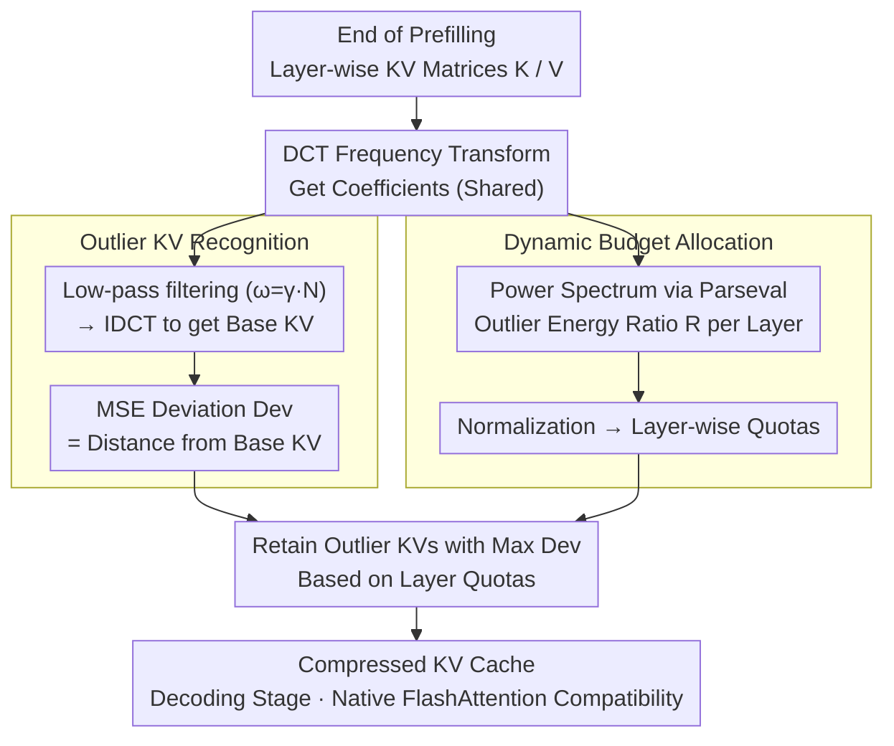

# FlashCache: Frequency-Domain-Guided Outlier-KV-Aware Multimodal KV Cache Compression

**Conference**: CVPR 2026  
**arXiv**: [2511.16786](https://arxiv.org/abs/2511.16786)  
**Code**: None  
**Area**: Multimodal VLM / Model Compression  
**Keywords**: KV Cache Compression, Frequency Domain Analysis, Outlier KV, Dynamic Budget Allocation, FlashAttention Compatibility  

## TL;DR
FlashCache is proposed as the first method to analyze the importance distribution of multimodal KV Cache from a frequency-domain perspective. It discovers that "Outlier KVs" deviating from low-frequency principal components encode critical features for inference. By identifying and prioritizing Outlier KVs through DCT low-pass filtering and performing dynamic layer-wise budget allocation, it achieves 1.69× decoding speedup with 80% KV memory compression and negligible performance loss, while maintaining native compatibility with FlashAttention.

## Background & Motivation

**Background**: Multimodal Large Language Models (MLLMs) excel in visual understanding and reasoning tasks, but the KV Cache grows linearly with visual input length during inference. In long-context scenarios such as multi-image, high-resolution, and video tasks, the GPU memory overhead of KV Cache expands drastically, significantly increasing decoding latency and becoming a core bottleneck for practical deployment.

**Limitations of Prior Work**: Existing multimodal KV Cache compression methods (e.g., LOOK-M, MEDA, H2O, SnapKV) almost exclusively rely on attention scores to determine which KV pairs to retain. This introduces two critical issues: (1) Efficient attention kernels like FlashAttention do not explicitly output the full attention matrix, and recomputing attention scores introduces extra overhead, contradicting the goal of efficient inference; (2) Attention scores are determined solely by Query-Key dot products, ignoring the actual contribution of Value vectors to the final attention output, leading to incomplete importance signals.

**Key Challenge**: To achieve high-ratio KV Cache compression, it is essential to accurately identify which KV pairs are most important for inference. However, current methods for obtaining importance signals (via attention scores) are both inaccurate and incompatible with efficient inference frameworks.

**Goal**: To design a compression method independent of attention scores that evaluates importance based on the distributional characteristics of the KV matrices themselves, enabling efficient identification of critical KV pairs while remaining natively compatible with FlashAttention.

**Key Insight**: Drawing inspiration from frequency-domain analysis in signal processing, the authors transformed KV matrices into the frequency domain to observe energy distribution. They found that frequency energy is highly concentrated in low frequencies—representing smooth, redundant principal component patterns. Conversely, KV pairs deviating from these principal components ("Outlier KVs") are more likely to encode critical inference features; prioritizing their removal leads to significant performance degradation.

**Core Idea**: Use frequency-domain low-pass filtering to extract principal components (Base KV), define the KV pairs with the largest deviations from the principal components as "Outlier KVs" for prioritized retention, and dynamically allocate KV Cache budgets across layers.

## Method

### Overall Architecture
FlashCache performs one-time compression of the multimodal KV Cache after the prefilling stage. It consists of two core modules: (1) Outlier KV Recognition Module—performs DCT frequency transformation on KV matrices of each layer, obtains smooth Base KV via low-pass filtering, and calculates the MSE deviation of each KV pair from the Base KV to prioritize outliers; (2) Dynamic Budget Allocation Module—calculates the ratio of outlier energy to total energy in the frequency domain for each layer to normalize and dynamically allocate retention quotas. Both modules share the same frequency analysis: a single DCT is performed per layer; the recognition module uses low-frequency coefficients to reconstruct the Base KV, while the allocation module uses the power spectrum to calculate outlier energy ratios. The process is training-free and independent of attention scores—since it only reads frequency statistics of KV matrices and never touches attention matrices, FlashCache is natively compatible with FlashAttention. Accelerated by NVIDIA CuPy operators, it adds only ~6.77ms latency for 8K token inputs (about 1/4 of H2O and 1/8 of LOOK-M).

### Key Designs

**1. Outlier KV Recognition: Separating "Redundant Components" from "Critical Outliers" via Low-pass Filtering**

Since attention scores are inaccurate and incompatible with FlashAttention, FlashCache directly examines the frequency structure of the KV matrices. By applying Discrete Cosine Transform (DCT) to the Key/Value tensors $K^l, V^l$ of the $l$-th layer, frequency coefficients $C_k^l[m], C_v^l[m]$ are obtained. Low-pass filtering is then applied, retaining only the first $\omega = \gamma \cdot N$ low-frequency coefficients ($\gamma$ is the cutoff factor, $N$ is the number of tokens). Setting other frequencies to zero and applying Inverse DCT (IDCT) generates a smooth "principal component version" called Base KV ($K_{base}^l, V_{base}^l$). The Base KV represents recurring redundant patterns; thus, the distance of each KV pair from it serves as a measure of importance:

$$Dev[x] = \text{MSE}(K^l[x], K_{base}^l[x]) + \text{MSE}(V^l[x], V_{base}^l[x])$$

KV pairs are sorted by $Dev[x]$ in descending order, and those with the largest deviations—the Outlier KVs—are retained. This is based on a counter-intuitive observation: performance drops significantly faster when high-deviation KVs are removed compared to random or low-deviation KVs, indicating that the few KVs deviating from the principal components encode critical features. This phenomenon mirrors outlier protection in model quantization—where a minority of elements carry disproportionate amounts of information.

**2. Dynamic Budget Allocation: Allocating Quotas by Outlier Energy Ratio**

Uniform compression ratios across all layers are suboptimal. Some Transformer layers have KV energy concentrated almost entirely in low-frequency components (few outliers), while others carry significant high-frequency outlier info. FlashCache utilizes Parseval's theorem to calculate the power spectrum $P_k^l[m] = |C_k^l[m]|^2$ directly in the frequency domain and computes the ratio of outlier (high-frequency) energy to total energy for each layer:

$$R^l = R_k^l + R_v^l, \quad R_k^l = \frac{\sum_{\ell=\omega+1}^{N-1}P_k^l[\ell]}{\sum_{\ell=0}^{N-1}P_k^l[\ell]}$$

A larger $R^l$ indicates richer outlier information. Normalizing $R^l$ across layers provides weights to allocate higher quotas to layers with more outliers under a global budget constraint. This module significantly improves visual reasoning tasks (e.g., +5.19 points on CLEVR-Change).

### Loss & Training
FlashCache is a completely training-free inference-time compression scheme. It performs one-time compression after prefilling without any parameter updates or backpropagation. Key hyperparameters include the low-pass cutoff factor $\gamma$ (optimal range 0.1-0.2) and the global KV Cache retention ratio $\rho$. DCT/IDCT operations are accelerated via the NVIDIA CuPy library, adding only 6.77ms latency for 8K token inputs (significantly lower than the 27-84ms of attention-based methods).

## Key Experimental Results

### Main Results
MileBench Multi-image Understanding (KV retention ratio $\rho=0.2$):

| Method | Task T (Qwen-7B) | Task S (Qwen-7B) | NH (Qwen-7B) | IR (Qwen-7B) |
|------|-------------------|-------------------|---------------|---------------|
| Full Cache | 55.59 | 69.17 | 27.35 | 14.17 |
| StreamingLLM | 55.59 | 67.51 | 9.69 | 14.00 |
| H2O | 55.59 | 68.60 | 12.66 | 14.67 |
| SnapKV | 55.59 | 68.27 | 13.59 | 15.33 |
| LOOK-M | 55.55 | 67.50 | 11.88 | 11.83 |
| MEDA | 55.59 | 68.13 | 9.07 | 14.50 |
| **Ours (FlashCache)** | **55.59** | **68.85** | **26.72** | **15.50** |

High-resolution benchmark (Qwen2.5-VL-7B, $\rho=0.05$):

| Method | V* | HR-Bench |
|------|-----|----------|
| Full Cache | 80.23 | 70.75 |
| SnapKV | 78.89 | 71.12 |
| LOOK-M | 77.78 | 70.25 |
| **Ours (FlashCache)** | **79.66** | **72.38** |

Efficiency comparison (Latency in ms):

| Method | 2K tokens | 4K tokens | 8K tokens |
|------|-----------|-----------|-----------|
| H2O | 3.83 | 10.29 | 27.62 |
| SnapKV | 2.53 | 4.95 | 9.57 |
| LOOK-M | 6.93 | 18.66 | 53.97 |
| MEDA | 16.6 | 38.39 | 83.75 |
| **Ours (FlashCache)** | **1.66** | **3.86** | **6.77** |

### Ablation Study
Ablation of low-pass cutoff factor $\gamma$ (Qwen2.5-VL-7B, $\rho=0.2$):

| $\gamma$ | 0.1 | 0.2 | 0.3 | 0.5 | 0.7 | 0.9 |
|-----------|------|------|------|------|------|------|
| INIAH | 29.06 | 29.69 | 25.0 | 22.5 | 22.81 | 20.08 |
| GPR1200 | 15.0 | 15.5 | 15.17 | 15.17 | 14.83 | 13.05 |

Ablation of Dynamic Budget Allocation (DBA) module:

| Config | INIAH | GPR1200 | ALFRED | CLEVR-Change |
|------|-------|---------|--------|--------------|
| w/o DBA | 24.69 | 14.67 | 34.32 | 35.85 |
| w/ DBA | 29.69 | 15.50 | 34.39 | 41.04 |

### Key Findings
- FlashCache shows the most prominent advantage in Needle-in-a-Haystack (NH) tasks: at $\rho=0.2$, it retains a score of 26.72 (close to Full Cache's 27.35), while H2O (12.66) and SnapKV (13.59) suffer significantly, indicating that frequency-domain outlier detection is superior for long-range retrieval.
- The cutoff factor $\gamma$ is optimal in the 0.1-0.2 range; setting $\gamma$ too high (>0.3) includes too many frequencies in the "principal component," failing to identify Outlier KVs and degrading performance.
- The DBA module contributes most to the CLEVR-Change dataset (+5.19), showing the importance of dynamic allocation for visual reasoning.
- FlashCache maintains near-Full Cache performance even at an extremely low retention ratio $\rho=0.05$ (V* task 79.66 vs 80.23), demonstrating better robustness than all baselines.
- The method displays very low latency (6.77ms for 8K tokens), roughly 1/4 of H2O and 1/8 of LOOK-M, as frequency operations do not depend on attention computations.

## Highlights & Insights
- **The Frequency Domain as a Novel Importance Signal**: This work is the first to introduce frequency-domain analysis from signal processing into KV Cache compression, identifying the "low frequency = redundancy, high deviation = outlier" pattern as an alternative to attention scores.
- **Analogy Between Outlier KV and Quantization Outliers**: The emergence of outliers in KV Cache compression shares a structural similarity with outlier issues in model quantization—both suggest that a few elements deviating from the norm carry disproportionate amounts of information.
- **First Attention-Score-Free and Training-Free Multimodal KV Compression**: Native compatibility with FlashAttention allows for direct deployment in production environments without modifying inference frameworks.
- **Dynamic Layer-wise Budget Allocation**: Significant differences in frequency energy distribution across layers mean that uniform compression ratios are suboptimal.

## Limitations & Future Work
- While DCT is accelerated by CuPy, its memory and computation overhead for ultra-long sequences (64K+ tokens) requires further optimization.
- The cutoff factor $\gamma$ requires manual tuning (optimal 0.1-0.2) and lacks an adaptive selection mechanism.
- Compression is currently performed once after prefilling; incremental KV management strategies during decoding remain unexplored.
- Theoretical explanation for why KV matrix energy concentrates in low frequencies requires deeper investigation.
- Evaluation has focused on multimodal scenarios; systematic assessment of pure-text long-context LLMs (e.g., 128K windows) is still needed.

## Related Work & Insights
- **vs H2O / SnapKV**: These methods discard KV pairs based on low attention scores, requiring explicit attention matrix output and thus lacking FlashAttention compatibility. SnapKV's partial attention computation still underperforms compared to FlashCache in NH tasks (13.59 vs 26.72).
- **vs LOOK-M**: Screens and merges visual KV pairs with low attention scores during prefilling, but KV merging introduces high latency (53.97ms at 8K), which is 8x slower than FlashCache.
- **vs MEDA**: Uses cross-modal attention entropy for layer-wise budget allocation, similar to DBA, but still relies on attention calculations (83.75ms latency) and faces OOM issues on MUIRBench.
- **Insights**: The frequency-domain approach can be extended to text-only LLMs; the Outlier KV concept may be intrinsically linked to the attention sink phenomenon; and DBA could be combined with mixed-precision KV quantization for multi-level compression.

## Rating
- Novelty: ⭐⭐⭐⭐⭐ The frequency-domain perspective is entirely new, and the discovery of Outlier KVs is insightful, drawing meaningful parallels to the quantization field.
- Experimental Thoroughness: ⭐⭐⭐⭐ Covers 3 MLLMs across 6 benchmarks (multi-image/high-res/video), various retention ratios, comprehensive ablations, and efficiency analysis.
- Writing Quality: ⭐⭐⭐⭐ Logical flow from motivation (incompatibility of attention scores) to discovery (outliers) and strategy (retention rules), supported by intuitive charts.
- Value: ⭐⭐⭐⭐⭐ Extremely high practical value as the first training-free multimodal KV compression scheme compatible with FlashAttention, offering 80% memory savings and 1.69× speedup.

<!-- RELATED:START -->

## Related Papers

- [\[ICLR 2026\] Mixing Importance with Diversity: Joint Optimization for KV Cache Compression in Large Vision-Language Models](../../ICLR2026/vlm_efficiency/mixing_importance_with_diversity_joint_optimization_for_kv_cache_compression_in_.md)
- [\[CVPR 2026\] ApET: Approximation-Error Guided Token Compression for Efficient VLMs](apet_approximation-error_guided_token_compression_for_efficient_vlms.md)
- [\[ACL 2026\] HERMES: KV Cache as Hierarchical Memory for Efficient Streaming Video Understanding](../../ACL2026/vlm_efficiency/hermes_kv_cache_as_hierarchical_memory_for_efficient_streaming_video_understandi.md)
- [\[ICCV 2025\] AirCache: Activating Inter-Modal Relevancy KV Cache Compression for Efficient Large Vision-Language Model Inference](../../ICCV2025/vlm_efficiency/aircache_activating_inter-modal_relevancy_kv_cache_compression_for_efficient_lar.md)
- [\[ACL 2025\] MadaKV: Adaptive Modality-Perception KV Cache Eviction for Efficient Multimodal Long-Context Inference](../../ACL2025/vlm_efficiency/madakv_adaptive_modality-perception_kv_cache_eviction_for_efficient_multimodal_l.md)

<!-- RELATED:END -->
