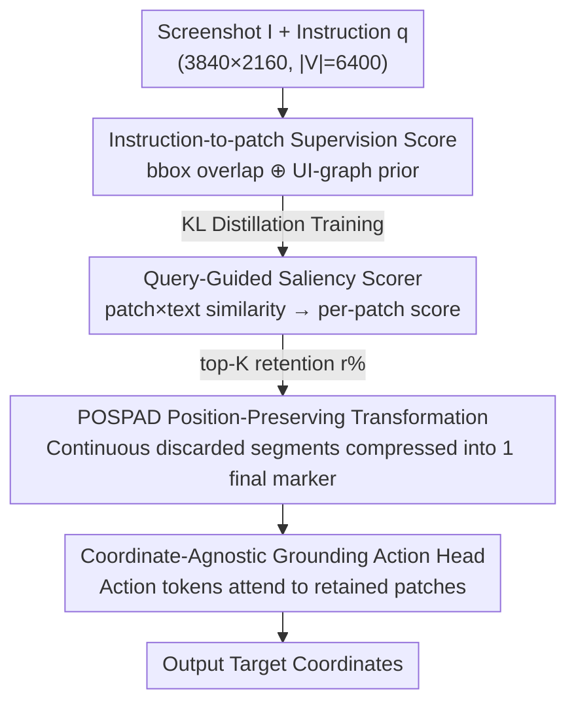

# FocusUI: Efficient UI Grounding via Position-Preserving Visual Token Selection

**Conference**: CVPR 2026  
**Paper**: [CVF Open Access](https://showlab.github.io/FocusUI)  
**Code**: https://showlab.github.io/FocusUI (Project Page)  
**Area**: Multimodal VLM  
**Keywords**: UI grounding, visual token selection, position preservation, saliency scoring, efficient inference

## TL;DR
FocusUI allow UI grounding VLMs to retain only a few instruction-related visual tokens—first using a lightweight scorer trained with "instruction $\times$ patch" saliency supervision to pick key patches, then using POSPAD to compress discarded continuous tokens into a placeholder mark retaining the final coordinate. This achieves a 1.44× speedup and 17% lower peak VRAM with only a 3.2% accuracy drop when keeping only 30% of visual tokens.

## Background & Motivation
**Background**: Recent UI visual grounding (localizing target components given a screenshot and a natural language instruction) has achieved high accuracy by leveraging VLMs to process high-resolution screenshots. The dominant approach involves partitioning the entire screenshot into visual patch tokens and feeding them all into the language model for decoding.

**Limitations of Prior Work**: UI screenshots have extremely high resolution (2K or even 4K), generating a massive number of visual tokens—approximately 4700 tokens for a 2K screenshot. The authors' statistics (Study 1) show that visual tokens account for $\ge$ 85.4% of the entire sequence, while instruction text tokens account for less than one percent. This extreme "visual token skew" results in massive computational and VRAM overhead while diluting attention. In reality, humans focus only on regions of interest when operating a UI, yet models are forced to process the entire screen.

**Key Challenge**: Directly applying visual token pruning methods designed for natural images leads to a collapse in accuracy for UI grounding. The authors identify the root cause as positional information: VLMs use M-RoPE (Multimodal Rotary Positional Embedding) to encode spatial relationships of visual tokens in a $(t, h, w)$ structure. Precise grounding is extremely sensitive to the position of visual embeddings; direct token removal causes "position jumps" in $(h, w)$ dimensions, leading to significant offsets in fine-grained target localization (as seen in Study 2 where general pruning methods' accuracy plummeted).

**Goal**: This work is the first to treat "efficient UI grounding" as an independent task, aiming to answer two sub-questions simultaneously: **which tokens to remove** (discarding instruction-irrelevant and visually redundant regions) and **how to remove them** (preserving positional continuity rather than crude removal).

**Key Insight**: Use "instruction-conditioned patch saliency" to determine which visual tokens to retain, and replace discarded continuous segments with a placeholder mark (POSPAD) that preserves the last coordinate. This shortens the sequence without breaking the spatial encoding of M-RoPE.

## Method

### Overall Architecture
FocusUI is an efficient grounding framework attached to existing VLMs (Qwen2.5-VL / Qwen3-VL). The core operations occur **before** the visual patch embeddings are fed into the LM decoder: first, each patch is assigned an "instruction-related" saliency score; top-K patches are selected based on a retention ratio $r$; then, continuous discarded token segments are compressed into placeholder marks; finally, a coordinate-agnostic action head performs localization on the remaining patches.

The pipeline comprises three contributions: (1) Constructing dense "instruction-to-patch saliency supervision" during training to teach the model which patches to retain; (2) A lightweight Query-Guided saliency scorer that predicts each patch's saliency from the similarity between patch and instruction text embeddings via KL distillation; (3) POSPAD, which performs position-preserving sequence transformations for visual token segments discarded outside the top-K. After these steps, a visual sequence originally of length $|V|=6400$ is compressed to approximately 1920 retained tokens + 280 POSPAD marks, which are then passed to the unmodified LM decoder and a GUI-Actor-style action head to output coordinates.

### Key Designs

**1. Instruction-to-Patch Saliency Supervision: Fusing bbox overlap and UI-graph priors to tell the model "which patches to keep"**

To train the scorer, labels for "which patches are important" are required. The authors partition the image into a $G_h \times G_w$ patch grid and construct dense supervision by fusing two complementary signals. The first is an **instruction-conditioned bounding box overlap score** $S_{bbox}$: given the ground truth box $b_{gt}$ of the target element, the score for each patch cell $R_{i,j}$ is proportional to its normalized overlap area $\mathrm{area}(R_{i,j}\cap b_{gt})/p^2$, where full coverage is 1 and no intersection is 0, creating a decay from the center to the boundaries. The second is a **UI-graph prior** $S_{uig}$ (inspired by ShowUI, instruction-agnostic and label-free): treating each patch as a graph node, adjacent patches in a 4-neighborhood with an RGB $\ell_2$ distance less than a threshold $\tau$ are merged using union-find to find connected components. Larger components indicate more "visually redundant" regions (e.g., large blank backgrounds), which are assigned lower weights $w_u = (\max\{1,\ \ln(n_u+1)\})^{-1}$, where $n_u$ is the component size. The two signals are fused as:

$$S_{\text{Ins2Patch}} = \lambda\, S_{bbox} + (1-\lambda)\, S_{uig},\quad \lambda = 0.8$$

This approach both precisely identifies patches near the ground truth box and suppresses large homogeneous backgrounds, providing dense supervision for unlabeled regions—mapping directly to the motivation of "deleting instruction-irrelevant + visually redundant" areas.

**2. Query-Guided Lightweight Saliency Scorer: Predicting per-patch saliency from patch × instruction similarity**

A lightweight module is needed for real-time scoring during inference. The authors use the VLM's own features: taking patch embeddings $\{v_i\}_{i=1}^M$ from the visual encoder and text embeddings $\{e_j\}_{j=1}^N$ **specifically from the instruction portion** in the LM space. Each undergoes a self-attention layer for intra-modal enhancement (preserving semantics while strengthening cross-modal interaction), followed by $\tanh$ constraints and $\ell_2$ normalization to bound the similarity. Token-level similarity matrices are then computed and mean-pooled along the text dimension to obtain the saliency of each patch:

$$P = \tilde{V}\tilde{E}^\top \in \mathbb{R}^{M\times N},\qquad s_i = \frac{1}{N}\sum_{j=1}^{N} P_{i,j}.$$

During training, scores are converted into a probability distribution and aligned with the supervision from the first design using KL divergence: $\mathcal{L}_{\text{Ins2Patch}} = \mathrm{KL}\big(\mathrm{softmax}(S_{\text{Ins2Patch}})\,\|\,\mathrm{softmax}(s)\big)$. Compared to using internal VLM attention maps as saliency (which requires intermediate activations and is incompatible with FlashAttention), this independent lightweight scorer natively supports FlashAttention.

**3. POSPAD: Compressing discarded continuous token segments into a single mark preserving the last coordinate to maintain position continuity**

This is the solution to "M-RoPE position jumps and grounding collapse caused by direct token removal," and is the most critical innovation. First, top-K selection is performed: given a retention ratio $r$, $K=\lfloor rM\rfloor$ tokens are kept. Using the $K$-th largest score $\gamma$ as a threshold yields the retained set $\mathcal{K}=\{i\mid s_i\ge\gamma\}$ and the discarded set $\mathcal{D}=\{i\mid s_i<\gamma\}$. Crucially, items in the discarded set are **not directly deleted**. Instead, $\mathcal{D}$ is partitioned into several maximal continuous segments $R_1,\dots,R_U$ according to the 1D flattened order. Each segment retains only its **final index** $r_u^{end}=\max R_u$, which is replaced with a **learnable** special token `<pos pad>`:

$$x'_j = \begin{cases}\texttt{<pos pad>} & j\in E_{\text{seq-end}}\\ x_j & j\in\mathcal{K}\end{cases}$$

Since this token inherits the $(h,w)$ coordinates of the end of the discarded segment, the spatial structure seen by M-RoPE does not experience jumps. The final visual sequence length is $M' = M - (|\mathcal{D}| - U)$, meaning $|R_u|-1$ tokens are saved for each continuous segment, leaving only 1 placeholder. Figure 4 of the paper compares three strategies: direct removal (breaks continuity), full padding (placeholder for every discarded position, good continuity but no length reduction), and POSPAD (shortens while preserving continuity). Because POSPAD only changes sequence sparsity without altering token indices or rotation bases, it has zero intrusion on common M-RoPE implementations and requires no changes to the downstream LM architecture.

**4. Coordinate-Agnostic Grounding Action Head: Direct localization on retained patches**

Finally, the "small set of retained patches" must be linked to specific localization output. The authors chose the coordinate-agnostic scheme from GUI-Actor because it aligns best with token selection: the model does not predict text coordinates but adds an action head atop the LM decoder, allowing action tokens to attend directly to visual patches. Specifically, the decoder outputs an action token sequence containing the `<ACTOR>` placeholder. The action head refines selected patch features through another self-attention layer to get $\{\tilde v_i\}$, then uses $\mathrm{MLP}_T$ and $\mathrm{MLP}_V$ to project the action hidden state $h_{\text{ACTOR}}$ and individual patches to compute attention scores $\alpha_i = z^\top z_i / \sqrt{d}$. The resulting softmax distribution $a_i$ points to the region where the action should most likely be executed. Since candidate patches have been filtered by saliency selection, the action head has fewer, more instruction-relevant candidates to align with, leading to more stable localization. For Qwen3-VL using the DeepStack visual encoder, deep visual embeddings are only collected for the retained set $\mathcal{K}$.

### Loss & Training
The overall objective is the sum of three terms: $\mathcal{L} = \mathcal{L}_{\text{Ins2Patch}} + \mathcal{L}_{\text{NTP}} + \mathcal{L}_{\text{Attn}}$. Training uses KL supervision $\mathcal{L}_{\text{Ins2Patch}}$ for the scorer, next-token prediction loss $\mathcal{L}_{\text{NTP}}$ for the LM, and attention alignment loss $\mathcal{L}_{\text{Attn}}$ for grounding—treating whether a patch overlaps with the ground truth box as a 0/1 label $y_i$ and fitting the action head attention $a_i$ to the target distribution $p_i = y_i/(\sum_j y_j + \epsilon)$. During training, the retention ratio $r$ is uniformly sampled from $(0.1, 1.0)$ to make a single set of weights adaptable to any retention rate. Matching the training budget of GUI-Actor (approx. 1M screenshots, filtered for samples with IoU < 0.3 via OmniParser), the model is trained for 1 epoch on 8×H200.

## Key Experimental Results

### Main Results
FocusUI exceeds GUI-specific baselines of similar sizes across four grounding benchmarks (ScreenSpot-V2, ScreenSpot-Pro, OSWorld-G, UI-Vision), reaching SOTA even when retaining only 30–50% of tokens. The table below excerpts average scores for ScreenSpot-Pro (high resolution, best demonstrating precision grounding):

| Model | Retention Rate | ScreenSpot-Pro Avg | ScreenSpot-V2 Avg |
|--------|------|------|------|
| GUI-Actor-7B | 100% | 44.6 | 92.1 |
| Jedi-7B | 100% | 39.5 | 91.7 |
| FocusUI-7B | 100% | **48.3** | 93.1 |
| FocusUI-7B | 50% | 46.5 | 92.6 |
| FocusUI-7B | 30% | 45.1 | 91.8 |
| FocusUI-3B | 100% | 43.8 | 91.5 |
| FocusUI-3B | 30% | 40.6 | 91.0 |

FocusUI-7B with full tokens outperforms GUI-Actor-7B by +3.7 on ScreenSpot-Pro (48.3 vs 44.6); even when cut to 30% tokens, its 45.1 remains higher than GUI-Actor-7B's 44.6. On the newer Qwen3-VL-2B backbone, FocusUI-QWEN3-VL-2B actually scores 40.4 at 50% retention, slightly higher than the 39.8 scored at 100%.

### Efficiency and Pruning Comparisons

| Setting | Retention Rate | Inference Latency | Peak VRAM | SS-Pro Acc |
|------|------|------|------|------|
| FocusUI-7B | 100% | 1.75s (1.00×) | 20994MB (1.00×) | 48.3 |
| FocusUI-7B | 50% | 1.49s (1.18×) | 17944MB (0.85×) | 46.5 |
| FocusUI-7B | 30% | 1.22s (**1.44×**) | 17392MB (0.83×) | 45.1 |

Reducing the retention rate from 100% to 30% speeds up inference by 1.44× and reduces peak VRAM by about 17%, with only a 3.2-point accuracy loss. Compared to general pruning (30% retention rate, FocusUI-3B backbone vs general methods): FocusUI only drops 0.5/3.2/1.6 points on SS-V2/Pro/OSWorld-G, while Fast-V drops 81.6% and Vision-Zip drops 27.6% on SS-Pro—confirming that "direct token removal breaking position" causes general pruning to collapse.

### Ablation Study

| Configuration | SS-Pro Acc | Description |
|------|---------|------|
| Ins2Patch + POSPAD (50%) | **42.3** | Full method |
| Ins2Patch + Direct removal (50%) | 29.2 | No position preservation → -13.1 drop |
| Ins2Patch + Full padding (50%) | 42.1 | Positional preserved but no length reduction |
| CLIP Score + POSPAD (50%) | 38.2 | Replacing instruction-to-patch scorer |
| w/ UI-Graph labels only | 41.1 | Removing bbox supervision |
| w/ BBox labels only | 39.8 | Removing UI-graph prior |

### Key Findings
- **POSPAD is the accuracy linchpin**: Using the same Ins2Patch scores, "direct removal" scores 29.2, whereas adding POSPAD boosts it to 42.3—a 13-point gap that validates "positional continuity" as the root cause of pruning collapse in UI grounding.
- **POSPAD vs Full padding yields almost no drop but is more efficient**: 42.3 vs 42.1 confirms that compressing discarded segments into a single final mark preserves position while effectively shortening the sequence.
- **Dual-path supervision complementarity**: Removing bbox supervision (UI-graph only) drops accuracy to 41.1; removing UI-graph (bbox only) drops it to 39.8. Fusion achieves 42.3, showing that instruction relevance and background suppression are both essential.
- **Scorer requires instruction conditioning**: Replacing instruction-to-patch scoring with zero-shot CLIP (38.2 vs 42.3) is significantly worse, showing that saliency must be instruction-conditioned rather than general visual saliency.

## Highlights & Insights
- **Precisely attributes "UI grounding pruning collapse" to M-RoPE position jumps**, rather than a vague "loss of information." This diagnosis is valuable, and POSPAD was designed explicitly around it, as evidenced by the 13-point gap in ablation.
- **The "last-mark inherits coordinates" mechanism in POSPAD is clever**: It changes only sequence sparsity without touching token indices or rotation bases, making it zero-intrusion for any M-RoPE implementation and requiring no downstream LM changes. This method of "modifying only the embedding entry point" is easily transferable to other high-res multimodal tasks needing visual token pruning.
- **The scorer intentionally avoids internal attention maps**, making it natively compatible with FlashAttention. This avoids the common conflict where pruning requires disabling FlashAttention to access intermediate attention.
- **Randomly sampling retention rates during training** allows a single set of weights to cover any value of $r$, enabling an "elastic token budget" at deployment time based on computational resources.

## Limitations & Future Work
- Benefits are highly dependent on the premise of "extreme visual token redundancy." In scenarios that are not high-resolution or where targets are sparse across the screen, the compression potential and efficiency gains may diminish.
- ⚠️ Supervision construction relies on ground truth boxes + OmniParser filtering for patch labels; training data quality is constrained by the detector. For interfaces without clear element boxes (e.g., graphics-heavy or game UIs), the bbox supervision path may fail.
- "Instruction-to-patch" assumes the target is uniquely identified by a single instruction; whether single-round saliency selection is sufficient for multi-step reasoning or multi-target grounding remains unexamined.
- At extremely low retention rates (e.g., 10%), the number of POSPAD placeholder tokens increases (the ablation shows 315 POSPAD tokens at 25% retention). The trade-off between marginal compression gains and positional approximation errors warrants further analysis.

## Related Work & Insights
- **vs General visual token pruning (Fast-V / HiPrune / Vision-Zip)**: These are designed for natural images and remove tokens based on attention or redundancy. They collapse in UI grounding due to breaking positional continuity (Fast-V drops 81.6% on SS-Pro); FocusUI preserves position with POSPAD, resulting in almost no drop.
- **vs GUI-Actor**: FocusUI reuses its coordinate-agnostic action head but adds instruction-conditioned visual token selection, presenting the action head with fewer, more relevant candidate patches, improving ScreenSpot-Pro by +3.7 for the same size.
- **vs ShowUI's UI-graph prior**: FocusUI adopts the union-find approach to suppress homogeneous regions but transforms it from "token merging" to a **dense supervision signal** fused with instruction-conditional bbox overlap to train an independent scorer, rather than merging tokens during the forward pass.

## Rating
- Novelty: ⭐⭐⭐⭐ First to establish efficient UI grounding as a task; POSPAD is a genuine innovation for positional continuity.
- Experimental Thoroughness: ⭐⭐⭐⭐ Covers four benchmarks, multiple backbones, various retention rates, and detailed ablations with clear efficiency/accuracy curves.
- Writing Quality: ⭐⭐⭐⭐ Motivation is empirically driven by two studies; method and figures correspond clearly.
- Value: ⭐⭐⭐⭐ Computational costs of high-res screenshots are the biggest pain point for UI agents; elastic token budgets + zero-intrusion integration are highly practical.

<!-- RELATED:START -->

## Related Papers

- [\[CVPR 2026\] GroundVTS: Visual Token Sampling in Multimodal Large Language Models for Video Temporal Grounding](groundvts_visual_token_sampling_in_multimodal_large_language_models_for_video_te.md)
- [\[CVPR 2026\] One Layer's Trash is Another Layer's Treasure: Adaptive Layer-wise Visual Token Selection in LVLMs](one_layers_trash_is_another_layers_treasure_adaptive_layer-wise_visual_token_sel.md)
- [\[CVPR 2026\] Hi-Lo Prune: Look at What You'll Lose before Pruning with Hierarchical Token Selection](hi-lo_prune_look_at_what_youll_lose_before_pruning_with_hierarchical_token_selec.md)
- [\[ICML 2026\] CLIP Tricks You: Training-free Token Pruning for Efficient Pixel Grounding in Large Vision-Language Models](../../ICML2026/vlm_efficiency/clip_tricks_you_training-free_token_pruning_for_efficient_pixel_grounding_in_lar.md)
- [\[ECCV 2024\] Groma: Localized Visual Tokenization for Grounding Multimodal Large Language Models](../../ECCV2024/vlm_efficiency/groma_localized_visual_tokenization_for_grounding_multimodal_large_language_mode.md)

<!-- RELATED:END -->
