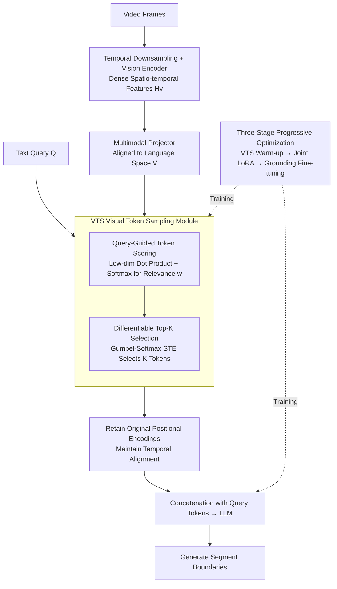

# GroundVTS: Visual Token Sampling in Multimodal Large Language Models for Video Temporal Grounding

**Conference**: CVPR 2026  
**arXiv**: [2604.02093](https://arxiv.org/abs/2604.02093)  
**Code**: Available (GitHub)  
**Area**: Multimodal VLM / Video Understanding  
**Keywords**: Video Temporal Grounding, Visual Token Sampling, Query-Guided, Video Large Language Model, Temporal Reasoning

## TL;DR
GroundVTS is proposed as a query-guided fine-grained visual token sampling architecture for Video Large Language Models (Vid-LLMs). By adaptively retaining query-relevant spatio-temporal information at the token level, it achieves an 18.4-point mIoU improvement on Charades-STA and a 20.6-point mAP improvement on QVHighlights.

## Background & Motivation

**Background**: Video Temporal Grounding (VTG) is a fundamental task in video understanding, requiring the precise localization of temporal boundaries for video segments based on natural language queries. Recently, Vid-LLMs such as Qwen2.5-VL and InternVL have made progress in general video reasoning but still struggle with fine-grained temporal understanding. Existing improvements have introduced query-conditioned attention, temporal boundary regressors, and temporal modeling modules.

**Limitations of Prior Work**: (1) Existing Vid-LLMs generally employ uniform frame sampling strategies, allocating the same input budget to all temporal segments, which causes query-relevant key moments to be diluted or missed; (2) Recent methods (e.g., CLIP-based frame selection) implement query-guided frame-level sampling, but their granularity is coarse (entire frames) and they rely on external multimodal encoders, limiting localization precision and adaptability; (3) The density and relevance of visual tokens directly affect VTG performance—experiments show that information is insufficient at low frame rates (<1 FPS), while redundant tokens dilute key signals at high frame rates (>2.4 FPS).

**Key Challenge**: There is a fundamental trade-off between "information coverage" and "signal dilution" in fixed uniform sampling—increasing the frame rate provides more temporal cues but introduces more redundancy, while decreasing it reduces redundancy but may lose key moments. An adaptive, query-aware sampling mechanism is required.

**Goal**: How can query-guided adaptive sampling be implemented at the visual token level within Vid-LLMs to suppress redundant content while preserving critical spatio-temporal information?

**Key Insight**: Starting from frame rate sensitivity experiments—Qwen2.5VL-7B reaches a peak mIoU of 47.8% at 2.0-2.4 FPS, with performance dropping sharply outside this range. This suggests that VTG requires "the right tokens" rather than "more tokens." Therefore, the sampling granularity is shifted from the frame level to the token level, performing differentiable top-K selection based on token-query similarity within the VLM (after the vision encoder and multimodal projection layer).

**Core Idea**: A query-guided token-level differentiable sampling module is introduced into Vid-LLMs, using Gumbel-Softmax STE for end-to-end training, combined with a three-stage progressive optimization strategy to adapt to non-uniform token distributions.

## Method

### Overall Architecture
GroundVTS addresses the issue where Vid-LLMs distribute the budget equally across all frames, causing key moments to be diluted by redundant tokens. It does so by shifting sampling granularity from "which frames to select" to "which visual tokens to select," guided by the query and trained end-to-end. The pipeline is as follows: the video undergoes temporal downsampling and passes through a vision encoder to obtain dense spatio-temporal features $H_v \in \mathbb{R}^{N_v \times D_v}$, which are then mapped by a multimodal projector to a shared space $V \in \mathbb{R}^{N_v \times D}$ aligned with language. Next, the Visual Token Sampling (VTS) module uses the text query $Q$ to score each token in $V$ (Query-Guided Token Scoring), performs a differentiable top-K selection to pick a compact subset $\tilde{V}$. The selected tokens retain their original positional encodings to maintain temporal alignment and are finally concatenated with query tokens for joint reasoning and segment boundary generation by the LLM. To adapt the LLM to this non-uniform token distribution, the VTS + LLM system is trained using a three-stage progressive optimization. The key lies in the "scoring-selection" occurring inside the VLM after the projection layer, allowing it to see language-aligned semantics and learn via loss backpropagation from the language model.

### Key Designs

**1. Query-Guided Token Scoring: Letting each visual token report its relevance to the query**
The fundamental problem with uniform sampling is that it ignores the query. The first step represents each visual token's relevance to the query. GroundVTS projects the visual embeddings $V$ and the mean-pooled query embedding $\mathbf{q}$ into a low-dimensional subspace using trainable projection matrices $W_v, W_q \in \mathbb{R}^{D \times D_r}$ to obtain $V'$ and $\mathbf{q}'$. It then calculates a temperature-scaled dot product and applies softmax to obtain the weight distribution $\mathbf{w} = \text{softmax}(V'{\mathbf{q}'}^\top / \tau)$. Essentially, this is a lightweight attention mechanism—$w_i$ encodes both the semantic alignment of the $i$-th token with the query and its relative importance within the sequence. Projecting to a lower dimension before calculating similarity saves computation and focuses comparison on semantically relevant dimensions rather than noise in the high-dimensional features. The temperature $\tau$ adjusts the sharpness of the distribution, determining whether selection is concentrated on a few tokens or more spread out.

**2. Differentiable Top-K Selection: Hard selecting K tokens for the LLM while allowing gradient flow**
Scoring is insufficient—selecting the top $K=\lceil\rho \cdot N_v\rceil$ based on scores is a hard operation that is non-differentiable and cannot be trained end-to-end with the LLM. GroundVTS bypasses this using Gumbel-Softmax relaxation with a Straight-Through Estimator (STE): forward propagation performs a hard selection $z_i^{\text{hard}} = \mathbf{1}(i \in \mathcal{I}_K)$, ensuring only $K$ tokens enter the LLM for efficient inference; backward propagation allows gradients to flow via continuous relaxation $z_i$. These are combined as:
$$\tilde{z}_i = z_i^{\text{hard}} + z_i - \text{stopgrad}(z_i)$$
The result is numerically equivalent to hard selection but allows differentiation via soft relaxation. Selected tokens undergo weight normalization and weighting:
$$\hat{w}_i = \frac{\exp(w_i/\tau') \cdot \tilde{z}_i}{\sum_j \exp(w_j/\tau') \cdot \tilde{z}_j}, \qquad \tilde{v}_i = \hat{w}_i \cdot \text{MLP}(v_i)$$
Normalization is crucial: reallocating weights only among the $K$ retained tokens prevents the loss of signal intensity from discarded tokens, allowing the remaining tokens to "fill" the total attention mass. For example, if a frame encodes $N_v$ tokens and $\rho=0.5$ is chosen, only half enter the LLM—the half most aligned with the query—while redundant background tokens are culled in the forward pass.

**3. Three-Stage Progressive Optimization: Ensuring stable convergence for non-uniform sampling**
Non-uniform sampling presents the LLM with a token distribution very different from the uniform distribution seen during pre-training. Simultaneous training of VTS and the LLM leads to unstable gradients. GroundVTS splits training into three stages. Stage 1 is VTS Warm-up: freezing all other components and training only the VTS parameters to stabilize "token-query relevance estimation." Stage 2 is Joint LoRA Adaptation: joint fine-tuning of VTS, the MLP projector, and the LLM (via LoRA) using large-scale data like LLaVA-Video-178K to adapt the language model to the new non-uniform distribution. Stage 3 is Grounding Fine-tuning: final task alignment on Grounding-FT data (70K samples in instructional QA format). Ablations show that skipping Stage 1 results in mIoU dropping from 50.1 to 5.6 (catastrophic failure), and skipping Stage 2 also yields significantly lower performance.

### Loss & Training
The objective is the standard LLM auto-regressive generation loss. The VTS module learns entirely through this loss backpropagated via differentiable top-K selection, without additional sampling supervision. The three stages are trained for 1 / 2 / 3 epochs respectively, with learning rates of 1e-5 / 2e-4 / 1e-4, and a fixed sampling ratio of $\rho=0.5$.

## Key Experimental Results

### Main Results (Moment Retrieval)

| Method | Charades-STA R1@0.5 | Charades-STA mIoU | ActivityNet R1@0.5 | ActivityNet mIoU |
|------|--------------------|--------------------|-------------------|-----------------|
| VTimeLLM | 27.5 | 31.2 | 27.8 | 30.4 |
| NumPro | 42.0 | 41.4 | 37.5 | 38.8 |
| LLaVA-ST | 44.8 | 42.4 | - | - |
| Qwen2.5VL-7B-G | 32.7 | 31.7 | 23.9 | 26.7 |
| **GroundVTS-Q (Ours)** | **57.5 (+24.8)** | **50.1 (+18.4)** | **33.6 (+9.7)** | **36.0 (+9.3)** |

### Highlight Detection (QVHighlights)

| Method | MR R1@0.5 | MR R1@0.7 | HD mAP | HD Hit@1 |
|------|-----------|-----------|--------|---------|
| Qwen2.5VL-7B-G | 11.0 | 4.3 | 34.4 | 44.5 |
| GroundVTS-Q (Ours) | 23.6 (+12.6) | 12.3 (+8.0) | 35.7 (+1.3) | 58.8 (+14.3) |
| InternVL3.5-8B-G | 31.8 | 15.0 | 31.9 | 39.8 |
| **GroundVTS-I (Ours)** | **63.6 (+31.8)** | **40.7 (+25.7)** | **52.5 (+20.6)** | **88.4 (+48.6)** |

### Ablation Study

| Sampling Strategy | Charades R1@0.5 | Charades mIoU | ActivityNet mIoU |
|---------|----------------|---------------|-----------------|
| Uniform (1.0 FPS) | 28.5 | 29.3 | 23.4 |
| Random (50% drop) | 35.0 | 35.7 | 27.7 |
| Frame-Level Query Selection | 44.9 | 41.6 | 30.7 |
| **Token-Level (Ours)** | **57.5** | **50.1** | **36.0** |

### Training Stage Ablation

| Training Stages | R1@0.3 | R1@0.5 | R1@0.7 | mIoU |
|---------|--------|--------|--------|------|
| None (Random VTS) | 8.6 | 5.0 | 1.9 | 5.6 |
| Stage 1 only | 31.2 | 20.5 | 10.0 | 20.9 |
| Stage 1+2 | 45.8 | 28.8 | 13.2 | 30.1 |
| Stage 1+3 | 49.1 | 32.5 | 15.2 | 32.4 |
| **Stage 1+2+3** | **71.5** | **57.5** | **34.2** | **50.1** |

### Key Findings
- Token-level sampling significantly outperforms frame-level sampling (Charades mIoU 50.1 vs 41.6), proving the importance of fine-grained selection.
- Removing positional encodings while keeping VTS causes mIoU to plummet from 50.1 to 9.5; temporal alignment is critical.
- Using only 50% of the token budget, GroundVTS exceeds the full-density performance of the baseline (R1@0.7 34.2 vs 30.5).
- GroundVTS-I achieves an 88.4% Hit@1 on QVHighlights (a 48.6-point gain over the baseline).
- GroundVTS-Q achieves the highest mIoU of 25.8 in zero-shot evaluation on NExT-GQA, demonstrating generalization ability.

## Highlights & Insights
- The frame rate sensitivity analysis is a compelling motivation, clearly demonstrating that "too many tokens can be harmful" and supporting the need for adaptive sampling.
- Applying Gumbel-Softmax STE for token-level differentiable selection in VTG is a clever engineering choice. This "selection as attention" concept can be transferred to other multimodal tasks requiring sparsification.
- The three-stage progressive optimization avoids end-to-end instability, with ablations precisely quantifying each stage's contribution.

## Limitations & Future Work
- The sampling ratio $\rho=0.5$ is fixed; ideally, it should adapt based on video complexity and query specificity.
- GroundVTS-I (InternVL3.5 base) shows smaller gains on Charades-STA compared to GroundVTS-Q, suggesting differences in compatibility between sampling paradigms (fixed frame rate vs fixed frame count).
- The VTS module adds training complexity (three stages) and top-K computation overhead during inference.
- Relying on mean-pooling to compress the query might lose fine-grained semantics (e.g., temporal relation words like "after").
- Performance on ultra-long videos has not been fully verified.

## Related Work & Insights
- **vs NumPro**: NumPro uses frame indexing to aid temporal understanding but does not change the visual token sampling strategy. GroundVTS solves this at the token selection level, outperforming it by 8.7 mIoU points on Charades-STA.
- **vs LLaVA-ST**: LLaVA-ST introduces spatio-temporal tokens but relies on uniform sampling. GroundVTS achieves more precise localization via query-guided non-uniform distribution.
- **vs Token Compression (FastV, etc.)**: Existing compression methods are often query-agnostic or based on saliency; GroundVTS's query-guided design is more focused for VTG. The principle that "compression strategies should align with downstream tasks" is a valuable takeaway.

## Rating
- Novelty: ⭐⭐⭐⭐ Token-level query-guided sampling is new for VTG, though differentiable top-K mechanisms exist.
- Experimental Thoroughness: ⭐⭐⭐⭐⭐ Comprehensive coverage across three VTG benchmarks, OOD evaluation, token density analysis, and ablation of training stages/sampling strategies.
- Writing Quality: ⭐⭐⭐⭐ Excellent narrative using frame rate sensitivity as the primary driver.
- Value: ⭐⭐⭐⭐ Provides a new perspective on visual token utilization in Vid-LLMs with significant performance gains.

<!-- RELATED:START -->

## Related Papers

- [\[ICLR 2026\] Enhancing Visual Token Representations for Video Large Language Models via Training-free Spatial-Temporal Pooling and Gridding](../../ICLR2026/vlm_efficiency/enhancing_visual_token_representations_for_video_large_language_models_via_train.md)
- [\[CVPR 2026\] Accelerating Streaming Video Large Language Models via Hierarchical Token Compression](accelerating_streaming_video_large_language_models_via_hierarchical_token_compre.md)
- [\[CVPR 2026\] EvoComp: Learning Visual Token Compression for Multimodal Large Language Models via Semantic-Guided Evolutionary Labeling](evocomp_learning_visual_token_compression_for_multimodal_large_language_models_v.md)
- [\[CVPR 2026\] FocusUI: Efficient UI Grounding via Position-Preserving Visual Token Selection](focusui_efficient_ui_grounding_via_position-preserving_visual_token_selection.md)
- [\[ECCV 2024\] Groma: Localized Visual Tokenization for Grounding Multimodal Large Language Models](../../ECCV2024/vlm_efficiency/groma_localized_visual_tokenization_for_grounding_multimodal_large_language_mode.md)

<!-- RELATED:END -->
