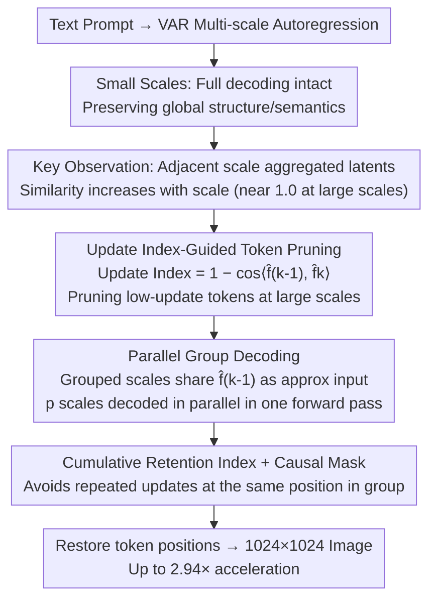

# LazyVAR: Accelerating Visual Autoregressive Models via Scale-wise Token Pruning and Parallel Group Decoding

**Conference**: CVPR 2026  
**Paper**: [CVF Open Access](https://openaccess.thecvf.com/content/CVPR2026/html/Mao_LazyVAR_Accelerating_Visual_Autoregressive_Models_via_Scale-wise_Token_Pruning_and_CVPR_2026_paper.html)  
**Code**: None  
**Area**: Model Compression / Generative Model Acceleration  
**Keywords**: Visual Autoregressive (VAR), Training-free Acceleration, Token Pruning, Parallel Decoding, Text-to-Image

## TL;DR
LazyVAR discovers that aggregated latent features in VAR on adjacent scales become increasingly similar as the scale increases. Therefore, it leverages a "scale update index" for training-free token pruning, and then groups and decodes scales with minimal updates in parallel. This accelerates the Infinity-2B text-to-image model by up to 2.94× (taking only 0.5 seconds for 1024×1024 resolution on a single RTX 4090 card) with almost no degradation in generation quality.

## Background & Motivation
**Background**: Diffusion models have long dominated image generation. However, visual autoregressive (VAR) approaches have recently matched or even surpassed diffusion on several benchmarks, while being naturally compatible with the training paradigms and scalability of Large Language Models. Specifically, VAR reformulates autoregression from "predicting the next token" into "predicting the next scale," generating multi-scale token maps in a coarse-to-fine manner, showing strong visual fidelity and semantic consistency.

**Limitations of Prior Work**: VAR suffers from two major pain points that directly slow down inference. First, **computational complexity explodes with scale**. As the scale increases, the number of tokens grows as $O(n^2)$ with the resolution side length $n$, and the attention computation even scales as $O(n^4)$, making the processing of the entire token map extremely expensive at high resolutions. Second, **cross-scale parallelization is impossible**. The sequential dependency of autoregression requires updating the aggregated latent variable first and then downsampling it to initialize the next scale, forcing each scale to be decoded serially and resulting in high latency.

**Key Challenge**: The prior VAR acceleration work, FastVAR, relies on frequency-domain deviation (the deviation of individual token norm from the mean norm, i.e., PTS) to select tokens for pruning. However, it fails to leverage VAR's intrinsic "token update dynamics." Consequently, the pruning criterion does not align well with the actual behavior of the model, and it leaves the serial latency issue completely unresolved.

**Goal**: Achieve "plug-and-play" acceleration **without retraining**, simultaneously eliminating both the overhead of "large-scale token redundancy" and "cross-scale serial latency."

**Key Insight**: The authors extract the aggregated latent variable $\hat{f}$ (the cumulative sum of residual predictions across scales) maintained by VAR and study the **cosine similarity of $\hat{f}$ between adjacent scales**. Three key observations support the proposed method: (1) The similarity monotonically increases with scale, and at larger scales, the distribution is sharply clustered near 1.0; approximately 94% of tokens at the 11th scale have a cosine similarity >0.95. (2) Tokens with low similarity (high updates) strongly correlate with high-frequency detail regions in the image, indicating that the model actively updates details while leaving the already generated background untouched. (3) The update patterns are consistent across scales: if a token undergoes a large update at scale $i$, it also tends to experience a large update at scale $i{+}1$.

**Core Idea**: Treat the "similarity of aggregated latent variables between adjacent scales" as a free pruning signal. A high similarity indicates that the current update is minimal and the forward pass can be skipped. Since a vast majority of tokens remain nearly unchanged at large scales, approximating the inputs of these scales with the same $\hat{f}$ allows **grouping and decoding multiple sequential scales in parallel within a single forward pass**.

## Method

### Overall Architecture
LazyVAR is a training-free acceleration plug-in applicable to pre-trained VAR text-to-image models (such as Infinity and HART). It consists of two complementary modules: **Update Index-Guided Token Pruning (UIGTP)** and **Parallel Group Decoding (PGD)**. The overall strategy is to "keep small scales intact and aggressively accelerate large scales." Since small scales contain fewer tokens but determine the global structure and semantics, pruning them is counterproductive; thus they are fully processed. Starting from a specific scale $i$, tokens with minimal updates are pruned based on the update index calculated from the previous scale. Then, the subsequent $p{-}1$ scales are packaged into a group, approximating the inputs of each scale with the same aggregated latent variable to decode the residuals of multiple scales in parallel via a single forward pass.

### Key Designs

**1. Scale Update Index: Transforming "adjacent scale similarity" into a training-free pruning criterion**

The pain point is that large scales contain too many tokens, but most of them barely change. The authors formulate the aggregated latent variable of VAR in a recursive manner: $\hat{f}_k = \hat{f}_{k-1} + \mathrm{Interpolate}(r_k, (h_K, w_K))$, where $r_k$ is the residual prediction of the $k$-th scale. Then, a token-wise update index is defined as follows:

$$\text{Update Index}_k = 1 - \cos\langle \hat{f}_{k-1}, \hat{f}_k \rangle \in [0,2]^{h_K \times w_K}$$

A small update index implies that the token is barely updated at the current scale and can be safely discarded from the transformer input, having negligible impact on the final representation. The reliability of this criterion stems from the three aforementioned observations: the update index strongly correlates with the high-frequency variance of image patches (meaning that only the already generated background is pruned), and it is consistent across scales (a significant Spearman correlation exists between $\text{Update Index}_{k-1}$ and $\text{Update Index}_k$). Thus, **the previous scale's $\text{Update Index}_{k-1}$ can be used to decide which tokens to prune at the current scale $k$**, eliminating the need for extra training or classifiers. Compared to FastVAR's PTS (which measures token norm deviation), this directly reads the model's own update dynamics, yielding a criterion that aligns much better with actual behavior. The pruned token positions are restored after the block output, and the residual predictions at those positions are simply set to zero.

**2. Parallel Group Decoding (PGD): Packaging sequential scales into a single forward pass**

The pain point is that autoregression requires updating $\hat{f}$ at each step to initialize the next scale, preventing cross-scale parallelization. The authors notice that adjacent $\hat{f}$ variables are highly similar at large scales ($\hat{f}_{k-1} \approx \hat{f}_{k+m-1}$). They thus approximate the inputs of different scales within the same group by downsampling the same $\hat{f}_{k-1}$:

$$\tilde{r}_{k+m} \approx \tilde{r}'_{k+m} = \mathrm{Interpolate}(\hat{f}_{k-1}, (h_{k+m}, w_{k+m})), \quad m \in [0, p-1]$$

Downsampling further smooths out the already minor differences, validating this approximation. Consequently, the originally sequential computation $r_k = \mathrm{Blocks}(\tilde{r}_1,\dots,\tilde{r}_k,c)$ can be reformulated to decode $p$ scales of a group in parallel using a single forward pass: $r_k,\dots,r_{k+p} = \mathrm{Blocks}(\tilde{r}_1,\dots,\tilde{r}'_k,\dots,\tilde{r}'_{k+p},c)$. This is the key to breaking the intrinsic "cross-scale serial" bottleneck of VAR, and it is the source of additional speedup for LazyVAR over pure pruning methods like FastVAR (which cannot parallelize)—PGD alone contributes about $1.45\times$ speedup according to ablation studies.

**3. Cumulative Retention Index: Avoiding repeated updates of tokens at the same location within a group**

When decoding multiple scales in parallel, there is a risk: if different scales update the token at the same spatial location, it violates causal dependency and introduces artifacts. The authors address this by allocating the update budgets to disjoint spatial locations. The highest update index tokens are assigned to the largest scale, while lower ones are assigned to smaller scales. Specifically, for scale $i$, the cross-scale cumulative retention count is computed as:

$$\text{cum}_i = \sum_{k=i+1}^{i+p} n_k \cdot (h_K \times w_K)/(h_k \times w_k)$$

Then, for scale $i{+}m$, the update index $\text{Update Index}_{i-1}$ is first downsampled to $(h_{i+m}, w_{i+m})$. After sorting, $n_{i+m}$ tokens starting from the $\text{cum}_{i+m}$-th largest value are selected as the retention indices for this scale. Combined with the attention mask used during training, this maintains causal relationships across scales within the group. This step acts as a safety valve to ensure parallelization does not degrade quality; ablations show that omitting it (w/o Cum) leads to a slight decline in performance.

### A Complete Example
Take Infinity (which has a total of 13 scales) as an example: scales 1–9 are fully decoded without modification to preserve global structure. From scale 10 onwards, LazyVAR is activated, grouping scales 10, 11, 12, and 13 together. The retention ratios are configured as [20%, 10%, 5%, 1%]—the larger the scale, the more aggressively it is pruned due to higher similarity and fewer updates at larger scales. Within the group, the inputs for scales 10–13 are approximated by downsampling $\hat{f}_9$ computed from scale 9, decoding the residuals of all four scales in parallel with a single forward pass. Based on the cumulative retention index, highly updated tokens are allocated to scale 13, and less updated tokens to scale 10. The residuals of pruned positions are set to zero, and position encodings are restored. This ultimately compresses 13 steps into approximately 10 effective computational steps, reducing the 1024×1024 image generation time from 1.38s to 0.47s.

## Key Experimental Results

### Main Results
Evaluated on two VAR text-to-image models (Infinity-2B, HART-0.7B) using a single RTX 4090 GPU. GenEval is used to evaluate semantic consistency, and MJHQ-30K is used to measure perceptual quality.

| Model | Steps | Time↓ | Speedup↑ | FLOPs↓ | VRAM↓ | GenEval↑ | MJHQ FID↓ | FID*↓ |
|------|------|-------|-------|--------|-------|----------|-----------|-------|
| Infinity | 13 | 1.38s | 1.00× | 101.58T | 16.1GB | 0.685 | 9.80 | 0.00 |
| +FastVAR | 11 | 0.65s | 2.12× | 44.15T | 11.9GB | 0.683 | 10.05 | 2.03 |
| **+LazyVAR** | 10 | **0.47s** | **2.94×** | **34.32T** | **11.2GB** | **0.686** | 9.83 | **1.46** |
| HART | 14 | 0.80s | 1.00× | 45.59T | 20.6GB | 0.476 | 10.98 | 0.00 |
| +FastVAR | 14 | 0.58s | 1.38× | 34.11T | 20.5GB | 0.458 | 10.54 | 8.06 |
| **+LazyVAR** | 13 | **0.48s** | **1.67×** | **32.09T** | 20.2GB | 0.468 | 11.04 | **3.77** |

Infinity+LazyVAR achieves a $2.94\times$ speedup, with GenEval actually increasing slightly by 0.3%. HART+LazyVAR achieves a $1.67\times$ speedup, with GenEval dropping by only 0.8%. On both model families, LazyVAR consistently outperforms FastVAR across speed, quality, FLOPs, and VRAM.

> **FID\***: A custom metric measuring the FID between images generated by the accelerated model and the original model (lower indicates closer alignment with the original model's output). LazyVAR consistently achieves a significantly lower FID\* than FastVAR across all 10 categories on MJHQ-30K (averaging 7.69 vs 12.52 on Infinity; 12.55 vs 18.50 on HART), indicating smaller deviation from the original model's behavior. Notably, although HART+FastVAR occasionally yields a lower absolute FID than the original model, the authors note that it introduces visible artifacts in the background (red boxes in Fig. 5), making low FID misleading in this context.

### Ablation Study

| Configuration | Time↓ | Speedup↑ | GenEval↑ | MJHQ FID↓ | FID*↓ | Description |
|------|-------|-------|----------|-----------|-------|------|
| [20%,10%]† Default | 0.47s | 2.94× | 0.686 | 9.83 | 1.46 | Optimal trade-off of pruning ratio |
| [0%,0%] | 0.41s | 3.37× | 0.658 | 10.81 | 2.67 | Prune all, quality collapses |
| [40%,20%] | 0.51s | 2.71× | 0.686 | 9.87 | 1.65 | Retaining more brings no gains |
| w/o PGD | 0.68s | 2.03× | 0.690 | 9.74 | 1.48 | Without parallel decoding, speedup drops from 2.94× to 2.03× |
| Group [9,10,11,12,13] | 0.42s | 3.29× | 0.678 | 9.83 | 2.21 | Grouping more scales is faster but degrades quality |
| w/o Cum | 0.47s | 2.94× | 0.681 | 9.88 | 1.54 | Without cumulative index, slight performance drop |
| w PTS (FastVAR criterion) | 0.48s | 2.88× | 0.665 | 10.12 | 2.29 | Quality worsens significantly when using PTS criterion |

### Key Findings
- **Pruning criterion is crucial for quality**: Replacing the proposed update index with FastVAR's PTS (w PTS) causes GenEval to drop from 0.686 to 0.665 and FID* to increase from 1.46 to 2.29. This confirms that "adjacent scale similarity" aligns much better with VAR's actual update behavior than "norm deviation."
- **PGD contributes approximately 1.45× speedup**: Disabling parallel group decoding drops the speedup from $2.94\times$ to $2.03\times$, while the quality remains almost unchanged. This indicates that the parallelization brings "free" acceleration.
- **There is a sweet spot for retention ratio**: Pruning everything ([0%,0%]) leads to quality collapse, while retaining too much ([40%,20%]) only increases latency without improving quality, as a vast majority of tokens at large scales experience negligible updates anyway.
- **Small scales must be kept intact**: Small scales have fewer tokens but determine structure and semantics, so pruning them is counterproductive.

## Highlights & Insights
- **Quantifying "redundancy" into a training-free signal**: Measuring the cosine similarity of aggregated latent variables between adjacent scales serves as both the pruning criterion and the justification for parallelization. A single observation simultaneously resolves both the "too many tokens" and "cannot parallelize" issues in an elegant and cost-effective manner.
- **Clever coupling of pruning and parallelization**: Because large-scale tokens barely update (high similarity), they can be pruned safely, and inputs across multiple scales can be approximated with the same $\hat{f}$ for parallel decoding. Both modules share the same physical premise, rather than being forced together.
- **Proposing the FID\* comparison metric**: Directly measuring the output deviation of "accelerated vs. original" model represents a more faithful evaluation of acceleration than absolute FID. It avoids the misdirection of FastVAR's "low absolute FID despite artifacts" and is generalizable to other training-free acceleration works.
- **Plug-and-play**: It requires no retraining, is compatible with FlashAttention, and relies on simple token index sorting at inference time, making implementation cost extremely low.

## Limitations & Future Work
- **Speedup depends on the model's scale structure**: Infinity has 13 scales with substantial redundancy at large scales, yielding a $2.94\times$ speedup. HART has fewer scales, leaving less room for pruning/parallelization, and thus only achieves $1.67\times$. The gains may shrink for VAR variants with fewer scales or more uniform token distributions.
- **Retention ratios and grouping are hand-tuned hyperparameters**: Selecting configurations like [20%, 10%, 5%, 1%] and scaling groups relies on manual analysis of the Update Index distribution. There is no automated strategy, which requires re-tuning for new models.
- **Only validated on text-to-image VAR**: The method fundamentally relies on "aggregated latent variable similarity," and its validity on VAR variants for image editing, image-to-image, or video generation has not been verified.
- **Aggressive pruning causes collapse**: High similarity does not mean zero updates. Extreme pruning ([0%, 0%]) leads to noticeable quality drops, showing the limits of the "similar objects can be discarded" assumption.

## Related Work & Insights
- **vs FastVAR**: FastVAR implements token pruning via PTS (token norm deviation) and restores spatial consistency using CTR, but only prunes without parallelization. LazyVAR adopts adjacent scale similarity as the criterion (which is more aligned with update dynamics) and introduces parallel group decoding to eliminate sequential latency, achieving a win-win in speed and quality.
- **vs ScaleKV / CoDE / SkipVAR etc. VAR Family Acceleration**: ScaleKV optimizes KV-cache memory allocation, CoDE adopts multi-resolution collaborative inference, and SkipVAR trains a classifier to skip certain scales or CFG branches. LazyVAR requires no model modification or classifier training, relying purely on the intrinsic similarity of aggregated latent variables, making it highly complementary to these methods.
- **vs Diffusion Acceleration (DDIM/DeepCache)**: DeepCache reuses high-level features from adjacent denoising steps, and DDIM optimizes sampling trajectories. While they share the concept of "exploiting redundancy between adjacent steps," VAR has a fundamentally different architecture and generation paradigm, preventing direct application of diffusion acceleration methods. This work presents a corresponding solution designed specifically for the scale dimension of VAR.

## Rating
- Novelty: ⭐⭐⭐⭐ The observation of "adjacent scale similarity" is leveraged as both a pruning criterion and parallelization foundation, which is highly insightful and unexplored by prior work.
- Experimental Thoroughness: ⭐⭐⭐⭐ Evaluated on two model families across three benchmarks with comprehensive ablation on pruning, grouping, and criteria, alongside introducing FID\* as a control metric. Very solid.
- Writing Quality: ⭐⭐⭐⭐ Smooth transition from findings to motivation and mathematical derivations. Formulas and figures are clear.
- Value: ⭐⭐⭐⭐ Training-free and plug-and-play, delivering a $2.94\times$ speedup and generating 1024×1024 images in 0.5s on a single GPU. Extremely practical for real-world VAR deployment.

<!-- RELATED:START -->

## Related Papers

- [\[CVPR 2026\] VVS: Accelerating Speculative Decoding for Visual Autoregressive Generation via Partial Verification Skipping](vvs_accelerating_speculative_decoding_for_visual_autoregressive_generation_via_p.md)
- [\[CVPR 2026\] When Token Pruning is Worse than Random: Understanding Visual Token Information in VLLMs](when_token_pruning_is_worse_than_random_understanding_visual_token_information_i.md)
- [\[CVPR 2026\] One Layer's Trash is Another Layer's Treasure: Adaptive Layer-wise Visual Token Selection in LVLMs](one_layers_trash_is_another_layers_treasure_adaptive_layer-wise_visual_token_sel.md)
- [\[CVPR 2026\] HAWK: Head Importance-Aware Visual Token Pruning in Multimodal Models](hawk_head_importance-aware_visual_token_pruning_in_multimodal_models.md)
- [\[CVPR 2026\] HTTM: Head-wise Temporal Token Merging for Faster VGGT](httm_head-wise_temporal_token_merging_for_faster_vggt.md)

<!-- RELATED:END -->
