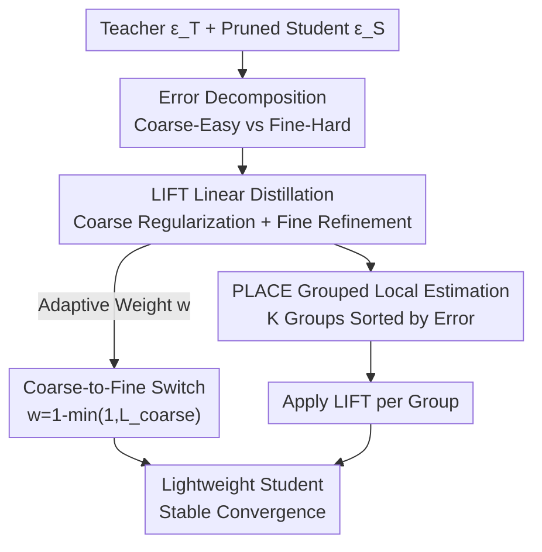

# LIFT and PLACE: A Simple, Stable, and Effective Knowledge Distillation Framework for Lightweight Diffusion Models

**Conference**: CVPR 2026  
**arXiv**: [2605.19729](https://arxiv.org/abs/2605.19729)  
**Code**: Available (Project page, no explicit GitHub link in the paper)  
**Area**: Model Compression / Diffusion Models / Knowledge Distillation  
**Keywords**: Diffusion Model Distillation, Capacity Gap, Coarse-to-Fine, Linear Regression Alignment, Local Adaptivity

## TL;DR
Addressing the instability of training small diffusion students distilled from large teachers, this paper decomposes distillation error into "coarse-easy" (low-order moment mismatch) and "fine-hard" (non-linear residual) components using linear regression. It proposes LIFT for coarse-to-fine refinement and PLACE for spatial local adaptivity via group ranking. Under extreme 90% pruning (where the student has only 1.6% of teacher parameters), it brings the FID back to 15.73 from the 50–200+ seen in conventional KD.

## Background & Motivation
**Background**: While diffusion models are powerful, they are too heavy for industrial deployment, necessitating compression into lightweight students. The mainstream approach involves pruning to obtain a small student followed by Knowledge Distillation (KD) to mimic the teacher—Output-level KD (OutKD, matching predicted noise $\epsilon$) and Feature-level KD (FeatKD, matching intermediate features) are common strategies.

**Limitations of Prior Work**: Through experiments (Fig.1), the authors observe a neglected phenomenon: **as the teacher grows larger, not only does student performance degrade, but training also becomes more unstable** (significantly higher variance across multiple runs). The iterative denoising nature of diffusion models forces students to learn a hierarchical set of noise prediction behaviors, which severely exacerbates the "capacity gap" problem. A common compromise is to intentionally use a weaker teacher, which essentially discards the rich knowledge of stronger models.

**Key Challenge**: Strong teachers have overly complex denoising processes and lightweight students have limited capacity. Forcing the student to simultaneously fit "easy statistical alignment" and "difficult non-linear details" causes KD instability—often leading to training collapse under large capacity gaps.

**Key Insight**: The authors conduct a diagnostic probe experiment (Alg.1). At each denoising step for every sample, they independently use linear regression to affinely align the student output to the teacher: $\epsilon^{\mathcal{T}}\approx\beta_0+\beta_1\cdot\epsilon^{\mathcal{S}}$. This only aligns low-order moments like mean and variance (a "coarse" operation). **Remarkably, even with student weights frozen, this single step significantly stabilizes and improves training**. This indicates that errors are naturally decomposable and that "coarse alignment" is the key to stable training. however, per-sample regression requires the teacher's presence during inference and is not deployable—it is a "diagnostic lens" rather than a method.

**Core Idea**: To "amortize" the stability gains of the probe experiment into a global, trainable objective that does not depend on regression coefficients during inference—first aligning "coarse-easy" errors to stabilize training, then gradually shifting to "fine-hard" residuals to learn details.

## Method

### Overall Architecture
The framework, termed **Coarse-to-Fine KD**, consists of two components, LIFT and PLACE, applied to a teacher-student pair. First, distillation error is decomposed into two types: **Coarse-Easy error** (low-order moment mismatch, easy to learn, crucial for stable denoising) and **Fine-Hard error** (complex non-linear residuals not captured by moments, providing teacher details). LIFT uses a set of linear regression coefficients $(\beta_0, \beta_1)$ to split the KD objective into a "coarse alignment regularization term" and a "fine residual refinement term," using an adaptive weight $w$ to transition from coarse to fine during training. PLACE further observes that errors are **spatially non-uniform** (concentrated in semantically salient regions and evolving over training). It sorts output elements by error magnitude, estimates regression coefficients independently within groups, and applies LIFT locally—**adding no parameters and no inference overhead**.

### Key Designs

**1. Error Decomposition: Splitting the KD Objective**

Conventional OutKD uses a single $\|\epsilon^{\mathcal{T}}-\epsilon^{\mathcal{S}}\|_2^2$ to force point-wise alignment, which is difficult and chaotic under large capacity gaps, leading to collapse. The authors treat teacher and student predictions as two distributions characterized by low-order (mean/variance) and high-order moments. Through per-sample OLS linear regression $\beta_1=\mathrm{Cov}[\epsilon^{\mathcal{T}},\epsilon^{\mathcal{S}}]/\mathrm{Var}[\epsilon^{\mathcal{S}}]$ and $\beta_0=\mathbb{E}[\epsilon^{\mathcal{T}}]-\beta_1\mathbb{E}[\epsilon^{\mathcal{S}}]$, they obtain affine correction $\hat{\epsilon}^{\mathcal{S}}=\beta_0+\beta_1\epsilon^{\mathcal{S}}$. Aligning only low-order moments significantly improves results but leaves a gap. This clearly separates errors into **Coarse-Easy** (statistical mismatch of moments, crucial for stable denoising) and **Fine-Hard** (residual non-linear details determining the final quality cap). This decomposition allows the method to handle both types of errors systematically.

**2. LIFT: Amortizing Regression into Deployable Loss**

Per-sample regression is not deployable at inference. The key trick of LIFT is to **enforce an identity constraint $\beta_0=0, \beta_1=1$** — which corresponds to the student directly predicting the teacher output without any coefficients. Since hard constraints are unsolvable, they are converted into a regularization term, resulting in two loss terms: a coarse alignment term $\mathcal{L}_{\text{coarse}}=|\beta_0|+|\beta_1-1|$ (pulling coefficients toward identity) and a fine refinement term $\mathcal{L}_{\text{fine}}=\|\epsilon^{\mathcal{T}}-(\beta_0+\beta_1\epsilon^{\mathcal{S}})\|_2^2$ (minimizing residuals), where $\beta_0, \beta_1$ are OLS closed-form solutions. These are combined using an adaptive weight:

$$\mathcal{L}_{\text{LIFT}}=\mathcal{L}_{\text{coarse}}+w\cdot\mathcal{L}_{\text{fine}},\qquad w=1-\min(1,\mathcal{L}_{\text{coarse}})$$

In early training, $\mathcal{L}_{\text{coarse}}$ is large and $w\approx0$, so the student focuses on coarse mismatch. As alignment improves and $\mathcal{L}_{\text{coarse}}\to0$, $w$ increases to 1, smoothly shifting focus to fine details. This schedule is **driven by the loss value itself** rather than fixed steps—ensuring "global statistics are stabilized before details are learned."

**3. PLACE: Spatial Local Adaptivity via Grouping**

While LIFT provides global alignment, the authors visualize error maps $\mathcal{E}=|\epsilon^{\mathcal{T}}-\epsilon^{\mathcal{S}}|$ (Fig.3) and find that errors are **highly structured and spatially non-uniform**, concentrating in semantically salient regions. A single global coefficient cannot address specific difficult regions. PLACE measures distillation difficulty via error magnitude $\mathcal{E}$, sorts all elements, and partitions them into $C \times N$ equal-sized groups $\{G_i\}$, each with $K$ elements. $G_1$ contains the smallest errors, while subsequent groups represent increasingly difficult regions. Each group $G_i$ uses OLS to estimate its own $(\beta_{0,i}, \beta_{1,i})$ and calculates the intra-group LIFT loss. This grouping remains simple to avoid complex construction and allows for parallel estimation. Consequently, **coarse alignment becomes spatially adaptive**, allowing the model to focus "attention" where the student struggles most.

### Loss & Training
The full objective integrates the diffusion loss, LIFT/PLACE loss, and FeatKD:

$$\mathcal{L}=\lambda_{diff}\mathcal{L}_{diff}+\lambda_{\text{LIFT}}\mathcal{L}_{\text{LIFT}}+\lambda_{\text{FeatKD}}\mathcal{L}_{\text{FeatKD}}$$

$\mathcal{L}_{diff}=\|\epsilon^{\mathcal{T}}-\epsilon^{\mathcal{S}}\|_2^2$. Under PLACE, $\mathcal{L}_{\text{LIFT}}$ is calculated per group $G_i$. Students are initialized from pruning baselines (Diff-Pruning for pixel space, BK-SDM/ShortGPT for LDM, TinyFusion for DiT). During training, **only the original OutKD is replaced by LIFT+PLACE**; all other settings remain unchanged. The default group size is $K=16$.

## Key Experimental Results

### Main Results
The method was evaluated on pixel-space diffusion (CelebA, LSUN-Bedroom), Latent Diffusion (SD 2.1, SD3-Medium), and Class-conditional DiT (ImageNet) across U-Net, DiT, and MMDiT backbones.

| Dataset | Pruning Rate | Student Params | Method | FID↓ |
|--------|--------|---------|------|------|
| CelebA 64² | 50% | 19.7M | OutKD+FeatKD | 5.24 |
| CelebA 64² | 50% | 19.7M | **Ours (K=16)** | **4.93** |
| CelebA 64² | 90% | 1.3M | w/o KD | 223.56 |
| CelebA 64² | 90% | 1.3M | OutKD | 55.41 |
| CelebA 64² | 90% | 1.3M | OutKD+FeatKD | 211.23 |
| CelebA 64² | 90% | 1.3M | **Ours (K=16)** | **15.73** |
| LSUN-Bedroom 256² | 30% | 63.2M | OutKD+FeatKD | 23.35 |
| LSUN-Bedroom 256² | 30% | 63.2M | **Ours (K=16)** | **16.57** |
| LSUN-Bedroom 256² | 50% | 28.5M | OutKD+FeatKD | 69.21 |
| LSUN-Bedroom 256² | 70% | 12.6M | **Ours (K=16)** | **37.96** |

The most dramatic result is at 90% pruning (student has 1.3M params, 1.6% of the 78.7M teacher): while conventional KD collapses (FID 50–240), the proposed method stably converges to **15.73**. On LSUN, the proposed method at 70% pruning (37.96) outperforms OutKD+FeatKD at 50% pruning (69.21) with fewer parameters.

For SD 2.1 (MS-COCO zero-shot), the FID of the BK-Tiny-v2 student dropped from 15.68 to 14.60. For SD3-Medium (MMDiT + flow matching), the D18 student FID improved from 22.72 to 21.21, proving generalizability to non-diffusion flow-based paradigms.

### Ablation Study

| Configuration | CelebA 90% Student (1.3M) FID↓ | Note |
|------|---------------------------|------|
| Linear scheduler $w=i/I$ | 18.09 | Fixed linear switch |
| Cosine scheduler | 17.45 | Fixed cosine switch |
| **Adaptive $w=1-\min(1,\mathcal{L}_{coarse})$** | **15.73** | Driven by loss, optimal |

| Teacher Capacity | Student (1.3M) OutKD+FeatKD FID↓ | Ours (K=16) FID↓ |
|---------|------------------------------|------------------|
| 78.7M (Strongest) | 193.56 ± 52.10 | **17.03 ± 1.77** |
| 19.7M | 42.41 ± 6.63 | **25.38 ± 3.93** |
| 9.2M | 40.88 ± 3.23 | **24.16 ± 3.48** |

### Key Findings
- **Adaptive weight is critical**: The $\mathcal{L}_{\text{coarse}}$-driven switch outperforms fixed schedules across all student capacities and accelerates convergence by avoiding fine-error interference early on.
- **Superiority in large capacity gaps**: As teachers strengthen, conventional KD collapses (FID 193.56±52.10 for the 78.7M teacher), whereas the proposed method achieves its best and most stable result (17.03±1.77)—proving that strong teacher signals are useful if the gap is managed correctly.
- **Sweet spot for $K$**: $K=2^3$ is too small (unstable regression estimation), and $K=2^6$ is too large (degrades toward global alignment); $K=16$ is optimal.
- **Almost zero overhead**: PLACE only adds a single error sorting operation during training, with throughput barely changing (4.89 to 4.86 iter/s), and zero inference cost.

## Highlights & Insights
- **The "Diagnostic Probe → Amortized Objective" methodology**: Proving "coarse alignment stabilizes training" via an undeployable experiment and then using an identity constraint to transform it into a deployable loss is an elegant engineering pipeline.
- **Parameterizing the KD Objective**: Conventional methods use point-wise matching. This paper structuralizes matching into "coefficient alignment (coarse) + residual minimization (fine)," allowing for weighted, rhythmic training.
- **Spatially Non-uniform Error Insight**: Errors are concentrated in semantic regions and change dynamically, suggesting that static weighting is insufficient and highlighting the value of dynamic local strategies like PLACE.
- **Cross-Paradigm Generalization**: Efficacy across image/latent spaces, U-Net/DiT/MMDiT, and diffusion/flow-matching frameworks suggests the method addresses a fundamental contradiction in KD rather than an architectural quirk.

## Limitations & Future Work
- The authors acknowledge PLACE's sorting overhead relative to resolution (though negligible in practice); scalability to very high resolutions remains for verification.
- The method mainly replaces OutKD and still benefits from being used with FeatKD; it is not a fully self-sufficient distillation solution.
- For BK-Base-v2 (where the capacity gap is small), FID showed slight degradation (16.72 vs 15.85), suggesting the method's "sweet spot" is primarily in **large capacity gaps/extreme compression**.
- Equal-sized grouping was chosen for simplicity; whether semantic/structure-aware grouping or time-step adaptive $K$ would provide further gains was not explored.

## Related Work & Insights
- **vs. Conventional OutKD / FeatKD**: Point-wise matching fails under large capacity gaps (FID 50–200+); the proposed method avoids early training collapse by splitting the objective and using adaptive switching.
- **vs. "Weakening the Teacher"**: Such methods simplify optimization but sacrifice teacher knowledge; the goal here is to **reliably transfer the full expressiveness of a strong teacher to a small student**.
- **vs. Pruning Baselines (TinyFusion, etc.)**: This method does not replace pruning/initialization but acts as a **plug-and-play KD objective** that can be applied on top of various baselines to improve stability and performance.

## Rating
- Novelty: ⭐⭐⭐⭐ Combination of error decomposition, identity constraint amortization, and spatial grouping is novel.
- Experimental Thoroughness: ⭐⭐⭐⭐⭐ Covers 5 datasets, 3 backbones, 3 tasks, and 2 paradigms with extensive ablations and variance reporting.
- Writing Quality: ⭐⭐⭐⭐ The link from motivation (probe experiment) to the final method is very clear.
- Value: ⭐⭐⭐⭐⭐ Makes extreme 1.6% parameter students viable (FID 15.73), offering direct value for lightweight diffusion deployment.

<!-- RELATED:START -->

## Related Papers

- [\[CVPR 2026\] DMGD: Train-Free Dataset Distillation with Semantic-Distribution Matching in Diffusion Models](dmgd_train-free_dataset_distillation_with_semantic-distribution_matching_in_diff.md)
- [\[CVPR 2026\] Streamlined Knowledge Distillation](streamlined_knowledge_distillation.md)
- [\[CVPR 2026\] Sampling-Aware Quantization for Diffusion Models](sampling-aware_quantization_for_diffusion_models.md)
- [\[CVPR 2026\] Mitigating The Distribution Shift of Diffusion-based Dataset Distillation](mitigating_the_distribution_shift_of_diffusion-based_dataset_distillation.md)
- [\[ECCV 2024\] Simple Unsupervised Knowledge Distillation With Space Similarity](../../ECCV2024/model_compression/simple_unsupervised_knowledge_distillation_with_space_similarity.md)

<!-- RELATED:END -->
