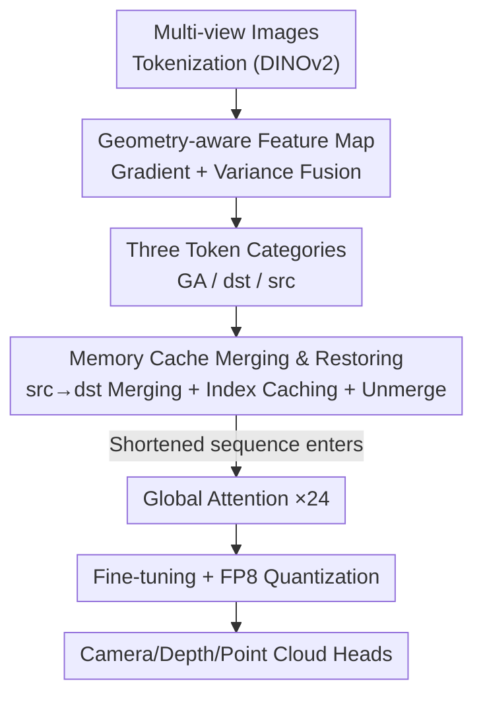

# LiteVGGT: Boosting Vanilla VGGT via Geometry-aware Cached Token Merging

**Conference**: CVPR 2026  
**Paper**: [CVF Open Access](https://openaccess.thecvf.com/content/CVPR2026/html/Shu_LiteVGGT_Boosting_Vanilla_VGGT_via_Geometry-aware_Cached_Token_Merging_CVPR_2026_paper.html)  
**Code**: https://garlicba.github.io/LiteVGGT/ (Project Page)  
**Area**: Model Compression / 3D Vision  
**Keywords**: VGGT acceleration, token merging, geometry-aware, cache reuse, 3D reconstruction

## TL;DR
To address the quadratic complexity bottleneck of global attention in the 3D foundation model VGGT on long sequences, LiteVGGT proposes a "geometry-aware + cross-layer cached" token merging strategy. It preserves critical tokens based on geometric importance, merges redundant tokens into anchors, and reuses merging indices across layers. Coupled with fine-tuning and FP8 quantization, it achieves approximately 10× speedup compared to VGGT on 1000-image inputs with almost no performance degradation.

## Background & Motivation

**Background**: Feed-forward 3D reconstruction models (e.g., DUSt3R, MASt3R, Fast3R, VGGT) directly regress camera parameters, depth, and point clouds from multi-view images in a single forward pass, bypassing the complexity of traditional MVS and per-scene optimization of NeRF. Among these, VGGT (1.2B parameters) is the current SOTA foundation model capable of handling image sequences of arbitrary lengths and predicting all 3D attributes simultaneously.

**Limitations of Prior Work**: The frame-global attention in VGGT concatenates tokens from all images for all-to-all self-attention to ensure cross-frame consistency. This results in computational and memory costs that grow quadratically with the number of tokens. In practice, vanilla VGGT suffers from OOM (Out of Memory) at 500 images; even an optimized VGGT* version takes 20 minutes for 1000 images on an H20 GPU, making it unsuitable for large-scale scenes.

**Key Challenge**: Concurrent works involve trade-offs: StreamVGGT switches to sequential input but sacrifices single-shot end-to-end capability; QuantVGGT relies on per-scene quantization calibration, leading to poor generalization. FastVGGT adopts generic token merging (derived from LLMs/VLMs/diffusion models) but **ignores the geometric coupling between VGGT tokens, image patches, and 3D point clouds**. Random or fixed-stride sampling tends to merge high-information geometric tokens (edges, textures) with low-information ones, causing loss of critical details and residual redundancy.

**Goal**: Reduce the redundancy of global attention while maintaining the reconstruction quality of vanilla VGGT, enabling efficient processing of large scenes with thousands of images.

**Key Insight**: The authors made two 3D-specific observations. First, feeding pure edge maps (removing all texture and photometry) to models like VGGT or DepthAnything-V2 still yields reasonable geometric results, suggesting that 3D models rely heavily on structural contours (edges) for geometric reasoning. Thus, edges, high-gradient, and high-variance regions constitute the geometric skeleton and must be preserved during merging. Second, token similarity between adjacent network layers is stable, meaning merging decisions can be reused across layers instead of being recomputed for each.

**Core Idea**: Replace generic random merging with "geometry-aware token priority + cross-layer cached merging indices" to preserve critical geometric tokens while eliminating the overhead of recomputing merging indices at every layer.

## Method

### Overall Architecture
LiteVGGT inserts Geometry-aware Token Merging (GA-merge / unmerge) modules flanking the global attention blocks of VGGT. Before entering global attention, tokens from each frame are classified into three types using a geometry-aware feature map. Redundant "src" tokens are merged into "dst" anchors to shorten the sequence for attention. After attention, the merged tokens are restored (unmerged) to their original layout for subsequent frame-attention and prediction heads. Merging indices are computed only once every 6 layers and reused in between. Performance is further enhanced via fine-tuning to recover accuracy and FP8 quantization to reduce latency and memory usage.

### Key Designs

**1. Geometry-aware Feature Map: Quantifying Importance via Edges and Variance**

Generic merging suffers from "blind merging," where random sampling might blend high-information edge tokens with low-information smooth tokens. The authors compute a geometric importance score for each token by fusing two lightweight clues: a pixel gradient map $\boldsymbol{g}$ extracted via Sobel operators (capturing edges/boundaries, downsampled to token resolution) and a token variance map $\boldsymbol{v}$ (calculated via local average pooling variance after reshaping tokens into a 2D grid). These are normalized and fused:

$$\mathcal{M}_{GA} = \omega \cdot \mathrm{norm}(\boldsymbol{g}) + \varepsilon \cdot \mathrm{norm}(\boldsymbol{v})$$

The $\mathcal{M}_{GA}$ clearly distinguishes high-information tokens from low-redundancy ones. This design directly implements the observation that 3D models rely on structural contours for reasoning by explicitly protecting edge regions.

**2. Three Token Categories: Balancing Compression and Fidelity**

Using the geometric scores, tokens are divided into three categories: **GA Tokens** are the top 10% highest-scoring tokens per frame (edges/textures), which are **completely excluded from merging** to prevent information loss. **dst Tokens** serve as merging anchors, including all tokens from the first frame (serving as the VGGT world coordinate anchor) and the lowest-scoring token in each $2\times2$ grid across other frames (prioritizing smooth areas to maximize merging efficiency). **src Tokens** are the remaining redundant tokens, which are assigned to merge into the most similar "dst" tokens. This separation ensures the "geometric skeleton" is preserved while redundancy is minimized.

**3. Cross-layer Cached Merging & Restoring: Reducing Redundancy and Computation**

Merging matches src tokens to dst tokens via cosine similarity to ensure geometric alignment. Each dst feature is updated by averaging itself with its allocated src tokens:

$$x_d^{\uparrow} = \frac{x_d + \sum_{x_s \in S_d} x_s}{1 + |S_d|}$$

Only the updated $x_d^{\uparrow}$ proceeds to subsequent layers, reducing sequence length. To save time, **index caching** reuses merging indices for 6 layers at a time (computed only 4 times total), which reduces latency by ~20% with negligible accuracy loss. To support the dense outputs of VGGT (depth maps, point clouds), **token unmerging** restores the sequence to its original length before prediction by copying each $x_d^{\uparrow}$ back to all tokens in its represented set $\{x_d\}\cup S_d$. Local geometric differences are recovered by VGGT's Frame Attention blocks.

### Loss & Training
Starting from pre-trained VGGT weights, only the aggregator and prediction heads are fine-tuned on mixed datasets like Co3Dv2, BlendMVS, and DL3DV. Training uses 4–48 images per batch on 8×H20 GPUs for 20K steps (~3 days) to compensate for merging-induced precision loss. The learning rate follows a composite schedule: linear warm-up from $1\times10^{-6}$ to $4\times10^{-5}$ for the first 5%, followed by cosine decay to $7\times10^{-7}$. Inference utilizes FP8 quantization via the NVIDIA Transformer Engine, which incurs minimal loss as the core feature representations are preserved by the merging strategy.

## Key Experimental Results

### Main Results
ScanNet-50 Point Cloud Reconstruction (Lower CD is better, Lower Time is better):

| Image Count | Metric | VGGT* | FastVGGT | LiteVGGT |
|-------------|--------|-------|----------|----------|
| 1000        | CD     | 0.485 | 0.436    | **0.428** |
| 1000        | Time   | 1275.1s | 258.3s | **127.2s** |
| 96          | CD     | 0.418 | 0.409    | **0.329** |
| 96          | Time   | 16.7s | 6.4s     | **3.5s** |

Vanilla VGGT triggers OOM beyond 296 images. LiteVGGT is ~10× faster than VGGT* on 1000 images and achieves a lower CD. In Tanks & Temples large-scale scenes, LiteVGGT outperforms FastVGGT across two thresholds, with a runtime of 29.52s vs. 221.45s for VGGT*.

### Ablation Study
Incremental module addition on DTU / ScanNet-50 / 7Scenes (Lower Overall/CD is better, Lower Time/Mem is better):

| Configuration            | DTU Over.↓ | CD↓   | Time↓  | Mem.↓ |
|--------------------------|-----------|-------|--------|-------|
| VGGT*                    | 0.534     | 0.485 | 1275.1 | 58.29 |
| + GA token merging       | 0.696     | 0.402 | 258.7  | 60.34 |
| + Fine-tuning            | 0.642     | 0.396 | 198.3  | 57.43 |
| + Cache Merge Indices    | 0.688     | 0.412 | 198.3  | 57.43 |
| + FP8 quantization       | **0.716** | 0.428 | **126.2** | **45.31** |

### Key Findings
- GA token merging is the primary driver of latency reduction, cutting time from 1275s to ~259s. Index caching further reduces latency by ~20% with almost no impact on accuracy.
- Fine-tuning is essential for recovering precision lost during merging; without it, DTU Overall is significantly higher (0.696 vs. 0.642).
- FP8 quantization primarily benefits memory and latency (Mem. reduced from ~57 to 45.31 GiB) with minimal accuracy cost due to the preserved feature representations.
- On DTU object-level reconstruction, LiteVGGT is slightly inferior to VGGT but significantly outperforms FastVGGT, proving that geometry-aware merging is better suited for 3D tasks than generic methods.

## Highlights & Insights
- **"Reconstruction from edge maps" is the theoretical pillar**: The counter-intuitive experiment showing that models can reconstruct geometry from just contours validates the design principle of protecting edge tokens.
- **Cross-layer caching turns merging into a temporal lever**: Observing stability in adjacent layer similarities allowed the authors to recompute indices only every 6 layers, a strategy applicable to other acceleration scenarios involving repeated token selection.
- **Merging and quantization are synergistic**: Token merging preserves core feature representations, making FP8 quantization nearly lossless. The combination of these two compression methods is a valuable engineering pattern.

## Limitations & Future Work
- Hyperparameters like GA token ratio (10%), $2\times2$ anchor grids, and 6-layer cache intervals are empirical; their sensitivity to different scene densities is not fully explored.
- Fine-tuning requires 8×H20 for ~3 days, presenting a high reproduction barrier. The method is also strictly tied to the VGGT architecture.
- In large scenes, F1 scores remain slightly lower than VGGT, and object-level DTU results are slightly behind the original model, indicating visible but acceptable losses in geometric detail.
- Specific values and selection methods for the fusion weights $\omega, \varepsilon$ are not detailed.

## Related Work & Insights
- **vs. FastVGGT**: Both use token merging, but FastVGGT uses generic random sampling from LLM paradigms, ignoring the geometric coupling of VGGT tokens. LiteVGGT uses geometry-aware partitioning and cross-layer caching for better quality and speed.
- **vs. QuantVGGT**: QuantVGGT relies on scene-specific calibration, limiting generalization; LiteVGGT's FP8 quantization is a generic post-processing step built on top of preserved features.
- **vs. StreamVGGT**: StreamVGGT sacrifices single-shot capability with sequential inputs; LiteVGGT retains the core single-forward pass advantage of VGGT while compressing redundancy.
- **vs. ToMe / ToMeSD**: Origins of visual token merging for semantic tokens and random sampling; LiteVGGT adapts "token unmerging" for dense 3D outputs and incorporates geometric priors.

## Rating
- Novelty: ⭐⭐⭐⭐ Solid geometry-aware and cross-layer cache approach tailored for 3D tokens.
- Experimental Thoroughness: ⭐⭐⭐⭐⭐ Comprehensive coverage across tasks (ScanNet/7Scenes/NRGBD/DTU/T&T) with clear ablations.
- Writing Quality: ⭐⭐⭐⭐ High logic flow driven by observations, though some hyperparameter details are sparse.
- Value: ⭐⭐⭐⭐⭐ Directly enables VGGT to process 1000-image scenes, highly significant for practical feed-forward 3D reconstruction.

<!-- RELATED:START -->

## Related Papers

- [\[CVPR 2026\] HTTM: Head-wise Temporal Token Merging for Faster VGGT](httm_head-wise_temporal_token_merging_for_faster_vggt.md)
- [\[CVPR 2026\] Co-Me: Confidence Guided Token Merging for Visual Geometric Transformers](co-me_confidence_guided_token_merging_for_visual_geometric_transformers.md)
- [\[CVPR 2026\] Saliency-Driven Token Merging for Vision Transformers](saliency-driven_token_merging_for_vision_transformers.md)
- [\[CVPR 2026\] CORE: Compact Object-centric REpresentations as a New Paradigm for Token Merging in LVLMs](core_compact_object-centric_representations_as_a_new_paradigm_for_token_merging_.md)
- [\[CVPR 2026\] QVGGT: Post-Training Quantized Visual Geometry Grounded Transformer](qvggt_post-training_quantized_visual_geometry_grounded_transformer.md)

<!-- RELATED:END -->
