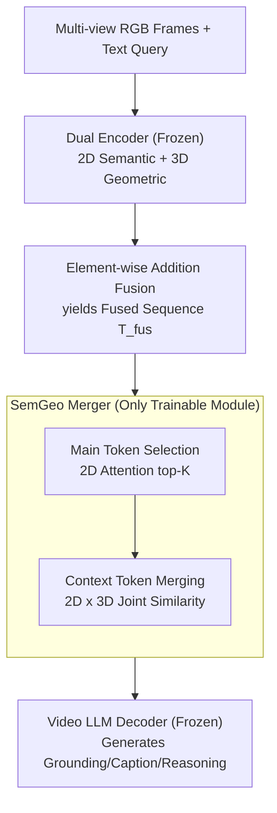

# Merge3D: Efficient 3D Multimodal LLMs via Joint 2D-3D Token Merging

**Conference**: CVPR 2026  
**Paper**: [CVF Open Access](https://openaccess.thecvf.com/content/CVPR2026/html/Pan_Merge3D_Efficient_3D_Multimodal_LLMs_via_Joint_2D-3D_Token_Merging_CVPR_2026_paper.html)  
**Code**: https://tianbo-pan.github.io/merge3d/ (Project page, includes code/checkpoint)  
**Area**: Model Compression / Multimodal VLM  
**Keywords**: 3D Multimodal LLM, Visual Token Merging, Geometry-Aware Compression, Dual Encoder, Inference Acceleration

## TL;DR
Merge3D introduces a semantic-geometric joint token merger (SemGeo Merger) for 3D video MLLMs with "2D semantic + 3D geometric" dual encoders. It uses 2D attention to select semantically salient main tokens and utilizes joint 2D×3D similarity to merge context tokens into spatial neighborhoods. While reducing visual tokens by up to 70% and achieving ~3× acceleration, it preserves performance in 3D grounding, description, and spatial reasoning.

## Background & Motivation
**Background**: Feeding multi-view RGB images as sequences into MLLMs for 3D scene understanding is becoming popular. Feed-forward 3D reconstruction models like VGGT can extract geometric priors from multi-view images. Consequently, dual-encoder architectures such as VG LLM and Spatial-MLLM (using "2D semantic encoder + 3D geometric encoder") can perform 3D visual grounding and spatial reasoning without explicit 3D inputs (point clouds/BEV).

**Limitations of Prior Work**: Dual encoders produce **extremely long visual token sequences** for multi-frame videos. Transformer computation grows approximately quadratically with the number of tokens ($$FLOPs \propto T(4nd^2+2n^2d+2ndm)$$), leading to massive training and inference overhead. The number of visual tokens in video often exceeds textual tokens by more than an order of magnitude.

**Key Challenge**: While there is significant redundancy in visual tokens, existing 2D token compression methods (e.g., VisionZip) only consider semantic signals. This leads to merging tokens that are "visually similar but spatially distant," which destroys 3D structural priors and cross-frame correspondences, causing grounding performance to collapse.

**Goal**: Achieve aggressive token compression in dual-encoder 3D MLLMs while preserving 3D spatial fidelity (grounding, cross-frame consistency, and view invariance).

**Key Insight**: The authors empirically discovered a **task-dependency pattern**: 2D attention-guided merging is stronger for spatial reasoning (CV-Bench, BLINK), while 3D attention-guided merging is superior for 3D grounding/detection (Scan2Cap). Feature distribution analysis also shows that 3D geometric tokens cluster tightly (encoding spatial proximity and cross-frame consistency), while 2D semantic tokens are more dispersed (encoding fine-grained appearance). Since they are complementary, both semantic saliency and geometric consistency should be integrated into the merging process.

**Core Idea**: Main tokens are selected based on 2D semantics, while context tokens are merged using joint 2D×3D similarity. Only tokens that are both "semantically correlated and geometrically proximal" are merged together.

## Method

### Overall Architecture
Merge3D is built upon VG LLM, keeping the 2D visual encoder, 3D geometric encoder, and video LLM decoder **frozen**. A SemGeo Merger is inserted after "2D-3D fusion" and before being "fed into the decoder." Given multi-frame RGB $\{I_k\}$ and a text query: the 2D encoder produces semantic features $F^{2D}_k$, and the 3D geometric encoder produces geometric features $F^{3D}_k$ (each undergoes 2×2 neighborhood downsampling). These are fused via element-wise addition into $F^{fus}_k=F^{2D'}_k+F^{3D'}_k$ and flattened into a fused sequence $T^{fus}$ of length $n=m\cdot h\cdot w$. The SemGeo Merger shortens $T^{fus}$ in two steps: selecting main tokens and then merging the remaining context tokens into them, resulting in the compressed sequence $\hat T^{fus}$, which is concatenated with text tokens for the decoder.

### Key Designs

**1. Main Token Selection: Using 2D Attention to Pick Semantically Salient "Anchors"**

The first step of compression is deciding which tokens to keep as anchors for merging. The authors found that 2D attention maps show concentrated activation in query-related regions, making them ideal for selecting main tokens. Specifically, the attention tensor $A\in\mathbb{R}^{B\times H_a\times n\times n}$ from a specific layer of the 2D encoder is summed over the query dimension and averaged across heads to obtain an importance score. The top-K tokens are selected as the main set $D=\{d_1,\dots,d_K\}$, while the rest form the context set $C=T^{fus}\setminus D$. This step reduces the sequence length to K while preserving the most informative visual evidence. 2D is preferred over 3D for anchor selection because semantic attention aligns better with query relevance, while geometric similarity is better suited for the subsequent "neighborhood merging."

**2. Context Token Merging: Joint 2D×3D Similarity to Merge Only "Relevant and Proximal" Tokens**

Simply selecting main tokens loses information. The second step recovers information from context tokens into the main tokens, but it must avoid the mistake of merging "distant but visually similar" tokens (the root cause of VisionZip's grounding failure in 3D). Merge3D flattens both 2D features $V$ and 3D features $G$. For any main token $d_k$ and context token $c$, it calculates semantic similarity $s_{sem}(k,c)=\exp(v_k^\top v_c/\tau_{sem})$ and geometric similarity $s_{geo}(k,c)=\exp(g_k^\top g_c/\tau_{geo})$, then **multiplies** them to get the joint similarity $s_{fuse}=s_{sem}\cdot s_{geo}$. Each context token is assigned to the main token with the highest joint similarity $a(c)=\arg\max_k s_{fuse}(k,c)$. Context tokens in the same group are averaged and added to the main token: $\hat d_k=d_k+\frac{1}{|C_k|}\sum_{c\in C_k}c$. **Multiplicative** fusion is critical: only tokens that are simultaneously semantically related and geometrically proximal receive high weights, thus preserving cross-frame correspondence and view invariance without losing semantic saliency.

**3. Frozen Backbone with Trainable Merger: Plug-and-Play and Training-Efficient**

The entire 2D encoder, 3D geometric encoder (VGGT), and video LLM backbone (Qwen2.5-VL) are frozen. Only the SemGeo Merger is fine-tuned to adapt the model to the compressed token sequence without breaking pre-trained priors. The SemGeo Merger can run frame-by-frame or on the entire video and does not modify any backbone parameters, allowing it to serve as a universal compression module for dual-encoder 3D MLLMs. This "train only a lightweight merger" setup yields incredible training efficiency: the 4B variant converges in just 1/4 epoch (2-3 hours) on 8×H100.

### Loss & Training
The model uses a standard next-token prediction objective for multi-task training. Data follows the VG LLM setup: 3D scene understanding uses ScanRefer (36,665 object descriptions/562 scenes) for grounding and Scan2Cap (with Mask3D proposals) for dense captioning; spatial reasoning uses the SPAR-7M subset (234K, 33 task types) and LLaVA-Video-178K (63K). Optimization uses Adam with a batch size of 64, a warmup ratio of 0.03, and a peak learning rate of 1e-5 followed by linear decay.

## Key Experimental Results

### Main Results
Evaluations were conducted on three complementary benchmarks: Scan2Cap (3D dense captioning + grounding, reporting CIDEr/BLEU-4/METEOR/ROUGE-L at IoU=0.5), CV-Bench (2D/3D spatial reasoning), and BLINK (Depth/Spatial/Multi-View). Below is the performance-efficiency trade-off for Merge3D at different token retention rates on Scan2Cap (baseline is VG LLM-4B, which does not use explicit 3D inputs).

| Configuration | 3D Input | C@0.5 | B-4@0.5 | M@0.5 | R@0.5 | Gain (Speedup) |
|------|---------|-------|---------|-------|-------|------|
| Video-3D LLM | ✓ | 80.0 | 40.2 | 28.5 | 61.7 | — |
| LLaVA-3D | ✓ | 79.2 | 41.1 | 30.2 | 63.4 | — |
| Baseline (VG LLM-4B) | ✗ | 78.6 | 40.9 | 28.6 | 62.4 | 1× |
| Merge3D (30% Keep) | ✗ | 73.4 | 39.3 | 28.2 | 61.6 | 2.5× |
| Merge3D (10% Keep) | ✗ | 66.1 | 37.9 | 27.5 | 61.1 | 2.8× |
| Merge3D (5% Keep) | ✗ | 57.9 | 36.1 | 26.8 | 60.5 | 3.1× |

At 30% retention (70% reduction), CIDEr retains approximately 93.4% of the baseline and remains competitive with Video-3D LLM/LLaVA-3D which require explicit 3D inputs. Even at 5% extreme compression, ROUGE-L only drops from 62.4 to 60.5.

### Ablation Study
Comparison with three VisionZip-style baselines (Scan2Cap CIDEr at consistent retention rates):

| Keep Rate | Randomzip | Visionzip-2D | Visionzip-3D | **Merge3D** |
|-----------|-----------|--------------|--------------|-------------|
| 5% | 51.2 | 49.5 | 52.4 | **57.9** |
| 10% | 58.5 | 59.5 | 61.0 | **66.1** |
| 30% | 70.2 | 71.9 | 72.2 | **73.4** |

CV-Bench Average Accuracy (5% Retention): Merge3D 74.8% vs Visionzip-2D 68.9% / Visionzip-3D 63.6% / Randomzip 65.1%, leading by +5.9 to +11.2 points. At 30% retention, Merge3D achieves 79.6%, preserving ~97% of the baseline (82.1%). On BLINK (30% keep), Merge3D hits 67.5% (98.7% of the 68.4% baseline).

### Key Findings
- **2D/3D Task Dependency Exists**: Visionzip-3D outperforms Visionzip-2D on grounding-sensitive metrics (CIDEr/ROUGE), while Visionzip-2D performs better on BLEU-4/METEOR (caption fluency) and 2D CV-Bench subsets—confirming geometry's role in grounding and semantics' role in appearance.
- **Joint Similarity Dominates**: Merge3D achieves the highest CIDEr at every retention rate while maintaining competitive BLEU-4/METEOR, proving "joint semantic + geometric modeling" is key to preserving object-level grounding signals under heavy compression.
- **Aggressive Compression Benefits**: The lead over baselines is greatest at 5% extreme compression, validating that multiplicative fusion can still identify correct merging pairs when tokens are extremely scarce.
- **Multi-View remains a Common Challenge**: All methods plateau at 55~57% on the BLINK Multi-View subset, suggesting that large perspective changes may require mechanisms beyond token merging.

## Highlights & Insights
- **Decoupling "Who to Select" from "Who to Merge"**: Using 2D semantics for anchor selection and 3D geometry for context merging leverages the strengths of each modality—a clever design for dual-encoder compression.
- **Multiplicative Fusion Prevents Mis-merging**: $s_{sem}\cdot s_{geo}$ ensures the total score is low if either similarity is low, preventing the merging of objects that look similar but are spatially distant—a highly transferable similarity design principle.
- **Training-free Friendly and Plug-and-Play**: With frozen backbones and only a merger to train, convergence in 2-3 hours makes it an ideal lightweight efficiency upgrade for existing dual-encoder 3D MLLMs.
- **Systemic Task Dependency Analysis**: The analysis of 2D vs 3D dominance provides a clear design foundation for future 3D token compression research.

## Limitations & Future Work
- **Dependency on Dual-Encoder Architectures**: The method is tied to "2D semantic + 3D geometric" dual encoders (like VG LLM/Spatial-MLLM) and is not directly applicable to single-encoder or explicit point cloud models.
- **Multi-View Consistency Unresolved**: Performance drops across all methods under large viewpoint changes; token merging does not solve this, and the authors acknowledge the need for additional mechanisms.
- **Performance Loss at Extreme Compression**: At 5% retention, Scan2Cap CIDEr drops from 78.6 to 57.9 (~73.7%); grounding tasks still pay a significant price under extremely sparse tokens.
- **Future Improvements**: Adapting merging across decoder layers (progressive compression) or introducing explicit cross-view alignment terms for Multi-View could improve the performance floor for extreme compression.

## Related Work & Insights
- **vs VisionZip**: VisionZip uses 2D attention for anchor selection and semantic similarity for merging but lacks 3D structural awareness, leading to incorrect merging across object boundaries. Merge3D fixes this 3D grounding pain point using 2D anchors + 2D×3D joint similarity merging.
- **vs VG LLM / Spatial-MLLM**: These models introduce VGGT to inject implicit 3D priors into multi-view images but suffer from high overhead due to long token sequences. Merge3D builds on VG LLM as an efficiency enhancement.
- **vs General Token Compression (Dynamic-VLM / Balanced Token Pruning / PVC)**: These are mostly designed for global video QA and treat visual tokens as pure semantics, rarely considering 3D geometry or dual-encoder representations. Merge3D is the first geometry-aware merging framework for dual-encoder 3D video MLLMs.

## Rating
- Novelty: ⭐⭐⭐⭐ First geometry-aware token merging for dual-encoder 3D MLLMs; the "2D selection + 2D×3D merging" division is clear and well-motivated.
- Experimental Thoroughness: ⭐⭐⭐⭐ Three benchmarks × multiple retention rates × three baselines + qualitative visualization; fairly comprehensive, though validated only on one backbone (VG LLM).
- Writing Quality: ⭐⭐⭐⭐ Strong causal link from motivation (2D/3D task dependency observation) to method; complete formulas and diagrams.
- Value: ⭐⭐⭐⭐ Plug-and-play, training-efficient, and provides ~3× acceleration; direct practical value for 3D MLLM deployment in robotics.

<!-- RELATED:START -->

## Related Papers

- [\[CVPR 2026\] MeToM: Metadata-Guided Token Merging for Efficient Video LLMs](metom_metadata-guided_token_merging_for_efficient_video_llms.md)
- [\[CVPR 2026\] ViLearn: Accelerating Training Convergence of Image-to-3D Generation via Visibility Learning](vilearn_accelerating_training_convergence_of_image-to-3d_generation_via_visibili.md)
- [\[CVPR 2026\] Co-Me: Confidence Guided Token Merging for Visual Geometric Transformers](co-me_confidence_guided_token_merging_for_visual_geometric_transformers.md)
- [\[CVPR 2026\] Saliency-Driven Token Merging for Vision Transformers](saliency-driven_token_merging_for_vision_transformers.md)
- [\[CVPR 2026\] HTTM: Head-wise Temporal Token Merging for Faster VGGT](httm_head-wise_temporal_token_merging_for_faster_vggt.md)

<!-- RELATED:END -->
