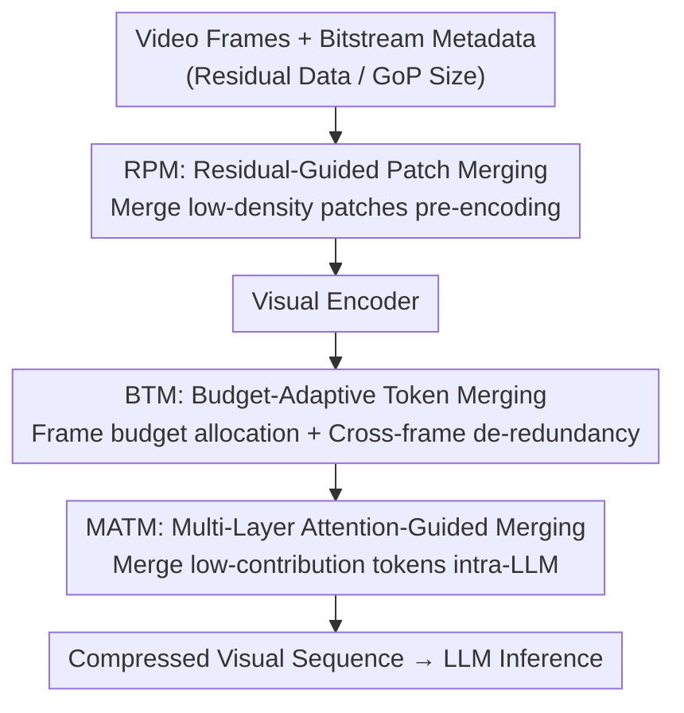

# MeToM: Metadata-Guided Token Merging for Efficient Video LLMs

**Conference**: CVPR 2026  
**Paper**: [CVF Open Access](https://openaccess.thecvf.com/content/CVPR2026/html/Wu_MeToM_Metadata-Guided_Token_Merging_for_Efficient_Video_LLMs_CVPR_2026_paper.html)  
**Code**: Not released  
**Area**: Model Compression / Video Multimodal  
**Keywords**: Video Large Language Models, Visual Token Compression, Codec Metadata, Training-free, Inference Acceleration

## TL;DR
MeToM utilizes "free" bitstream metadata from video codecs (residual energy, GoP packet size) as zero-cost proxies for spatio-temporal information density. It employs three modules—RPM, BTM, and MATM—to hierarchically merge visual tokens at "tokenization, pre-LLM, and intra-LLM" stages based on content complexity. Without any training, it achieves 2.65× end-to-end inference acceleration across multiple Video LLMs while maintaining or even improving accuracy.

## Background & Motivation
**Background**: Mainstream Video LLMs adopt LLaVA-style architectures, where multi-frame images are converted into visual embeddings by a visual encoder, projected, and fed into an LLM with text for multimodal reasoning. However, videos generate tens of thousands of visual tokens, and attention complexity grows quadratically with sequence length, leading to prefill latency and memory (KV cache) explosions that hinder deployment.

**Limitations of Prior Work**: To reduce overhead, visual token pruning/merging is commonly used, categorized into two types: "pre-LLM" pruning based on feature similarity or attention scores, and "intra-LLM" methods to shorten effective context. However, these methods almost always allocate token budgets **uniformly** across frames and regions. In reality, the spatio-temporal information density of video is **highly non-uniform**: static backgrounds and smooth regions carry sparse information, while foreground objects, texture boundaries, and intense motion segments are critical. Uniform strategies lead to severe resource mismatch—valuable budget is wasted on non-informative backgrounds, leaving complex dynamic regions under-represented.

**Key Challenge**: To achieve content-adaptive token allocation, one must first **measure** the information density of each region/frame. However, directly estimating density before the visual encoder is itself an expensive feature extraction process, which is counterproductive.

**Goal**: To find a **zero-cost, training-free** spatio-temporal information density signal to drive content-adaptive token merging, compressing redundancy at the pre-encoding, pre-LLM, and intra-LLM stages.

**Key Insight**: The authors draw inspiration from traditional video compression—bitstreams **already carry two types of metadata for free**: 1) **Residual data** (non-redundant details remaining after inter/intra-frame prediction) naturally reflects spatial texture richness; 2) **GoP (Group of Pictures) packet size** reflects the temporal complexity of the video segment (more intense motion and structural changes result in larger packets). These signals are obtained during decoding with nearly zero overhead.

**Core Idea**: Use codec metadata as an "information density map" to replace uniform token compression with metadata-guided content-adaptive token merging, while remaining entirely training-free.

## Method

### Overall Architecture
MeToM is a training-free framework that hierarchically compresses visual tokens at **three different stages** along the Video LLM inference pipeline, using a specific type of codec metadata as a density cue for each stage. The input consists of raw video frames and their bitstream metadata; the output is a significantly shortened visual token sequence that preserves key spatio-temporal semantics, fed directly into the LLM. The three modules are: RPM performs early merging during the tokenization stage (pre-visual encoder) based on spatial residuals; BTM performs frame-wise budget allocation and cross-frame redundancy removal before entering the LLM using GoP packet size; and MATM merges low-contribution tokens into neighbors within the LLM using multi-layer attention.

### Key Designs

**1. RPM (Residual-Guided Patch Merging): Reducing spatial redundancy before encoding**

Addressing the pain point that "uniform tokenization wastes computation on low-density backgrounds," RPM **moves merging forward to the tokenization stage, before the heavy visual encoder**, using bitstream residuals as a zero-cost proxy for spatial information density (residuals correlate strongly with local texture richness without requiring feature extraction). Given input frame $I_t$ and its residual $r_t$, per-channel standardization $\tilde r_{t,c}=(r_{t,c}-\mu_{t,c})/(\sigma_{t,c}+\epsilon)$ is applied to unify the dynamic range, followed by calculating pixel-level information density $E_t(x,y)=\sum_{c=1}^{3}\tilde r_{t,c}(x,y)^2$. After min-max normalization and patch-grid aggregation $S_t=\text{GridAggregate}(\text{norm}(E_t))$, patch-level density scores are obtained. Patches below threshold $\tau$ are marked as low-density masks $M_t$. **Spatially adjacent** low-density patches are extracted as connected regions $C_t$, and each region is averaged into one representative token $\bar h_{t,C}=\frac{1}{|C|}\sum_{p\in C}h_{t,p}$ via patch embedding, while high-density patches ($S_t\ge\tau$) are kept at original resolution. This "connectivity-aware" merging suppresses scattered background tokens and avoids redundant encoding—crucially, as it occurs before the encoder, it also saves the visual encoder's own overhead (Vision Tower time reduced from 525ms to 450ms), a benefit post-encoding pruning methods cannot achieve.

**2. BTM (Budget-Adaptive Token Merging): Using GoP size for frame budgeting and temporal redundancy removal**

While RPM addresses spatial redundancy, BTM targets the inherent **temporal** redundancy of video (highly repetitive backgrounds in adjacent frames). BTM uses GoP packet size $c_t$ as a temporal density signal—larger packets indicate more intense motion/structural changes and higher information content. For **budget allocation**, given a global visual token budget $M_v$, each frame is first granted a minimum $m_{\min}$ tokens. The remaining budget is allocated proportionally to $\sqrt{c_t}$: $m_t=m_{\min}+\text{round}\big((M_v-Tm_{\min})\frac{\sqrt{c_t}}{\sum_k\sqrt{c_k}}\big)$, so complex frames receive more tokens. After obtaining frame-wise budgets, three steps are performed: ① **Coreset selection**—the top-$m_t$ tokens are selected based on spatial density scores $s_{t,i}$ as the coreset $T_t$, with others moved to the supplementary set $\bar T_t$; ② **Cross-frame temporal redundancy removal**—cosine similarities $\text{sim}((t,i),(t',j))$ are calculated between core tokens; pairs exceeding threshold $\tau_{tem}$ are merged as $\hat h=(h_{t,i}+h_{t',j})/2$; ③ **Low-density spatial folding**—each low-density token in the supplementary set is merged into its most similar refined core token **within the same frame**. These steps preserve spatial semantics while eliminating temporal repetition.

**3. MATM (Multi-Layer Attention-Guided Merging): Utilizing multi-layer attention intra-LLM for stable merging**

Visual attention is sparse within the LLM, but **single-layer** attention distributions are highly volatile. Existing methods that prune tokens based on single-layer attention make unstable decisions. MATM instead **aggregates attention across multiple layers**: for a set of layers $L$, the aggregated importance of token $i$ is $a_i=\frac{1}{|L|}\sum_{\ell\in L}a_i^{(\ell)}$. Based on this, the bottom $R\%$ of visual tokens are judged as redundant and merged into the most similar (cosine) retained token $v'_{r^\star}=\text{average}(v_{r^\star},v_j)$. Multi-layer aggregation stabilizes saliency estimation, further shortening the visual sequence and directly reducing prefill FLOPs and KV cache occupancy (LLM backbone prefill reduced from 1329ms to 215ms, approx. 6.2×).

## Key Experimental Results

### Main Results
Evaluated on LLaVA-OneVision-7B against 5 training-free SOTA methods (FastV / ToMe / DyCoke / STTM / HoliTom) across 5 video QA benchmarks (VideoMME, LongVideoBench, MLVU, EgoSchema, NExT-QA). **All accuracies are reported relative to the 100% budget baseline**. TTFT (Time-To-First-Token, i.e., prefill latency) and NV (number of visual tokens retained) are lower-is-better.

| Configuration | Avg. Accuracy (Rel. 100%) | Avg. TTFT (Rel. 100%) | Description |
|------|------|------|------|
| 100% LLaVA-OV-7B | 100.0 | 100 | Full token baseline |
| 50% + ToMe | 101.2 | 50.4 | Second-tier |
| 50% + HoliTom | 100.4 | 46.3 | — |
| **50% + MeToM** | **102.0** | **41.5** | Accuracy exceeds baseline by 2.0%, lowest TTFT |
| 30% + FastV | 98.4 | 31.5 | Below baseline, key info lost |
| 30% + ToMe | 100.7 | 34.1 | Slightly higher but limited latency gain |
| **30% + MeToM** | **101.2** | **27.3** | Highest accuracy and lowest TTFT under aggressive budget |

### Cross-Backbone Generalization and Efficiency

| Backbone / Budget | MeToM Performance | Comparison |
|------|------|------|
| LLaVA-Video-7B @30% | Retains 98.4% accuracy | FastV 96.0%, HoliTom 97.4% |
| Qwen2VL-7B @30% | TTFT 23.7% (lowest), Accuracy +1.3% | ToMe drops to 97.9% |
| LLaVA-Video-72B @50% | Accuracy +1.4% (101.4%), TTFT 41.9% | Only method significantly improving accuracy |
| LLaVA-Video-72B @30% | Retains 99.1% | ToMe 97.1%, DyCoke 98.3% |

Efficiency Breakdown (Fig. 3, TTFT divided into Vision Tower / LLM Backbone / Other): LLM backbone prefill 1329ms → 215ms (**6.2×**); Vision Tower 525ms → 450ms (due to RPM pre-encoding); preprocessing takes only 53ms (HoliTom 92ms, DyCoke 58ms); total TTFT reduced to 718ms, providing **2.65× end-to-end acceleration**.

### Key Findings
- **Superiority under aggressive budgets**: At a 30% budget, while FastV and HoliTom drop below the baseline, MeToM maintains 101.2%, proving metadata-guided allocation prioritizes tokens effectively.
- **Pre-encoding merging is a unique benefit**: Because RPM operates before the visual encoder, MeToM saves Vision Tower time, whereas post-encoding methods must run the full Vision Tower before compression.
- **Metadata is nearly free**: Preprocessing takes only 3ms more than the baseline (53 vs 50ms) but yields 2.65× acceleration.

## Highlights & Insights
- **Repurposing "compression byproducts" for inference compression**: Residual energy and GoP sizes are computed during video encoding and are free during decoding. Using them as spatio-temporal density maps is an elegant "free lunch" that avoids the trap of performing expensive feature extraction to measure density.
- **Three-stage hierarchical optimization**: Spatial redundancy is handled pre-encoding (RPM), temporal redundancy pre-LLM (BTM), and semantic contribution intra-LLM (MATM). Using different signals for different stages ensures they complement each other without conflict.
- **Transferability**: The idea of using bitstream metadata as a cheap saliency prior can be generalized to any task requiring prioritization among massive frames, such as video retrieval or streaming understanding.

## Limitations & Future Work
- Strong dependence on **codec metadata availability**: If the video is transcoded, re-encoded, or provided as raw frames, the residual and GoP signals might be distorted or missing, reducing the method's effectiveness.
- Residuals/packet sizes are **compression domain** proxies and are not perfectly equivalent to "semantic importance"—highly textured but semantically irrelevant regions (e.g., complex background noise) might be wrongly preserved.
- There are several hyperparameters ($\tau$, $\tau_{tem}$, $m_{\min}$, $L$, $R\%$). Sensitivity analyses for these are not fully detailed in the main text.
- Future work could introduce richer metadata signals and extend the framework to streaming and retrieval-augmented video understanding.

## Related Work & Insights
- **vs FastV / HoliTom (Attention Pruning)**: These use uniform budgets and rely solely on intra-LLM attention, leading to performance drops under aggressive budgets. MeToM uses metadata for content-adaptive budgeting, remaining stable at 30% budget.
- **vs ToMe (Feature Similarity Merging)**: ToMe merges after encoding based on similarity, offering limited latency benefits (TTFT 34.1%). MeToM moves merging pre-encoding and across three stages, reducing TTFT to 27.3%.
- **vs DyCoke / STTM (Spatio-temporal Compression)**: These also target redundancy but derive density cues from internal model computations. MeToM uses zero-cost bitstream metadata, resulting in lower preprocessing overhead (53ms vs ~58/45ms).

## Rating
- Novelty: ⭐⭐⭐⭐⭐ Using bitstream metadata as a density prior for training-free, pre-encoding merging is highly novel.
- Experimental Thoroughness: ⭐⭐⭐⭐ Extensive comparison across 4 backbones and 5 benchmarks; however, main text lacks detailed module-wise ablation.
- Writing Quality: ⭐⭐⭐⭐ Clear motivation, mechanisms, and formulas for the three modules.
- Value: ⭐⭐⭐⭐⭐ Plug-and-play, training-free, 2.65× acceleration with no accuracy loss—high deployment value.

<!-- RELATED:START -->

## Related Papers

- [\[CVPR 2026\] Merge3D: Efficient 3D Multimodal LLMs via Joint 2D-3D Token Merging](merge3d_efficient_3d_multimodal_llms_via_joint_2d-3d_token_merging.md)
- [\[CVPR 2026\] Co-Me: Confidence Guided Token Merging for Visual Geometric Transformers](co-me_confidence_guided_token_merging_for_visual_geometric_transformers.md)
- [\[ICLR 2026\] SURGE: Surprise-Guided Token Reduction for Efficient Video Understanding with VLMs](../../ICLR2026/vlm_efficiency/surge_surprise-guided_token_reduction_for_efficient_video_understanding_with_vlm.md)
- [\[CVPR 2026\] HTTM: Head-wise Temporal Token Merging for Faster VGGT](httm_head-wise_temporal_token_merging_for_faster_vggt.md)
- [\[CVPR 2026\] CORE: Compact Object-centric REpresentations as a New Paradigm for Token Merging in LVLMs](core_compact_object-centric_representations_as_a_new_paradigm_for_token_merging_.md)

<!-- RELATED:END -->
