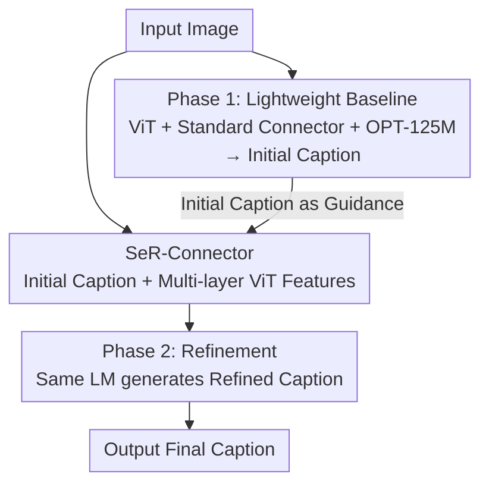

# MM-SeR: Multimodal Self-Refinement for Lightweight Image Captioning

**Conference**: CVPR 2026  
**Paper**: [CVF Open Access](https://openaccess.thecvf.com/content/CVPR2026/html/Song_MM-SeR_Multimodal_Self-Refinement_for_Lightweight_Image_Captioning_CVPR_2026_paper.html)  
**Code**: TBD  
**Area**: Multimodal VLM / Image Captioning / Edge Deployment  
**Keywords**: Lightweight image captioning, self-refinement, multimodal, on-device deployment, visual features  

## TL;DR
The authors first observe that replacing a 7B language model in an MLLM with a 125M OPT can approximate large model performance on factual image descriptions. They then propose MM-SeR, a multimodal self-refinement framework: the lightweight model first generates a coarse description, which then guides the extraction of finer visual features for a second refinement stage. This achieves performance parity with large models on single-sentence/detailed descriptions and long-video QA, while reducing parameters by 93% and inference time by 97%.

## Background & Motivation

**Background**: Systems such as video chatbots and navigation/exploration robots widely rely on "streaming image captioning" to convert visual input into text for downstream LLMs. The current mainstream approach is to directly utilize Multimodal Large Language Models (MLLMs, such as LLaVA-1.5-7B, Qwen-VL).

**Limitations of Prior Work**: MLLMs impose massive computational overhead. As shown in Table 1, models like LLaVA-1.5-7B require over 8GB of VRAM in FP16, while 34B/72B models exceed 68GB/140GB, far surpassing the available memory on edge devices like iPhone or Galaxy. Furthermore, cloud APIs depend on stable network connectivity, which is unavailable in scenarios like disaster rescue. Repeatedly describing multiple frames or scenes further amplifies these costs.

**Key Challenge**: There exists a fundamental trade-off between efficiency and performance in image captioning—either use large models to maintain performance at the cost of deployability, or use small models that are deployable but limited in capability. The authors question: Is image captioning truly so difficult that an MLLM is mandatory?

**Goal**: ① Verify whether an extremely small language model can handle image captioning; ② Bridge the "reliability gap" between lightweight models and large models.

**Key Insight**: The authors observe that the power of MLLMs largely stems from the complex reasoning abilities of large LLMs. However, factual image captioning is essentially about "enumerating visual details in a frame," which relies more on perceptual grounding than abstract reasoning. Consequently, they replaced LLaMA-7B in LLaVA-1.5 with OPT-125M (56× smaller) and found it could match MLLM performance on MS COCO, validating this hypothesis.

**Core Idea**: Mimicking the human visual process of "viewing a global coarse description and then focusing on salient regions for refinement," the authors introduce a multimodal self-refinement phase (MM-SeR) to the lightweight captioning model. The initial caption produced by the model guides the extraction of finer multi-layer visual features, bridging the fine-grained description gap without stacking large models.

## Method

### Overall Architecture
The starting point of MM-SeR is that traditional captioning models are "single-pass"—the image is processed once to produce text, which often leads to "visual blind spots" (blurred visual features or missed details). MM-SeR extends this into "Initial + Refinement" stages: the model first generates an initial caption capturing the overall scene, then uses this (potentially coarse) caption to guide a dedicated connector (SeR-Connector) to extract clearer and more informative visual cues from multiple layers of the visual encoder. Finally, the same language model generates the refined final description.

Pipeline: Input Image → ViT Encoding → Standard Connector → Lightweight LM generates Initial Caption → SeR-Connector processes "Initial Caption + Multi-layer ViT Features" → Same LM generates Refined Caption. Note that the initial and refinement stages share the same language model; the difference lies in the connector, where refinement uses the specially designed SeR-Connector.

### Key Designs

**1. Lightweight captioner baseline: Replacing 7B LLM with OPT-125M**

To address the MLLM deployment bottleneck, the authors follow the LLaVA-1.5 architecture but replace LLaMA-7B with OPT-125M (the LLM accounts for ~96% of the computation in LLaVA-7B). Training involves pre-training the multimodal connector on 558K Concept-balanced data, followed by fine-tuning on MS COCO / DCI / ShareGPT4V, keeping all other configurations (batch size, learning rate) identical to LLaVA. Surprisingly, this 450M parameter model achieved a CIDEr score 6.9 points higher than SmallCap (which also uses OPT-125M) on MS COCO and approached 7B-level MLLMs. This finding supports the argument that factual captioning relies on perceptual grounding rather than abstract reasoning.

**2. SeR-Connector + Two-stage refinement: "Looking at what matters + Looking in detail"**

Lightweight models still exhibit a reliability gap, which the authors attribute to "visual blind spots." MM-SeR compensates with two complementary inputs: ① **Looking at what matters**: Feeding the initial caption into the SeR-Connector and LM allows the model to locate and focus on key entities named in the text (e.g., "cat" and "chair" in "a cat relaxing on a brown chair"). ② **Looking in detail**: Instead of adding auxiliary encoders like DINOv2 (which adds 300M parameters, +66.7%), the model extracts multi-layer features from the existing ViT—taking $N$ tokens of $d$ dimensions from $m$ selected layers and concatenating them into an $N \times (md)$ hierarchical representation. The SeR-Connector, implemented with Transformer blocks (self-attention + positional encoding), fuses these inputs for refinement. This stage introduces only ~50M additional parameters and one extra inference pass.

**3. Pseudo-initial caption training: "Small perturbation → Directional correction"**

Training the refinement stage faces a pitfall: if the model's first-pass output is used as input with the ground truth $c_k$ as the target, semantic misalignment often occurs (e.g., initial "a table in front of a window" vs. ground truth "a cat sitting on a table"). The model might learn to ignore the initial caption and "regenerate" from scratch. The authors instead use GPT-4o-mini to apply small perturbations (entities/attributes/relations) to the ground truth $c_k$ to create a pseudo-initial caption $\hat{c}_k$ (e.g., "a cat sitting on a chair" → "a dog sitting on a chair"). The SeR-Connector learns to extract features from $\hat{c}_k$ and visual features to correct these errors. Since $\hat{c}_k$ only deviates at a few token positions $E_k=\{t\mid \hat{c}_{k,t}\neq c_{k,t}\}$, the sequence-level objective:

$$\mathcal{L}(\theta) = -\mathbb{E}\Big[\sum_j \log \pi_\theta\big(c_{k,j}\mid i_k, \hat{c}_k, c_{k,<j}\big)\Big]$$

concentrates gradients on $E_k$, creating "directional optimization"—preserving correct parts while modifying only the errors. This is philosophically similar to DPO treating $c_k/\hat{c}_k$ as "preferred/dispreferred" responses, but MM-SeR assigns them distinct roles as "input/target" rather than symmetric responses.

### Loss & Training
Two-stage training: Stage 1 follows the standard LLaVA pipeline for initial caption generation (10 epochs); Stage 2 uses pseudo-initial captions for refinement training (2 epochs) with the aforementioned cross-entropy loss $\mathcal{L}(\theta)$. Both stages use a batch size of 256 and a learning rate of $2\times10^{-5}$ on 2× A6000 GPUs. The main experiments use OPT-125M, with Qwen2.5-500M used to verify generalization.

## Key Experimental Results

### Main Results
On MS COCO (single-sentence) and ShareGPT4V & DCI (detailed descriptions), the 450M lightweight model approaches 7B/10B MLLMs, with MM-SeR providing consistent improvements.

| Dataset | Model | Params | CIDEr | GPT(MLLM-Judge) |
|--------|------|------|-------|------|
| MS COCO | LLaVA-1.5 (Reference) | 7.3B | 133.7 | 2.93 |
| MS COCO | Our Lightweight Baseline | 450M | 129.6 | 2.74 |
| MS COCO | + MM-SeR(①+②) | 500M | 133.5 (+3.9) | 2.82 |
| ShareGPT4V&DCI | Cambrian (Reference) | 10.5B | 38.7 | 3.00 |
| ShareGPT4V&DCI | Our Lightweight Baseline | 450M | 40.5 | 2.74 |
| ShareGPT4V&DCI | + MM-SeR(①+②) | 500M | 43.6 (+3.1) | 3.02 |

> Note: ① refers to initial caption input, ② refers to multi-layer visual features. The lightweight baseline already outperforms the 10.5B Cambrian on detailed descriptions, which MM-SeR further improves by +3.1.

Regarding efficiency (Table 5, timed over 100 streaming images): LLaVA-1.5 took 274.49s, our baseline took only 5.55s (↓97.97%), and MM-SeR took 7.44s (↓97.28%).

### Ablation Study
Breaking down the contributions of the two MM-SeR inputs (measured via CIDEr / CAPT on ShareGPT4V&DCI):

| Config | CIDEr | CAPT | Description |
|------|-------|------|------|
| Lightweight Baseline (No refinement) | 40.5 | 45.9 | Single-pass description |
| + Only ① Initial Caption | 42.8 | 47.1 | Textual guidance only |
| + Only ② Multi-layer Features | 43.1 | 47.6 | Detailed features only |
| Single-pass with ② | 42.5 | 46.5 | No refinement, just multi-layer features → Limited gain |
| + MM-SeR(①+②) Full | 43.6 | 48.4 | Both inputs are essential |

### Key Findings
- **Inputs are complementary**: Both ① and ② provide gains, but "single-pass inference with multi-layer features ②" yields limited improvement (CIDEr +2.0), suggesting the "refinement step" itself is key.
- **Iterative refinement gains depend on model capacity**: Multiple refinement rounds (×2/×3) provided almost no extra benefit for OPT-125M, whereas OPT-1.3B showed meaningful gains only after 2–3 rounds—small models lack the capacity to utilize multi-step signals, matching the "larger is better" trend in LLM self-refinement.
- **Framework generalizes to larger LMs**: MM-SeR consistently improves OPT-1.3B / LLaMA-2-7B (CAPT +1.2 / +0.9, CIDEr up to +4.4), proving it is a general framework.
- **Downstream validation in Long-video QA**: In the LLoVi long-range VideoQA setting, our specialist achieved 49.3, rising to 50.8 with MM-SeR, approaching the LLaVA-1.5 generalist score of 51.1 while using 14× fewer parameters and taking ~5min vs ~29min.

## Highlights & Insights
- **Solid "Negative to Positive" narrative**: The paper starts with a counter-intuitive discovery (125M LM matching MLLM) to break the assumption that captioning requires large models, then proposes a refinement framework to fill the gaps. The insight that captioning relies on grounding rather than abstraction is highly valuable.
- **First Multimodal Self-Refinement**: While self-refine is common in text LLMs, this work applies it to the multimodal domain, allowing the refinement stage to ingest visual evidence (multi-layer ViT features). Attention visualizations prove that attention converges from "diffuse" to "keyword-corresponding regions" during refinement.
- **Pseudo-caption trick for training**: Converting refinement training into "directional error correction via small perturbations" avoids misalignment issues and provides a comparison with DPO (asymmetric role assignment). This trick can transfer to other "generate-then-revise" multimodal tasks.
- **Efficiency through feature exploitation**: Unlike Interleaved MoF (adding DINOv2, +300M), this work adds only ~50M parameters, emphasizing mining information from existing encoders over stacking modules.

## Limitations & Future Work
- **Small models cannot handle multi-round refinement**: Iterative refinement is ineffective for OPT-125M, indicating the gain ceiling is limited by LM capacity; dynamic iteration adjustments are left for future work.
- **Dependency on GPT-4o-mini**: Constructing training data relies on external large models during the training phase, and the quality of perturbations affects results (details in Appendix G.1).
- **Extra inference overhead**: Although negligible compared to MLLMs, it requires one additional LM forward pass (500M + 50M connector), requiring a trade-off in extreme resource-constrained scenarios.
- **Outlook**: Potential introduction of external tools (e.g., zoom/crop similar to GPT-o3) and designing a unified connector to serve both "looks."

## Related Work & Insights
- **vs. SmallCap / Tag2Text (Lightweight Captioning)**: These focus on reducing trainable parameters (retrieval-augmented, mean-teacher distillation, tagging). Ours focuses on inference efficiency and overcoming single-pass limitations, achieving higher CIDEr with the same backbone through architectural modernization and self-refinement.
- **vs. Interleaved MoF / EyesWideShut (Visual Detail)**: These rely on auxiliary visual encoders (e.g., DINOv2, +300M). Ours uses multi-layer features and textual guidance without expanding the architecture, keeping parameter costs an order of magnitude lower.
- **vs. LLM Self-Refine (Textual Self-Refinement)**: Textual self-refine allows models to evaluate and revise their own output; ours brings refinement to the multimodal domain with dual guidance from language and vision.

## Rating
- Novelty: ⭐⭐⭐⭐ First multimodal self-refinement framework + counter-intuitive lightweight insights, though refinement paradigms are borrowed from LLMs.
- Experimental Thoroughness: ⭐⭐⭐⭐⭐ Covers single-sentence/detailed/long-video QA + multiple backbones + iteration/efficiency ablations.
- Writing Quality: ⭐⭐⭐⭐ Clear "negative to positive" narrative with sound theoretical comparisons (margin/DPO).
- Value: ⭐⭐⭐⭐ A practical lightweight captioning solution for edge/offline scenarios with significant efficiency gains.

<!-- RELATED:START -->

## Related Papers

- [\[CVPR 2026\] Adapting Lightweight Image-based Counting Models for Video Crowd Counting](adapting_lightweight_image-based_counting_models_for_video_crowd_counting.md)
- [\[CVPR 2026\] OmniZip: Learning a Unified and Lightweight Lossless Compressor for Multi-Modal Data](omnizip_learning_a_unified_and_lightweight_lossless_compressor_for_multi-modal_d.md)
- [\[CVPR 2026\] Differentiable Vector Quantization for Rate-Distortion Optimization of Generative Image Compression](differentiable_vector_quantization_for_rate-distortion_optimization_of_generativ.md)
- [\[CVPR 2026\] ViLearn: Accelerating Training Convergence of Image-to-3D Generation via Visibility Learning](vilearn_accelerating_training_convergence_of_image-to-3d_generation_via_visibili.md)
- [\[CVPR 2026\] Vision-Oriented Lightweight Neural Architecture Search with Budget-Adaptive Evaluation](vision-oriented_lightweight_neural_architecture_search_with_budget-adaptive_eval.md)

<!-- RELATED:END -->
