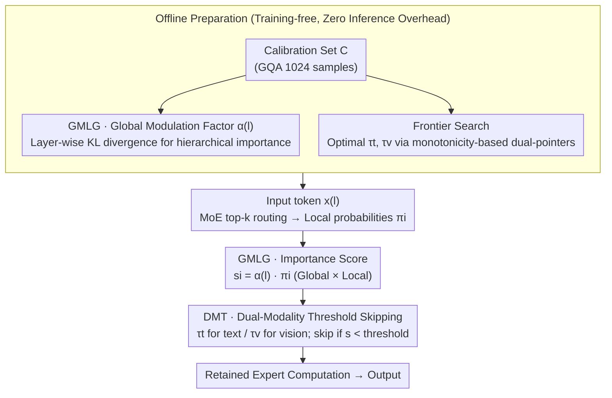

<!-- Generated automatically by src/gen_stubs.py -->
# MoDES: Accelerating Mixture-of-Experts Multimodal Large Language Models via Dynamic Expert Skipping

**Conference**: CVPR2026  
**arXiv**: [2511.15690](https://arxiv.org/abs/2511.15690)  
**Code**: [ModelTC/MoDES](https://github.com/ModelTC/MoDES)  
**Area**: Multimodal VLM  
**Keywords**: MoE Acceleration, Expert Skipping, Multimodal Large Language Models, Training-free, Inference Efficiency

## TL;DR

The authors propose MoDES, the first training-free expert skipping framework for MoE Multimodal Large Language Models (MLLMs). By utilizing Global Modulated Local Gating (GMLG) and a Dual-Modality Threshold (DMT) mechanism to adaptively skip redundant experts, MoDES retains 97%+ of the original performance while skipping 88% of experts, achieving a 2.16× prefill acceleration.

## Background & Motivation

**MoE MLLM Inference Bottleneck**: MoE MLLMs (e.g., Qwen3-VL-MoE-30B) reduce computation via sparse activation, yet each token still interacts with multiple activated experts, resulting in significant inference overhead.

**Limitations of Prior Work**: Existing expert skipping methods like NAEE, MC-MoE, and DiEP were originally designed for unimodal LLMs. Direct application to MLLMs leads to a performance drop of over 10% when skipping 83% of experts.

**Key Insight (i): Uneven Layer Contributions**: Shallow layer experts contribute significantly more to the final output than deep ones—errors introduced in shallow layers are amplified by subsequent layers. However, existing methods make skipping decisions based solely on intra-layer routing probabilities, ignoring global hierarchical importance.

**Key Insight (ii): Behavioral Differences Across Modalities**: Text tokens and vision tokens exhibit significantly different update magnitudes in FFNs. Vision tokens are more orthogonal to FFN weights (angles near 90°), thus receiving less influence from FFNs and exhibiting higher redundancy.

**Key Challenge: Lack of Multimodal-Aware Skipping Strategies**: Prior works adopt a uniform threshold for all modalities, failing to account for the distinct characteristics of text and vision tokens, which leads to suboptimal skipping strategies.

**Key Challenge: High Threshold Search Cost**: Brute-force searching for dual-modality thresholds has a time complexity of $\mathcal{O}(ND^2)$, which can take several days for models with 20-30B parameters.

## Method

### Overall Architecture

MoDES aims to accelerate MoE MLLMs via expert skipping without re-training. The core logic involves measuring the importance of each expert and deciding which to skip based on token modality. Global Modulated Local Gating (GMLG) calculates expert importance scores incorporating global hierarchical weights. Dual-Modality Thresholding (DMT) applies separate thresholds for text and vision tokens to make skipping decisions. These thresholds are efficiently determined offline using a frontier search algorithm. The entire process is training-free, with calibration and search performed offline, introducing zero extra overhead during inference.

### Key Designs

**1. GMLG: Integrating Global Hierarchical Importance into Local Routing Probabilities**

Existing methods rely only on intra-layer routing probabilities. However, shallow layer errors propagate. GMLG multiplies the local routing probability $\pi_i^{(l)}$ (softmax normalized) by a global modulation factor $\alpha^{(l)}$ to obtain the true importance score:

$$s_i^{(l)} = \alpha^{(l)} \cdot \pi_i^{(l)}$$

where $\alpha^{(l)}$ measures the impact of skipping an entire layer on the final output by calculating the mean KL divergence between the original model and the model with skipped layer $l$ on a calibration set $\mathcal{C}$:

$$\alpha^{(l)} = \frac{1}{N}\sum_{j=1}^{N}\mathcal{D}_{\text{KL}}(\text{prob}_j \| \text{prob}_j^{(l)})$$

Calibration is performed once offline using 1024 samples. This protects shallow layers (large $\alpha^{(l)}$) while allowing redundant deep experts to be easily identified and skipped.

**2. DMT: Distinct Skipping Thresholds for Text and Vision Tokens**

The research found that vision tokens are more orthogonal to FFN weights, less influenced by FFNs, and highly redundant. DMT sets separate thresholds $\tau_t$ and $\tau_v$ for text and vision tokens, skipping experts only if their importance score falls below the respective threshold:

$$\{\text{Expert}_i^{(l)} \mid s_i^{(l)} < \tau_t \cdot \mathbb{I}_t + \tau_v \cdot \mathbb{I}_v\}$$

Vision tokens typically receive a larger $\tau_v$ due to higher redundancy, whereas text tokens are handled more cautiously.

**3. Frontier Search: Reducing Dual-Threshold Search Time**

Brute-force searching for $(\tau_t, \tau_v)$ results in $\mathcal{O}(ND^2)$ complexity. This optimization problem is modeled as minimizing KL divergence under a target skipping rate $\rho$. By exploiting the monotonicity of the constraint function $f$ and objective function $g$ with respect to thresholds, a dual-pointer search on the frontier set reduces complexity to $\mathcal{O}(ND)$, achieving a ~45× speedup over brute-force search.

## Key Experimental Results

### Main Results: Comparison on 13 Benchmarks using Kimi-VL-A3B-Instruct

| Method | Skipping Rate | ChartQA | MME | MMBench | LVB | VMMMU | Avg.(%) |
|------|--------|---------|-----|---------|-----|-------|---------|
| Default k=6 | 0% | 89.48 | 2207 | 83.16 | 63.13 | 49.33 | 100.00 |
| DiEP | 83% | 78.31 | 2071 | 76.28 | 52.41 | 43.81 | 87.58 |
| MC-MoE | 83% | 80.25 | 2063 | 73.42 | 54.39 | 44.02 | 88.32 |
| **Ours** | **83%** | **84.20** | **2162** | **81.44** | **62.60** | **47.11** | **96.25** |

### Generalization: Qwen3-VL-MoE-30B with 88% Skipping Rate

| Method | ChartQA | MME | MMBench | VMMMU | Avg.(%) |
|------|---------|-----|---------|-------|---------|
| MC-MoE | 71.43 | 2168 | 75.42 | 37.41 | 86.66 |
| DiEP | 70.51 | 2074 | 73.21 | 34.79 | 85.30 |
| **Ours** | **78.84** | **2403** | **85.57** | **46.56** | **97.33** |

At an aggressive 88% skipping rate, MoDES outperforms the strongest baseline MC-MoE by 10.67 percentage points.

### Ablation Study

| Configuration | ChartQA | MME | MMBench | LVB | VMMMU |
|------|---------|-----|---------|-----|-------|
| Single Threshold Baseline | 76.74 | 1956 | 65.48 | 54.67 | 40.33 |
| +GMLG | 79.28 | 2107 | 75.19 | 60.02 | 43.87 |
| +DMT | 82.94 | 2081 | 79.42 | 61.16 | 45.08 |
| +GMLG+DMT (Full) | **84.20** | **2162** | **81.44** | **62.60** | **47.11** |

(83% skipping rate, Kimi-VL-A3B-Instruct) GMLG and DMT contribute significantly and independently, with gains increasing alongside the skipping rate.

### Key Findings

- **Inference Acceleration**: MoDES achieves 2.16× prefill and 1.26× decoding speedup on Qwen3-VL-MoE-30B.
- **Compatibility with Quantization**: MoDES combined with 2.5-bit quantization retains 94.43% performance on Qwen3, while MC-MoE drops to 89.58%.
- **Skipping Pattern Visualization**: Skipping rates are higher in deep layers; vision tokens are skipped more frequently than text tokens, validating the core insights.
- **Robustness of Calibration Data**: Performance remains stable when using COCO or VMMMU as the calibration set.
- **Search Efficiency**: Frontier search is ~45× faster than brute-force. Total time (calibration + search) for 20-30B models ranges from 20 minutes to under 4 hours.

## Highlights & Insights

- First work to systematically analyze uneven layer contributions and cross-modality behavior differences in MoE MLLMs with empirical support.
- GMLG effectively combines offline global calibration with online local routing without inference overhead.
- DMT replaces unified thresholds with modality-aware dual thresholds, offering a clear design logic.
- Frontier search utilizes monotonicity to reduce complexity from $\mathcal{O}(ND^2)$ to $\mathcal{O}(ND)$, ensuring practical utility.
- Performance loss is <3% when skipping 88% of experts across 3 model series and 13 benchmarks.

## Limitations & Future Work

- Currently limited to text/vision; not yet extended to other modalities like audio.
- $\alpha^{(l)}$ is at the layer level, not distinguishing global importance differences among experts within the same layer.
- Evaluations are focused on image/video understanding; evaluation of generation tasks (e.g., captioning) is limited.
- Limited speedup during the decoding phase (~1.2×) as decoding is memory-bound and processes only text tokens.
- Frontier search relies on a monotonicity assumption which, while practically observed, lacks a rigorous theoretical proof.

## Related Work & Insights

- **NAEE** [Lu et al.]: Skips minor experts based on routing probability ratios, considering only intra-layer information.
- **MC-MoE** [Huang et al., 2024]: Adds attention-aware expert protection and mixed-precision quantization to NAEE.
- **DiEP** [Bai et al., 2025]: Differentiable expert pruning utilizing both routing probabilities and expert similarity.
- Previous methods were designed for unimodal LLMs and perform poorly on MLLMs. MoDES introduces the first global and modality-aware skipping strategy specifically for multimodal scenarios.

## Rating

- Novelty: ⭐⭐⭐⭐ — Compelling insights with a well-reasoned GMLG+DMT design.
- Experimental Thoroughness: ⭐⭐⭐⭐⭐ — Large-scale evaluation across 3 model series and multiple benchmarks.
- Writing Quality: ⭐⭐⭐⭐ — Clear structure and logical flow from motivation to results.
- Value: ⭐⭐⭐⭐ — High practical value for MoE MLLM deployment due to efficiency.

<!-- RELATED:START -->

## Related Papers

- [\[CVPR 2026\] Quant Experts: Token-aware Adaptive Error Reconstruction with Mixture of Experts for Large Vision-Language Models Quantization](quant_experts_token_aware_vlm_quantization.md)
- [\[CVPR 2026\] VVS: Accelerating Speculative Decoding for Visual Autoregressive Generation via Partial Verification Skipping](vvs_accelerating_speculative_decoding_for_visual_autoregressive_generation_via_p.md)
- [\[CVPR 2026\] Blink: Dynamic Visual Token Resolution for Enhanced Multimodal Understanding](blink_dynamic_visual_token_resolution_for_enhanced_multimodal_understanding.md)
- [\[ICCV 2025\] ShortV: Efficient Multimodal Large Language Models by Freezing Visual Tokens in Ineffective Layers](../../ICCV2025/vlm_efficiency/shortv_efficient_multimodal_large_language_models_by_freezing_visual_tokens_in_i.md)
- [\[CVPR 2026\] OmniZip: Audio-Guided Dynamic Token Compression for Fast Omnimodal Large Language Models](omnizip_audio-guided_dynamic_token_compression_for_fast_omnimodal_large_language.md)

<!-- RELATED:END -->
