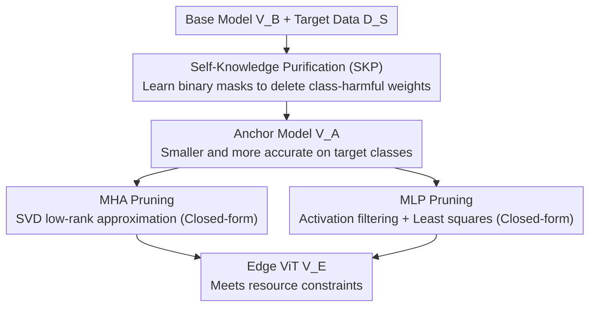

# NuWa: Deriving Lightweight Class-Specific Vision Transformers for Edge Devices

**Conference**: CVPR 2026  
**arXiv**: [2504.03118](https://arxiv.org/abs/2504.03118)  
**Code**: https://github.com/CGCL-codes/NuWa (Available)  
**Area**: Model Compression  
**Keywords**: Structured Pruning, Class-Specific Models, Closed-Form Solution, Training-Free Pruning, Edge Deployment

## TL;DR
Addressing the overlooked scenario where "edge devices only focus on specific classes," NuWa first employs Self-Knowledge Purification (SKP) to learn binary masks that remove "class-harmful weights." Subsequently, it formulates MHA/MLP pruning as closed-form optimization problems, enabling the derivation of smaller ViTs from large ones **without retraining**. These derived models achieve **higher accuracy** than the original on target classes while being faster, with pruning speeds 33.69× faster than state-of-the-art training-dependent methods and costs reduced by up to 99.83%.

## Background & Motivation
**Background**: Deploying ViTs to resource-constrained edge devices like drones and smart vehicles primarily relies on model compression. Structured pruning is considered ideal for edge scenarios due to its regular output, hardware friendliness, and ability to transfer base model weights for initialization. These methods fall into two categories: training-free (using importance metrics like magnitude/activation/gradient) and training-dependent (requiring retraining to recover accuracy).

**Limitations of Prior Work**: Existing methods aim for small models to approximate the base model's performance across **all classes**. This ignores the reality that edge devices often only require specific classes (e.g., smart vehicles prioritize pedestrians and traffic signs over birds). In this "class-specific derivation" setting, simply replacing the calibration set with class-specific data is insufficient. The authors identify two fundamental flaws: ① **Existence of "class-harmful weights"**—randomly removing neurons from the MLP of DeiT-Base can actually **increase** target class accuracy (Fig.1), indicating that certain weights in the base model degrade performance for specific classes, yet traditional importance metrics fail to identify them (Fig.4); ② **Explosive derivation costs**—different scenarios and devices require massive numbers of customized models, but training-dependent methods require per-model configuration searches and retraining, with no reusable intermediate results.

**Key Challenge**: Training-free methods inherently assume "pruning inevitably drops accuracy," thus they cannot remove class-harmful weights. Training-dependent methods, while capable of injecting class-specific knowledge, also fail to explicitly identify class-harmful weights and are hindered by astronomical time and costs due to retraining. Both paradigms are trapped in the "pruning must degrade accuracy" framework.

**Goal**: In class-specific scenarios, the objective is to **identify and remove class-harmful weights** (enabling the small model to outperform the base model) while deriving numerous customized small ViTs rapidly and reusably **without retraining**.

**Key Insight**: The authors observe the counter-intuitive phenomenon where "deleting certain weights improves accuracy," treating it as a "free lunch" within ViTs. Rather than approximating the base model, it is more effective to actively excavate and discard weights that interfere with the target classes.

**Core Idea**: A set of learnable binary masks is used to let the frozen base model "confess" which weights are class-harmful (SKP). The remaining compression task is then formulated as low-rank/least-squares problems with closed-form solutions (OFP), requiring no retraining.

## Method

### Overall Architecture
NuWa takes a pre-trained large ViT $\mathcal{V}_B$, a set of target classes $\mathcal{S}$ with their data $\mathcal{D_S}$, and edge resource constraints (in GFLOPs) as input. It outputs a class-specific small ViT $\mathcal{V}_E$. The pipeline consists of two serial steps: First, **Self-Knowledge Purification (SKP)** freezes $\mathcal{V}_B$ and inserts learnable mask vectors and control factors into each MLP. Driven by the original task loss, the model learns which neurons to delete, resulting in an **"anchor model" $\mathcal{V}_A$** that is smaller yet more accurate on target classes. Second, **Optimization-based Fast Pruning (OFP)** further compresses $\mathcal{V}_A$ to meet constraints—MHA pruning is formulated as low-rank approximation (via SVD), and MLP pruning as least squares (closed-form), directly calculating pruned weights without gradient-based retraining.

### Key Designs

**1. Self-Knowledge Purification (SKP): Identifying Class-Harmful Weights via Self-Learning**

To address the inability of traditional metrics to identify class-harmful weights, SKP creates a pruning space for the model to self-learn. Specifically, $\mathcal{V}_B$ is frozen, and a learnable mask vector $M^{(l)}\in\mathbb{R}^{e_l}$ and a control factor $\beta^{(l)}\in\mathbb{R}^1$ are inserted before the down-sampling weight $W_2^{(l)}$ in each MLP. Binary binarization of $M^{(l)}$ is performed based on $\beta^{(l)}$:

$$M^{(l)}_{\text{bin}}[i]=\begin{cases}1,&M^{(l)}[i]\ge \text{Sel}_{\lfloor e_l\cdot\sigma(\beta^{(l)})\rfloor}(M^{(l)})\\0,&\text{otherwise}\end{cases}$$

where $\text{Sel}_k(v)$ selects the $k$-th largest value and $\sigma$ is the sigmoid function. Thus, $\beta^{(l)}$ controls the retention ratio per layer, while the mask learns which neurons to keep. To handle non-differentiability, the Straight-Through Estimator (STE) is used. By using **only the original visual task loss $\mathcal{L}_T$ and target data $\mathcal{D_S}$ without additional regularization**, the model naturally masks weights whose removal reduces $\mathcal{L}_T$ (the class-harmful weights). In practice, a large negative bias (e.g., -100) is applied to non-target classes in the classifier of $\mathcal{V}_A$ to eliminate misclassification into $\mathcal{S}^c$.

**2. OFP-MHA Pruning: Dimension Reduction via Low-Rank Approximation and SVD**

Since the anchor model may still exceed constraints, further pruning is required. OFP handles MHA pruning by targeting the fine-grained **QK dimension $q_l$ and VO dimension $v_l$** rather than entire heads. These dimensions are independent of the input feature $\mathbf{X}$ (since $W_{QK}=W_Q^\top W_K$), allowing results to be shared across tasks. Pruning the QK dimension is formulated as minimizing $\|W_Q^\top W_K - W_Q'^\top W_K'\|_F^2$ subject to a rank constraint $q_l'<q_l$. According to the Eckart-Young theorem, SVD provides the global optimum. SVD is performed on $W_{QK}$ and $W_{VO}$ to reconstruct $W_Q', W_K', W_V', W_O'$ using the top singular vectors, with energy compensation applied to the QK path.

**3. OFP-MLP Pruning: Activation-Based Selection and Least Squares Compensation**

OFP subsequently prunes MLP intermediate dimensions to achieve the total pruning rate $\alpha$. To maintain inference efficiency, layers are pruned to approximately equal sizes. Neurons are selected based on their **mean activation** $a_i^{(l)}$ across target data $\mathcal{D_S}$. To minimize knowledge loss from discarded neurons, a least squares problem is solved using block-wise activation features $\mathcal{H}^{(l)}$ from $K=128$ calibration images: $\min_{W_2'}\|\mathcal{H}^{(l)}W_2^{(l)\top}-\mathcal{H}^{(l)}[\mathcal{I}_r^{(l)}]W_2'^\top\|_F^2$. This ensures that retained neurons approximate the original MLP output through compensated weights. The closed-form solution is $W_1'=W_1[\mathcal{I}_r]$ and $W_2'=W_2\mathcal{H}^\top\mathcal{H}_r(\mathcal{H}_r^\top\mathcal{H}_r)^\dagger$ (where $\dagger$ denotes the pseudo-inverse).

### Loss & Training
During the SKP stage, only masks $\mathcal{M}$ and control factors $\mathcal{B}$ are optimized using the **original task loss $\mathcal{L}_T$**. The AdamW optimizer is used with a batch size of 1 for $10^4$ steps. The OFP stage requires no gradient training, as it relies entirely on closed-form SVD and least squares solutions with $K=128$ calibration samples. An optional light fine-tuning (10 epochs, NuWa(FT)) can further enhance performance.

## Key Experimental Results

### Main Results
Evaluation used DeiT-B/S/T, ViT-L/16, and Swin-T on ImageNet-1K, CIFAR, and COCO. Sub-tasks $\mathcal{S}_i/N$ denote $N$ randomly selected classes.

Class-specific accuracy on DeiT-Base (25-class sub-task, pruning rates $\alpha=0.40/0.60$):

| Configuration | $\mathcal{S}_4$/25 (α=0.4) | Avg (25 classes, α=0.4) | Avg (25 classes, α=0.6) | Retraining |
|------|------|------|------|------|
| DeiT-Base (Base) | 79.92 | 81.05 | 81.05 | — |
| X-Pruner (Best Dependent) | 95.44 | 96.11 | 92.58 | Yes |
| **NuWa** (Training-free) | 94.40 | 96.05 | 91.44 | **No** |
| **NuWa (FT, 10ep)** | 96.16 | **96.64** | **95.95** | Minimal |

NuWa (training-free) improves accuracy over the base model by 15.37%/10.04% at $\alpha=0.40/0.60$, matching 99-100% of the performance of training-dependent methods. Compared to training-free baselines (e.g., Numerical), NuWa achieves up to **29.00%** higher accuracy at $\alpha=0.60$.

Derivation Efficiency ($N$=50 sub-tasks × $M$=10 devices, requiring $MN$ models):

| Method | Per-model Cost (GPU·h) | Total Cost ($) | Avg Accuracy (%) |
|------|------|------|------|
| X-Pruner | 2.50 | $23,074 | 93.77 |
| **NuWa** | **0.08** | **$59.12** | 93.16 |

NuWa achieves **33.69× speedup** in per-model pruning compared to X-Pruner. For massive deployments, time and cost are reduced by up to **99.83%**.

### Ablation Study
DeiT-Base, $\alpha=0.6$, Average of $\mathcal{S}_4$–$\mathcal{S}_6$/25:

| Configuration | Avg Accuracy | Note |
|------|---------|------|
| NuWa (Full) | 91.44 | — |
| w/o SKP | 72.69 (↓18.75) | Model fails to focus on target classes |
| w/o Activation | 86.45 (↓4.99) | Random neuron selection instead of activation-based |
| w/o Optimization | 76.69 (↓14.75) | Direct deletion without least squares compensation |

## Key Findings
- **Criticality of MLP Pruning**: Removing MLP pruning causes accuracy to collapse by 85.95% (MLP accounts for ~2/3 of ViT parameters). SKP is the second most critical component (↓18.75%), proving that deleting class-harmful weights is the source of "outperforming the base model."
- **Batch=1 Superiority**: In SKP, a small batch size allows the model to explore the pruning space more effectively, yielding higher anchor model pruning rates while remaining faster.
- **Robustness and Scalability**: Only $K=128$ calibration images are needed for optimal closed-form solutions. The SVD results for MHA are data-independent and can be reused across sub-tasks.

## Highlights & Insights
- **Legitimatizing "Pruning for Accuracy"**: The most significant insight is the conceptualization of "class-harmful weights." By identifying these as a "free lunch," NuWa breaks the assumption that pruning must degrade accuracy.
- **Self-Confession over Manual Metrics**: Instead of designing complex importance metrics, NuWa allows the frozen model to learn its own structure via masks and task loss. This paradigm is transferable to various data-driven architectural searches.
- **Closed-Form Efficiency**: Formulating pruning as low-rank approximation and least squares problems provides analytical solutions, eliminating the need for retraining—a key enabler for the 33.69× speedup.

## Limitations & Future Work
- SKP is currently only effective for MLP; class-harmful weights in MHA are not yet fully understood or learnable.
- There is a "pruning rate ceiling" for outperforming the base model (e.g., $\alpha < 0.40$ for backbone tasks); beyond this, accuracy drops below the base model due to the exhaustion of class-harmful weights.
- The use of a -100 bias for non-target classes assumes a closed-world setting, which may pose challenges for out-of-distribution (OOD) inputs.

## Related Work & Insights
NuWa differentiates itself from **training-free structured pruning** (e.g., Wanda-sp) by its ability to exceed base model performance through SKP. Unlike **training-dependent methods** (e.g., X-Pruner), it avoids the cost of retraining, reducing deployment expenses by orders of magnitude (99.83%). It remains complementary to quantization and non-structured pruning for further compression.

## Rating
- Novelty: ⭐⭐⭐⭐⭐ 
- Experimental Thoroughness: ⭐⭐⭐⭐⭐ 
- Writing Quality: ⭐⭐⭐⭐ 
- Value: ⭐⭐⭐⭐⭐

<!-- RELATED:START -->

## Related Papers

- [\[CVPR 2026\] Saliency-Driven Token Merging for Vision Transformers](saliency-driven_token_merging_for_vision_transformers.md)
- [\[CVPR 2026\] Vision-Oriented Lightweight Neural Architecture Search with Budget-Adaptive Evaluation](vision-oriented_lightweight_neural_architecture_search_with_budget-adaptive_eval.md)
- [\[CVPR 2026\] LS-ViT: Least-Squares Hessian Based Block Reconstruction for Low-Bit Post-Training Quantization of Vision Transformers](ls-vit_least-squares_hessian_based_block_reconstruction_for_low-bit_post-trainin.md)
- [\[CVPR 2026\] Co-Me: Confidence Guided Token Merging for Visual Geometric Transformers](co-me_confidence_guided_token_merging_for_visual_geometric_transformers.md)
- [\[CVPR 2026\] MM-SeR: Multimodal Self-Refinement for Lightweight Image Captioning](mm-ser_multimodal_self-refinement_for_lightweight_image_captioning.md)

<!-- RELATED:END -->
