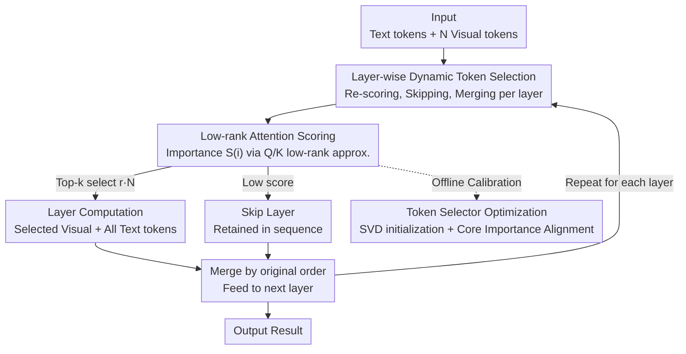

# One Layer's Trash is Another Layer's Treasure: Adaptive Layer-wise Visual Token Selection in LVLMs

**Conference**: CVPR 2026  
**Paper**: [CVF Open Access](https://openaccess.thecvf.com/content/CVPR2026/html/Chen_One_Layers_Trash_is_Another_Layers_Treasure_Adaptive_Layer-wise_Visual_CVPR_2026_paper.html)  
**Code**: None  
**Area**: Model Compression  
**Keywords**: Visual token compression, LVLM inference acceleration, Layer-wise dynamic selection, Low-rank attention approximation, Training-free

## TL;DR
Addressing the inference slowdown caused by excessive visual tokens in Large Vision-Language Models (LVLMs), ALVTS avoids the one-time permanent pruning used by methods like FastV. Instead, it **re-selects tokens at every decoding layer**. Using a lightweight selector with low-rank approximation to score all visual tokens, important tokens participate in layer computation while unimportant ones skip the current layer and merge back later. This mechanism preserves 96.7% of the original accuracy while compressing 89% of tokens.

## Background & Motivation
**Background**: LVLMs process images by generating a massive number of visual tokens (e.g., LLaVA-NeXT produces 2,880 tokens for a 672×672 image, while text inputs are typically under 100), making the visual modality the dominant factor in inference computation. Visual token pruning has become a mainstream acceleration technique. Common practices involve estimating token importance using `[CLS]` attention in ViT or text-to-vision attention in LLMs, and pruning low-scoring tokens at a shallow layer (e.g., FastV prunes at the 2nd LLM layer, and PyramidDrop uses staged pyramid-style discarding).

**Limitations of Prior Work**: These methods share a fundamental flaw: **once a token is pruned at a certain layer, all subsequent layers lose access to it**. This leads to irreversible information loss, as pruned tokens might contain critical information required by deeper layers.

**Key Challenge**: The authors observe significant **cross-layer heterogeneity** by visualizing layer-wise attention in FastV. For an image of the "Roebling Bridge," the 2nd layer focuses on the lower structure, the 10th layer on the bridge's nameplate, and the 20th layer on the towers. This implies that **optimal token subsets differ across layers**. Using a single fixed subset throughout the model contradicts the fact that visual focus shifts per layer, inevitably discarding regions that should have been utilized.

**Goal**: To enable each layer to select tokens based on its own visual focus without incurring the high cost of full attention computation at every layer, ideally without **re-training** the entire LVLM.

**Core Idea**: Replace "static, one-time, irreversible" pruning with "layer-wise, dynamic, recoverable" **selection**. Each layer processes only the tokens it currently deems important; the rest skip that layer but remain in the sequence, available for re-selection by subsequent layers ("One layer's trash is another layer's treasure").

## Method

### Overall Architecture
ALVTS (Adaptive Layer-wise Visual Token Selection) inserts a lightweight token selector **before each decoding layer** of the LLM. The input consists of $N$ visual tokens $X_V$ and $M$ text tokens $X_T$ (concatenated as $X=[X_T, X_V]$). Before entering layer $\ell$, the selector computes an importance score $S(i)$ for each visual token. A top-k selection is performed to pick high-scoring tokens $X_V^{(select)}$ (ratio $r$) which, along with **all text tokens**, are sent to the layer for computation. The remaining $X_V^{(skip)}$ skip the layer. After the layer output, processed and skipped tokens are merged back into a full sequence according to their **original positional order**. This "score → select → skip → merge" process is **independently repeated** for every layer, allowing different layers to select different visual subsets and achieving adaptive compression across the entire model.

The method focuses on a key problem: **How to determine token importance without full attention computation?** The solution involves using a low-rank approximation of the attention Q/K projection matrices to "simulate" full attention scoring, calibrated via a consistency alignment objective to match original attention behavior—**tuning only the lightweight selector while freezing the LVLM**, thus remaining training-free in the traditional sense.

### Key Designs

**1. Layer-wise Dynamic Token Selection: Allowing skipped tokens to be retrieved by later layers**

This design directly addresses the limitation of static pruning. ALVTS does not maintain a fixed global subset. Instead, at each layer $\ell$, it uses the importance score for top-k selection $X_V^{(select)} = \mathrm{TopK}(X_V, S, k)$, where $k = \lfloor r \cdot N \rfloor$. The $k$ selected visual tokens and all text tokens are processed, while the complement set $X_V^{(skip)}$ **skips the layer but is not deleted**. After the layer, the two paths are merged back into the full length, **maintaining original token order** to preserve positional information. Crucially, "skip" $\neq$ "prune": a token skipped in shallow layers because it is deemed unimportant can be re-selected in deeper layers if its importance score increases. Visualizations (Fig. 5) show that while FastV permanently loses the "decorated rug" region after pruning, ALVTS retrieves these areas at layers 10 and 26, resulting in a correct answer.

**2. Low-rank Attention Approximation Scoring: Estimating importance without full attention**

To prevent the computational overhead of per-layer scoring from negating the compression gains, ALVTS employs a selector $P$. It performs **low-rank decomposition** on the query/key projection matrices: $\tilde{W}_Q = U_Q V_Q$ and $\tilde{W}_K = U_K V_K$, where $U_Q, U_K \in \mathbb{R}^{D \times R}$ and $V_Q, V_K \in \mathbb{R}^{R \times D}$, with rank $R \ll D$. It then computes approximate query/keys $\tilde{Q} = X\tilde{W}_Q^\top$, $\tilde{K} = X\tilde{W}_K^\top$, and the approximate attention weights:

$$\tilde{A} = \mathrm{softmax}\!\left(\frac{\tilde{Q}\tilde{K}^\top}{\sqrt{d_k}}\right) \in \mathbb{R}^{(M+N)\times(M+N)}.$$

$\tilde{A}$ is partitioned into visual-to-visual blocks $\tilde{A}_{V2V} \in \mathbb{R}^{N\times N}$ and text-to-visual blocks $\tilde{A}_{T2V} \in \mathbb{R}^{M\times N}$. The average attention received by the $i$-th visual token is calculated: $S_{V2V}(i) = \frac{1}{N}\sum_{j=1}^{N}\tilde{A}_{V2V}(j,i)$ and $S_{T2V}(i) = \frac{1}{M}\sum_{j=1}^{M}\tilde{A}_{T2V}(j,i)$. The final importance score is the **product**: $S(i) = S_{V2V}(i)\cdot S_{T2V}(i)$. Multiplication is used to ensure a token scores high only if it is **both visually contextual and relevant to the text instruction**. This filters tokens that are visually salient but irrelevant to the question, or relevant but visually redundant. The low-rank overhead is minimal, accounting for only 1-2% of the base model parameters (Table 4).

**3. Selector Optimization: SVD Initialization + Importance Consistency Alignment**

To ensure the selector mimics original attention behavior, optimization is performed in two steps. First, **SVD** is applied to the original projection matrices $W_Q = U_{full}\Sigma V_{full}^\top$. Taking the top $R$ singular values, the low-rank matrices are initialized as $U_Q = U_{full}[:, :R]\cdot\Sigma_R^{1/2}$ and $V_Q = \Sigma_R^{1/2}\cdot V_{full}[:R, :]^\top$. This ensures the initial approximation is as close to the original as possible. Second, **Importance Consistency Alignment** is performed: using original full attention as a reference score $S^*$, the reconstruction error is minimized:

$$L = \frac{1}{N}\sum_{i=1}^{N}\big(S(i) - S^*(i)\big)^2.$$

Each selector is **optimized independently**, and only the selector parameters are updated while the LVLM is frozen. This is highly efficient, requiring only 256 random samples from LLaVA-655k and completing in under 15 minutes for LLaVA-1.5-7B.

## Loss & Training
The sole training objective is the Importance Consistency Alignment loss $L$ (layer-wise MSE). Training uses 256 random samples from LLaVA-655k. The original LVLM is frozen, and only the low-rank matrices are tuned. Rank settings: $R=256$ for LLaVA-1.5-7B / LLaVA-NeXT-7B, and $R=128$ for Qwen2.5-VL-3B, keeping parameter overhead under 2%.

## Key Experimental Results

### Main Results
Average performance (percentage of the original model) on 8 multimodal benchmarks (AI2D / POPE / TextVQA / etc.) for LLaVA-1.5-7B:

| Compression Ratio | FastV | PyramidDrop | DART | ALVTS (Ours) |
|--------|-------|-------------|------|--------------|
| ↓67% (Keep 192) | 97.07% | 98.19% | 98.13% | **99.60%** |
| ↓78% (Keep 128) | 93.75% | 95.13% | 97.26% | **98.77%** |
| ↓89% (Keep 64) | 85.13% | 88.52% | 93.27% | **96.73%** |

Cross-model and high-resolution verification (Average retention at 89% compression):

| Model | Vanilla Token Count | FastV | PyramidDrop | DART | ALVTS |
|------|-----------------|-------|-------------|------|-------|
| LLaVA-1.5-13B | 576 | 91.20% | 92.66% | 93.98% | **96.63%** |
| LLaVA-NeXT-7B | up to 2880 | 89.70% | 94.54% | 93.84% | **96.25%** |
| Qwen2.5-VL-3B | Dynamic | 80.23% | 78.43% | — | **86.39%** |

At an aggressive 89% compression, ALVTS outperforms DART by 3.46% and FastV by 11.60% on LLaVA-1.5-7B. On the POPE benchmark for LLaVA-NeXT-7B, it achieves 87.09, slightly exceeding the original model, demonstrating high efficacy for long token sequences.

### Ablation Study

| Config | Key Result | Explanation |
|------|---------|------|
| ALVTS (Full) | COCO 95.81 / NoCaps 92.42 | Layer-wise dynamic selection |
| w/o Dynamic Selection | COCO 88.05 / NoCaps 87.59 | Degrades to static pruning at 2nd layer (FastV strategy) |
| SVD (No Alignment) | Larger L2 distance | Appr. scores differ significantly from oracle |
| + Consistency Alignment | L2 distance clusters at 0 | Significant improvement in approximation fidelity |

Efficiency (LLaVA-1.5-7B, single 4090, POPE):

| Method | End-to-end Latency | Prefill | Accuracy |
|------|-----------|---------|------|
| LLaVA-1.5-7B (Orig) | 211ms | 165ms | 100% |
| FastV (↓60%) | 179ms | 126ms | 93.2% |
| ALVTS (↓89%) | **156ms** | **103ms** | **97.7%** |

### Key Findings
- **Dynamic selection is the primary source of performance**: Reverting to static pruning significantly drops performance on generative tasks (COCO/NoCaps), validating the hypothesis that static pruning discards information prematurely.
- **Product-based scoring is robust**: Requiring both visual and textual relevance avoids the biases of using single-modality signals.
- **Efficiency and Scalability**: The low-rank selector adds negligible parameters (~2%) and achieves 1.6× acceleration in prefill, which is the most computationally expensive stage for LVLMs.
- **Superiority in aggressive compression**: As compression increases from 67% to 89%, the gap between ALVTS and baselines widens, highlighting the value of the "recoverable" mechanism.

## Highlights & Insights
- **"Skip instead of Prune"**: Converting irreversible pruning to reversible selection cures information loss without substantial sequence management overhead.
- **Low-rank "Replica" of Attention**: By targeting the ranking behavior rather than exact attention values, ALVTS achieves a high-fidelity approximation with minimal cost.
- **Multiplicative Gating**: The $S = S_{V2V}\cdot S_{T2V}$ design is a simple yet effective way to fuse multimodal signals for token scoring.

## Limitations & Future Work
- While lightweight, per-layer low-rank projections still accumulate overhead in very deep models. Prefill acceleration (1.6×) is notable, but end-to-end (1.35×) is further from the theoretical limit.
- Per-layer optimization for each specific model backbone is required. Although fast (15 mins), it is not entirely zero-shot across architectures.
- The compression ratio $r$ is currently uniform across layers; adaptive layer-specific ratios might yield further improvements.

## Related Work & Insights
- **vs. FastV / VTW (Static Pruning)**: These prune tokens early and permanently. ALVTS allows re-selection, essentially solving the information bottleneck.
- **vs. PyramidDrop**: PyramidDrop reduces tokens monotonically across stages; ALVTS allows bi-directional recovery layer-by-layer.
- **vs. DART (Diversity Pruning)**: While DART focuses on diversity to reduce redundancy, it remains static. ALVTS's dynamic approximation provides better performance at high compression ratios.

## Rating
- Novelty: ⭐⭐⭐⭐ The shift to "layer-wise recoverable selection" is a clean paradigm change.
- Experimental Thoroughness: ⭐⭐⭐⭐ Strong coverage across 3 architectures, multiple baselines, and ablation studies.
- Writing Quality: ⭐⭐⭐⭐ Logical flow from motivation to method; strong storytelling with visual evidence.
- Value: ⭐⭐⭐⭐ High practical value for deployment due to being training-free and providing 1.6× prefill acceleration.

<!-- RELATED:START -->

## Related Papers

- [\[ACL 2026\] Adaptive Layer Selection for Layer-Wise Token Pruning in LLM Inference](../../ACL2026/model_compression/adaptive_layer_selection_for_layer-wise_token_pruning_in_llm_inference.md)
- [\[CVPR 2026\] HTTM: Head-wise Temporal Token Merging for Faster VGGT](httm_head-wise_temporal_token_merging_for_faster_vggt.md)
- [\[CVPR 2026\] PPCL: Pluggable Pruning with Contiguous Layer Distillation for Diffusion Transformers](ppcl_pluggable_pruning_dit_distillation.md)
- [\[CVPR 2026\] Hi-Lo Prune: Look at What You'll Lose before Pruning with Hierarchical Token Selection](hi-lo_prune_look_at_what_youll_lose_before_pruning_with_hierarchical_token_selec.md)
- [\[ACL 2026\] A Layer-wise Analysis of Supervised Fine-Tuning](../../ACL2026/model_compression/a_layer-wise_analysis_of_supervised_fine-tuning.md)

<!-- RELATED:END -->
