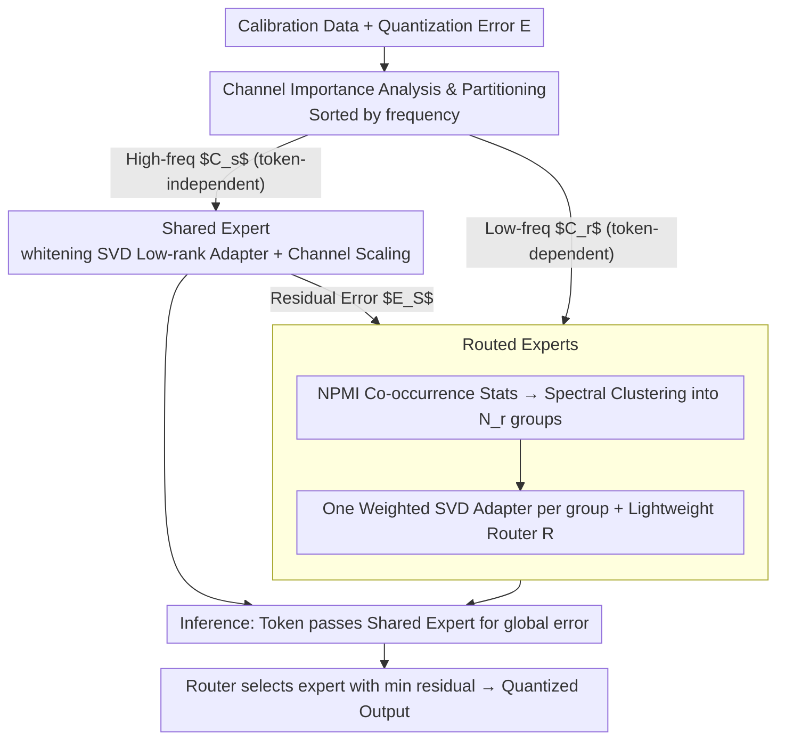

# Quant Experts: Token-aware Adaptive Error Reconstruction with Mixture of Experts for Large Vision-Language Models Quantization

**Conference**: CVPR 2026  
**arXiv**: [2602.24059](https://arxiv.org/abs/2602.24059)  
**Code**: None  
**Area**: Model Compression / VLM Quantization  
**Keywords**: post-training quantization, VLM, MoE, token-aware, low-rank adapter, channel importance

## TL;DR

Quant Experts (QE) is proposed, a token-aware adaptive quantization error reconstruction framework based on Mixture-of-Experts. It partitions important channels into two groups: token-independent (high-frequency, global) and token-dependent (low-frequency, local). These are compensated using low-rank adapters from shared and routed experts, respectively, to mitigate global and local quantization errors. QE consistently improves VLM performance across various quantization settings ranging from W4A6 to W3A16.

## Background & Motivation

**Background**: Post-Training Quantization (PTQ) is a critical technique for reducing the computational and memory overhead of Large Vision-Language Models (VLMs). Existing methods include channel smoothing (SmoothQuant, AWQ), mixed-precision (SpQR), Hessian-based optimization (GPTQ), and low-rank reconstruction (LQER, ASER). In multi-modal scenarios, MBQ revealed cross-modal channel sensitivity differences and proposed modal-aware channel scaling strategies.

**Limitations of Prior Work**: (1) Channel smoothing methods (SmoothQuant/AWQ) use fixed scaling coefficients estimated from calibration data, treating all tokens equally and failing to capture token-level variations in channel importance; (2) Static low-rank reconstruction (LQER/ASER) employs a single global adapter for all important channels, ignoring the dynamic nature of channel importance; (3) Modal-aware methods (MBQ) distinguish cross-modal differences but still rely on static channel scaling, neglecting channel importance fluctuations between different tokens within the same modality.

**Key Challenge**: The locations of important channels are not static—they not only shift across modalities but, more crucially, change significantly between different tokens within the same modality (due to activation distribution shifts caused by differences in token semantics and contextual information). Globally fixed channel identification and compensation strategies fundamentally fail to capture this token-level dynamics.

**Goal**: To design a framework capable of simultaneously handling global consistent (token-independent) and local dynamic (token-dependent) quantization errors, accurately compensating for the varying quantization losses faced by different tokens.

**Key Insight**: Important channels are categorized into two groups based on appearance frequency—high-frequency token-independent channels are compensated globally via a shared expert, while low-frequency token-dependent channels are clustered by co-occurrence patterns and compensated dynamically via routed experts.

**Core Idea**: Leveraging the MoE concept, a two-level structure comprising a "shared expert + routed experts" is used to compensate for global errors and token-dependent local errors during quantization, respectively.

## Method

### Overall Architecture

QE addresses the fact, overlooked by previous quantization methods, that "important channels" determining quantization error size are not fixed but drift with the semantics and context of each token. Consequently, QE abandons the use of a single global adapter for all tokens. Instead, it adopts an MoE-inspired approach to decompose error compensation into two layers. During the offline phase, it statistics the frequency of each channel being identified as "important" from calibration data, partitioning channels into two sets: a few high-frequency token-independent channels (important for almost every token) and many low-frequency token-dependent channels (important only for specific tokens). The former is handled by a **shared expert** for global compensation, while the latter are clustered into subgroups based on co-occurrence patterns, with each group assigned a **routed expert** for local compensation. During inference, tokens first pass through the shared expert to rectify global errors, followed by a lightweight router that selects the routed expert with the minimum residual to compensate for local errors.

### Key Designs

**1. Channel Importance Analysis & Partitioning: Quantifying channel drift as a frequency distribution**

Fixed scaling (SmoothQuant/AWQ) and single global adapters (LQER/ASER) fail because they assume static important channels. QE measures this "drift" first. For each token $x_t$, it combines weight row-means $\mathbf{w} = \text{Mean}_{\text{row}}(|\mathbf{W}_f|)$ and identifies the set of important channels $\mathcal{C}_t = \text{Top-}k(|x_t| \odot \mathbf{w})$ based on the largest element-wise product of activations and weights. Accumulating $\mathcal{C}_t$ across all tokens allows calculating the selection frequency per channel $f_c = k \times \frac{m_c}{\sum_i m_i}$. Channels are sorted by frequency: the top $k$ channels selected by almost every token are classified as the token-independent set $\mathcal{C}_s$; the subsequent $N_r \times k$ channels appearing only for specific tokens are classified as the token-dependent set $\mathcal{C}_r$. This partitioning directly reflects the observation that very few channels are consistently important across all tokens.

**2. Shared Expert: A global low-rank adapter for high-frequency channel errors**

Since token-independent channels are important for every token and contribute the bulk of quantization error, they receive high-precision compensation. The shared expert exempts these channels from direct quantization and performs whitening SVD on their quantization errors, decomposing them into a pair of low-rank adapters $(\mathbf{L}_{SA}^l, \mathbf{L}_{SB}^l)$ for reconstruction—consistent with the LQER/ASER approach of using low-rank matrices to approximate errors. Simultaneously, it applies channel scaling to suppress outlier magnitudes in activations while proportionally scaling weights. The remaining residual $\mathbf{E}_S^l = \mathbf{E}^l - \mathbf{L}_{SA}^l \mathbf{L}_{SB}^l$ is passed to the routed experts.

**3. Routed Experts: Grouping by "Channel Co-occurrence Patterns" with per-token routing**

Ideally, local compensation would be tailored for every token, but the infinite combinations of tokens make per-token adapters infeasible. QE's compromise involves grouping token-dependent channels that frequently become "important together." Co-occurrence is tracked via $\mathcal{O}_{t,i}^l = \mathbf{1}(c_i \in \mathcal{C}_r^l \cap \mathcal{A}_t^l)$, and the NPMI (Normalized Pointwise Mutual Information) $\mathbf{S}_{i,j} = (\log\frac{p(i,j)}{p(i)p(j)}) / -\log p(i,j)$ measures association strength between channels. Spectral clustering (normalized Laplacian decomposition followed by K-Means) partitions channels into $N_r$ subgroups, each assigned a routed expert using weighted SVD. During inference, a lightweight router $\mathbf{R}^l$ predicts residual reduction to activate the optimal expert.

### Loss & Training

The core QE processes (partitioning, SVD decomposition, clustering) are computed offline without end-to-end training. An optional lightweight refinement strategy involves training only the routed experts $(\mathbf{L}_{RA}^l, \mathbf{L}_{RB}^l)$ and the router $\mathbf{R}^l$ while freezing other parameters. This refinement is layer-wise (non-end-to-end) for 16 epochs $\times$ 100 iterations using AdamW (lr=$1 \times 10^{-4}$) and a cosine annealing schedule. The calibration set consists of 128 randomly sampled image-text pairs from the COCO Caption dataset augmented by ShareGPT4V. The total SVD rank is fixed at 64, split equally between shared and routed experts. $k=32$ important channels and $N_r = 8$ routed experts are used.

## Key Experimental Results

### Main Results (Qwen2VL-2B, Average accuracy across 11 multi-modal benchmarks)

| Method | #W | #A | MMMU | OCRBench | ScienceQA | TextVQA | Average |
|------|----|----|------|----------|-----------|---------|------|
| FP16 | 16 | 16 | 39.89 | 74.90 | 76.96 | 77.72 | 62.97 |
| RTN | 4 | 6 | 34.00 | 59.80 | 64.70 | 67.58 | 53.62 |
| SmoothQuant | 4 | 6 | 30.44 | 59.60 | 65.25 | 65.88 | 50.27 |
| LQER | 4 | 6 | 33.00 | 65.80 | 68.32 | 69.37 | 55.92 |
| MBQ | 4 | 6 | 34.44 | 61.10 | 67.08 | 69.45 | 54.73 |
| **QE** | **4** | **6** | **33.78** | **68.20** | **71.84** | **73.18** | **58.74** |

Qwen2VL-72B Key Results:

| Setting | Method | MMMU | OCRBench | ScienceQA | TextVQA | VizWiz |
|------|------|------|----------|-----------|---------|--------|
| FP16 | - | 61.44 | 78.70 | 91.22 | 82.26 | 76.27 |
| W4A6 | MBQ | 52.67 | 69.70 | 86.32 | 76.08 | 67.99 |
| W4A6 | **QE** | **58.11** | **76.60** | **90.33** | **79.27** | **73.91** |

### Ablation Study

Component contribution (Qwen2VL-2B, W4A6):

| Setting | Component | MMMU↑ | ScienceQA↑ |
|------|------|-------|-----------|
| FP16 | - | 39.89 | 76.95 |
| W4A6 | Routed Experts (REs) only | 34.56 | 68.72 |
| W4A6 | Shared Expert (SE) only | 35.22 | 69.61 |
| W4A6 | SE + Random Routing | 35.89 | 70.00 |
| W4A6 | SE + Random Clustering | 35.33 | 69.71 |
| W4A6 | **QE (SE+REs)** | **36.89** | **70.85** |

### Key Findings

- Under the challenging W4A6 setting, QE outperforms MBQ by 4.01% on Qwen2VL-2B, trailing FP16 by only 4.23%.
- On Qwen2VL-72B W4A6, QE achieves a 5.09% accuracy gain over MBQ, effectively narrowing the gap to FP16.
- Removing either expert type leads to performance degradation: the shared expert is vital for global stability, while routed experts are crucial for precise per-token compensation.
- Random vs. Adaptive Routing: Random routing (35.89) is inferior to QE (36.89), validating the router's adaptive selection capability.
- Random vs. Co-occurrence Clustering: Random clustering (35.33) is inferior to QE (36.89), validating the effectiveness of NPMI-based spectral clustering for channel relationship modeling.

## Highlights & Insights

- **Observation-driven Design**: Two key observations (channel importance drift across tokens and non-uniform frequency distribution) directly drive the method—shared experts target high-frequency global channels, while routed experts target low-frequency local channels.
- **Innovative MoE Application in Quantization**: Migrating the "shared+routed" MoE paradigm to quantization error compensation. Unlike traditional MoEs used for capacity, this adapts to token-level dynamics of quantization errors.
- **NPMI Spectral Clustering**: Modeling channel co-occurrence with NPMI captures semantic association patterns more effectively than simple clustering methods.
- **Consistent Scalability**: The method consistently improves results across 2B to 72B scales, demonstrating robust scalability.

## Limitations & Future Work

- Hyperparameters $N_r=8$ and $k=32$ are fixed and may require differentiated tuning for different models and layers.
- Introduction of $N_r$ low-rank adapters and a router increases inference parameter count and computational overhead (though total rank budget remains constrained).
- Clustering and SVD decomposition are performed independently per layer, without considering cross-layer channel importance correlations.
- The 128-sample calibration set might lack robustness for frequency estimation in ultra-large models (e.g., 72B).

## Related Work & Insights

- **LQER (ICML'24)**: Pioneer in low-rank reconstruction of quantization errors; QE extends this with token-aware dynamic grouping.
- **MBQ (CVPR'25)**: Revealed cross-modal sensitivity differences; QE further uncovers token-level dynamics inside a single modality.
- **SmoothQuant (ICML'23)**: A classic for channel scaling; QE's shared expert enhances this with low-rank reconstruction.
- **Insight**: The evolution of quantization error compensation from "globally uniform" to "modal-aware" and now "token-aware" shows that finer granularity yields significant gains.

## Rating

- **Novelty**: ⭐⭐⭐⭐
- **Experimental Thoroughness**: ⭐⭐⭐⭐⭐
- **Writing Quality**: ⭐⭐⭐⭐
- **Value**: ⭐⭐⭐⭐

<!-- RELATED:START -->

## Related Papers

- [\[CVPR 2026\] MoDES: Accelerating Mixture-of-Experts Multimodal Large Language Models via Dynamic Expert Skipping](modes_accelerating_mixture-of-experts_multimodal_large_language_models_via_dynam.md)
- [\[CVPR 2026\] Fine-Grained Post-Training Quantization for Large Vision Language Models with Quantization-Aware Integrated Gradients](fine-grained_post-training_quantization_for_large_vision_language_models_with_qu.md)
- [\[CVPR 2026\] MASQuant: Modality-Aware Smoothing Quantization for Multimodal Large Language Models](masquant_modality-aware_smoothing_quantization_for_multimodal_large_language_mod.md)
- [\[CVPR 2026\] VLM-PTQ: Efficient Post-Training Quantization for Large Vision-Language Models](vlm-ptq_efficient_post-training_quantization_for_large_vision-language_models.md)
- [\[CVPR 2026\] LS-ViT: Least-Squares Hessian Based Block Reconstruction for Low-Bit Post-Training Quantization of Vision Transformers](ls-vit_least-squares_hessian_based_block_reconstruction_for_low-bit_post-trainin.md)

<!-- RELATED:END -->
## Related Papers

- [\[ICLR 2026\] Unveiling Super Experts in Mixture-of-Experts Large Language Models](../../ICLR2026/model_compression/unveiling_super_experts_in_mixture-of-experts_large_language_models.md)
- [\[CVPR 2026\] Teacher-Guided Routing for Sparse Vision Mixture-of-Experts](teacher-guided_routing_for_sparse_vision_mixture-of-experts.md)
- [\[CVPR 2026\] Enhancing Mixture-of-Experts Specialization via Cluster-Aware Upcycling](enhancing_mixture_of_experts_specialization_via_cluster_aware_upcycling.md)
- [\[CVPR 2026\] Hybrid Token Compression for Vision-Language Models](hybrid_token_compression_for_vision-language_models.md)
- [\[CVPR 2026\] Rethinking Token Reduction for Large Vision-Language Models](rethinking_token_reduction_for_large_vision-language_models.md)

<!-- RELATED:END -->
