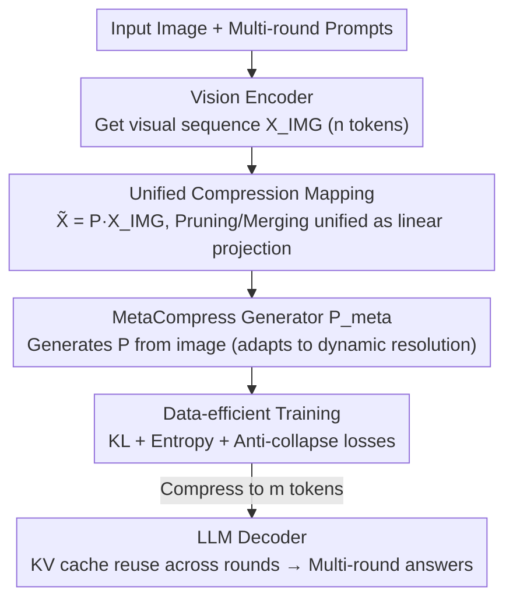

# Rethinking Token Reduction for Large Vision-Language Models

**Conference**: CVPR 2026  
**Paper**: [CVF Open Access](https://openaccess.thecvf.com/content/CVPR2026/html/Wang_Rethinking_Token_Reduction_for_Large_Vision-Language_Models_CVPR_2026_paper.html)  
**Code**: https://github.com/MArSha1147/MetaCompress  
**Area**: Model Compression / Multimodal VLM  
**Keywords**: Visual token compression, Multi-round VQA, Learnable compression matrix, Inference acceleration, prompt-agnostic

## TL;DR
Aiming at multi-round visual question answering (MT-VQA) scenarios, this paper unifies visual token pruning and merging into a "learnable compression mapping $P$" and trains a meta-generator, MetaCompress, which relies solely on images and adapts to arbitrary resolutions to produce $P$. At a 90% compression rate, it consistently outperforms heuristic methods like FastV and PruMerge, with inference efficiency approaching the fastest equidistant sampling baseline.

## Background & Motivation
**Background**: Large Vision-Language Models (LVLMs) encode images into hundreds or thousands of visual tokens for LLMs. The $O(n^2)$ complexity of attention makes inference slow and memory-intensive. Consequently, numerous token reduction methods have emerged, but nearly all are designed for **single-round VQA**—where one can greedily discard visual tokens irrelevant to the current question.

**Limitations of Prior Work**: Real-world utility lies in **multi-round VQA (MT-VQA)**, where subsequent questions are unknown beforehand and may point to any region in the image. Existing methods fail here:
- **prompt-dependent** (e.g., FastV): Only retains tokens highly correlated with the first prompt. If the first round asks about the foreground, background tokens are discarded, causing failure if the second round asks about the background. Furthermore, it relies on attention matrices from LLM intermediate layers, which are inaccessible in modern LVLMs using FlashAttention.
- **prompt-agnostic** (e.g., PruMerge): Only considers internal attention scores of the image sequence. While technically usable for multi-round scenarios, it relies entirely on **heuristic metrics designed via human priors** ([CLS] attention, inter-token attention), lacking theoretical support and yielding suboptimal results.

**Key Challenge**: Multi-round scenarios require "retaining tokens useful for **unknown** future questions," whereas heuristic metrics like attention scores do not accurately characterize "which tokens are truly important." The authors conducted a key experiment: directly learning an optimal compression matrix $P^*$ for a single image and checking the overlap between retained tokens and high-attention tokens. The result showed **almost no overlap** (only about 1.71% of retained tokens correlated with high [CLS] attention), proving that using attention as a basis for pruning is inherently suboptimal.

**Goal / Key Insight**: Move away from manual heuristics and use a data-driven approach to directly learn "which tokens to retain/merge." To achieve this, the "learning objective" must first be defined.

**Core Idea**: Unify all token reduction (pruning + merging) as a linear projection $\tilde{X}_{IMG}=P X_{IMG}$. The problem then becomes "finding an optimal compression matrix $P$ that minimizes the difference in LLM output before and after compression." Subsequently, a generator that only sees the image and adapts to dynamic resolutions is trained to output $P$.

## Method

### Overall Architecture
The input to MetaCompress is the visual sequence $X_{IMG}\in\mathbb{R}^{n\times d}$ from the vision encoder, and the output is a shortened sequence $\tilde{X}_{IMG}$ compressed to $m\ (m\ll n)$ tokens, fed directly to the LLM decoder. Text sequences are concatenated as usual, and the KV cache is reused across rounds. The core is a lightweight module $P_{meta}$ that **only looks at the image, not the prompt**, calculating a compression matrix $P=P_{meta}(X_{IMG})$ for each image. Compression is completed via a single matrix multiplication $\tilde{X}_{IMG}=PX_{IMG}$. The methodology follows two steps: first, analyzing the "per-image optimal compression matrix" to confirm heuristics are suboptimal (Section 4), then upgrading the per-image $P$ to a **generator** $P_{meta}$ (Section 5) capable of adapting to any resolution, trained in a data-efficient manner.

### Key Designs

**1. Unifying pruning and merging into a learnable compression mapping, and proving attention heuristics are suboptimal**

Existing methods are diverse (discarding tokens vs. merging tokens), making them difficult to fit into a single learning objective. The first step of this paper is to unify them as a linear projection of the visual sequence:

$$\tilde{X}_{IMG}=P X_{IMG},\quad P\in\mathbb{R}_+^{m\times n},\ m\ll n$$

Where $P$ is a sparse compression matrix—a row with a single non-zero entry represents "pruning," while weighted entries represent "merging." Thus, both are unified into a continuous optimizable object. Based on this, the authors formalize "finding the optimal compression" as an optimization problem: let trainable parameters $P_{raw}$ (where $P=\sigma(P_{raw})$ via row-wise softmax) minimize the distribution difference of LLM outputs. The objective is $P^*=\arg\min_{P_{raw}} L_{pred}+\epsilon L_{entropy}$, where $L_{pred}=D_{KL}\big(p(y)\,\|\,p(\tilde y)\big)$ measures the difference in the distribution of $T$ output tokens. Comparing the learned $P^*$ for a single image with attention scores reveals that retained tokens are largely unrelated to [CLS]/prompt attention—empirically refuting the "high attention = keep" heuristic and explaining why FastV performs worse than random pruning in some experiments.

**2. MetaCompress: An image-only compression matrix generator adapting to dynamic resolution**

Learning $P$ per image is impractical—real inputs vary in resolution (LLaVA-NeXT, XComposer-2.5 use multi-scale, variable sequence lengths). MetaCompress instead learns a **generator** $P_{meta}$ that computes a shape-matched $P$ based on the current sequence length. The mechanism involves a "downsampled weighted inner product of query and key": the visual sequence is first augmented with absolute positional encoding $E_{pos}$, downsampled via average pooling into $m$ queries (this step determines the output token count $m$ to adapt to any resolution), and linearly projected into keys:

$$\tilde{X}_q=\text{Pool}(X_{IMG}+E_{pos}\mid k,s)W_q,\qquad X_k=(X_{IMG}+E_{pos})W_k$$

$$P=\sigma\!\left(\frac{\tilde{X}_q\,\text{diag}(\beta)\,X_k^\top}{\sqrt{d_c}}\right)$$

Where $\text{diag}(\beta)$ is a learnable diagonal matrix and $d_c\ll d$ keeps computation low. Expanding this as $P_{raw}$ yields a low-rank, semi-definite form. When $W_q=W_k$ at initialization, the module is equivalent to "weighted pooling," subsequently learning through data which tokens to select or merge. This explicit low-rank structure allows inference efficiency to approach equidistant sampling. The module is placed only before the LLM decoder to avoid additional MHA overhead in intermediate layers.

**3. Data-efficient training with three loss terms and gradient clipping**

Without ground-truth labels for the compression matrix, direct training might cause $P$ to **collapse** to a trivial solution—where all compressed tokens originate from the same source. Beyond $L_{pred}$ (KL alignment), two regularizations are added: an entropy term $L_{entropy}=\frac1m\sum_i H(P_{i,:})$ to encourage sparse/deterministic assignment, and an anti-collapse term $L_{collapse}=\max_j\sum_i P_{i,j}$ to penalize a single input token being "over-claimed" by output rows. The total objective is:

$$L=L_{pred}+\lambda_{entropy}L_{entropy}+\lambda_{collapse}L_{collapse}$$

The anti-collapse term carries a heavy penalty and can cause training divergence at low compression rates (<70%), hence it is paired with **gradient clipping** (max $10^{-2}$) to stabilize training. Training requires only two LLM forward passes (original $y$, compressed $\tilde y$) to calculate KL, and is conducted on a small subset of ~20k entries for 2 epochs. LLaVA-NeXT-7B takes ~30 GPU hours at 90% compression, demonstrating "data efficiency."

## Key Experimental Results

### Main Results
Evaluation across three MT-VQA benchmarks and five LVLM architectures at a uniform 90% compression rate (Avg denotes three-round average accuracy, ConvBench is a 1–10 score):

| Model | Method | MT-VQA-v2 Avg | MT-GQA Avg | ConvBench Avg |
|------|------|------|------|------|
| LLaVA-1.5-7b | FastV | 48.06 | 45.66 | 2.02 |
| LLaVA-1.5-7b | PruMerge | 69.56 | 57.54 | 3.82 |
| LLaVA-1.5-7b | **Ours** | **70.65** | **58.43** | **4.16** |
| LLaVA-1.5-13b | PruMerge | 70.68 | 58.11 | 4.68 |
| LLaVA-1.5-13b | **Ours** | **72.94** | **59.48** | **5.20** |
| LLaVA-NeXT-7b | FastV | 58.45 | 50.31 | 1.23 |
| LLaVA-NeXT-7b | **Ours** | **75.18** | **62.70** | **7.28** |
| XComposer-2.5-7b | FastV | 74.23 | 57.00 | 2.78 |
| XComposer-2.5-7b | **Ours** | **75.76** | **58.68** | **9.88** |

Key Finding: **FastV (attention heuristic) often fails to beat Random/Sample baselines** (e.g., 48.06 vs 66.66 Random on LLaVA-1.5-7b), consistent with the conclusion that attention is a suboptimal basis. On the unobserved ConvBench, MetaCompress maintains a significant lead, showing cross-benchmark transferability.

Efficiency (MT-GQA, 90% Compression):

| Model | Method | TTFT(ms) | E2ET(ms) | VRAM(GB) | TFLOPs |
|------|------|------|------|------|------|
| LLaVA-NeXT-7b | Base | 484 | 830 | 16.7 | 95.3 |
| LLaVA-NeXT-7b | FastV | 219 | 529 | 19.2 | 12.9 |
| LLaVA-NeXT-7b | **Ours** | **174** | 501 | **14.9** | **12.7** |

MetaCompress's TTFT, VRAM, and FLOPs approach the minimalist Sample baseline and are significantly lower than FastV (which is slower due to calculating intermediate attention).

### Ablation Study
LLaVA-NeXT-7b, MT-GQA, 90% compression, adding losses sequentially:

| Configuration | MT-GQA Avg | Note |
|------|------|------|
| Only $L_{pred}$ | 61.98 | Align outputs before/after compression |
| $+L_{entropy}$ | 62.42 | Entropy regularization provides small gain |
| $L_{pred}+L_{collapse}$ (No clip) | 56.34 | Penalty too heavy → training diverges |
| $L_{pred}+L_{collapse}+$ Grad Clip | 62.13 | Recovers after stabilization |
| All ($+$Ent$+$Collapse$+$Clip) | **62.70** | Best complete model |

### Key Findings
- **Attention is a Poor Guide**: Across five models, attention-driven FastV frequently lags behind random/equidistant sampling, the most counter-intuitive finding that challenges the mainstream "prune by attention" assumption.
- **Anti-collapse is a Double-edged Sword**: Using $L_{collapse}$ alone causes divergence (56.34, lower than just $L_{pred}$); gradient clipping is necessary to make it effective.
- **Hyperparameter Insensitivity**: Performance fluctuates within 0.5 percentage points for various $\lambda_{entropy}, \lambda_{collapse}$ values; defaults of 1 are sufficient.
- **Cross-dataset/Task Transferability**: Robustness is maintained during MT-GQA $\leftrightarrow$ MT-VQA-v2 transfer and even to Video QA, reducing reliance on specific training sets.

## Highlights & Insights
- **Unified Perspective**: Recasting pruning/merging as a linear projection $P$ transforms heuristic selection into a differentiable optimization problem—a sophisticated way to consolidate scattered tricks into a single objective, transferable to other "subset selection/aggregation" tasks.
- **Analysis-Driven Design**: The authors empirically demonstrate the lack of overlap between attention tokens and optimal tokens before deciding to discard attention-based approaches, grounding the method in solid evidence.
- **Efficiency from Structure**: The low-rank semi-definite structure of $P_{meta}$ ensures the compression itself adds negligible overhead, with efficiency nearing equidistant sampling.
- **Data Efficiency**: A compression generator can be trained on a 20k subset in a few hours on a single machine, ensuring low deployment costs.

## Limitations & Future Work
- The compression is currently inserted only once **before the LLM**. "Across-all-layers" compression within the LLM or full-stack compression (vision tower + LLM) is not yet explored as it would require expensive pre-training/instruction tuning.
- Insight: While being prompt-agnostic is a strength, it also acts as a constraint—it treats all future questions equally. In rounds focused on extremely small regions, it might not exceed an ideal prompt-aware method.
- The anti-collapse loss requires gradient clipping and can diverge at low compression rates, indicating some sensitivity in training stability.
- Accuracy on ConvBench used Llama-3.1-8B instead of GPT-3.5 for scoring; metrics may not be perfectly aligned with original benchmarks.

## Related Work & Insights
- **vs. FastV (prompt-dependent)**: FastV prunes based on first-round attention and requires intermediate matrices; Ours is prompt-agnostic, image-only, and compatible with FlashAttention.
- **vs. PruMerge (prompt-agnostic heuristic)**: PruMerge relies on metrics like [CLS] attention and is limited to single-scale LLaVA-1.5; Ours is data-driven, naturally handles multi-scale vision towers, and consistently outperforms PruMerge.
- **vs. Quantization / Pruning / Distillation**: These compress parameters; Ours compresses the token sequence. The approaches are orthogonal and stackable.
- **Insight**: The paradigm of "unifying heuristic choices into learnable sparse projection matrices + KL alignment" can be transferred to scenarios like KV cache compression or long-context token pruning.

## Rating
- Novelty: ⭐⭐⭐⭐⭐ First learnable prompt-agnostic token reduction for MT-VQA; refutes the "attention equals importance" assumption.
- Experimental Thoroughness: ⭐⭐⭐⭐ Five models and three benchmarks with efficiency/transfer/ablation; lacks comparison with more learnable compression methods (though few exist).
- Writing Quality: ⭐⭐⭐⭐ Clear logical chain from formalization to analysis to method; some cached OCR formulas require reference to the original text.
- Value: ⭐⭐⭐⭐⭐ High practical value given multi-round dialogue is a real-world use case for LVLMs, and the method is plug-and-play with low training costs.

<!-- RELATED:START -->

## Related Papers

- [\[CVPR 2026\] SCoRe: Salience-Coverage Reduction for Vision Token Pruning in Vision-Language Models](score_salience-coverage_reduction_for_vision_token_pruning_in_vision-language_mo.md)
- [\[ICLR 2026\] LearnPruner: Rethinking Attention-based Token Pruning in Vision Language Models](../../ICLR2026/vlm_efficiency/learnpruner_rethinking_attention-based_token_pruning_in_vision_language_models.md)
- [\[AAAI 2026\] Rethinking Visual Token Reduction in LVLMs under Cross-Modal Misalignment](../../AAAI2026/vlm_efficiency/rethinking_visual_token_reduction_in_lvlms_under_cross-modal_misalignment.md)
- [\[CVPR 2026\] Hybrid Token Compression for Vision-Language Models](hybrid_token_compression_for_vision-language_models.md)
- [\[CVPR 2026\] CoIn: Coverage and Informativeness-Guided Token Reduction for Efficient Large Multimodal Models](coin_coverage_and_informativeness-guided_token_reduction_for_efficient_large_mul.md)

<!-- RELATED:END -->
