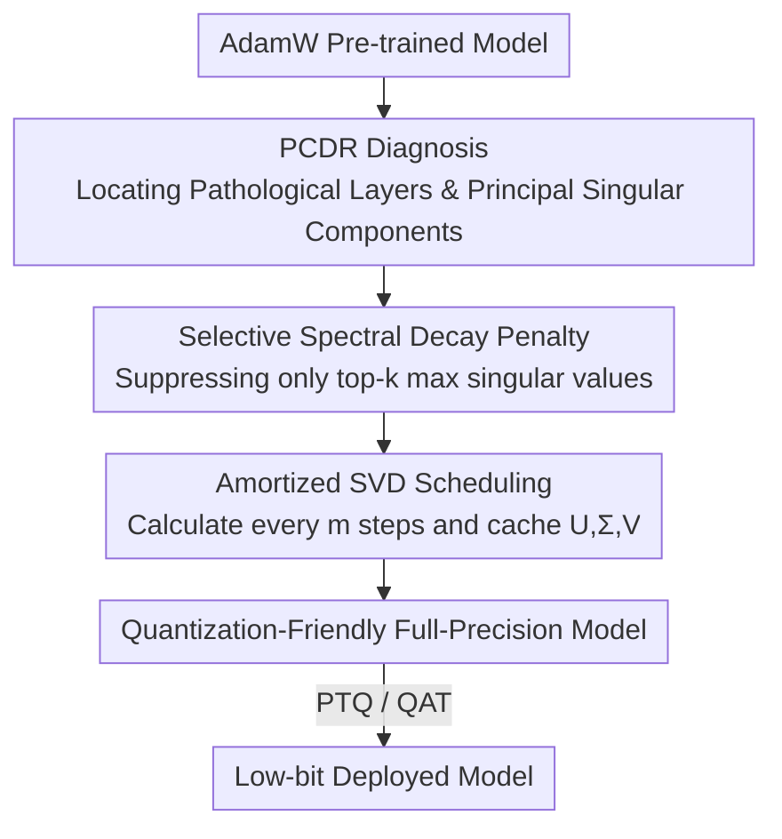

# S2D: Selective Spectral Decay for Quantization-Friendly Conditioning of Neural Activations

**Conference**: CVPR 2026  
**Paper**: [CVF Open Access](https://openaccess.thecvf.com/content/CVPR2026/html/Chavan_S2D_Selective_Spectral_Decay_for_Quantization-Friendly_Conditioning_of_Neural_Activations_CVPR_2026_paper.html)  
**Code**: None  
**Area**: Model Compression  
**Keywords**: Activation Outliers, Low-bit Quantization, Spectral Regularization, Singular Values, SigLIP

## TL;DR
S2D attributes the root cause of activation outliers to a few "bloated" principal singular values of the weight matrix. By applying selective spectral decay only to these largest singular values during the fine-tuning stage, the model is conditioned into a "quantization-friendly" state without requiring retraining from scratch. W4A4 PTQ on ImageNet achieves gains of up to 7%.

## Background & Motivation
**Background**: Large-scale transformers (especially vision/multimodal encoders like SigLIP) generally require low-bit quantization (e.g., W4A4) for deployment. Activation outliers, where activation values in certain dimensions are several orders of magnitude larger than normal, remain the primary obstacle to quantization.

**Limitations of Prior Work**: Affine quantization must use a unified scale to cover the entire activation range. When extreme outliers exist, the scale is forced to be very large, causing the majority of normal activations to be compressed into the same quantization bin (or rounded to zero), which collapses accuracy. The authors also observe a counter-intuitive phenomenon: **outlier severity increases monotonically with pre-training scale and duration**—from CLIP to SigLIP to SigLIP2, outliers become increasingly extreme.

**Key Challenge**: Previous methods either "bypass" outliers (using mixed-precision to keep outlier dimensions in FP16 or using SmoothQuant to migrate difficulty from activations to weights) or rely on orthogonal optimizers (Muon) during training from scratch to suppress them. However, methods like Muon provide minimal gains when applied to models already pre-trained with AdamW. The true root cause—where exactly these outliers originate—has not been clearly explained.

**Goal**: (1) Identify the geometric root cause of outliers; (2) Design a "conditioning" method that acts directly on existing AdamW pre-trained models without retraining from scratch, making models inherently quantization-friendly.

**Key Insight**: The authors observe from an SVD perspective that the output magnitude of a linear layer $y=Wx$ is upper-bounded by the spectral norm $\sigma_{\max}(W)$ (i.e., $\|y\|_2 \le \sigma_{\max}(W)\cdot\|x\|_2$). They further quantify "how much of an activation value originates from the top-k singular components of the weight" using a custom diagnostic metric, PCDR. They find that the PCDR of outlier activations is close to 1, proving that outliers are almost entirely generated by a few inflated principal singular components.

**Core Idea**: Since the root cause is a few principal singular values being "blown up" by prolonged AdamW training, **decay should be applied only to these largest singular values** (using a spectral penalty with power $n>1$) rather than shrinking all singular values uniformly as in L2 weight decay.

## Method

### Overall Architecture
S2D aims to "condition" a model pre-trained with AdamW into a quantization-friendly weight geometry during downstream fine-tuning (or an independent post-processing stage). The logical chain is: identify "pathological" layers and singular components using the PCDR metric, apply a power spectral penalty to suppress these specific principal singular values while leaving small singular values intact (preserving model capacity). The resulting full-precision checkpoint is more stable when fed into any off-the-shelf PTQ/QAT method. To prevent SVD from slowing down training, an amortization strategy is used.

### Key Designs

**1. PCDR Diagnostic Metric: Quantifying Outlier Sources to Specific Singular Components**

Simply observing activation distributions only reveals the presence of outliers but cannot locate "which part of the weight" creates them. Thus, the authors define the **Principal Component Dominance Ratio (PCDR)**. For a weight $W=U\Sigma V^\top$, the output of the $i$-th neuron on sample $x_j$ can be expanded along singular directions as $A_{ij}=\sum_r \sigma_r u_{ir}v_r^\top x_j$. PCDR$_k$ is defined as the ratio of the magnitude contributed by the first $k$ singular components to the total magnitude: $\text{PCDR}_k^{(i,j)} = \big|\sum_{r=1}^{k}\sigma_r u_{ir}v_r^\top x_j\big| \big/ \big|\sum_r \sigma_r u_{ir}v_r^\top x_j\big|$. A value near 1 indicates the activation is determined almost entirely by the top-k components. In practice, the PCDR$_3$ of outlier activations approaches 1 as models progress from CLIP to SigLIP2. This confirms that outliers are not produced uniformly by the weight matrix but are concentrated in a few inflated principal singular values.

**2. Selective Spectral Decay Regularization: Penalizing Only the Max Singular Values**

Standard L2 weight decay penalizes $\frac{\lambda}{2}\|W\|_F^2=\frac{\lambda}{2}\sum_i\sigma_i^2$, exerting uniform pressure on all singular values and potentially damaging small singular values that carry useful information. S2D uses a higher-power spectral penalty: defining $W^{(n)}=U\Sigma^n V^\top$ (where index $n>1$), the regularization term is:

$$L_{S2D}^{(n)}(W)=\frac{\lambda}{n+1}\,\mathrm{tr}\big((W^{(n)})^\top W\big)=\frac{\lambda}{n+1}\sum_{i=1}^{N}\sigma_i^{n+1}.$$

With $n>1$, the pressure on large singular values is exponentially magnified, while small singular values are nearly unaffected (reducing to standard L2 when $n=1$). The gradient is straightforward: $\partial L_{S2D}/\partial W_{ij}=\lambda\sum_k U_{ik}\sigma_k^{n}V_{jk}$. This targets the regularization pressure specifically on the $\sigma_i$ responsible for the worst-case magnification, preserving representation capacity while eliminating spectral pathology.

**3. PCDR Selection + Amortized SVD: Ensuring Precise and Affordable Regularization**

Performing full SVD on all layers at every step is computationally prohibitive. S2D uses two mechanisms to reduce cost. First is **PCDR Selection**: using hyperparameters $\tau$ (minimum PCDR threshold) and $K_{\max}$ (maximum principal components to consider), the algorithm finds the smallest $k_{\text{target}}\le K_{\max}$ such that $\text{PCDR}_{k_{\text{target}}}\ge\tau$ for each layer. Only layers meeting this criteria are flagged, and only their top-$k_{\text{target}}$ components are penalized. Second is **Amortized SVD**: full SVD is performed and $(U,\Sigma,V)$ are cached every $m$ steps. The cached values are reused for the subsequent $m-1$ steps to apply gradients, spreading the SVD cost over $m$ steps.

### Loss & Training
Total Loss = Downstream Task Loss + S2D Spectral Regularization $L_{S2D}^{(n)}$. Uniform hyperparameters: $\tau=0.95$, $K_{\max}=3$, $m=100$, $n=2$, $\lambda=5\times10^{-4}$. Models are fine-tuned for 10 epochs from a SigLIP2 backbone. For PTQ, standard methods (ERQ / PTQ4ViT / RepQ-ViT) are used. For QAT, straight-through estimation (STE) is used with shared hyperparameters from the AdamW baseline.

## Key Experimental Results

### Main Results
PTQ accuracy of SigLIP2-Base on ImageNet-1k (subset at 384 resolution, ERQ):

| Config | Metric | AdamW | AdamW+S2D | Gain |
|--------|------|------|----------|------|
| ERQ W4A4 (384) | Top-1 | 65.6 | 73.0 | +7.4 |
| RepQ-ViT W5A5 (384) | Top-1 | 46.0 | 78.0 | +32.0 |
| RepQ-ViT W6A6 (384) | Top-1 | 58.5 | 80.0 | +21.5 |
| PTQ4ViT W5A5 (384) | Top-1 | 3.4 | 62.0 | +58.6 |
| FP16 (384) | Top-1 | 85.0 | 85.0 | ≈0 |

Key takeaway: Full-precision accuracy remains stable (85.0 → 85.0), indicating S2D reshapes geometry without sacrificing capacity. Gains are more significant for lower bit-widths and more aggressive PTQ methods.

Generalization to downstream tasks and VLM (under W4A4/low-bit quantization):

| Task/Benchmark | Metric | AdamW | AdamW+S2D |
|--------|------|------|----------|
| Detection (COCO, ERQ W5A5) | AP50 | 10.8 | 40.7 |
| Segmentation (COCO, ERQ W5A5) | AP | 11.7 | 34.4 |
| GQA (LLaVA-1.5, W4A4) | Acc | 35.3 | 40.1 |
| DocVQA (LLaVA-1.5, W6A6) | Acc | 8.8 | 12.4 |

QAT bit-widths: W3A4 improves from 59.9% to 62.4%, and W4A4 improves from 65.8% to 69.7%.

### Ablation Study

| Metric / Layer | AdamW | AdamW+S2D | Description |
|------|---------|------|------|
| PCDR$_1$ (Layer 9) | 0.77 | 0.09 | Significant drop in spectral concentration |
| Max Abs. Activation (Layer 9) | 1166.2 | 614.7 | Outlier magnitude effectively suppressed |
| $\sigma_{\max}$ (Layer 9) | 7.9 | 3.9 | Principal singular value reduced |
| PCDR$_1$ (Layer 5) | 0.91 | 0.46 | Improved condition number in pathological layers |

### Key Findings
- S2D acts directly on the "cause" (principal singular values): targeted layers show simultaneous decreases in PCDR$_1$, maximum activation, and $\sigma_{\max}$.
- Gains are agnostic to the PTQ method (ERQ, PTQ4ViT, and RepQ-ViT all improve), suggesting the benefit comes from better weight conditioning rather than specific algorithmic interactions.
- Outliers scale with pre-training magnitude (CLIP < SigLIP < SigLIP2). Since all use the same ViT-Base architecture, this confirms outliers are a byproduct of long-duration AdamW optimization.

## Highlights & Insights
- **Attributing "Outliers" to Computable Spectral Quantities**: The PCDR metric plus Theorem 1 transforms a vague engineering issue into a directed geometric intervention.
- **Selective Spectral Decay as an Elegant Generalization of L2**: Changing $\sum\sigma_i^2$ to $\sum\sigma_i^{n+1}$ ($n>1$) allows a single hyperparameter to shift from "uniform shrinkage" to "targeting large singular values" with a simple gradient form.
- **No Retraining, Fully Additive**: S2D only adds a regularization term during downstream fine-tuning. The resulting checkpoint is orthogonally compatible with existing PTQ/QAT, making it highly practical for deployment.

## Limitations & Future Work
- Amortized SVD uses "stale" singular vectors from a cache every $m$ steps; weights may drift, introducing approximation errors.
- The primary focus is on vision/multimodal encoders (SigLIP2, LLaVA-1.5 vision tower). Effectiveness on pure LLM backbones is suggested but not systematically validated.
- Low gains on tasks naturally insensitive to outliers (e.g., POPE).
- Requires intervention during a fine-tuning stage; performance as a standalone "post-processing" step without fine-tuning is less explored.

## Related Work & Insights
- **vs. Mixed Precision / SmoothQuant / Outlier Suppression**: These methods "bypass" outliers by using high precision for outlier dimensions or migrating difficulty to weights. S2D eliminates the root cause (spectral imbalance), providing a better foundation for all subsequent quantization steps.
- **vs. Orthogonal Optimizers (Muon)**: Muon suppresses outliers via orthogonal updates from scratch. S2D is designed for existing pre-trained models where Muon is less effective.
- **vs. Architectural Quantization (RepQ-ViT, etc.)**: These focus on quantization algorithms (re-parameterization, twin quantizers). S2D optimizes the weight geometry itself before quantization starts.

## Rating
- Novelty: ⭐⭐⭐⭐⭐ PCDR diagnosis plus selective spectral decay provides a novel and self-consistent perspective.
- Experimental Thoroughness: ⭐⭐⭐⭐ Coverage of multiple scenarios (PTQ/QAT, Detection/VLM), though lacking extensive pure LLM validation.
- Writing Quality: ⭐⭐⭐⭐ Clear chain of logic; well-defined metrics and theorems.
- Value: ⭐⭐⭐⭐⭐ High industrial value due to its additive nature and effectiveness in low-bit deployment.

<!-- RELATED:START -->

## Related Papers

- [\[CVPR 2026\] Vision-Oriented Lightweight Neural Architecture Search with Budget-Adaptive Evaluation](vision-oriented_lightweight_neural_architecture_search_with_budget-adaptive_eval.md)
- [\[CVPR 2026\] Fine-Grained Post-Training Quantization for Large Vision Language Models with Quantization-Aware Integrated Gradients](fine-grained_post-training_quantization_for_large_vision_language_models_with_qu.md)
- [\[CVPR 2026\] VQRAE: Representation Quantization Autoencoders for Multimodal Understanding, Generation and Reconstruction](vqrae_representation_quantization_autoencoders_for_multimodal_understanding_gene.md)
- [\[CVPR 2026\] Rethinking Asymmetric Quantization: Hidden Symmetry in Vision Model Weights](rethinking_asymmetric_quantization_hidden_symmetry_in_vision_model_weights.md)
- [\[CVPR 2026\] MASQuant: Modality-Aware Smoothing Quantization for Multimodal Large Language Models](masquant_modality-aware_smoothing_quantization_for_multimodal_large_language_mod.md)

<!-- RELATED:END -->
