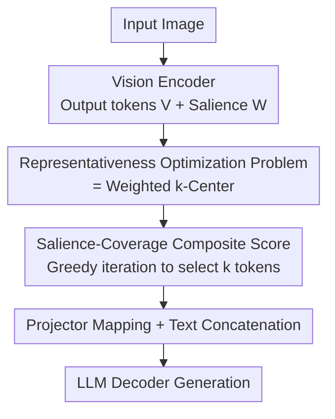

# SCoRe: Salience-Coverage Reduction for Vision Token Pruning in Vision-Language Models

**Conference**: CVPR 2026  
**Paper**: [CVF Open Access](https://openaccess.thecvf.com/content/CVPR2026/html/Xu_SCoRe_Salience-Coverage_Reduction_for_Vision_Token_Pruning_in_Vision_Language_Models_CVPR_2026_paper.html)  
**Code**: None  
**Area**: Model Compression / Multimodal VLM  
**Keywords**: Vision token pruning, weighted k-Center, Salience-Coverage, training-free, LVLM inference acceleration

## TL;DR
SCoRe reformulates LVLM vision token pruning from a two-stage heuristic—"attention-based Top-k followed by post-hoc diversity"—into a unified "representativeness optimization problem." It proves this problem is equivalent to the classical weighted k-Center problem and adopts a composite score encoding both salience and coverage for greedy selection. Being training-free and plug-and-play, it retains 95% performance while pruning 94.4% of tokens.

## Background & Motivation
**Background**: The computational bottleneck of Large Vision-Language Models (LVLMs) primarily stems from long vision token sequences generated by the vision encoder. LLaVA-1.5 uses 576 tokens per image, while LLaVA-NeXT scales this to 2880 for high-resolution inputs. Since Transformer self-attention has $O(L^2)$ complexity, long sequences significantly hinder inference. Recent works shift towards vision encoder-side token pruning, assuming that encoder features (e.g., [CLS] attention) are more stable and less contaminated by positional biases than LLM cross-attention.

**Limitations of Prior Work**: The authors point out that these methods using "more reliable features" almost all rely on a **decoupled two-stage heuristic**: first selecting Top-k tokens based on vision encoder attention, then applying clustering or merging to regain diversity. This workflow is fundamentally flawed as it fails to treat "maximum coverage of the semantic space" as an optimization objective from the start.

**Key Challenge**: The authors clarify the conflict through two observations. First, vision tokens are non-uniformly distributed in the feature space, forming discrete high-density semantic clusters ("semantic islands" in UMAP+DBSCAN). Ideal pruning must achieve **cross-cluster coverage**, or secondary subjects will be entirely discarded. Second, high-salience regions exhibit high intra-redundancy—"importance $\neq$ representativeness." Greedy selection based solely on salience (Top-k) leads to **sampling collapse**, where tokens cluster heavily in a few high-salience islands, wasting the budget meant for covering other clusters.

**Goal**: To design a query-agnostic pruning algorithm that simultaneously satisfies two principles—global coverage (sampling from all discrete semantic clusters) and salience prioritization (prioritizing high-information regions)—which decoupled heuristics cannot inherently unify.

**Core Idea**: To **formalize token pruning as a unified representativeness optimization problem** and prove its equivalence to the classical weighted k-Center problem. A composite score multiplying salience and coverage is used for greedy approximation, ensuring that selecting a high-salience point naturally reduces the attractiveness of its neighboring points within a single objective.

## Method

### Overall Architecture
SCoRe is a training-free, plug-and-play module inserted between the vision encoder and the modality projector. During inference, the image passes through the vision encoder, which outputs $L$ original vision token features $V=\{v_1,\dots,v_L\}$ and their respective salience weights $W=\{w_1,\dots,w_L\}$ (derived from [CLS] attention). SCoRe uses $V$ and $W$ to greedily select $k$ representative token indices $S_{idx}$. The compressed subset $V_S$ is then projected to the LLM semantic space and concatenated with text tokens for the LLM Decoder. The LLM remains unchanged, and pruning occurs before it, making SCoRe compatible with efficient attention implementations like FlashAttention.

The method consists of two layers: formalizing the problem and establishing equivalence to weighted k-Center (Theory), and providing the SCoRe greedy approximation algorithm (Algorithm).

### Key Designs

**1. Formalizing Pruning as a Representativeness Optimization Problem and Reducing it to Weighted k-Center**

To address the flaw of prior heuristics, the authors redefine the problem: given a set $V$ of $L$ tokens, salience weights $w_i\ge 0$, and distances $d(v_i,v_j)$, the goal is to find a subset $S^*$ of size $k$ that minimizes the representativeness loss $R(S,V)$, where $S^*=\arg\min_{S\subset V,|S|=k} R(S,V)$. The authors quantify this loss using the maximum weighted distance of the "worst point":

$$R(S,V)=\max_{v_i\in V}\big(w_i\cdot d(v_i,S)\big)$$

Substituting this into the objective yields:

$$S^*=\arg\min_{S\subset V,|S|=k}\Big(\max_{v_i\in V} w_i\cdot d(v_i,S)\Big)$$

This formulation **is exactly the classical weighted k-Center problem**. This reduction transforms pruning from a heuristic into an optimization problem with established efficient greedy approximation algorithms.

**2. Greedy Selection with Salience-Coverage Composite Score**

With the k-Center reduction, the authors propose a greedy algorithm: select the token with the highest salience as the first representative point; then iterate $k-1$ times, calculating a unified representativeness score for all unselected tokens—the minimum cosine distance to the current set $S_{t-1}$ multiplied by its salience raised to the power of $\alpha$:

$$s_t=\arg\max_{v_i\in V\setminus S_{t-1}}\big(d_{\cos}(v_i,S_{t-1})\cdot \text{score}(v_i)^{\alpha}\big)$$

where $d_{\cos}(v_i,S)=\min_{s\in S}\big(1-\cos(v_i,s)\big)$ represents coverage (distance to selected set), and $\text{score}(v_i)$ represents salience ([CLS] attention). The product form is the soul of this design: a token must be **simultaneously** salient and distant from existing selections to be chosen. This prevents sampling collapse—once a point in a high-salience cluster is selected, $d_{\cos}$ for neighboring points drops, "pushing" the algorithm to explore previously ignored semantic clusters.

**3. $\alpha$ as a Continuous Knob for Coverage vs. Salience**

The parameter $\alpha$ unifies two conflicting objectives into a tunable spectrum: at $\alpha=0$, the salience term becomes constant, and the algorithm becomes pure diversity/coverage (equivalent to farthest-point sampling); as $\alpha\to\infty$, the coverage term is suppressed, reverting to pure salience Top-k. The optimal middle ground is found at $\alpha=0.8$, with stable performance between $[0.7, 0.9]$. This knob ensures that "salience prioritization" and "global coverage" are no longer mutually exclusive but part of a smooth trade-off framework.

## Key Experimental Results

### Main Results (LLaVA-1.5-7B, Average across 10 benchmarks)
Rel. indicates the performance percentage retained relative to the original (576 tokens, 100%).

| Tokens Retained | Pruning Rate | FastV | SparseVLM | VisionZip | VisPruner | **SCoRe** |
|:---:|:---:|:---:|:---:|:---:|:---:|:---:|
| 128 | ↓77.8% | 85.4% | 94.4% | 98.4% | 99.6% | **100.6%** |
| 64 | ↓88.9% | 75.9% | 86.4% | 95.6% | 96.6% | **97.8%** |
| 32 | ↓94.4% | 64.1% | 77.9% | 89.0% | 91.5% | **95.0%** |

Ours shows greater advantages under heavier pruning. With 32 tokens (~5% remaining), SCoRe retains 95.0%, outperforming the previous SOTA VisPruner by 3.5% and the cross-attention-based SparseVLM by 17%. Similar trends hold for LLaVA-NeXT-7B (2880→160 tokens, ↓94.4%, 93.4% retained) and Video-LLaVA tasks.

### Ablation Study (LLaVA-1.5-7B, 32 tokens)
Testing the necessity of both objectives by taking $\alpha$ to extremes:

| Configuration | $\alpha$ | TextVQA Acc. | POPE F1 | Description |
|:---:|:---:|:---:|:---:|:---:|
| Pure Diverse | $\alpha=0$ | 53.2 | 76.2 | Coverage only, insufficient |
| Pure Important | $\alpha\to\infty$ | 54.0 | 77.8 | Top-k only, misses context |
| **Full SCoRe** | $\alpha=0.8$ | **54.5** | **80.3** | Superior to decoupled approaches |

### Efficiency Analysis (LLaVA-NeXT-7B, A100-40GB, POPE)

| Method | Tokens Retained | FLOPs(T) | GPU Memory (GB) | CUDA Latency (ms) |
|:---:|:---:|:---:|:---:|:---:|
| Original | 2880 | 43.3 | 16.7 | 853.2 |
| FastV | 160 | 6.3 | 16.9 | 305.3 |
| **SCoRe** | 160 | **3.8** | **14.7** | **158.3** |

## Key Findings
- The "product" form of the composite score is the cure for sampling collapse: selecting a point lowers the attractiveness of its neighborhood, making coverage occur automatically during iterations.
- Performance is robust to $\alpha$ in the $[0.7, 0.9]$ range, facilitating real-world deployment.
- SCoRe prunes before the LLM, allowing synergy with FlashAttention. In contrast, methods like FastV that require LLM cross-attention cannot be easily optimized, making SCoRe nearly twice as fast at the same token count.

## Highlights & Insights
- **Theoretical Grounding**: Replacing engineering heuristics with an optimization problem (weighted k-Center) provides a provable basis for token selection rather than just another trick.
- **Importance $\neq$ Representativeness**: High-salience regions are highly redundant; selecting by attention scores alone inevitably leads to collapse.
- **Generalizable Greedy Framework**: The product-based composite score is transferable to any budget allocation problem requiring both "priority" and "spread," such as keyframe selection or coreset selection.
- Ours is training-free, plug-and-play, and compatible with FlashAttention, offering zero integration cost.

## Limitations & Future Work
- Salience relies entirely on [CLS] attention; its performance on encoders without [CLS] or with unreliable attention warrants further investigation.
- As a query-agnostic approach, there is still risk for VQA tasks where the answer depends on a "low-salience" small region.
- While greedy is a good approximation for k-Center, the iterative overhead for extremely long sequences (e.g., long videos) should be monitored.
- Future Work: Introducing text query signals into salience weights for query-aware coverage-salience balancing.

## Related Work & Insights
- **vs. Top-k / FastV**: FastV uses early LLM cross-attention, which is noisy and contaminated by position bias. SCoRe uses stable encoder-side features and unifies salience with coverage.
- **vs. ToMe / VisionZip**: These merge similar tokens using a decoupled two-stage approach. SCoRe selects representative points within a unified objective, showing larger gains at high pruning rates.
- **vs. VisPruner (Prev. SOTA)**: VisPruner still relies on "Top-k + post-hoc diversity." SCoRe optimizes both in a single composite score, achieving a 3.5% Gain at 32 tokens.

## Rating
- Novelty: ⭐⭐⭐⭐⭐ Reformulating pruning as weighted k-Center with a unified composite score is a clean and powerful perspective.
- Experimental Thoroughness: ⭐⭐⭐⭐⭐ 4 architectures across 13 benchmarks (image/high-res/video), including ablation and efficiency.
- Writing Quality: ⭐⭐⭐⭐ Motivations are clearly illustrated with observations and visualizations.
- Value: ⭐⭐⭐⭐⭐ Practical for LVLM deployment due to being training-free and FlashAttention compatible.

<!-- RELATED:START -->

## Related Papers

- [\[CVPR 2026\] Rethinking Token Reduction for Large Vision-Language Models](rethinking_token_reduction_for_large_vision-language_models.md)
- [\[CVPR 2026\] CoIn: Coverage and Informativeness-Guided Token Reduction for Efficient Large Multimodal Models](coin_coverage_and_informativeness-guided_token_reduction_for_efficient_large_mul.md)
- [\[CVPR 2026\] TransPrune: Token Transition Pruning for Efficient Large Vision-Language Model](transprune_token_transition_pruning_for_efficient_large_vision-language_model.md)
- [\[CVPR 2026\] ZOO-Prune: Training-Free Token Pruning via Zeroth-Order Gradient Estimation in Vision-Language Models](zoo-prune_training-free_token_pruning_via_zeroth-order_gradient_estimation_in_vi.md)
- [\[ACL 2026\] HiPrune: Hierarchical Attention for Efficient Token Pruning in Vision-Language Models](../../ACL2026/vlm_efficiency/hiprune_hierarchical_attention_for_efficient_token_pruning_in_vision-language_mo.md)

<!-- RELATED:END -->
