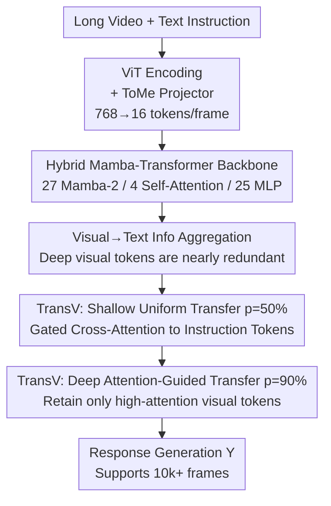

# TimeViper: A Hybrid Mamba-Transformer Vision-Language Model for Efficient Long Video Understanding

**Conference**: CVPR 2026  
**Paper**: [CVF Open Access](https://openaccess.thecvf.com/content/CVPR2026/html/Xu_TimeViper_A_Hybrid_Mamba-Transformer_Vision-Language_Model_for_Efficient_Long_Video_CVPR_2026_paper.html)  
**Code**: Project Page https://xuboshen.github.io/TimeViper/  
**Area**: Multimodal VLM / Video Understanding  
**Keywords**: Long video understanding, Mamba-Transformer hybrid architecture, visual token compression, visual-to-text information aggregation, State Space Models

## TL;DR
TimeViper utilizes a 9B large model backbone hybridizing Mamba-2 and self-attention. Leveraging the newly discovered "visual information converges into instruction tokens layer-by-layer" phenomenon, the authors propose the TransV module within the LLM to transfer and compress redundant visual tokens into instruction tokens via gated cross-attention. This enables the processing of hour-long videos with tens of thousands of frames on a single GPU, achieving performance comparable to Transformer-based MLLMs.

## Background & Motivation

**Background**: Long video understanding requires MLLMs to balance efficiency with the ability to handle ultra-long temporal contexts. Current mainstream methods utilize Transformer LLMs (e.g., Qwen2, Vicuna) as backbones, relying on their strong reasoning and linguistic capabilities, while compressing visual tokens at the projection layer before feeding them into the LLM.

**Limitations of Prior Work**: Two bottlenecks intersect. ① The computational cost of attention grows quadratically with sequence length, making it inherently inefficient for long contexts—encoding a 1-hour video at 1 fps with 768 tokens per frame generates approximately 2.7 million tokens, far exceeding the million-level context limits of models like Gemini. ② Even with projection-layer compression, **the LLM itself remains the primary computational bottleneck**, as it must process the sequence layer-by-layer with billions of parameters. Existing internal LLM token dropping methods (e.g., PDrop), while efficient, cause irreversible information loss due to hard pruning based on attention scores; furthermore, these methods are designed exclusively for Transformers.

**Key Challenge**: Linear architectures (e.g., Mamba state space models) offer $O(n)$ computation and $O(1)$ caching benefits but often suffer performance drops in complex multimodal tasks or rely on distillation from Transformers. Conversely, pure Transformers are expressive but inefficient. More critically, **how token information is stored and how visual redundancy manifests in hybrid Mamba-Transformer architectures may differ fundamentally from pure Transformers**, and this has remained unexplored. Existing compression strategies cannot be directly applied.

**Goal**: To build a truly efficient long-video MLLM, it is necessary to simultaneously (a) select a backbone that balances efficiency and expressiveness, and (b) eliminate visual redundancy within that backbone.

**Key Insight**: The authors first analyze the information exchange between visual, instruction, and response tokens within the hybrid model using "information blocking" experiments. They discover a consistent **visual-to-text information aggregation phenomenon**: as layers deepen, information from visual tokens is progressively merged into instruction tokens. In deep layers, performance remains nearly unchanged even if all visual tokens are removed. This suggests that deep visual tokens are highly redundant and that compression should "transfer" information to instruction tokens rather than simply discarding it.

**Core Idea**: Following this phenomenon, a lightweight module is introduced within the LLM to explicitly **"transfer" redundant visual token information into instruction tokens** (rather than hard pruning). This reduces context length while preserving critical visual information, pushing the frame-processing capability of the hybrid backbone to tens of thousands of frames.

## Method

### Overall Architecture
TimeViper follows a standard three-stage multimodal architecture: "Visual Encoder + Projector + LLM." However, the backbone is replaced with a hybrid Mamba-Transformer LLM (Nanov2-9B: 27 Mamba-2 layers + 4 self-attention layers + 25 MLP layers), with TransV compression modules inserted internally. Given a long video and a text instruction: the ViT encodes frames sequentially, and the projector uses ToMe (Token Merging) to compress each frame from 768 to 16 tokens, resulting in a visual sequence $X_0 \in \mathbb{R}^{T_0 \times D}$. Instructions are tokenized into $X_1 \in \mathbb{R}^{T_1 \times D}$ (where $T_0 \gg T_1$). The LLM processes the concatenated input $X=[X_0, X_1]$ layer-by-layer to generate the response $Y$.

The roles of the two layer types in the hybrid backbone are complementary: **Mamba-2 layers** handle sequence positional modeling by compressing historical sequences into a fixed-size implicit memory via forget/remember mechanisms; **self-attention layers** maintain the full history for retrieval and querying based on token importance. TransV modules are inserted between the shallow (layer 7) and deep (layer 39) sections of the LLM to progressively shorten the sequence: uniform transfer at shallow layers and attention-guided transfer at deep layers.

### Key Designs

**1. Hybrid Mamba-Transformer Backbone: SSM for Length, Attention for Expressiveness**

To address the dilemma between the inefficiency of pure Transformers and the performance degradation of pure Mamba in complex multimodal tasks, TimeViper employs a hybrid backbone. Mamba-2 layers revolve around a State Space Model (SSM) block, recursively maintaining a compact hidden state $h_t \in \mathbb{R}^{N \times D}$ representing the history, updated as $h_t = A_t h_{t-1} + B_t x_t$ and $y_t = C_t^T h_t$, where $A_t, B_t, C_t$ are discretized SSM parameters. This enables efficient information propagation over long sequences with $O(n)$ computation and $O(1)$ caching. Self-attention layers directly model token interactions $y = \mathrm{SoftMax}(L \odot \frac{QK^T}{\sqrt{D}}) \cdot V$ (with causal mask $L$), preserving the full history for retrieval. Since Mamba layers dominate the backbone (27 vs. 4), memory usage and prefill time growth are approximately linear with input length.

**2. Visual→Text Information Aggregation: Diagnosing Redundancy in Hybrid Models**

This observation-driven design is the core motivation for TransV. The authors use an information blocking method: setting specific positions of the attention mask $L$ to zero at layer $l$ to block "Visual→Instruction" (V2I) and "Visual→Response" (V2R) pathways. The findings are consistent: in **instruction-centric tasks** (MCQ, temporal grounding), visual information first converges into instruction tokens—blocking V2I at shallow layers significantly degrades performance, whereas blocking it at deep layers has little effect. In **visual-centric tasks** (detailed description), visual tokens participate directly in response generation, and blocking V2R at shallow layers causes significant drops.

To quantify redundancy, a dropping operator $\mathrm{TD}(X)$ is defined with dropping rate $p$ and count $T_d = pT_0$. Two strategies are tested: uniform dropping $\mathrm{Uniform}(X, T_d)$ and attention-guided dropping $\mathrm{Topk}(X, -\mathrm{Attn}(X_{T_1}, X), T_d)$. Results show that redundancy increases with depth: while shallow visual tokens are critical, deep ones are nearly 100% redundant—**even if all deep visual tokens are discarded, the model maintains high performance using only instruction tokens.**

**3. TransV: Explicitly Transferring Visual Information within the LLM**

To address irreversible information loss from hard pruning, TransV is a lightweight module (~100M parameters) that uses gated cross-attention to move visual information into instruction tokens. At layer $l$, the transfer is formulated as: $\tilde{X}_1^l = \mathrm{CrossAttn}_l(X_1^l, \mathrm{TD}_l(X_0^l))$ and $X_1^{l+1} = X_1^l + \tanh(\alpha_l)(\tilde{X}_1^l)$. It uses instruction tokens as queries and (filtered) visual tokens as keys/values. A learnable scalar $\alpha_l$, initialized to 0, gates the aggregation intensity to ensure instruction understanding is not disrupted during early training.

TransV employs a "dual-location strategy": **Shallow (Layer 7) uses uniform transfer with $p=50\%$**, reflecting the continued importance of early visual features. **Deep (Layer 39) uses attention-guided transfer with $p=90\%$**, aggressively compressing the near-total redundancy. This allows TimeViper to save 54.8% VRAM at 4,096 frames compared to the baseline and handle over 10,000 frames.

### Loss & Training
Two-stage training using open-source data. **Stage 1 (Alignment)**: The projector is pre-trained on 3 million high-quality image-text pairs (sampled from CC12M, PixelProse) to align ViT and LLM modalities; compression is disabled. **Stage 2 (Visual Instruction Tuning)**: The projector, LLM, and compression modules are fine-tuned on ~4.8 million multimodal instruction pairs, including 1.8M video instructions (LLaVA-Video), 2.8M image instructions (LLaVA-OneVision), and 276K task-specific data (dense captions, grounding). Learning rates: 1e-5 for backbone, 5e-5 for TransV; AdamW optimizer; cosine annealing. Videos are sampled at 1 fps.

## Key Experimental Results

### Main Results
On 7 long-video benchmarks, TimeViper (Nanov2-9B backbone) performs on par with Transformer-based SOTA, despite not tuning the ViT and using only 7.8M training samples:

| Task / Benchmark | Metric | TimeViper (w/ TransV) | Comparison | Result |
| :--- | :--- | :--- | :--- | :--- |
| MCQ · VideoMME | avg.acc | 56.9 | Video-XL 55.5 | +1.4 |
| Captioning · VDC | avg.acc | 39.7 | AuroraCap 39.0 | +0.7 |
| Grounding · Charades-STA | mIoU | 40.5 | VTimeLLM-13B 34.6 | +5.9 |
| Long-duration · LVBench | avg.acc | 48.2 | Gemini-1.5-Pro 33.1| Substantial Lead |

> Note: TimeViper without TransV achieves VideoMME=58.8 and Charades=40.5. Adding TransV maintains grounding performance while significantly increasing frame capacity. The Charades result is notable as TimeViper relies on Mamba's implicit temporal modeling without explicit MRoPE timestamps.

### Ablation Study
Ablation of TransV positions and rates (Table 2):

| Configuration | Max Frames | VideoMME | VDC | Charades | Note |
| :--- | :--- | :--- | :--- | :--- | :--- |
| none (Baseline) | 5k | 58.8 | 39.7 | 40.5 | No compression |
| TD uni 7 0.5 (Hard drop) | 8k | 57.3 | 39.0 | 26.1 | Hard drop tanks Grounding |
| uni 7 0.5 (TransV) | 8k | 56.7 | 38.9 | 38.1 | Transfer restores Grounding |
| uni 7 0.5-uni 39 0.9 | >10k | 56.2 | 39.4 | 37.9 | Deep compression holds |
| uni 7 0.5-attn 39 0.9 | >10k | 56.9 | 39.1 | 37.9 | Attn-guided is slightly better |

### Key Findings
- **Transfer is superior to hard dropping**: At the same 50% compression rate in layer 7, hard dropping (TD uni) causes Charades to plummet from 40.5 to 26.1, while TransV transfer maintains it at 38.1.
- **Aggressive deep compression is viable**: Adding a 90% attention-guided transfer at layer 39 increases max frames from 5K to 10K+ with only a 0.1 drop in VideoMME. In contrast, increasing shallow compression to 90% causes a significant performance drop.
- **Linear VRAM growth**: The original model OOMs at 128 frames. Projector-level ToMe extends this to ~5K frames. TransV further saves 54.8% VRAM at 4096 frames and extends capacity to 10K+.

## Highlights & Insights
- **"Explainable diagnosis before compression design"**: The visual-to-text aggregation phenomenon directly dictates where to compress (deep layers), how to compress (transfer vs. drop), and how much to compress.
- **Gated Initialization ($\alpha_l = 0$)**: This ensures that TransV acts as an identity mapping at the start of training, allowing the model to stabilize instruction understanding before activating compression.
- **Backbone Synergy**: TransV performs better on the hybrid Nano backbone than on pure Qwen2.5, suggesting hybrid architectures are more compatible with internal token compression.

## Limitations & Future Work
- **ViT is frozen**: Computational constraints prevented fine-tuning the visual encoder, which may limit the upper bound of visual representation.
- **Infrastructure Constraints**: A bug in the current Mamba SSM library limits practical inference to ~6,000 frames despite theoretical 10K+ capacity.
- **Static Placement**: The optimal layers for TransV are currently determined empirically; future work could explore adaptive selection of layers and rates.

## Related Work & Insights
- **vs. Projection Compression (LLaMA-VID)**: These methods merge features before the LLM. TimeViper argues the LLM itself is the bottleneck and implements in-LLM compression complementary to projection-layer methods.
- **vs. Token Dropping (PDrop)**: PDrop uses irreversible hard pruning. TransV uses gated cross-attention to preserve information by "moving" it, which significantly outperforms dropping in temporal tasks like grounding.
- **vs. Transformer Hybridization**: TimeViper is the first work to implement internal token compression specifically for a hybrid Mamba-Transformer architecture.

## Rating
- **Novelty**: ⭐⭐⭐⭐⭐ First in-LLM token compression for hybrid Mamba-Transformer models.
- **Experimental Thoroughness**: ⭐⭐⭐⭐ Comprehensive evaluation across 7 benchmarks and extensive ablations.
- **Writing Quality**: ⭐⭐⭐⭐⭐ Excellent narrative flow from diagnosis to solution.
- **Value**: ⭐⭐⭐⭐⭐ Sets a high-efficiency path for long-video MLLMs.

<!-- RELATED:START -->

## Related Papers

- [\[ICCV 2025\] MaTVLM: Hybrid Mamba-Transformer for Efficient Vision-Language Modeling](../../ICCV2025/vlm_efficiency/matvlm_hybrid_mamba-transformer_for_efficient_vision-language_modeling.md)
- [\[CVPR 2026\] Hybrid Token Compression for Vision-Language Models](hybrid_token_compression_for_vision-language_models.md)
- [\[CVPR 2026\] UniCompress: Token Compression for Unified Vision-Language Understanding and Generation](unicompress_token_compression_for_unified_vision-language_understanding_and_gene.md)
- [\[ACL 2025\] Sharper and Faster mean Better: Towards More Efficient Vision-Language Model for Hour-scale Long Video Understanding](../../ACL2025/vlm_efficiency/sophia_efficient_long_video.md)
- [\[CVPR 2026\] MeToM: Metadata-Guided Token Merging for Efficient Video LLMs](metom_metadata-guided_token_merging_for_efficient_video_llms.md)

<!-- RELATED:END -->
