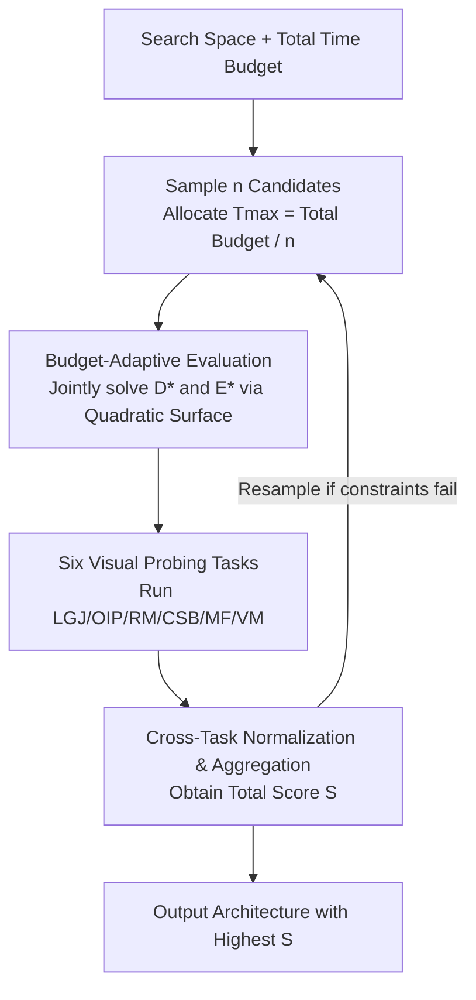

# Vision-Oriented Lightweight Neural Architecture Search with Budget-Adaptive Evaluation

**Conference**: CVPR 2026  
**Paper**: [CVF Open Access](https://openaccess.thecvf.com/content/CVPR2026/html/Fan_Vision-Oriented_Lightweight_Neural_Architecture_Search_with_Budget_Adaptive_Evaluation_CVPR_2026_paper.html)  
**Code**: https://github.com/fanyi-plus/tf-nas  
**Area**: Model Compression / Neural Architecture Search  
**Keywords**: Neural Architecture Search, Training-free Proxies, Visual Probing Tasks, Budget-Adaptive, Rank Correlation

## TL;DR
Addressing the dilemma between "accurate but slow training-based" and "fast but unreliable and family-specific training-free" NAS, this paper proposes six "vision-specific micro-tasks" with negligible training costs as architecture quality proxies. Combined with a quadratic response surface that automatically allocates data volume and training epochs within a given time budget, the method achieves SOTA rank correlation and final accuracy across CNN, Transformer, and Mamba families.

## Background & Motivation
**Background**: NAS has become the de facto standard for automatically searching network structures for various vision tasks. Early methods required training thousands of candidates from scratch, incurring exorbitant GPU costs. Subsequent works (weight-sharing supernets, DARTS-style differentiable relaxation, progressive shrinking in OFA/BigNAS) amortized the cost but remained stuck in the "train-validate-retrain" paradigm, requiring full pipeline reruns when datasets or deployment constraints changed. To eliminate training entirely, training-free NAS (zero-cost proxies) emerged, calculating scores based on lightweight statistics of weights, gradients, or features in a random (or near-random) initialization state within seconds.

**Limitations of Prior Work**: This speedup comes at a cost. First, **Rank Accuracy Drops**: many proxies are heuristics measuring expressive power or trainability of untrained networks, but network behavior changes unpredictably after training. Others rely on strong theoretical assumptions that seldom hold in practice, leading to training-free searched architectures being outperformed by training-based ones. Second, **Architecture Family Binding**: CNN-oriented proxies yield disastrous results when applied to Transformer search spaces; some even require specific layers like ReLU. Most training-free methods target only CNNs or Transformers, leaving new architectures like Mamba or RWKV without corresponding proxies.

**Key Challenge**: NAS is trapped in a fundamental "accuracy-efficiency dilemma"—training-based methods are accurate and universal but extremely slow, while training-free methods are fast but inaccurate and highly specialized.

**Key Insight**: Inspired by prior work [41] that used synthetic token-level tasks (testing memory, retrieval, and compression) as performance predictors, the authors observe that those tasks assume 1D discrete tokens where solutions can be guessed from positional indices, making them incompatible with the 2D, geometry-sensitive nature of images. The strategy is: **Instead of designing architectural statistics for specific families, design a set of "Universal Representation Probes" (micro-tasks) and let candidates train for a very short duration. Their performance on these tasks serves as the ranking proxy.** If the tasks are vision-universal, the proxy naturally generalizes across families.

**Core Idea**: Develop a lightweight training-based NAS using "six vision probes with negligible training costs that jointly detect wide-spectrum representation capabilities + a budget-adaptive evaluator to allocate data and epochs," retaining the reliability of training while keeping costs near training-free levels.

## Method

### Overall Architecture
The pipeline consists of "sampling candidates → short training within a fixed time budget → multi-task scoring → selecting the highest score." Given a search space and total budget $T_{\max,\text{all}}$, the number of candidates $n$ is determined (e.g., 500-1000). Each candidate gets a budget $T_{\max}=T_{\max,\text{all}}/n$. For each candidate, the "Budget-Adaptive Evaluation" solves for the optimal data volume $D$ and epochs $E$. The candidate is then evaluated on six vision probes to obtain scores, which are normalized and aggregated into a total score $S$. If resource constraints (Params/FLOPs/Latency) are violated, the candidate is resampled.

### Key Designs

**1. Six Vision-Specific Micro-Probing Tasks: Replacing Family-Specific Statistics with Universal Capabilities**

Instead of zero-cost statistics, candidates are trained briefly on six cheap tasks, each probing different visual capabilities:

- **LGJ (Local-Global Jigsaw)**: Patches are shuffled; the model predicts the original positional indices, testing long-range dependency to integrate local fragments. The score uses the mean Euclidean distance between predicted and ground-truth coordinates, specifically excluding patches with cosine similarity exceeding $\gamma$ (e.g., sky) to avoid indistinguishable samples:
$$\text{Score}_{\text{LGJ}}=\frac{\sum_{i=1}^{p}\mathbb{1}_{c(\boldsymbol{x}_i,\boldsymbol{x}_{g(i)})<\gamma}\,\|\mathcal{P}(g(i))-\mathcal{P}(\boldsymbol{y}_i)\|_2}{\sum_{i=1}^{p}\mathbb{1}_{c(\boldsymbol{x}_i,\boldsymbol{x}_{g(i)})<\gamma}},$$
where $g(i)$ is the ground-truth index and $\mathcal{P}(\cdot)$ maps indices to 2D coordinates.
- **OIP (Occlusion Inpainting)**: A random mask is applied with semi-transparent noise from another image. The model regresses the original pixels. To avoid bias from pre-trained models, L2 loss is used with a variance penalty: $\text{Score}_{\text{OIP}}=\|\boldsymbol{y}-\boldsymbol{o}\|_2+\mu\,|\text{std}(\boldsymbol{y})-\text{std}(\boldsymbol{o})|$.
- **RM (Rotation Matching)**: The model predicts rotation angles of two overlapping crops, testing geometric equivariance. To handle angular periodicity, angles are mapped to the unit circle: $\text{Score}_{\text{RM}}=\|\hat{\boldsymbol{y}}-\hat{\boldsymbol{\theta}}_g\|_2$.
- **CSB (Color-Shape Binding)**: Classifying combinations of "Color $\times$ Shape" (e.g., red circle), testing attribute binding. A binary score $\text{Score}_{\text{CSB}}=\mathbb{1}_{\boldsymbol{y}=\boldsymbol{y}_g}$ is used to emphasize successful simultaneous binding over partial attribute recognition.
- **MF (Motion Forecasting)**: Predicting the $T$-th frame center of a bouncing ball given the previous $T-1$ frames, testing dynamical modeling via L2 error $\text{Score}_{\text{MF}}=\|\boldsymbol{y}-\boldsymbol{y}_g\|_2$.
- **VM (Visual Memory)**: Extreme few-shot classification on ImageNet-1K ($k$ classes, tiny $m_{\text{train}}$), testing the ability to remember rare classes under long-tail distributions while explicitly penalizing overfitting:
$$\text{Score}_{\text{VM}}=p_{\text{test}}-(p_{\text{train}}-p_{\text{test}})=2p_{\text{test}}-p_{\text{train}}.$$

**2. Cross-Task Normalization & Aggregation**

Scores have different scales and directions: CSB and VM are "higher is better," while LGJ, OIP, RM, and MF (errors) are "lower is better." Scores are standardized (mean subtraction, division by std) and negated for error-based tasks to ensure "higher is better" across all dimensions before summation into $S$.

**3. Budget-Adaptive Quadratic Response Surface: Joint Optimization of D and E**

The evaluation precision and cost are significantly affected by data volume $D$ and epochs $E$. This is formulated as a quadratic response surface:
$$\hat{S}(D,E)=\beta_0+\beta_1 D+\beta_2 E+\beta_3 D^2+\beta_4 E^2+\beta_5 DE,$$
subject to $D\cdot t_d+E\cdot t_e\le T_{\max}$. After fitting the surface via anchor points, the optimal $(D^*, E^*)$ is found analytically using Lagrange multipliers:
$$D^*=\frac{2\beta_4(T_{\max}-\beta_5 D_{\text{saddle}}t_e)-\beta_5 t_d\beta_2}{\Delta},\qquad E^*=\frac{T_{\max}-D^* t_d}{t_e}.$$
This ensures the most reliable evaluation within the strict GPU time limit $T_{\max}$.

### Mechanism
For a search with a 1 GPU-hour budget and 500 candidates, $T_{\max}$ is set to 1/500 hours (~7 seconds) per candidate. $D^*$ and $E^*$ are solved via the response surface. Each candidate is briefly trained on the six probes. Scores are normalized and summed to select the winner. This "lightweight training" preserves ranking reliability while keeping costs comparable to training-free methods.

## Key Experimental Results

### Main Results
Kendall-τ rank correlation across CNN, Transformer (ViT-Bench), and Mamba (Vim/VMamba) benchmarks:

| Benchmark | Family | Ours | Strongest Competitor | Gain |
|------|------|------|----------|------|
| NAS-Bench-101 | CNN | 92.10 | 85.12 (AZ-NAS) | +6.98 |
| ViT-Bench-101-A | Transformer | 86.38 | 81.14 (HC) | +5.24 |
| VMamba | Mamba | 87.15 | 28.14 (DSS++) | +59.01 |

Downstream ImageNet Top-1 accuracy in CNN search space:

| Method | Search Cost (GPU h) | Params (M) | Top-1 (%) |
|------|------|------|------|
| OFA | 27 | 15 | 75.3 |
| QuantNAS | 17 | 16 | 79.3 |
| Ours (S) | 1 | 17 | 78.7 |
| Ours (L) | 3 | 17 | **80.9** |

### Ablation Study
Necessity of joint D & E optimization (Top-1 Acc, Budget 1h):

| Configuration | CNN | Transformer | Mamba |
|------|------|------|------|
| D-only | 77.5 | 78.0 | 78.3 |
| E-only | 77.3 | 77.2 | 78.5 |
| D & E (Full) | **78.7** | **79.2** | **80.1** |

### Key Findings
- **Task Monotonicity**: Rank correlation increases monotonically with the number of tasks; diversity cannot be replaced by simply increasing $D$ or $E$.
- **Cross-Family Robustness**: Unlike proxies specialized for CNNs (e.g., GraSP), the proposed micro-tasks generalize to Transformers and Mamba without correlation collapse.
- **Joint Optimization Gain**: Jointly tuning $D$ and $E$ consistently outperforms single-variable optimization across all families.

## Highlights & Insights
- **Proxy Paradigm Shift**: Moving from static statistics on untrained networks to performance-based metrics on micro-tasks provides universal applicability across CNN/Transformer/Mamba families.
- **Sophisticated Probe Design**: Each task addresses specific visual capabilities (integration, restoration, geometric equivariance, etc.) while carefully neutralizing "shortcuts" (e.g., angular periodicity in rotation).
- **Automated Budget Allocation**: Modeling the evaluation budget as an optimization problem with a closed-form solution via response surfaces maximizes precision under strict constraints.

## Limitations & Future Work
- **Static Task Weighting**: Tasks are currently equally weighted; future work could adaptively weight tasks based on specific downstream applications.
- **Detail Placement**: Many implementation details (hyperparameters, diagnostic plots) are relegated to the Supplementary materials.
- **Response Surface Assumptions**: The quadratic assumption might be challenged in extremely low-budget or highly non-convex scoring landscapes.

## Related Work & Insights
- **vs. Token-level Predictors [41]**: Improves upon [41] by shifting from 1D discrete tasks to 2D geometry-sensitive vision tasks, significantly boosting correlation for visual models.
- **vs. Training-free Proxies**: Zero-cost proxies are family-specific and lose correlation after training; ours maintains high correlation across diverse architectures.
- **vs. Training-based/Supernets**: Matches or exceeds the performance of methods requiring 10-100x more GPU hours.

## Rating
- Novelty: ⭐⭐⭐⭐⭐ 
- Experimental Thoroughness: ⭐⭐⭐⭐ 
- Writing Quality: ⭐⭐⭐⭐ 
- Value: ⭐⭐⭐⭐⭐ 

<!-- RELATED:START -->

## Related Papers

- [\[CVPR 2026\] S2D: Selective Spectral Decay for Quantization-Friendly Conditioning of Neural Activations](s2d_selective_spectral_decay_for_quantization-friendly_conditioning_of_neural_ac.md)
- [\[CVPR 2026\] MiniCPM-V 4.5: Cooking Efficient MLLMs via Architecture, Data and Training Recipes](minicpm-v_45_cooking_efficient_mllms_via_architecture_data_and_training_recipe.md)
- [\[CVPR 2026\] NuWa: Deriving Lightweight Class-Specific Vision Transformers for Edge Devices](nuwa_deriving_lightweight_class-specific_vision_transformers_for_edge_devices.md)
- [\[CVPR 2026\] SODA: Sensitivity-Oriented Dynamic Acceleration for Diffusion Transformer](soda_sensitivity-oriented_dynamic_acceleration_for_diffusion_transformer.md)
- [\[CVPR 2026\] AdaptVision: Efficient Vision-Language Models via Adaptive Visual Acquisition](adaptvision_efficient_vision-language_models_via_adaptive_visual_acquisition.md)

<!-- RELATED:END -->
