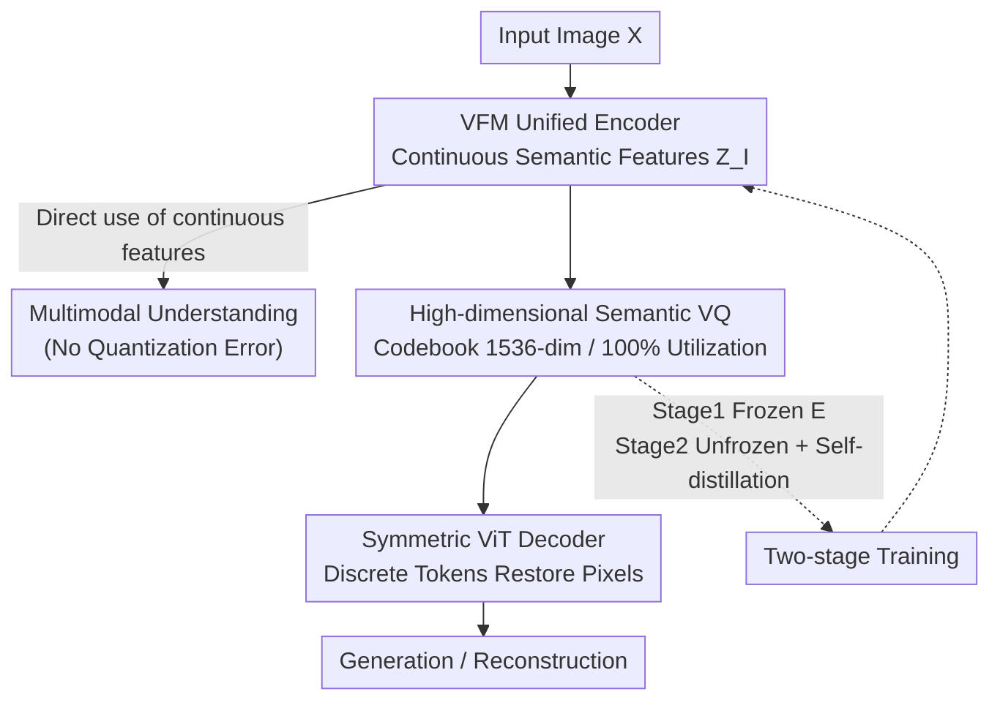

# VQRAE: Representation Quantization Autoencoders for Multimodal Understanding, Generation and Reconstruction

**Conference**: CVPR 2026  
**Paper**: [CVF Open Access](https://openaccess.thecvf.com/content/CVPR2026/html/Du_VQRAE_Representation_Quantization_Autoencoders_for_Multimodal_Understanding_Generation_and_Reconstruction_CVPR_2026_paper.html)  
**Code**: https://github.com/KlingAIResearch/VQRAE  
**Area**: Multimodal VLM  
**Keywords**: Unified tokenizer, vector quantization, representation autoencoder, multimodal unification, high-dimensional codebook

## TL;DR
VQRAE transforms RAE (a representation autoencoder using a pre-trained visual backbone as the encoder) into a vector-quantized version. **A single tokenizer simultaneously outputs continuous semantic features for understanding and discrete tokens for generation and reconstruction**. It demonstrates for the first time that quantizing semantic features requires **high dimensionality** (1536) for 100% utilization and to avoid collapse, completely moving away from dual-encoders and CNN pixel encoders.

## Background & Motivation

**Background**: To integrate "image understanding + image generation + image reconstruction" into a single autoregressive large model, the key bottleneck lies in the visual tokenizer, which must convert pixels into representations digestible by LLMs. Early unified models (Chameleon, EMU-3, Show-o) directly used discrete VQ tokenizers because discrete tokens are naturally compatible with next-token-prediction (NTP), scalable, and have mature training infrastructure.

**Limitations of Prior Work**: Discrete tokenizers trained with pixel reconstruction objectives tend to favor **fine-grained texture features**, which conflict with the **semantic-level features** (such as CLIP) required for understanding tasks, leading to performance degradation in understanding. To reconcile this, the mainstream shifted to **dual-encoders**: the Janus series uses two independent encoders (one for semantics, one for pixels); TokenFlow/MUSE-VL use shared mapping networks to decouple semantics and pixels; QLIP/VILA-U/UniTok add contrastive loss supervision to backbone features for discrete tokens.

**Key Challenge**: The cost of the dual-encoder paradigm is high—increased model complexity, difficulty in deep interaction between the two representations, and the requirement of massive batch sizes for contrastive loss to balance conflicting objectives. The essence of unified models is the synergy between different representations, which dual-encoders hinder. Conversely, pure continuous tokenizers (diffusion-based) are difficult to converge under the autoregressive paradigm due to the high dimensionality of CLIP features.

**Goal**: Is it possible to build a **truly unified single-encoder tokenizer** that simultaneously produces continuous semantic features (for understanding) and discrete fine-grained tokens (for generation/reconstruction) without a CNN pixel encoder?

**Key Insight**: The authors were inspired by RAE (Representation AutoEncoder), which replaces the VAE with a pre-trained visual foundation model (VFM) and a trained decoder, proving in diffusion generation that a "structured semantic latent space actually accelerates convergence." The authors further investigated: since the continuous semantic space can be reconstructed, can its **discretization** into VQ tokens support generation while preserving semantics?

**Core Idea**: Use SimVQ to perform vector quantization on **frozen/fine-tuned VFM semantic features** (rather than pixel features), paired with a symmetric ViT decoder. Two-stage training + self-distillation allows a single encoder to provide continuous features for understanding and discrete tokens for generation—this is VQRAE (a VQ version of RAE).

## Method

### Overall Architecture
VQRAE is a **single-encoder unified tokenizer** consisting of three parts: a pre-trained vision foundation model (VFM, such as SigLIP2 or InternViT) as the unified encoder $E$, a high-dimensional semantic VQ codebook $C$, and a ViT decoder $D$ symmetric to the encoder. An input image $X \in \mathbb{R}^{h\times w\times 3}$ is encoded by $E$ into continuous semantic features $Z_I$—these features are **directly used for multimodal understanding** (without quantization, hence no quantization error). The same $Z_I$ is then projected and quantized via the codebook into discrete tokens $Z_q$, which are restored to pixels by the symmetric ViT decoder. These **discrete tokens are used for generation and reconstruction**. One encoder, two outputs—this is what distinguishes it from dual-encoder setups.

Training is divided into two stages: **Stage 1** freezes the VFM encoder and only trains the codebook + decoder using a pixel reconstruction objective to learn discrete semantic representations. **Stage 2** unfreezes the encoder for joint optimization but adds a **self-distillation loss** to pull the encoder features toward the original VFM, preventing fine-tuning from drifting away from semantics.

### Key Designs

**1. VFM as Unified Encoder: One encoder serving both understanding and generation**

This addresses the redundancy and fragmentation of dual-encoders. Previous models like TokenFlow/Janus required a ViT semantic encoder plus a CNN pixel encoder, leading to high complexity and weak interaction between representations. VQRAE uses a pre-trained VFM (CLIP/SigLIP2/InternViT) as the sole encoder $E$: given an image $X\in\mathbb{R}^{h\times w\times 3}$, patch size $p$, and hidden dimension $d$, it produces intermediate features $Z_I\in\mathbb{R}^{\frac{hw}{p^2}\times d}$. This feature is **dual-purpose**: it is sent as-is for understanding tasks and projected/quantized for reconstruction. The key observation is that continuous features from a frozen semantic encoder **can themselves reconstruct images** (with some loss of color and texture), and minor fine-tuning of the encoder can recover these details with minimal impact on, or even enhancement of, semantic understanding. This implies that semantic space and pixel reconstruction are not inherently antithetical.

**2. High-Dimensional Semantic VQ: Quantizing semantic features with "unusually high dimensionality"**

This is the most counter-intuitive finding of the paper. Traditionally, VQVAE/VQGAN quantized CNN pixel features using **low dimensionality** (8–256) because it was believed that reconstruction requires fine-grained details and low-dim codebooks are more stable; high-dim codebooks were prone to collapse and low utilization. VQRAE specifically quantizes only **VFM semantic features** using SimVQ: given a codebook $C\in\mathbb{R}^{k\times e}=\{c_i\}_{i=1}^{k}$ and a learnable projection matrix $W$, the semantic feature $Z_I$ is projected to $\hat{Z}_c$, then quantized by searching the codebook based on $l_2$ distance:

$$Z_q = \text{lookup}\!\left(\arg\min_i \|\hat{Z}_c - c_i w_i\|\right),\quad i=1,\dots,k$$

The authors emphasize that the codebook dimension **must be at least equal to the VFM encoder dimension**. Experiments show that when quantizing semantic features, higher dimensionality is better—1536 dimensions with 16k entries achieved **100% utilization**; lower dimensions (e.g., 384) led to training non-convergence and codebook collapse. This contradicts the "low-dim codebook" conclusion from the CNN era because high-dim latent semantic spaces are more structured (a core observation of RAE), and discretizing them requires sufficient capacity.

**3. Symmetric ViT Decoder: Pixel reconstruction from discrete tokens without convolutions**

This targets the extra structural and training overhead of CNN pixel decoders. VQRAE replaces traditional CNN decoders with a **ViT decoder $D$ mirroring the encoder structure**: the quantized vector $Z_q$ is first projected into a bottleneck feature $Z_{bot}\in\mathbb{R}^{\frac{hw}{p^2}\times d}$ to align with the decoder dimension. The decoder patch size is set to 1, projecting $D(Z_{bot})$ back to pixel space $X'$, maintaining resolution with hyperparameters $q=q'=p$. Thus, the entire tokenizer is **free of convolutional blocks**, purely ViT-based, simple in structure, and seamlessly integrates into existing MLLMs.

**4. Two-stage Training + Self-distillation: Stabilizing reconstruction before preserving semantics**

This addresses the dilemma where unfreezing the encoder allows for fine-grained details but risks drifting from semantics. Stage 1 freezes $E$ and jointly optimizes the codebook $C$ and decoder $D$ using pixel reconstruction loss (L2 + LPIPS perceptual + adversarial) and VQ quantization loss:

$$L_{rec}=\ell_2(X,X')+L_P(X,X')+\lambda_G L_G(X')$$
$$L_{quant}=\|\text{sg}(C)-Z_q\|_2^2+\beta\cdot\|Z_q-\text{sg}(C)\|_2^2,\quad L_{stage1}=L_{rec}+L_{quant}$$

where $\beta=0.25$ and $\text{sg}[\cdot]$ is stop-gradient. Stage 2 unfreezes the encoder to add fine-grained details but includes a **self-distillation loss** to pull continuous features $Z_I$ toward the frozen teacher $T$ (initialized by $E$):

$$L_{distill}=\|Z_I-T(X)\|_2^2,\quad L_{stage2}=L_{rec}+L_{quant}+\lambda_d L_{distill}$$

Crucially, self-distillation **directly supervises the unquantized continuous features $Z_I$** (unlike Tar/VQKD which distill discrete tokens), avoiding quantization errors. Ablations prove that end-to-end training without self-distillation yields the best reconstruction but collapses understanding (MME-P only 608.9), while adding self-distillation and the two-stage approach restores understanding (MME-P 1439.1).

### Loss & Training
The total objective follows the Stage 1 / Stage 2 losses described above. On the understanding side, there is no need for separate VQRAE training—the VFM of an existing MLLM acts as the encoder; after the two-stage process, it is plugged back into the MLLM. On the generation side, the visual vocabulary is expanded based on the Qwen3 backbone, and training uses the NTP loss solely on visual tokens.

## Key Experimental Results

Data: Pre-trained on BLIP3-o open-source data (27M Qwen2.5-VL recaptioned + 5M CC12M + 4M JourneyDB); understanding follows LLaVA-1.5 settings; generation uses an additional 80M high-quality images. Encoders used are SigLIP2-so400m and InternViT-300M; LLMs for understanding are Vicuna-1.5 / Qwen2.5-7B, and Qwen3-0.6B for generation.

### Main Results: Reconstruction Quality (ImageNet 256×256 50k Val Set)

| Type | Method | Downsample | rFID↓ | PSNR↑ | SSIM↑ |
|------|------|------|------|------|------|
| Unified tokenizer | TokenFlow (Dual-encoder) | 16 | 1.37 | 21.41 | 0.690 |
| Unified tokenizer | MUSE-VL (Dual-encoder) | 16 | 2.26 | 20.14 | 0.646 |
| Unified tokenizer | DualViTok | 16 | 1.37 | 22.53 | 0.740 |
| Unified tokenizer | **Ours (SigLIP2)** | 16 | **1.31** | 22.23 | **0.762** |
| Unified tokenizer | **Ours (InternViT)** | 14 | 1.39 | **22.88** | **0.784** |

Using a simpler single-encoder, pure ViT, and no convolution blocks, VQRAE outperforms dual-encoder methods like TokenFlow and MUSE-VL in reconstruction quality, particularly in SSIM.

### Main Results: Multimodal Understanding (Selected Benchmarks)

| Method | Encoder / LLM | Res | POPE | MME-P | SEED | TQA |
|------|------|------|------|------|------|------|
| TokenFlow-L | ViTamin-XL / Vicuna-13B | 256 | 85.0 | 1365.4 | 62.6 | 54.1 |
| Tar | SigLIP2 / Qwen2.5-7B | 384 | 87.8 | 1571.0 | 73.0 | — |
| **Ours** | SigLIP2 / Vicuna-13B | 512 | **88.2** | 1543.3 | 69.9 | 61.7 |
| InternVL3 (Cap) | InternViT / Qwen2.5-7B | 448 | 91.1 | 1748.4 | 77.1 | 80.2 |
| **Ours** | InternViT / Qwen2.5-7B | 448 | 90.5 | 1746.8 | 77.0 | 80.6 |

In comparable 13B settings, VQRAE's MME-P (1543.3) significantly exceeds that of the dual-encoder TokenFlow-L (1365.4). With InternViT, it almost matches the pure understanding model InternVL3, and even surpasses it in TextVQA (80.6 vs 80.2), indicating that two-stage training preserves or enhances understanding. On the generation side, the 0.6B VQRAE achieved 0.76 on GenEval and 86.67 on DPG-Bench, remaining competitive within its scale.

### Ablation Study: Codebook Dimension and Size (ImageNet-1K, 20 epochs)

| Dim | Codebook Size | rFID↓ | PSNR↑ | SSIM↑ | Utilization↑ |
|------|------|------|------|------|------|
| 384 | 16384 | 7.69 | 8.24 | 0.261 | 64% |
| 768 | 16384 | 5.38 | 13.76 | 0.398 | 69% |
| 1152 | 16384 | 3.51 | 17.22 | 0.569 | 83% |
| **1536** | **16384** | **2.65** | **20.14** | **0.668** | **100%** |
| 1920 | 16384 | 2.69 | 20.07 | 0.664 | 98% |
| 1536 | 4096 | 7.07 | 8.02 | 0.253 | 100% |
| 1536 | 8192 | 3.74 | 17.02 | 0.548 | 100% |
| 1536 | 32768 | 2.78 | 19.94 | 0.645 | 96% |

### Ablation Study: Training Strategy

| Two-stage | Self-distill | rFID↓ | MME-P↑ | MMB↑ | TQA↑ | Note |
|------|------|------|------|------|------|------|
| ✗ | ✗ | 2.69 | 608.9 | 22.3 | 7.0 | E2E No Distill: Good Rec, Bad Und |
| ✗ | ✓ | 2.84 | 1435.2 | 64.9 | 42.6 | Distill restores Understanding |
| ✓ | ✓ | 2.71 | 1439.1 | 65.8 | 44.0 | Stage 2 + Distill: Win-win |

### Key Findings
- **Dimension is Critical**: When quantizing semantic features, increasing dimensionality from 384 to 1536 caused rFID to drop from 7.69 to 2.65 and utilization to surge from 64% to 100%. This is the most counter-intuitive finding, reversing the "low-dim" convention of the CNN pixel VQ era.
- **Codebook Size Sweet Spot**: Optimal reconstruction occurred at 16k; exceeding this (32768) led to slight degradation due to slower convergence.
- **Self-distillation as the Performance Switch**: Without self-distillation, MME-P plummeted from 1439 to 609, and TQA from 44 to 7, proving that unconstrained encoder fine-tuning completely derails semantics.
- **Natural Emergence of Decoupled Representations**: K-means clustering showed continuous features clustering by objects/animals (semantics) and discrete tokens clustering by texture (fine-grained), confirming that a single encoder naturally produces two complementary representations, making dual-encoders redundant.

## Highlights & Insights
- **"High-dim for 100% utilization" overturns consensus**: While the VQ community conventionally assumes reconstruction codebooks must be low-dim (8–256), this work proves semantic features require high dimensionality ($\ge$ encoder dim) and is the first to train high-dim codebooks to 100% utilization without collapse. This conclusion can guide future semantic VQ research.
- **Dual-use features avoiding quantization error**: Understanding uses unquantized continuous features, while generation uses quantized discrete tokens. This bypasses the long-standing problem of "discretization damaging semantics" in unified models, providing a cleaner solution than direct discrete token distillation like Tar.
- **Pure ViT, no convolution, plug-and-play**: The tokenizer has no convolutional blocks. Since it is built on existing VFMs, it can directly replace ViT encoders in MLLMs without retraining, significantly lowering the engineering barrier for unified models.
- **Transferable paradigm**: The "semantic backbone + high-dim VQ + semantic-preserving self-distillation" paradigm could be equally effective for unified tokenizers in other modalities like video and audio.

## Limitations & Future Work
- **Small Generation Scale**: Generation experiments used only a 0.6B Qwen3. While it showed the potential of discrete autoregressive scaling, it did not verify the true scaling limit of semantic discrete tokens in larger models.
- **Reconstruction rFID Not SOTA**: Pure generation tokenizers like RAE (continuous, rFID 0.49) and VAR still outperform the discrete version of VQRAE in reconstruction metrics; discretization itself still incurs a visible cost.
- **Dependency on Strong VFMs**: The method relies on high-quality pre-trained VFMs and may not be directly applicable to modalities/domains lacking strong foundations; matching codebook dimensions to encoder dimensions also adds hyperparameter tuning overhead.
- **Evaluation Dependency**: The authors did not specifically train a MLLM for VQRAE, meaning the understanding ceiling is partially determined by the original VFM/MLLM. Controlled experiments are needed to clarify VQRAE's specific gain boundaries.

## Related Work & Insights
- **vs RAE**: RAE uses a VFM instead of VAE as a **continuous** representation autoencoder for diffusion generation; VQRAE **discretizes** it into a VQ version to support autoregressive generation and understanding, with core additions being "100% utilization of high-dim semantic codebooks" and "two-stage self-distillation."
- **vs Janus / TokenFlow / MUSE-VL (Dual-encoders)**: These use two encoders for decoupled representations, which is complex and limits interaction; VQRAE uses a **single encoder** for dual-purpose features, which is simpler and outperforms them in both reconstruction and understanding.
- **vs QLIP / VILA-U / UniTok (Contrastive Supervision)**: These add CLIP contrastive loss to discrete tokens, requiring large batches to balance loss conflicts; VQRAE uses self-distillation to directly constrain continuous features, avoiding batch-size dependency.
- **vs Tar / X-Omni (Semantic-supervised VQ)**: These distill **discrete tokens** and sacrifice reconstruction capability (no longer autoencoders); VQRAE distills unquantized continuous features and preserves full reconstruction, resulting in higher understanding performance (surpassing Tar in the same setup).

## Rating
- Novelty: ⭐⭐⭐⭐⭐ Single-encoder unified tokenizer + counter-intuitive "high-dim semantic codebook" discovery are genuine innovations.
- Experimental Thoroughness: ⭐⭐⭐⭐ Complete three-task results plus ablation of dimension/size/strategy; generation scaling verification is slightly light.
- Writing Quality: ⭐⭐⭐⭐ Clear motivation, good diagrams, though naming and symbols are somewhat dense.
- Value: ⭐⭐⭐⭐⭐ Provides a simple, reusable paradigm for unified multimodal tokenizers; the codebook dimension conclusion has universal significance.

<!-- RELATED:START -->

## Related Papers

- [\[CVPR 2026\] UniCompress: Token Compression for Unified Vision-Language Understanding and Generation](unicompress_token_compression_for_unified_vision-language_understanding_and_gene.md)
- [\[CVPR 2026\] LS-ViT: Least-Squares Hessian Based Block Reconstruction for Low-Bit Post-Training Quantization of Vision Transformers](ls-vit_least-squares_hessian_based_block_reconstruction_for_low-bit_post-trainin.md)
- [\[CVPR 2026\] Quant Experts: Token-aware Adaptive Error Reconstruction with Mixture of Experts for Large Vision-Language Models Quantization](quant_experts_token_aware_vlm_quantization.md)
- [\[CVPR 2026\] Blink: Dynamic Visual Token Resolution for Enhanced Multimodal Understanding](blink_dynamic_visual_token_resolution_for_enhanced_multimodal_understanding.md)
- [\[CVPR 2026\] MASQuant: Modality-Aware Smoothing Quantization for Multimodal Large Language Models](masquant_modality-aware_smoothing_quantization_for_multimodal_large_language_mod.md)

<!-- RELATED:END -->
