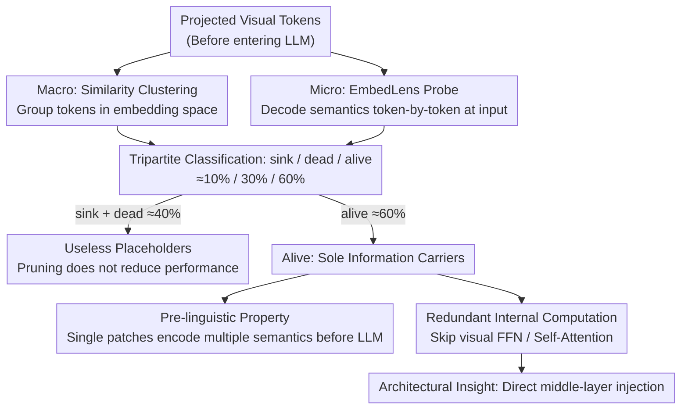

# What Do Visual Tokens Really Encode? Uncovering Sparsity and Redundancy in Multimodal Large Language Models

**Conference**: CVPR 2026  
**arXiv**: [2603.00510](https://arxiv.org/abs/2603.00510)  
**Code**: [https://github.com/EIT-NLP/EmbedLens](https://github.com/EIT-NLP/EmbedLens)  
**Area**: Multimodal VLM  
**Keywords**: visual token analysis, semantic sparsity, MLLM interpretability, attention sink, token redundancy

## TL;DR
The authors propose the EmbedLens probing tool to systematically analyze the internal structure of visual tokens in MLLMs. They discover that visual tokens are categorized into three types: sink, dead, and alive (approximately 40% are useless). Alive tokens already encode rich semantics before entering the LLM ("pre-linguistic" property), and internal visual computation within the LLM is redundant for most tasks, allowing for direct middle-layer injection.

## Background & Motivation
**Background**: MLLMs map patch embeddings from visual encoders like CLIP into the LLM embedding space via projection layers, achieving significant progress in vision-language tasks. However, the structured organization and processing of visual tokens within the LLM remain unclear.

**Limitations of Prior Work**: Contrastive pre-training encourages global image-text alignment, while the LLM processes inputs as local patch-level token sequences. This inconsistency creates a critical gap in understanding: how is globally aligned semantic information distributed among local tokens? Do all patches carry meaningful semantics?

**Key Challenge**: Existing analysis methods (such as LogitLens using the unembedding matrix) cannot distinguish whether semantics are inherent to the visual encoder/projection layer or injected by the language backbone.

**Goal**: (a) Identify the semantic organizational structure of visual tokens at the input layer; (b) determine how much information alive tokens carry before entering the LLM; (c) assess the necessity and depth of internal visual computation within the LLM.

**Key Insight**: Propose EmbedLens to directly probe token semantics in the input embedding space, avoiding confusion caused by transformations in subsequent layers.

**Core Idea**: Visual tokens exhibit a tripartite structure of sink/dead/alive; alive tokens are already "pre-linguistic," and most internal visual computations in the LLM are redundant.

## Method

### Overall Architecture
Rather than proposing a new model, this paper aims to clarify what each of the hundreds of patch tokens encoded by MLLMs actually represents and which ones are redundant. The authors decompose the problem using a two-level analysis: macroscopically, they perform similarity clustering on all visual tokens to see how they group in the embedding space; microscopically, they use a probe called EmbedLens to interpret the semantic content of each token individually. By cross-referencing these levels, visual tokens naturally fall into sink, dead, and alive categories. The subsequent work involves investigating the behavior of each class—identifying which are useless placeholders, which are the true information carriers, and whether information is encoded before or after entering the LLM.

### Key Designs

**1. EmbedLens Probe: Reading semantics at the input embedding space instead of the output**

To determine whether semantics originate from the projection layer or the LLM, it is crucial to decide where to read the tokens. Existing LogitLens methods use the unembedding matrix to project representations back to the vocabulary at the output stage, but the decoded semantics at that point have been transformed by LLM layers, making it impossible to distinguish the source. EmbedLens changes this by directly calculating the cosine similarity between the target representation $\mathbf{h}$ and the input embedding $\mathbf{e}_i$ of each token in the vocabulary, selecting the Top-k nearest words as the explanation for what the representation "looks like":

$$\text{EmbedLens}(\mathbf{h}) = \text{TopK}_{i \in \mathcal{V}} \frac{\mathbf{h}^\top \mathbf{e}_i}{\|\mathbf{h}\|_2 \|\mathbf{e}_i\|_2}$$

Because this compares with input-side embeddings, it reads the semantics currently carried by the representation without interference from subsequent layer transformations. The authors verify that its matching accuracy in shallow and middle layers is higher than LogitLens across multiple model families including LLaVA, Qwen-VL, and InternVL.

**2. Sink / Dead / Alive Categories: Approximately 40% of visual tokens are placeholders**

By overlaying clustering results with EmbedLens interpretations, visual tokens are clearly divided into three categories with proportions of roughly 10%, 30%, and 60%. Sink tokens (~10%) are nearly identical vectors across different images (cosine similarity > 0.99) and carry no image-specific information. Dead tokens (~30%) form the largest cluster and are also highly similar across images; EmbedLens decodes them as fragmented, non-semantic subwords. Their representations remain almost unchanged throughout the network, receiving less than 8% of cross-modal attention. Alive tokens (~60%) cluster near textual semantic centers and are the sole carriers of image-specific semantics.

**3. "Pre-linguistic" Property of Alive Tokens: Semantics are encoded before entering the LLM**

The authors find that a single alive token can simultaneously encode multiple semantic trajectories—object identity, color, shape, and OCR text can be packed into one token. To confirm this, they created a patch-level compression benchmark where an object or character is rendered exactly into one visual patch. Results show that for patches where the object is correctly identified, most color and counting questions are also answered correctly, proving that a single patch indeed contains multi-layered semantics formed at the visual encoder + projection stage.

**4. Redundancy in internal visual computation: Shallow text-centric transformations are unnecessary for visual tokens**

The authors demonstrate that for most standard tasks, skipping the FFN and self-attention layers that act only on visual tokens results in nearly identical or even better performance. Projection layers intentionally amplify the L2 norm of visual tokens to skip shallow transformations designed for text. This leads to the architectural insight that visual tokens can be directly injected into middle layers rather than the first layer.

## Key Experimental Results

### Main Results — Impact of Sink Pruning

| Method | General | OCR | CV Centric | Hallu. | Avg. |
| :--- | :--- | :--- | :--- | :--- | :--- |
| LLaVA-v1.5 7B | 58.7 | 36.9 | 54.0 | 61.1 | 52.7 |
| −Sink(LLM) | 58.6 | 37.0 | 54.4 | 61.3 | 52.7 |
| −Sink(ViT) | 58.7 | 37.2 | 53.8 | 61.1 | 52.8 |
| −All Sink | 58.6 | 37.2 | 54.1 | 61.3 | 52.8 |

### Ablation Study — Dead Token Pruning

| Method | General | OCR | CV Centric | Hallu. | Avg. |
| :--- | :--- | :--- | :--- | :--- | :--- |
| Original Model | 58.7 | 36.9 | 54.0 | 61.1 | 52.7 |
| −Dead | 58.7 | 37.1 | **57.7** | 61.2 | **53.7** |
| −Same Amount Remaining | 57.2 | 34.3 | 48.5 | 60.2 | 50.1 |

### Key Findings
- Removing approximately 40% of sink+dead tokens does not decrease performance (52.7 → 53.7), confirming input-level semantic sparsity.
- Randomly removing the same number of alive tokens significantly degrades performance (50.1), proving alive tokens are the sole information carriers.
- Dead tokens remain almost unchanged throughout the network (cross-layer cosine similarity near 1).
- The 2nd MLP layer of the LLM acts as a "sink aligner," projecting LLM sink tokens into nearly the same direction as ⟨bos⟩.
- Visual token L2 norms are significantly higher than text tokens, which suppresses effective transformations in shallow layers—an intentional design of the projector.

## Highlights & Insights
- **Tripartite Framework (sink/dead/alive)**: Provides the first empirical evidence clearly delineating the functional roles of visual tokens, offering a theoretical basis for token pruning.
- **EmbedLens Probe**: A model-agnostic utility verified across LLaVA, Qwen-VL, and InternVL families, proving more accurate than LogitLens in shallow layers.
- **Architectural Implications of "Pre-linguistic" Findings**: Since alive tokens already encode sufficient semantics, visual computation within the LLM is redundant, suggesting visual tokens can skip certain layers or be injected directly into middle layers.
- **Fine-grained Discovery of Color Bias**: Model color predictions often rely on background statistics rather than the target object itself, exposing a systemic bias in VLMs.

## Limitations & Future Work
- The analysis is primarily based on the LLaVA-1.5 architecture; while consistency was verified on InternVL/Qwen-VL, it does not cover all visual encoders (e.g., SigLIP).
- The tripartite definition depends on clustering, and proportions may fluctuate across different images.
- The patch compression benchmark used for "pre-linguistic" verification is highly controlled; generalizability to natural images requires further study.
- No specific efficient architecture was proposed to exploit these findings beyond mechanistic insights.

## Related Work & Insights
- **Vs. Pruning Methods (FastV/VLM-Pruner)**: While those methods prune based on attention or redundancy heuristics, this paper reveals from an information theory perspective that ~40% of tokens are inherently useless.
- **Vs. LogitLens**: LogitLens decodes at the output with an unembedding matrix, failing to distinguish semantic sources; EmbedLens works at the input for a "purer" analysis.
- **Relation to other papers**: Complements "When Token Pruning is Worse than Random"—explaining why deep pruning is equivalent to random (information dissipation) from a representation structure perspective.

## Rating
- Novelty: ⭐⭐⭐⭐⭐ 
- Experimental Thoroughness: ⭐⭐⭐⭐ 
- Writing Quality: ⭐⭐⭐⭐⭐ 
- Value: ⭐⭐⭐⭐⭐ 

<!-- RELATED:START -->

## Related Papers

- [\[CVPR 2026\] GroundVTS: Visual Token Sampling in Multimodal Large Language Models for Video Temporal Grounding](groundvts_visual_token_sampling_in_multimodal_large_language_models_for_video_te.md)
- [\[CVPR 2026\] EvoComp: Learning Visual Token Compression for Multimodal Large Language Models via Semantic-Guided Evolutionary Labeling](evocomp_learning_visual_token_compression_for_multimodal_large_language_models_v.md)
- [\[ICCV 2025\] ShortV: Efficient Multimodal Large Language Models by Freezing Visual Tokens in Ineffective Layers](../../ICCV2025/vlm_efficiency/shortv_efficient_multimodal_large_language_models_by_freezing_visual_tokens_in_i.md)
- [\[CVPR 2026\] MASQuant: Modality-Aware Smoothing Quantization for Multimodal Large Language Models](masquant_modality-aware_smoothing_quantization_for_multimodal_large_language_mod.md)
- [\[ICLR 2026\] iLLaVA: An Image Is Worth Fewer Than 1/3 Input Tokens in Large Multimodal Models](../../ICLR2026/vlm_efficiency/illava_an_image_is_worth_fewer_than_13_input_tokens_in_large_multimodal_models.md)

<!-- RELATED:END -->
