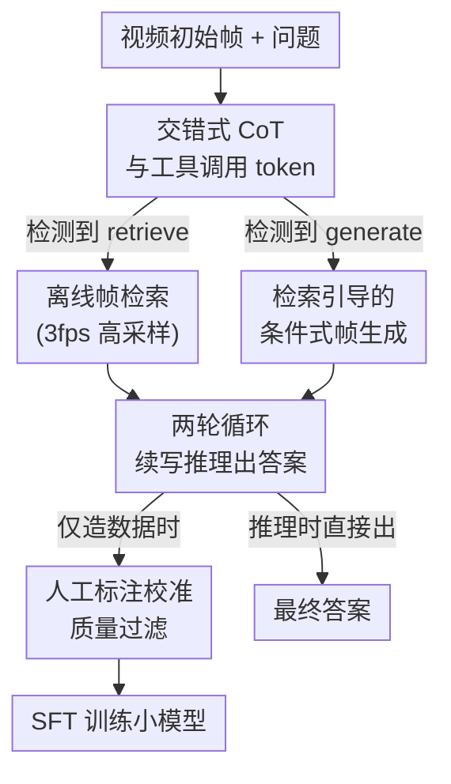

# Act2See: Emergent Active Visual Perception for Video Reasoning

**Conference**: CVPR 2026  
**arXiv**: [2605.01657](https://arxiv.org/abs/2605.01657)  
**Code**: https://github.com/martinmamql/act2see (Available)  
**Area**: Multimodal VLM / Video Reasoning / Causal Reasoning  
**Keywords**: Active Visual Perception, Interleaved CoT, Frame Retrieval, Frame Generation, SFT

## TL;DR
Act2See enables video VLMs through supervised fine-tuning to **autonomously decide when to insert a video frame** during the textual CoT reasoning process—either by retrieving a real evidence frame from the original video or conditionally "imagining" a counterfactual frame—thereby refreshing or surpassing closed-source models of similar or even larger sizes on 5 video reasoning benchmarks including VideoEspresso and ViTIB.

## Background & Motivation
**Background**: Attaching Chain-of-Thought (CoT) to video VLMs has become a mainstream paradigm for improving complex video reasoning. The standard practice involves feeding the model a set of **static initial frames** (or frames sampled at a fixed fps) and letting it reason step-by-step in text.

**Limitations of Prior Work**: Unlike image reasoning, key information in video reasoning is often hidden in the subtleties of spatio-temporal dynamics that are **not sampled at all** in the initial frames. Once the model starts reasoning and realizes it needs new evidence, it has no way to go back and "take another look." Recent works have tried to insert extra frame information into CoT (pre-selected keyframes, visual tool calls, keyframe IDs, etc.), but suffer from two major flaws: ① **Uneven CoT quality**—most CoT samples with frame information are ground-truth automatically generated by VLMs without human verification, and their inconsistent quality often drags down the model; ② **Inability to "imagine" scenes**—many real-world questions are counterfactual or hypothetical ("What would happen to the object if the temporal order of two events in the original video were reversed?"), requiring frames that do not exist in the original video. Existing methods can only retrieve existing frames and cannot **visually synthesize** such scenarios during reasoning.

**Key Challenge**: There is a fundamental conflict between static inputs and the "dynamically evolving nature of reasoning"—evidence requirements emerge only during the reasoning process, yet input frames are frozen before reasoning begins; meanwhile, the quality of supervision signals (human annotation vs. automatic generation) directly determines the quality of the learned CoT.

**Goal**: To empower VLMs with **active visual perception** capabilities—allowing them to autonomously decide "when and how" to acquire new visual information during video reasoning, including both the retrieval of real frames and the generation of hypothetical ones.

**Key Insight**: Instead of modifying the architecture during inference or using RL, the authors focus on **data**: using a frontier model (Gemini 2.5 Pro) to construct a batch of high-quality training samples with interleaved text and frames, and then implanting this "retrieve-while-reasoning" behavior into a smaller model via supervised fine-tuning. The key observation is that active frame-acquisition capabilities will **emerge** during inference as long as the training data contains sufficient natural tool-call samples.

**Core Idea**: Perform SFT using a set of interleaved CoT data with `<retrieve>` / `<generate>` tool tokens, training the model to actively insert frames (retrieving real frames or conditionally generating hypothetical frames) within the textual reasoning flow.

## Method

### Overall Architecture
Act2See is essentially a pipeline that "**constructs interleaved CoT data with frontier models and then SFTs small models**," where data construction and inference share the same **two-loop algorithm**. Given initial video frames and a question, the model generates text while reasoning in the first loop. If it judges the current visuals insufficient, it outputs a tool-call token (`<retrieve>` or `<generate>`) and a corresponding query. Once the token is detected, the system calls offline models to supplement a frame (either by retrieving one or "retrieving then conditionally generating" one) and inserts it back into the CoT. In the second loop, the reasoning is completed based on the context now containing the new frame, finally providing an `<answer>`. During data construction, all CoT samples must pass through **human-label-calibrated similarity filtering** before entering the training set; during training, standard token-level language modeling loss is used (excluding loss calculation on the supplemented frames).

### Key Designs

**1. Interleaved video-text CoT and tool-call tokens: Making "frame acquisition" a first-class citizen in the reasoning flow**

Existing methods either fix keyframes before reasoning or only allow retrieval; the model itself has no say in whether "I need a new frame now." Act2See uses an instruction template (Table 1) requiring the model to reason within `<think>...</think>` and allowing it to insert `<retrieve> query </retrieve>` or `<generate> query </generate>` at any time to request a frame. The frame is returned as `<frame>...</frame>`, and the process concludes with `<answer>...</answer>`. A specific example is the model writing `<generate> a bison baby chased by a wolf pack </generate>`—describing the image it wants to see. This syntax delegates the decision of "when to take a frame and what frame to take" entirely to the model, allowing frame-taking actions and textual reasoning to interleave seamlessly in the same sequence, rather than being pinned to a pre-processing stage. Because decisions are endogenous to reasoning, the model **exhibits emergent** on-demand frame-taking behavior: retrieving for missing factual evidence and generating for missing counterfactual visuals.

**2. Two-loop mechanism: Sewing dynamic evidence into a single CoT via "Query Output → Frame Supplementation → Completion"**

Token syntax alone is insufficient; a mechanism is needed to actually connect the requested frames back to reasoning. Act2See designs a two-loop algorithm (Algorithm 1) used for both data construction and inference. In the first loop, the model generates tokens autoregressively until it hits `</retrieve>`, `</generate>`, or `</answer>`/`<eos>`. If it stops at a tool call, the query $q_r$ or $q_g$ is extracted, an offline model supplements the frame $v'$, and $v'$ is appended to the generated sequence $Y$. In the second loop, using the "first-loop text + new frame" as prefix $Y$, the model $y_t \sim f(\cdot \mid V, Q, A, Y)$ continues writing the reasoning until it reaches `</answer>`. The final CoT is the concatenation of the two loop outputs, naturally forming an interleaved "text-frame-text" structure. Notably, supplemented retrieval frames use a high sampling rate of **3 fps** (initial input is only 1 fps), so they often contain **new evidence** not in the initial frames. If no tool call is triggered in the first loop, the sample degrades to pure text CoT, forming a "mixed" training set where 47% of samples contain frames.

**3. Retrieval-guided conditional frame generation: Allowing the model to "imagine" counterfactual scenes non-existent in the original video**

Frames needed for counterfactual/hypothetical questions simply do not exist in the original video, rendering pure retrieval useless. Act2See's generation is not text-to-image from scratch but **retrieval-then-generation**: after receiving a generation query $q_g$, the same retrieval process first pulls a frame $v_r'$ from the original video as a visual anchor. Then, the text of $q_g$ and the image of $v_r'$ are encoded via the VAE of Stable Diffusion 3.5 Large for conditional image-to-image generation to obtain $v'$. Retrieval (TFVTG, based on BLIP-2) is responsible for "staying close to real video content," while generation modifies it to "rewrite the hypothetical scenario." This coordination ensures generated frames match the style of the original video while creating scenes it does not contain, supporting causal/counterfactual reasoning. The authors acknowledge that generation is sometimes not perfectly faithful to prompts (e.g., pouring coffee beans into a cup instead of a machine), as performance is limited by current generation tools.

**4. Human-label-calibrated quality filtering: Screening CoT with human gold standards, but intentionally not feeding them to the model**

The second pain point is poor automatic CoT quality. Instead of using existing automatic CoT datasets directly, Act2See selects three datasets with **human-annotated reasoning trajectories**—MINERVA (multi-step reasoning), CausalVQA (physical/causal reasoning), and Social Genome (social reasoning)—as gold standards for quality calibration. Filtering follows three steps: first, discard all incorrect CoTs and regenerate (up to 2 retries to save compute); second, use BGE M3-Embedding to calculate text similarity between the generated CoT and human ground-truth, **retaining only those with similarity > 80%**; finally, perform format checks and a manual spot check of 100 samples (all passed). There is a counter-intuitive key decision here: **not feeding ground-truth CoTs into the prompt during data construction**. If fed, the probability of Gemini calling retrieval/generation tools drops from 45.21% to 5.26% (Ablation Table 6), and frame-bearing samples almost disappear. Thus, the authors prefer allowing text to deviate slightly from gold standards to preserve tool-call rates, using similarity thresholds to filter out samples that stray too far post-hoc.

### Loss & Training
SFT employs standard token-level negative log-likelihood loss calculated over the entire rollout (including retrieval/generation query text), **specifically excluding loss on the supplemented retrieval/generation frames**:

$$J(\theta)=-\frac{1}{N}\sum_{i=1}^{N}\sum_{t=1}^{L^{(i)}}\log P\big(y_{t}^{(i)}\mid V^{(i)},Q^{(i)},y_{<t}^{(i)};\theta\big)$$

The base model is Qwen3-VL-8B-Thinking, fine-tuned using LoRA on 8 A100 GPUs with a learning rate of $2.5\times10^{-6}$, batch size 1, and 1 epoch. Inference reuses the same offline tools as data construction (TFVTG for retrieval, Stable Diffusion 3.5 Large for generation). The final SFT dataset contains 3,373 high-quality CoT samples, of which 1,608 (47.67%) include retrieved/generated frames (1,026 retrieved, 582 generated).

## Key Experimental Results

### Main Results
On five benchmarks, Act2See (base Qwen3-VL-8B-Thinking) comprehensively outperforms same-sized open-source models, and some metrics approach or even exceed closed-source large models (Acc, zero-caption setting):

| Model | Video-MME | VideoEspresso | EgoNormia | VCR-Bench | ViTIB |
|------|-----------|---------------|-----------|-----------|-------|
| GPT-4o (Closed-source) | 71.9 | 26.4 | 45.5 | 46.9 | - |
| Gemini 2.5 Pro (Closed-source) | 84.3 | - | 64.7 | 61.3 | 53.9 |
| Qwen2.5-VL-7B | 65.1 | 35.5 | - | 30.4 | 49.8 |
| InternVL2.5-8B | 64.2 | 28.7 | 13.0 | 33.0 | 56.8 |
| Qwen3-VL-8B-Thinking (Base) | 71.8 | 41.5 | 48.9 | 38.2 | 60.2 |
| **Act2See** | **74.2** | **46.8** | **51.3** | **47.1** | **63.3** |

Highlights: Compared to the base, all five benchmarks show improvement; it surpasses GPT-4o on VideoEspresso using only 3 frames (46.8 vs 26.4, despite GPT-4o using a denser 3fps); on EgoNormia, it far exceeds InternVL2.5-8B (51.3 vs 13.0).

Comparison with recent video-text interleaved CoT methods on Video-MME (Table 3): Act2See (74.2) outperforms Video-R1 (61.4), Chain-of-Shot (64.4), and FrameMind (60.9), trailing only the concurrent work Chain-of-Frames (75.3, which uses the stronger InternVL3-8B base).

### Ablation Study

| Ablation Dimension | Configuration | Key Metric | Description |
|----------|------|----------|------|
| Feed GT into prompt (Table 6, 1k samples) | Fed GT | Frame rate 5.26% / Video-MME 72.2 | Tool call rate crashes |
|  | No GT (Ours) | Frame rate 45.21% / Video-MME 73.7 | Preserves call rate, higher performance |
| CoT Data Source (Table 7, 1k samples) | VLM Generated | ViTIB 58.3 / Video-MME 68.6 | Even lower than base |
|  | Human Labeled (Ours) | ViTIB 62.0 / Video-MME 73.7 | Source data quality is key |
| Tool Type (Table 8, 1k samples, Video-MME) | Pure Text | 71.9 | Baseline |
|  | Retrieval Only | 72.8 | Single tool improvement |
|  | Generation Only | 72.4 | Single tool improvement |
|  | Retrieval + Generation (Ours) | 73.7 | Hybrid is best |
| SFT vs. Inference-only Frame Insertion (Table 4) | ViTCoT (Inference only) | ViTIB 59.9 / Video-MME 70.2 | Similar to base |
|  | Act2See (SFT) | ViTIB 63.3 / Video-MME 74.2 | SFT is significantly superior |
| SFT vs. RL (Table 5, base Qwen2.5-VL-7B) | ReWatch-R1 (RL) | VCR-Bench 39.6 | - |
|  | Act2See (SFT) | VCR-Bench 42.2 | SFT surpasses RL |

### Key Findings
- **Avoiding ground-truth in prompts is critical for data construction**: Feeding GT causes frame-bearing samples to plummet from 45.21% to 5.26%, hurting downstream tasks—indicating that "tool call rate" is more important than "text matching the gold standard," as visual info compensates for slight textual deviations.
- **Source data quality determines everything**: SFT with VLM-generated CoT is actually **worse than the base model** (ViTIB 58.3 < Base 60.2), while human labels lead significantly; this explains why SFT-based Act2See outperforms RL-based ReWatch-R1—the authors attribute this to the extreme sensitivity of RL/CoT to low-quality data.
- **Retrieval and generation are complementary**: Using either tool alone is better than pure text, but hybridizing both is optimal, confirming that "acquiring real evidence" and "imagining counterfactuals" are distinct, irreplaceable needs.

## Highlights & Insights
- **Active perception as an "emergent capability" rather than an explicit architecture**: By not changing the inference structure or using RL and relying solely on meticulously constructed interleaved SFT data, on-demand frame acquisition emerges spontaneously during inference—an "implanting behavior via data" approach transferable to any tool-use scenario.
- **Anchor-based generation via "retrieval before generation"**: Using retrieved frames as conditions for img2img ensures generated scenes stay style-consistent with the original video while creating non-existent counterfactuals, avoiding style drift in pure text-to-image—a trick valuable for any task needing "hypothetical imagination in real contexts."
- **Most counter-intuitive point**: Using human gold standards as **post-hoc filters** rather than **input prompts**. Treating the gold standard as a referee rather than a teacher preserves the diversity of the model's active frame acquisition—reminding us that high-quality supervision signals have more uses than just "feeding them in."

## Limitations & Future Work
- **Generation quality limited by existing tools**: The authors admit Stable Diffusion 3.5 sometimes generates frames unfaithful to the prompt, which might mislead reasoning; more controllable video frame generators are needed.
- **Only SFT, no RL**: The method stops at supervised fine-tuning and has not explored using RL to further optimize the strategy for "when to call tools," as timing is still implicitly determined by SFT data distribution.
- **Small data scale**: Only 3,373 CoT samples were used, relying on specific labeled datasets (MINERVA/CausalVQA/Social Genome); generalization to reasoning skills outside these three categories remains to be verified.
- **Two-loop inference overhead**: Every frame acquisition requires offline retrieval/generation plus a second decoding pass, significantly increasing inference latency and cost compared to pure text CoT; these costs are not quantified in the paper.

## Related Work & Insights
- **vs. ViTCoT (Inference-time insertion)**: ViTCoT pre-selects frames offline and inserts them during two-loop inference without a training phase or dynamic acquisition; Act2See is superior (ViTIB 63.3 vs. 59.9) as it uses SFT and **dynamically retrieves/generates** frames during reasoning.
- **vs. Chain-of-Frames (Concurrent, SFT)**: Both use SFT to integrate frame info into CoT, but Chain-of-Frames uses frame **ID indices** and a stronger base (InternVL3-8B), leading slightly on Video-MME (75.3 vs. 74.2); Act2See differentiates by **generating** counterfactual frames.
- **vs. FrameMind / ReWatch-R1 (RL route)**: These use RL for dynamic zooming/scanning or simulating "re-watching"; Act2See's SFT route outperforms them given the same base and sampling rate (VCR-Bench 42.2 vs. 39.6), which the authors attribute to the quality of human-labeled data and RL's vulnerability to low-quality samples.
- **vs. Video-R1 / Video-of-Thought (Pure text video CoT)**: These only add text reasoning or offline scene graphs without acquiring new visuals during the flow; Act2See's core increment is internalizing "active visual evidence acquisition" into CoT.

## Rating
- Novelty: ⭐⭐⭐⭐⭐ First to support both real frame retrieval and counterfactual frame generation in CoT, treating active perception as an emergent capability.
- Experimental Thoroughness: ⭐⭐⭐⭐⭐ 5 benchmarks + 6 ablation groups, validating "GT prompting/data source/tool types/SFT vs. RL" separately.
- Writing Quality: ⭐⭐⭐⭐ Clear algorithm and motivation, but lacks quantitative analysis of generation quality and inference overhead.
- Value: ⭐⭐⭐⭐⭐ "Implanting behavior via data" and "retrieval-anchored generation" are highly transferable ideas for multimodal reasoning.

<!-- RELATED:START -->

## Related Papers

- [\[ICML 2026\] Native Active Perception as Reasoning for Omni-Modal Understanding](../../ICML2026/vlm_reasoning/native_active_perception_as_reasoning_for_omni-modal_understanding.md)
- [\[CVPR 2026\] A Multi-Agent Perception-Action Alliance for Efficient Long Video Reasoning](a_multi-agent_perception-action_alliance_for_efficient_long_video_reasoning.md)
- [\[CVPR 2026\] Don't Show Pixels, Show Cues: Unlocking Visual Tool Reasoning in Language Models via Perception Programs](dont_show_pixels_show_cues_unlocking_visual_tool_reasoning_in_language_models_vi.md)
- [\[CVPR 2026\] Dr. Seg: Revisiting GRPO Training for Visual Large Language Models through Perception-Oriented Design](dr_seg_revisiting_grpo_training_for_visual_large_language_models_through_percept.md)
- [\[CVPR 2026\] Graph-to-Frame RAG: Visual-Space Knowledge Fusion for Training-Free and Auditable Video Reasoning](graph-to-frame_rag_visual-space_knowledge_fusion_for_training-free_and_auditable.md)

<!-- RELATED:END -->
