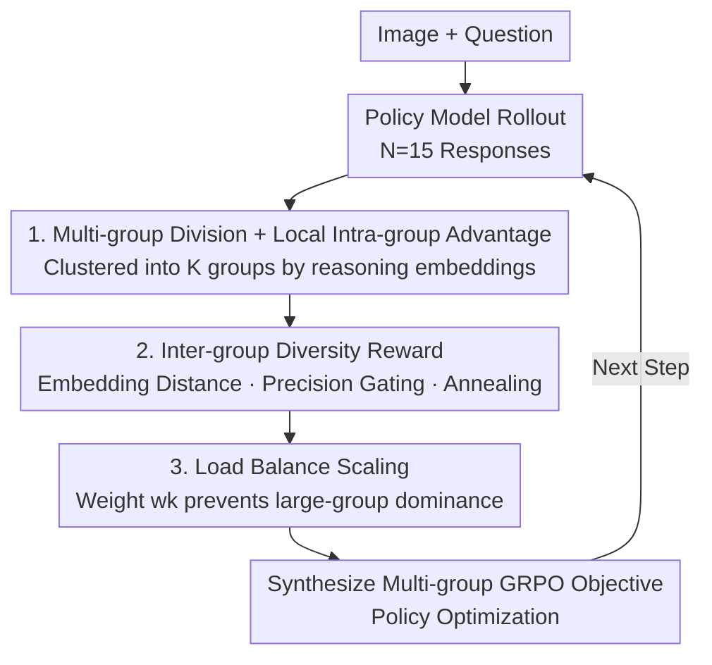

# All Roads Lead to Rome: Incentivizing Divergent Thinking in Vision-Language Models

**Conference**: CVPR 2026  
**Paper**: [CVF Open Access](https://openaccess.thecvf.com/content/CVPR2026/html/Tian_All_Roads_Lead_to_Rome_Incentivizing_Divergent_Thinking_in_Vision-Language_CVPR_2026_paper.html)  
**Code**: None  
**Area**: Multimodal VLM / RL Reasoning  
**Keywords**: GRPO, Divergent Thinking, Diversity Collapse, Multi-group Policy Optimization, Test-time Scaling

## TL;DR
The authors observe that VLMs trained with GRPO, while achieving deeper reasoning in single trials, suffer from "diversity collapse" early in training—degenerating into a single dominant strategy. They propose MUPO (Multi-group Policy Optimization), which clusters sampled responses into multiple groups based on reasoning patterns, estimates local advantages within groups, and applies inter-group diversity rewards. This allows the model to maintain multiple problem-solving strategies while preserving depth, achieving an average improvement of 2-7% in acc@1/acc@4 across nine reasoning benchmarks.

## Background & Motivation

**Background**: Utilizing Reinforcement Learning (RL) with verifiable rewards, such as GRPO, to stimulate reasoning capabilities in VLMs has become mainstream. It is widely believed that RL enables models to learn self-reflection and self-verification, significantly outperforming base models in mathematical geometry and logical visual question answering.

**Limitations of Prior Work**: The authors conducted a crucial behavioral comparison experiment and reached a counter-intuitive conclusion: **while RL models are indeed stronger when only one response is allowed (acc@1), base models can solve more problems when multiple samples are allowed (acc@k as k increases)**. On difficult problems where RL models repeatedly fail, base models often succeed using alternative paths that RL models never consider. For instance, in geometry, RL models might persist with "equation solving" (error-prone), while base models might "verify options by substitution"; for counting large numbers of objects, RL models may only enumerate sequentially, while base models use "elimination" to find the answer in fewer steps.

**Key Challenge**: RL makes models "deeper yet narrow," whereas base models are "broader and diverse." Further tracking of training dynamics reveals the root cause as **diversity collapse in GRPO**: reasoning diversity drops sharply to near zero within the first 20 training steps. The model converges prematurely to a small subset of strategies, discarding the vast majority of potential paths. This leads to two issues: (1) Exploitation overpowers exploration, leading to local optima; (2) Poor scalability, as a single converged strategy cannot cover diverse problems, limiting test-time scaling capabilities.

**Goal**: Is it possible to **retain the divergent thinking of the base model** during the RL process, performing deep reasoning on individual solutions while maintaining a set of diverse strategies?

**Key Insight**: The authors measured a strong positive correlation between reasoning diversity and acc@4—the more divergent the responses, the higher the probability of success. This indicates that "broad-net exploration" is a valuable capability erased by RL that needs to be recovered.

**Core Idea**: Instead of calculating advantages globally as in GRPO, the approach is shifted to "grouping responses by reasoning patterns, calculating local advantages within groups, and using inter-group diversity rewards to push them apart." MUPO reintroduces "parallel divergent exploration" into RL.

## Method

### Overall Architecture

MUPO (Multi-Group Policy Optimization) is a **plug-and-play replacement** for GRPO. Given an image-based question, the policy model first performs $N$ rollouts. Instead of treating these $N$ responses as a single global group, they are first **clustered into $K$ groups** based on reasoning embeddings (each group representing a reasoning pattern). **Intra-group** normalized advantage estimation is performed independently to refine each pattern. Simultaneously, an **inter-group diversity reward** is added to each response to push different patterns apart in the embedding space. Finally, a **load-balancing weight** $w_k$ is used to synthesize the GRPO objectives of the $K$ groups into a total objective. Conceptually, MUPO $\approx$ a combination of multiple GRPO objectives, where each group handles the deep refinement of one strategy, and inter-group rewards maintain breadth.

### Key Designs

**1. Multi-group Division + Local Intra-group Advantage: Splitting "Global Normalization" into "Local Multi-group Normalization"**

This directly addresses "diversity collapse." In GRPO, advantages are normalized globally across the entire group $G$. When most responses converge to a single dominant strategy, a few alternative paths are drowned out by the global mean/variance and fail to receive positive advantages, resulting in narrowing strategies. MUPO clusters the $N$ responses using **constrained clustering** (enforcing a minimum group size $G_{\min}$ for reliable estimation) into $K$ groups $\{G_k\}$ based on trajectory similarity. Advantages are then estimated **only within the group**:

$$\hat{A}^k_i = \frac{R^k_i - \mathrm{mean}(R)}{\mathrm{std}(R)}, \quad i = 1, \cdots, |G_k|.$$

The total objective is a weighted sum of the GRPO objectives for each of the $K$ groups:

$$\mathcal{J}_{\text{MUPO}}(\theta) = \mathbb{E}\Big[\sum_{k=1}^{K} \frac{w_k}{|G_k|} \sum_{i=1}^{|G_k|} \min\big(r_i(\theta)\hat{A}^k_i,\ \mathrm{clip}(r_i(\theta), 1-\epsilon, 1+\epsilon)\hat{A}^k_i\big)\Big].$$

In contrast, the original GRPO objective is in a single global form:

$$\mathcal{J}_{\text{GRPO}}(\theta) = \mathbb{E}\Big[\frac{1}{|G|}\sum_{i=1}^{|G|} \min\big(r_i(\theta)\hat{A}_i,\ \mathrm{clip}(r_i(\theta), 1-\epsilon, 1+\epsilon)\hat{A}_i\big)\Big].$$

The benefit of local estimation is that each pattern is treated as an independent "mini-arena" for self-refinement. Niche but correct strategies are not discarded as inferior due to a high overall mean, allowing multiple patterns to be preserved and polished simultaneously—achieving both breadth and depth.

**2. Inter-group Diversity Reward: Pushing strategies apart via embedding distance with "success-gated" rewards**

Grouping alone is insufficient; different groups must be actively encouraged to differ. MUPO calculates a diversity reward for each trajectory $o^k_i$, defined as its average cosine distance to the embeddings of responses in **all other groups**:

$$R_{\text{div}} = \frac{1}{N - |G_k|} \sum_{\substack{m=1 \\ m \neq k}}^{K} \sum_{j=1}^{|G_m|} d(o^k_i,\ o^m_j),$$

where $d(\cdot,\cdot)$ is the cosine distance. Responses further from other groups receive higher advantages. However, simply rewarding "difference" can induce reward hacking—models failing just to be diverse. Thus, the final reward applies **precision gating** $\mathbb{1}[R_{\text{acc}}=1]$ to the diversity term (only correct responses receive the diversity reward):

$$R^k_i = R_{\text{acc}} + R_{\text{fmt}} + \lambda \cdot \mathbb{1}[R_{\text{acc}}=1] \cdot R_{\text{div}}.$$

The weight $\lambda$ follows a cosine annealing schedule from $\lambda_{\max}$ to $\lambda_{\min}$:

$$\lambda = \lambda_{\min} + \frac{\lambda_{\max} - \lambda_{\min}}{2}\Big(1 + \cos\big(\frac{\pi \cdot t_{\text{cur}}}{t_{\max}}\big)\Big).$$

This "gating + annealing" design encourages broad exploration of various patterns in **early training**, while the decaying weight in **later training** shifts focus toward converging to global optima.

**3. Load Balance Scaling: Preventing large groups from dominant weighting**

When synthesizing objectives, large groups with many responses could dominate the gradient if unconstrained, marginalizing smaller groups (frequently the rare but valuable strategies). MUPO introduces a load-balancing scaling factor for each group:

$$w_k = \Big(\frac{N}{K|G_k|}\Big)^{\beta},$$

where $\beta$ is a sensitivity index. Larger groups have smaller $w_k$ to suppress their contribution, while smaller groups are appropriately boosted. This balances the influence of different patterns in the total objective. The paper defaults to $\beta=1$.

### Loss & Training
Models are trained for 2 epochs on the ViRL39K dataset with a learning rate of $1\text{e}{-6}$, using Qwen2.5-VL 3B / 7B as base models. $N=15$ responses are generated per sample (temperature 1.0), with $K=3$ groups, $G_{\min}=3$, $\beta=1$, and $\lambda_{\max}=0.4 \to \lambda_{\min}=0.1$. Rewards consist of accuracy, format, and (gated + annealed) diversity.

## Key Experimental Results

### Main Results

Comparison of 7B models on six mathematical reasoning benchmarks (Selected, acc@1 / acc@4, in %):

| Model | Math Avg Acc@1 | Math Avg Acc@4 | General Avg Acc@1 | General Avg Acc@4 |
|------|------|------|------|------|
| Qwen2.5-VL-7B (Base) | 40.1 | 56.5 | 58.0 | 71.5 |
| VLAA-Thinker-7B | 47.2 | 51.5 | 63.6 | 66.2 |
| Vision-R1-7B | 49.1 | 52.8 | 63.3 | 66.1 |
| **MUPO-Thinker-7B** | **51.6** | **58.8** | **65.6** | **72.4** |

- Math benchmark acc@1 improves by +2.5% over the previous best (49.1 $\to$ 51.6); general benchmarks improve by +2.3%.
- Test-time scaling (acc@4) shows larger gains: Math +6.0% (52.8 $\to$ 58.8), General +6.2% (66.2 $\to$ 72.4), and **surpasses the base model**—indicating MUPO effectively combines RL depth with base model breadth.
- The 3B version is also competitive: MUPO-Thinker-3B improves acc@4 by +5.9% on average (50.1 $\to$ 56.0), catching up to several 7B baselines due to strong scalability.

### Ablation Study

Impact of group number $K$ (7B, average across five benchmarks, %):

| K | MathVerse | MathVista | MathVision | MMStar | HallBench | Average |
|---|------|------|------|------|------|------|
| 1 (GRPO) | 46.9 | 69.1 | 24.1 | 64.8 | 54.7 | 51.9 |
| 2 | 49.4 | 72.3 | 28.0 | 65.2 | 56.7 | 54.3 |
| **3** | 51.2 | 74.1 | 29.3 | 65.8 | 56.5 | **55.4** |
| 4 | 50.9 | 74.6 | 29.4 | 65.1 | 56.3 | 55.3 |
| 5 | 50.6 | 74.8 | 29.1 | 64.5 | 55.9 | 55.0 |

- At $K=1$, MUPO degrades to GRPO, which is the worst performing point (51.9), supporting "grouping" as the key factor.
- Accuracy peaks at $K=3$. Math tasks favor larger $K$ (more flexible strategies), while general tasks favor smaller $K$ (consistent structured reasoning).

### Key Findings
- **Diversity reward weight $\lambda$ is a double-edged sword**: $\lambda_{\max}=0.4, \lambda_{\min}=0.1$ is optimal. Increasing these values causes diversity to override accuracy; decreasing them leads to insufficient exploration and local optima.
- **Training dynamics validate design intent**: The diversity reward curve follows a "rise-fall-stable" pattern. MUPO shows a **gradual decrease** in diversity on the validation set, contrasting with the "drastic collapse" in GRPO, indicating a balance between exploration and exploitation.
- **t-SNE Visualization**: GRPO reasoning embeddings cluster tightly (high pass rate for successes, but failures don't cover correct trajectories). MUPO displays a broad multi-modal structure, where each peak corresponds to a strategy, effectively finding correct solutions in alternative modes where GRPO fails.

## Highlights & Insights
- **The counter-intuitive finding that "RL models are not necessarily better than base models" is valuable**: Acc@1 leads often mask a loss of diversity. Looking at acc@k reveals that reasoning RL should be evaluated beyond greedy decoding.
- **Pinpointing "diversity collapse" to the first 20 training steps**: This diagnostic suggests the issue is premature convergence in early RL, not capacity, leading to the "diverge early, converge late" annealing approach.
- **The combination of "grouping + local advantage + inter-group diversity + load balance" is a cohesive strategy**: Local advantages protect niche modes from global means, inter-group rewards proactively separate modes, and load balancing prevents group-size bias. This approach is transferable to any GRPO-like RL training.
- **Precision gating for preventing reward hacking** is a simple but necessary detail: rewarding only "correct and different" responses ensures the model doesn't sacrifice accuracy for diversity.

## Limitations & Future Work
- Diversity measurement relies entirely on an external embedding model (Qwen3-Embedding-0.6B). The semantic quality of the embedding space determines the effectiveness of clustering; if embeddings cannot distinguish between "superficially different but essentially identical" reasoning, grouping may be ineffective. ⚠️ This is not deeply discussed in the paper.
- Generating $N=15$ responses and clustering them adds training overhead compared to GRPO. Multiple hyperparameters ($K$, $G_{\min}$, $\beta$, $\lambda$) may need task-specific tuning.
- Ablations on constrained clustering, $\beta$, and more comprehensive limitation analyses are in the appendix rather than the main text.
- The acc@1 gain (+2~3%) is stable but not massive; the primary benefit is in acc@4 test-time scaling—if deployed using only single greedy decoding, the gains may be reduced.

## Related Work & Insights
- **vs. GRPO**: GRPO uses global advantage and single-group comparison, prone to diversity collapse. MUPO is a plug-and-play replacement with multi-group local advantages and diversity rewards, reducing to GRPO when $K=1$.
- **vs. Entropy-based RL**: Entropy-based methods inject uncertainty at the token/distribution level but struggle to foster divergence across "different strategies." MUPO separates patterns at the group level, achieving both depth and breadth.
- **vs. Test-time Scaling (CoT/Verifier aggregation)**: These are inference-time methods that do not modify training. MUPO integrates "parallel divergence" directly into RL training, fundamentally improving the model's multi-strategy capability and scaling potential.

## Rating
- Novelty: ⭐⭐⭐⭐⭐ Sharp diagnosis of "diversity collapse" and a clean, self-consistent solution.
- Experimental Thoroughness: ⭐⭐⭐⭐ Nine benchmarks across 3B/7B scales, acc@1/acc@4 metrics, and training dynamics. Some ablations are confined to the appendix.
- Writing Quality: ⭐⭐⭐⭐⭐ Smooth logical flow from behavioral comparison to root cause diagnosis to method.
- Value: ⭐⭐⭐⭐⭐ Reveals a common hidden pitfall in reasoning RL ("getting deeper yet narrower") and provides a practical solution transferable to all GRPO-style training.

<!-- RELATED:START -->

## Related Papers

- [\[CVPR 2026\] Improving Vision-language Models with Perception-centric Process Reward Models](improving_vision-language_models_with_perception-centric_process_reward_models.md)
- [\[CVPR 2026\] R-4B: Incentivizing General-Purpose Auto-Thinking in MLLMs via Bi-Mode Annealing and Reinforce Learning](r-4b_incentivizing_general-purpose_auto-thinking_in_mllms_via_bi-mode_annealing_.md)
- [\[CVPR 2026\] OneThinker: All-in-one Reasoning Model for Image and Video](onethinker_all-in-one_reasoning_model_for_image_and_video.md)
- [\[CVPR 2026\] Unified Generation and Self-Verification for Vision-Language Models via Advantage Decoupled Preference Optimization](unified_generation_and_self-verification_for_vision-language_models_via_advantag.md)
- [\[CVPR 2026\] Thinking with Programming Vision: Towards a Unified View for Thinking with Images](thinking_with_programming_vision_towards_a_unified_view_for_thinking_with_images.md)

<!-- RELATED:END -->
