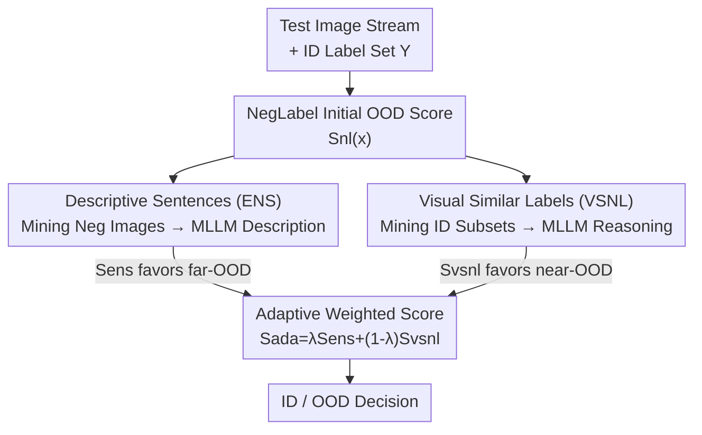

# ANTS: Adaptive Negative Textual Space Shaping for OOD Detection via Test-Time MLLM Understanding and Reasoning

**Conference**: CVPR 2026  
**Paper**: [CVF Open Access](https://openaccess.thecvf.com/content/CVPR2026/html/Zhu_ANTS_Adaptive_Negative_Textual_Space_Shaping_for_OOD_Detection_via_CVPR_2026_paper.html)  
**Code**: https://github.com/ZhuWenjie98/ANTS  
**Area**: Multimodal VLM / OOD Detection  
**Keywords**: OOD Detection, Negative Labels, MLLM, Test-Time Adaptation, Zero-shot  

## TL;DR
ANTS allows Multimodal Large Language Models (MLLM) to "understand" cached suspected OOD images at test-time. It generates "descriptive negative sentences" to characterize far-OOD and "visually similar negative labels" to characterize near-OOD. These two negative textual spaces are dynamically fused via an adaptive weight. On the ImageNet benchmark, ANTS achieves a zero-shot, training-free 3.1% reduction in FPR95, setting a new SOTA.

## Background & Motivation
**Background**: The mainstream approach for zero-shot OOD detection using Vision-Language Models like CLIP is introducing "negative labels" (NLs). Beyond the ID label set $\mathcal{Y}$, a disjoint negative label set $\mathcal{Y}^-$ is prepared. A test image is classified as OOD if it is similar to the negative labels and dissimilar to ID labels. Representative methods include NegLabel, which selects words with the largest cosine distance from ID labels in a large corpus, and EOE, which uses LLM prompts to generate negative labels.

**Limitations of Prior Work**: These methods suffer from three specific issues. First, **they do not "look" at OOD images**: Negative labels are generated purely from the text side (corpus/LLM), creating a semantic gap with real OOD images. t-SNE visualizations show negative textual features are far from OOD image features (Fig.1). Second, **near-OOD detection often fails**: NegLabel deliberately selects words semantically distant from ID, naturally ignoring near-domain OOD that "looks like ID." While EOE generates visually similar labels for all ID classes, OOD samples usually resemble only a subset of ID classes; generating similarity labels for all ID classes yields many false negative labels. Third, **task types are assumed to be known**: Existing methods require prior knowledge of whether the task is near-OOD or far-OOD to customize label generation rules, which is untenable in dynamic open environments.

**Key Challenge**: The quality of negative labels is paramount. "Vacuum-generated" negative labels lack knowledge of real OOD distributions (hurting far-OOD) and fail to precisely approximate similar ID subsets (hurting near-OOD). Furthermore, the requirements for far/near OOD are contradictory: coarse characterizations (descriptive sentences) benefit far-OOD, while fine-grained ones (visually similar class names) benefit near-OOD.

**Goal**: To create a negative textual space that "understands" OOD images, precisely covers similar ID subsets for near-OOD, and adapts without knowing the task type.

**Key Insight**: MLLMs possess both image understanding and reasoning capabilities—they can "describe what is in an image" and "reason visually similar class names." By bringing these capabilities to test-time, real OOD images can be used to reshape the negative textual space.

**Core Idea**: Cache suspected OOD images from historical tests. Use the MLLM to "describe" them for descriptive negative sentences (far-OOD) and "reason" visually similar negative labels for similar ID subsets (near-OOD). Finally, fuse the two negative spaces using adaptive weights.

## Method

### Overall Architecture
ANTS is a **test-time adaptive** streaming framework. As test images arrive in batches, the system maintains an online memory to extract suspected OOD images and their visually similar ID sub-classes. A frozen MLLM "translates" these clues into two negative textual spaces, and an adaptive weighted OOD score is calculated for each test image. The pipeline consists of three steps: (1) **Caching**—extracting negative images and visually similar ID subsets from history; (2) **Shaping**—prompting the MLLM with cached data to generate Descriptive Negative Sentences (ENS) and Visually Similar Negative Labels (VSNL); (3) **Online Scoring**—fusing the scores from both spaces with adaptive weights. The process is zero-shot, training-free, requires no external OOD images, and initializes the negative space with NegLabel's $\mathcal{Y}^-_{nl}$ before dynamic updates.

### Key Designs

**1. Descriptive Negative Sentences (ENS): MLLM "Image Captioning" to bridge OOD understanding**

To address the gap where negative labels do not align with real OOD images, ENS feeds suspected OOD images to the MLLM for precise descriptions. The first step is **negative image mining**: historical images with NegLabel scores $S_{nl}(x) < \gamma$ are flagged. Since a fixed $\gamma$ varies across datasets (Fig.6b), an **adaptive threshold** is designed. First, sample a candidate set $\hat{X}_{neg}$ by filtering out high $S_{nl}$ samples (likely ID) via Eq.5, then take $\eta$ images with the lowest $S_{nl}$:

$$X_{neg} = \text{Top}(\hat{X}_{neg}, O_{nl}, \eta),\quad \gamma^* = \max_{x\in X_{neg}} S_{nl}(x)$$

The second step is **ENS generation**: using the prompt "Briefly describe this image in under eight words, avoiding the predicted ID label $y_i$" (Fig.4), the MLLM generates a negative sentence set $\mathcal{Y}^-_{ens}$. The score is a softmax-normalized ratio:

$$S_{ens}(v) = \frac{\sum_{y\in\mathcal{Y}} e^{\cos(v,t)/\tau}}{\sum_{y\in\mathcal{Y}} e^{\cos(v,t)/\tau} + \sum_{y^-\in\mathcal{Y}^-_{ens}} e^{\cos(v,t^-)/\tau}}$$

where $v$ is the image feature and $t/t^-$ are text features. These descriptions pull the negative textual features closer to real OOD distributions, significantly boosting far-OOD detection.

**2. Visually Similar Negative Labels (VSNL): Generating labels only for "OOD-like ID classes" to eliminate false negatives**

ENS is often too coarse to distinguish ID from "ID-like" near-OOD. VSNL lets the MLLM **reason** names of classes visually similar to ID classes. To avoid the false negative labels produced by EOE's all-class similarity, ANTS performs **visually similar ID subset mining**: it tracks the frequency $F(y_i)$ of historical images classified by CLIP into ID classes and selects the top $\delta$ fraction:

$$F(y_i) = \frac{|\{x\in X^{his}_{test}\mid H(x)=y_i\}|}{|X^{his}_{test}|},\quad \mathcal{Y}' = \text{Top}(\mathcal{Y}, F(\mathcal{Y}), \delta)$$

For this subset $\mathcal{Y}'$, the MLLM is prompted to provide visually similar class names (e.g., "leopard" for a feline ID class) to form $\mathcal{Y}^-_{vsnl}$. The corresponding score $S_{vsnl}(v)$ follows the same softmax form as Eq.6. Restricting labels to "truly OOD-like ID subsets" reduces false negatives and improves near-OOD performance.

**3. Adaptive Weighted Score: Automatic near/far detection via statistical divergence**

ANTS must adapt without pre-set task types. ENS and VSNL are observed to be complementary (Fig.6c): ENS is effective for far-OOD due to high negative scores but lacks discriminative power for near-OOD, while VSNL is precise for near-OOD but generates false negatives for far-OOD. The fused score is:

$$S_{ada}(v) = \lambda S_{ens}(v) + (1-\lambda) S_{vsnl}(v)$$

$\lambda$ is automatically calculated from the mean scores on the negative image set:

$$\lambda = F\!\left(\frac{1}{|X_{neg}|}\sum_{v\in X_{neg}} S_{ens}(v),\ \frac{1}{|X_{neg}|}\sum_{v\in X_{neg}} S_{vsnl}(v)\right),\quad F(a,b)=\frac{1-a}{(1-a)+(1-b)}$$

This allows seamless switching between near and far scenarios without manual intervention.

### Loss & Training
ANTS is **completely training-free, zero-shot, and has no learnable parameters**. It uses CLIP ViT-B/16 as the vision encoder and LLaVA-1.5-7B as the default MLLM. Following NegLabel settings: text prompt "The nice <label>.", temperature $\tau=0.01$, negative label count $M=10,000$, initial threshold $\gamma=0.9$, $\eta=0.5$, and $\delta=0.08$. MLLM calls are triggered selectively for a small subset of samples (see Alg.1).

## Key Experimental Results

### Main Results
Using ImageNet-1K as ID and iNaturalist/SUN/Places/Textures as OOD, ANTS sets a new zero-shot SOTA:

| Method | Avg. AUROC↑ | Avg. FPR95↓ |
|------|------------|------------|
| MCM | 90.82 | 43.93 |
| EOE | 92.96 | 30.09 |
| NegLabel | 94.21 | 25.40 |
| AdaNeg | 96.66 | 18.92 |
| CSP | 95.76 | 17.51 |
| **ANTS** | **97.75** | **11.20** |

On the OpenOOD benchmark, ANTS leads in both near-OOD and far-OOD metrics:

| Method | Near FPR95↓ | Far FPR95↓ | Near AUROC↑ | Far AUROC↑ |
|------|------------|-----------|-------------|------------|
| NegLabel | 68.18 | 27.34 | 76.92 | 93.30 |
| EOE | 82.93 | 46.73 | 66.94 | 89.14 |
| AdaNeg | 67.51 | 17.31 | 76.70 | 96.43 |
| SynOOD | 71.68 | 17.11 | 77.55 | 96.21 |
| **ANTS** | **60.98** | **15.38** | **82.15** | **96.50** |

### Ablation Study
NIM = Negative Image Mining, SIM = Similarity ID Subset Mining (FPR95↓, OpenOOD):

| Config | NIM | ENS | SIM | VSNL | Sada | Near | Far |
|------|----|-----|-----|------|------|------|-----|
| NegLabel | | | | | | 68.18 | 27.34 |
| A | ✗ | ✓ | | | | 74.48 | 43.87 |
| B | ✓ | ✓ | | | | 73.70 | 19.22 |
| C | | | ✗ | ✓ | | 74.36 | 53.82 |
| D | | | ✓ | ✓ | | 63.11 | 23.44 |
| **F** | ✓ | ✓ | ✓ | ✓ | Adaptive λ | **60.98** | **15.38** |

### Key Findings
- **NIM is essential for ENS**: Without NIM (B vs A), far-OOD FPR95 drops from 43.87 to 19.22. Without mining real negative images, ENS descriptions do not represent OOD, performing worse than NegLabel.
- **SIM drastically cuts False Negatives**: D vs C shows near-OOD dropping from 74.36 to 63.11, validating the necessity of generating labels only for the similar subset.
- **Adaptive λ outperforms fixed weights**: Adaptive weighting further reduces far-OOD FPR95 from 21.65 to 15.38, showing clear gains from dynamic task identification.
- **Inference Efficiency**: Average latency is 2.84 ms/image, as most samples only go through CLIP, and MLLM is triggered selectively.

## Highlights & Insights
- **"Seeing OOD before shaping space"**: Unlike prior word-side-only negative labels, ANTS reshapes the textual space based on real suspected OOD images discovered in the test stream.
- **Self-calibrating fusion**: Use of the statistical divergence between $S_{ens}$ and $S_{vsnl}$ on negative samples to determine $\lambda$ is a clever, parameter-free way to identify the scene.
- **Subset-targeted logic**: It identifies the flaw in EOE's approach and uses classification frequency as a low-cost filter to suppress false negative labels.

## Limitations & Future Work
- **Dependency on initial detector/MLLM quality**: Negative mining relies on NegLabel's $S_{nl}$. While ANTS works with other seeds, performance is partially bound by the initial detector.
- **Hyperparameter Tuning**: Global parameters like $\delta=0.08$ are not dataset-optimal; there is room for per-dataset adaptation.
- **Cold Start**: Performance boundaries during the initial phase (few historical images) and under sharp temporal shifts require more characterization.

## Related Work & Insights
- **vs NegLabel**: NegLabel uses text-only corpus words distant from ID, failing at near-OOD. ANTS uses MLLM-based descriptions and subset-based similarity labels, providing holistic coverage.
- **vs EOE**: EOE generates visual similarity labels for all ID classes, causing false negative label inflation. ANTS filters for the "truly OOD-like" subset first.
- **vs Test-Time Image Proxy methods**: Methods like AdaNeg/OODD cache image features to calculate proxies, facing modal gaps. ANTS "translates" images into text, performing all scoring in the textual space to eliminate modal differences.

## Rating
- Novelty: ⭐⭐⭐⭐⭐ First to use MLLM test-time understanding/reasoning for shaping negative spaces.
- Experimental Thoroughness: ⭐⭐⭐⭐⭐ Comprehensive analysis across ImageNet, OpenOOD, multiple backbones, and MLLMs.
- Writing Quality: ⭐⭐⭐⭐ Clear logic; formulas are complete, though some symbolic directions for $\lambda$ require careful reading.
- Value: ⭐⭐⭐⭐⭐ High practical value for open-environment detection as it is zero-shot, training-free, and SOTA-level.

<!-- RELATED:START -->

## Related Papers

- [\[CVPR 2026\] UniT: Unified Multimodal Chain-of-Thought Test-time Scaling](unit_unified_multimodal_chain-of-thought_test-time_scaling.md)
- [\[CVPR 2026\] Scaling Test-Time Robustness of Vision-Language Models via Self-Critical Inference Framework](scaling_test-time_robustness_of_vision-language_models_via_self-critical_inferen.md)
- [\[CVPR 2026\] REVISOR: Beyond Textual Reflection, Towards Multimodal Introspective Reasoning in Long-Form Video Understanding](revisor_beyond_textual_reflection_towards_multimodal_introspective_reasoning_in_.md)
- [\[CVPR 2026\] dMLLM-TTS: Self-Verified and Efficient Test-Time Scaling for Diffusion Multi-Modal Large Language Models](dmllm-tts_self-verified_and_efficient_test-time_scaling_for_diffusion_multi-moda.md)
- [\[ICLR 2026\] ARES: Multimodal Adaptive Reasoning via Difficulty-Aware Token-Level Entropy Shaping](../../ICLR2026/vlm_reasoning/ares_multimodal_adaptive_reasoning_via_difficulty-aware_token-level_entropy_shap.md)

<!-- RELATED:END -->
