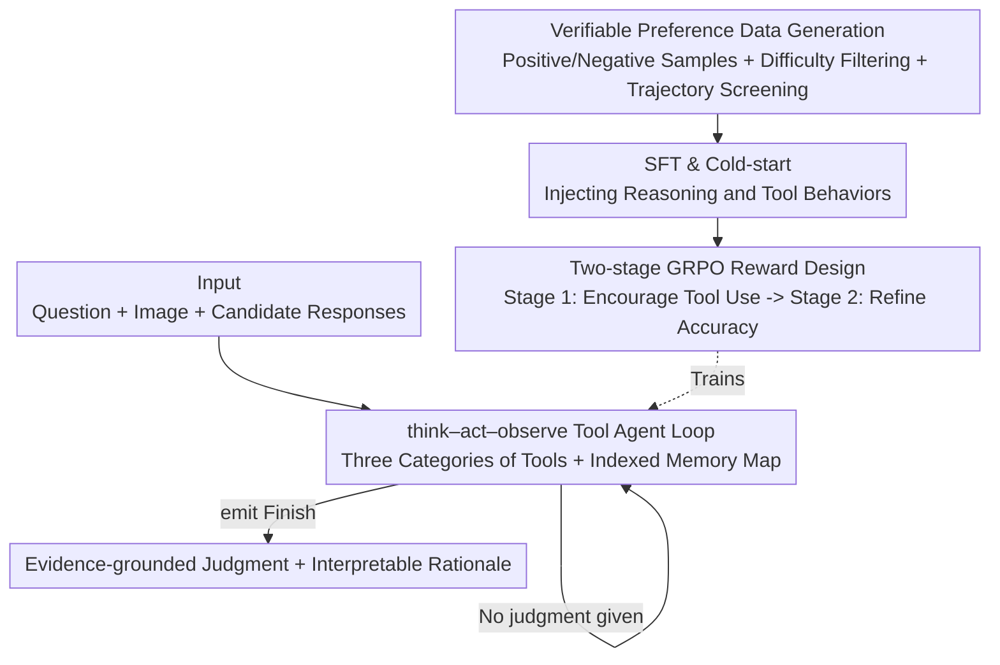

# ARM-Thinker: Reinforcing Multimodal Generative Reward Models with Agentic Tool Use and Visual Reasoning

**Conference**: CVPR 2026  
**Paper**: [CVF Open Access](https://openaccess.thecvf.com/content/CVPR2026/html/Ding_ARM-Thinker_Reinforcing_Multimodal_Generative_Reward_Models_with_Agentic_Tool_Use_CVPR_2026_paper.html)  
**Code**: TBD  
**Area**: Multimodal VLM / RLHF Alignment  
**Keywords**: Multimodal Reward Model, Agentic Tool Use, think-act-verify, GRPO, Evidence-grounded Judgment

## TL;DR
ARM-Thinker transforms the multimodal reward model from a "one-pass scoring" system into an agent that actively invokes tools (crop-and-zoom, document retrieval, instruction verification) to seek evidence. Using a two-stage GRPO training strategy—encouraging tool usage followed by refining accuracy—the 7B model achieves average gains of +16.2%, +9.6%, and +4.2% across reward modeling, think-with-images, and general reasoning benchmarks, respectively, matching or even surpassing GPT-4o on reward and tool-use benchmarks.

## Background & Motivation

**Background**: Reward Models (RM) are core components for aligning LLMs/LVLMs with human preferences. As tasks become increasingly cross-modal, open-ended, and fine-grained, judging the correctness of a response relies more on "semantic understanding + evidence grounding" rather than mere string matching with scarce or ambiguous ground truths.

**Limitations of Prior Work**: Existing reward signals follow two paths, both of which fail on complex multimodal tasks. First, rule-based verifiers are fragile to paraphrasing, cannot provide partial credit, and fail when ground truths are subjective. Second, generative reward models typically output scores via a **single forward pass without tools**, leading to hallucinatory rationales and position/length biases. They cannot retrieve or verify cited content, often rewarding "fluent but groundless" responses while punishing "concise but evidenced" ones.

**Key Challenge**: Modern multimodal judgment is inherently a **multi-step, evidence-grounded** process requiring cross-page retrieval, maintaining spatial localization after cropping/scaling, and distinguishing between "plausible but unsupported" and "evidenced" responses. Furthermore, agentic judgment is a planning problem: the judge must decide when to think, which tool to call, what parameters to pass, and how to integrate intermediate results into a hallucination-free causal chain. Existing RMs lack a think–act–verify loop and credit assignment for "tool decisions," resulting in a misalignment between training and inference behaviors.

**Goal**: To enable reward models to act as agents that can actively **retrieve, locate, and verify** evidence before judging, grounding scores in "verifiable facts," while establishing a benchmark to evaluate such agentic judgment capabilities.

**Key Insight**: Replace static scoring with an explicit **think–act–verify loop + multimodal toolset**, transforming "judgment" into a verifiable agentic process, and use multi-stage RL to jointly optimize "tool-calling decisions" and "judgment accuracy."

## Method

### Overall Architecture

The core of ARM-Thinker is transforming a standard LVLM (Qwen2.5-VL-7B) into a tool-using judge agent. Given a multimodal query (question + image + candidate responses), the model Enters a ReAct-style **think–act–observe** loop rather than directly outputting a score. In each step, it plans/reasons within `<think>`, invokes a tool (or terminates with `<answer>` to provide final judgment) within `<tool_call>`, and receives the environment's output (text + image) within `<tool_response>`. Formally, a trajectory of length $L$ is denoted as $\tau = \{(\theta_0,t_0,o_0),(\theta_1,t_1,o_1),\ldots,(\theta_L,t_L,o_L)\}$, where $\theta_i$ is reasoning, $t_i$ is the tool call, and $o_i$ is the observation, continuing until a Finish action emits the final reasoning trace $\theta^*$ and answer $a^*$.

To learn this behavior, the model undergoes **SFT/Cold-start** using high-quality CoT trajectories with tool calls (generated via preference data and difficulty filtering), followed by **two-stage GRPO** reinforcement. The first stage encourages tool invocation, while the second stage uses verifiable rewards to refine accuracy and tool efficiency. The agent reasoning loop and training pipeline are integrated as follows:

### Key Designs

**1. Multimodal Tool Agent Loop: think–act–observe + Three Tool Categories + Indexed Memory Map**

This design directly addresses the limitation of RMs being "single forward pass only." ARM-Thinker iteratively interacts between `<think>/<tool_call>/<answer>` and `<tool_response>` using a structured ReAct format, refining its understanding with each observation. It integrates three tool categories: (1) **Instruction Following Verification Tools**—19 text verifiers checking word/sentence counts, keyword constraints, etc., based on the MM-IFEngine schema; (2) **Image Crop/Zoom Tools**—localized focusing on high-resolution images, implementing the "think-with-images" paradigm by dynamically shifting attention; (3) **Document Retrieval Tools**—`doc_page_retrieval_by_query` and `by_index` to fetch relevant pages from long documents.

To maintain state across multiple rounds, it uses an **indexed memory map**: a texts map for candidate responses (e.g., resp_1, resp_2) and an imgs map for accessible image paths (e.g., img_0, img_1). This allows the model to consistently reference specific responses or crops, providing a structured scaffold for long-chain evidence retrieval.

**2. Verifiable Preference Data Generation + Difficulty Filtering + Trajectory Screening: Solving Agentic Label Scarcity**

The main bottleneck is the lack of "judgment trajectories with tool calls." The authors build a scalable pipeline: First, construct preference pairs. General judgment supervision is sourced from LLaVA-Critic, supplemented with task data from DeepEyes (cropping), MM-IFEngine (verification), and MP-DocVQA (retrieval). For each positive sample $r^+$, GPT-4o-mini generates a semantically related but flawed negative sample $r^-$, forming preference pairs $\mathcal{D}_{\text{pair}}=\{(q,I,r^+,r^-)\}$ where $r^+\succ r^-$. 

Two critical filters are applied: **Difficulty Filtering**—discarding samples where the base model succeeds in 5 rollouts (100%) to focus on informative hard cases; and **Three-dimensional Screening**—trajectories generated by a stronger LVLM are filtered based on format, accuracy, and behavior (whether tools were actually successfully invoked).

**3. Two-stage GRPO Reward Design: Encouraging Exploration and Hierarchical Accuracy**

This design manages the tension between encouraging tool use and preventing "over-calling." **Stage 1 (Tool Call Encouragement)**: The goal is exploration. Binary rewards are defined as $\mathcal{R}_{\text{tool}}=\mathcal{R}_{\text{f}}+\mathcal{R}_{\text{try}}\,\mathbb{I}_{tool\_calls>0}$, where $\mathcal{R}_{\text{f}}$ constrains the think–act–observe output format and $\mathcal{R}_{\text{try}}$ rewards the attempt at reasonable tool calls.

**Stage 2 (Accuracy Refinement)**: Once the model learns to call tools, the focus shifts to factual correctness and tool utility using a **hierarchical conditional reward**:

$$
\mathcal{R}_{\text{acc}} = \begin{cases}
\mathcal{R}_{\text{f}}+\mathcal{R}_{\text{try}}, & \mathcal{R}_{\text{a}}=0 \text{ AND } tool\_calls>0;\\
\mathcal{R}_{\text{f}}+\mathcal{R}_{\text{a}}, & \mathcal{R}_{\text{a}}>0 \text{ AND } succ\_tool\_calls=0;\\
\mathcal{R}_{\text{f}}+\mathcal{R}_{\text{a}}+\mathcal{R}_{\text{succ}}, & \mathcal{R}_{\text{a}}>0 \text{ AND } succ\_tool\_calls>0.
\end{cases}
$$

Here, $\mathcal{R}_{\text{a}}$ evaluates final answer correctness, and $\mathcal{R}_{\text{succ}}$ provides extra credit if tool calls directly contributed to a correct prediction. This structure mirrors verifiable logic: incorrect answers only get rewards for format/attempt; correct answers without functional tool use get answer rewards; only correct answers aided by tools receive full credit.

### Loss & Training
The base model is Qwen2.5-VL-7B. The pipeline consists of SFT & Cold-start (reinforcing general judgment and injecting structured tool behaviors) followed by two-stage GRPO. For each sample, $n$ trajectories $\mathcal{G}=\{(\tau_i,a_i)\}_{i=1}^n$ are rolled out and optimized according to the hierarchical reward stages. Difficulty filtering is consistently applied across all stages.

## Key Experimental Results

### Main Results

Reward Modeling Benchmarks (VL-RewardBench Multimodal / RewardBench-2 Text / ARMBench-VL):

| Model | VL-RewardBench(Avg) | RewardBench-2 | ARMBench-VL(Avg) | Avg |
|------|------|------|------|------|
| Qwen2.5-VL-7B (Baseline) | 50.1 | 47.1 | 46.1 | 47.8 |
| InternVL3.5-8B | 50.9 | 53.7 | 55.5 | 53.4 |
| Qwen3-VL-8B | 66.0 | 58.9 | 50.6 | 58.5 |
| GPT-4o | 65.8 | 65.5 | 63.3 | 64.9 |
| **ARM-Thinker-7B** | **67.8 (+17.7)** | **59.6 (+12.5)** | **64.6 (+18.5)** | **64.0 (+16.2)** |

Visual Tool Use (Think-with-Images) Benchmarks:

| Model | V* | HRBench-4K | HRBench-8K | MME-RW | Avg |
|------|------|------|------|------|------|
| Qwen2.5-VL-7B (Baseline) | 75.4 | 69.1 | 64.6 | 58.5 | 66.9 |
| Mini-o3† | 88.2 | 77.5 | 73.3 | 65.5 | 76.1 |
| Qwen3-VL-8B | 82.2 | 76.8 | 70.4 | 63.1 | 73.1 |
| **ARM-Thinker-7B** | **86.4 (+11.0)** | **80.1 (+11.0)** | **73.7 (+9.1)** | **65.8 (+7.3)** | **76.5 (+9.6)** |

### Ablation Study

Tool invocation ablation (Tab. 5) — Baseline performance drops with tools, while ARM-Thinker gains:

| Config | ARMBench-VL | V* | HR-4K | HR-8K | Description |
|------|------|------|------|------|------|
| Qwen2.5-VL-7B | 46.1 | 75.4 | 69.1 | 64.6 | Baseline (No tools) |
| Qwen2.5-VL-7B w/ tool | 44.3 | 50.3 | 60.1 | 51.8 | Baseline fails when tools are enabled |
| ARM-Thinker-7B | 59.2 | 82.2 | 76.6 | 70.5 | Stronger even without tools |
| ARM-Thinker-7B w/ tool | **64.6 (+5.4)** | **86.4 (+4.2)** | **80.1 (+3.5)** | **73.7 (+3.2)** | Tools provide stable gains |

### Key Findings
- **Tool capability is not a free lunch**: Enabling tools for the baseline model causes a performance crash (V* 75.4→50.3) because it lacks the skill to use them; ARM-Thinker demonstrates that tool use must be explicitly trained.
- **Adaptive rewarding balances under-use and over-invocation**: Rewarding only accuracy leads to tool neglect (call rate ≈0.7); a fixed tool bonus leads to over-calling (≈1.15). ARM-Thinker’s adaptive reward achieves higher accuracy with a stable call rate (~1.12), indicating tool use based on contextual utility.
- **Judgment capability overflows to general reasoning**: Training focused on "verification" leads to gains in WeMath (+10.9) and LogicVista (+8.7), suggesting that discriminating response quality fosters logical analysis and error detection skills.

## Highlights & Insights
- **Redefining Reward Models as Agents**: The "aha!" moment is treating the RM not as a scorer, but as an agent that grounding scores in "verifiable evidence," addressing the root cause of generative RM hallucinations.
- **Multi-stage + Hierarchical RL for Agentic Tool Use**: The combination of Stage 1 (exploration) and Stage 2 (utility-based credit assignment) is a robust agentic RL recipe applicable to search, code, or RAG-based judgment.
- **Alignment of Verifiable Supervision & Reward Structure**: Constructing counterfactual negatives and then mirroring that verification logic in the reward branches ensures training signals are perfectly aligned with the validation goal.

## Limitations & Future Work
- The current toolset is relatively small (3 categories); plans exist to expand tool variety.
- Reproduction difficulty: many critical details (sampling stats, tool definitions, weight splits) are relegated to the supplementary materials.
- Dependence on GPT-4o-mini for negative sample generation: potential systematic biases from the generator might pollute the reward signal if not strictly filtered.
- Tool call frequency (~1.12) implies limited multi-step interaction; performance under extremely long-chain evidence retrieval across many pages remains to be tested.

## Related Work & Insights
- **vs. Rule-based Verifiers**: ARM-Thinker handles partial credit and subjective scenarios where string-based rules fail.
- **vs. Non-agentic Generative RMs**: While models like UnifiedReward-7B achieve high scores on specific benchmarks, they lack generalizability; ARM-Thinker's agentic loop provides more balanced across-benchmark performance.
- **vs. Think-with-Images Specialized Models (e.g., Mini-o3)**: These models train on task-specific demonstrations. ARM-Thinker achieves similar levels through **reward modeling and optimization**, proving that well-designed reward signals can induce systematic tool strategies without massive expert demonstration labels.

## Rating
- Novelty: ⭐⭐⭐⭐⭐ (First to implement agentic think–act–verify in multimodal RM)
- Experimental Thoroughness: ⭐⭐⭐⭐ (Extensive benchmarks and ablations; some details in supplementary)
- Writing Quality: ⭐⭐⭐⭐ (Clear motivation and framework formulation)
- Value: ⭐⭐⭐⭐⭐ (7B model matching GPT-4o; provides a transferable agentic RL recipe)

<!-- RELATED:START -->

## Related Papers

- [\[CVPR 2026\] GGBench: A Geometric Generative Reasoning Benchmark for Unified Multimodal Models](ggbench_a_geometric_generative_reasoning_benchmark_for_unified_multimodal_models.md)
- [\[ICLR 2026\] VTool-R1: VLMs Learn to Think with Images via Reinforcement Learning on Multimodal Tool Use](../../ICLR2026/vlm_reasoning/vtool-r1_vlms_learn_to_think_with_images_via_reinforcement_learning_on_multimoda.md)
- [\[CVPR 2026\] Improving Vision-language Models with Perception-centric Process Reward Models](improving_vision-language_models_with_perception-centric_process_reward_models.md)
- [\[CVPR 2026\] Hierarchical Process Reward Models are Symbolic Vision Learners](hierarchical_process_reward_models_are_symbolic_vision_learners.md)
- [\[ICML 2026\] Active Exploring like a Pigeon: Reinforcing Spatial Reasoning via Agentic Vision-Language Models](../../ICML2026/vlm_reasoning/active_exploring_like_a_pigeon_reinforcing_spatial_reasoning_via_agentic_vision-.md)

<!-- RELATED:END -->
