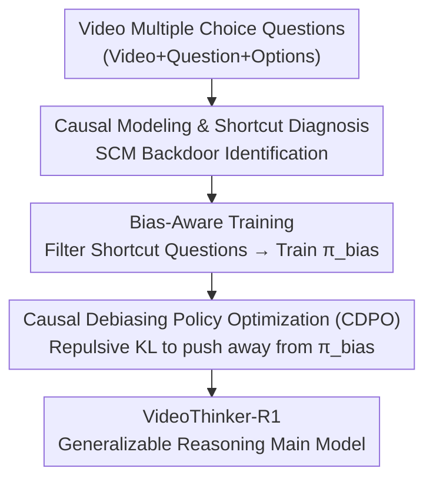

# Beyond Perceptual Shortcuts: Causal-Inspired Debiasing Optimization for Generalizable Video Reasoning in Lightweight MLLMs

**Conference**: CVPR 2026  
**arXiv**: [2605.01324](https://arxiv.org/abs/2605.01324)  
**Code**: https://github.com/falonss703/VideoThinker (Available)  
**Area**: Multimodal VLM / Video Reasoning / Reinforcement Learning  
**Keywords**: Lightweight MLLM, Perceptual Shortcuts, Causal Debiasing, RL Fine-tuning, Repulsive KL

## TL;DR
This paper discovers that RL (GRPO) fine-tuning forces lightweight (3B) video MLLMs to take "perceptual shortcuts" instead of genuine reasoning. By first training a "bias model" specialized in shortcuts and then using a repulsive objective (CDPO) with a reversed KL divergence sign to push the main model away from the bias model, it achieves a 14.2% improvement on CLEVRER over GRPO using only 1% of the data.

## Background & Motivation

**Background**: Fine-tuning multimodal large language models using reinforcement learning (typically GRPO, a critic-free variant of PPO) to enhance reasoning capabilities has achieved significant success in large-scale (7B+) models. Embedding reasoning capabilities into lightweight models (3B) suitable for edge deployment is a critical requirement.

**Limitations of Prior Work**: Paradoxically, RL techniques proven effective on large models suffer significant performance degradation when applied to small 3B models. Specifically, diagnostic experiments showed that after GRPO fine-tuning, a 3B model's accuracy on truly inferential tasks plummeted from 73.9% to 63.1%, while it remained stable on purely observational tasks. Fine-tuning essentially "breaks" the model's reasoning capability.

**Key Challenge**: The root cause is not the optimization algorithm but the "perceptual shortcuts" hidden in the training data. Even in common counterfactual reasoning datasets like CLEVRER, up to 74.0% (13,674/18,473) of counterfactual questions are "pseudo-reasoning." For instance, in a question like "What happens if the yellow ball is removed?", if the yellow ball is irrelevant to the causal chain, the model can answer correctly by merely scanning the original video and describing surface events without actual counterfactual deduction. 3B models, having weaker fundamental capabilities, are more prone to being misled by these statistical shortcuts, causing RL to favor these shortcuts and leading to the "unlearning" of true reasoning.

**Goal**: ① Formally diagnose the neglected failure mode of "perceptual shortcuts"; ② Design a fine-tuning framework that actively blocks shortcuts to force the model toward true reasoning paths.

**Key Insight**: The video question-answering process is modeled as a Structural Causal Model (SCM), identifying the query as a confounder that simultaneously opens a "true reasoning path $\mathcal{Q}\to\mathcal{T}\to\mathcal{A}$" and a "shortcut backdoor path $\mathcal{Q}\to\mathcal{O}\to\mathcal{A}$". Debiasing essentially involves cutting this backdoor path.

**Core Idea**: Since the theoretical standard solution (backdoor adjustment) is intractable, an "adversarial approximation" is used—training a bias model as a negative template that embodies the shortcuts, and then using a repulsive objective to push the main model away from it, effectively cutting the backdoor path.

## Method

### Overall Architecture

VideoThinker is a two-stage causal debiasing framework that takes video multiple-choice questions as input and outputs a debiased, generalizable reasoning policy model $\pi_\theta$. The core intuition: if RL attracts the model toward shortcuts, explicitly materialize the "shortcut" into a model and push the main model away during fine-tuning. The first stage, **Bias Aware Training**, uses ground-truth collision logs from CLEVRER to filter "observational/shortcut" questions to train a bias model $\pi_{\text{bias}}$. The second stage, **CDPO**, freezes $\pi_{\text{bias}}$ and fine-tunes the main model on the full dataset. The objective includes "reward attraction" (getting it right) and "repulsive KL" (staying away from the bias model), forcing the model to explore true reasoning paths.

### Key Designs

**1. Causal Diagnosis of Perceptual Shortcuts: Attributing Model Failure to Data Backdoors**

The limitation of prior work lies in focusing only on optimization algorithms and reward signals instead of the training data. The process is modeled as an SCM with four variables: query $\mathcal{Q}$, implicit true reasoning $\mathcal{T}$, surface observation $\mathcal{O}$, and answer $\mathcal{A}$. The ideal reasoning chain is $\mathcal{Q}\to\mathcal{T}\to\mathcal{A}$, but $\mathcal{Q}$ also activates a shallow pattern matching path $\mathcal{Q}\to\mathcal{O}\to\mathcal{A}$. Since $\mathcal{Q}$ is a confounder pointing to both $\mathcal{O}$ and $\mathcal{T}$, it opens a backdoor between $\mathcal{T}$ and $\mathcal{A}$ via $\mathcal{O}$, creating spurious correlations. Because 74% of samples can be answered via $\mathcal{O}$ alone, the model learns the "path of least resistance."

**2. Bias-Aware Training: Materializing the "Bad Path" into a Bias Model**

To cut the backdoor, standard backdoor adjustment requires marginalizing the confounder $\mathcal{O}$: $P(\mathcal{A}|do(\mathcal{T}=t),\mathcal{Q}=q)=\int_{\mathcal{O}}P(\mathcal{A}|\mathcal{T},\mathcal{O},\mathcal{Q})P(\mathcal{O}|\mathcal{Q})d\mathcal{O}$. Since $\mathcal{O}$ is high-dimensional and continuous, this is intractable. Instead of integration, a "bias model" $\pi_{\text{bias}}$ specialized in the path $\mathcal{Q}\to\mathcal{O}\to\mathcal{A}$ is trained. Samples are automatically filtered via CLEVRER collision logs; if an event in the options already occurred in the original video (irrespective of counterfactual conditions), it is labeled as a "shortcut" question. $\pi_{\text{bias}}$ is trained without KL constraints (following DAPO) to converge quickly to the simplest shortcut solutions, acting as a negative anchor.

**3. CDPO Repulsive Policy Optimization: Reversing the KL Sign as "Repulsion"**

In standard GRPO, the KL term is $-\beta D_{\text{KL}}(\pi_\theta\|\pi_{\text{ref}})$, which pulls the policy **toward** the reference model. CDPO changes this to $+\beta D_{\text{KL}}(\pi_\theta\|\pi_{\text{bias}})$. Since the total objective $\mathcal{J}_{\text{CDPO}}$ is maximized, the positive sign actively **increases** the distributional distance between the main model and the bias model. This creates a repulsive force that penalizes token distributions similar to the shortcut solutions. Consequently, the main model is attracted to correct answers by the reward $\hat{A}_{i,t}$ but pushed away from shortcut logic by the repulsion, forcing the exploration of complex reasoning paths $\mathcal{Q}\to\mathcal{T}\to\mathcal{A}$ that $\pi_{\text{bias}}$ cannot reach.

### Loss & Training

The CDPO objective function is:

$$\mathcal{J}_{\text{CDPO}}(\theta)=\mathbb{E}\Big[\tfrac{1}{G}\textstyle\sum_i \tfrac{1}{|o_i|}\sum_t\big(\min(r_{i,t}\hat{A}_{i,t},\,\text{clip}(r_{i,t},1-\varepsilon,1+\varepsilon)\hat{A}_{i,t})+\beta D_{\text{KL}}(\pi_\theta\|\pi_{\text{bias}})\big)\Big]$$

The base model is Qwen2.5-VL-3B-Instruct, trained on two A6000 (48GB) GPUs. The bias model is trained for 500 steps, followed by VideoThinker for another 500 steps. Parameters: $\beta=0.01$, group size $G=8$, learning rate $10^{-6}$, utilizing soft accuracy and format rewards. Training samples up to 16 frames at $128\times28\times28$ resolution; evaluation uses 32 frames at $256\times28\times28$.

## Key Experimental Results

### Main Results

Evaluated against three video reasoning benchmarks (CLEVRER / MMVU / Video-Holmes) and three general video understanding benchmarks (MVBench / TempCompass / VideoMME). VideoThinker-R1 used only 1K RL data with no SFT:

| Model | Training Volume | CLEVRER$_{cf}$ | MMVU$_{mc}$ | VideoHolmes | MVBench | TempCompass | VideoMME$_{wo}$ |
|------|--------|------|------|------|------|------|------|
| Qwen2.5-VL-3B (CoT) | - | 44.7 | 52.8 | 32.5 | 49.6 | 30.0 | 52.0 |
| VideoRFT-3B | 110K SFT&RL | 59.3 | 55.1 | 33.0 | 59.5 | 61.0 | 45.4 |
| Qwen2.5-VL-GRPO | 1K RL | 64.9 | 52.0 | 32.3 | 54.9 | 41.4 | 50.3 |
| Video-UTR-7B | - | - | - | - | 58.8 | 59.7 | 52.6 |
| **VideoThinker-R1 (3B)** | **1K RL** | **79.1** | **56.8** | **34.3** | **60.9** | **63.5** | **52.4** |

Ours improves 14.2% on CLEVRER over the GRPO baseline at the same scale. It also surpasses the larger Video-UTR-7B on MVBench (+2.1%) and TempCompass (+3.8%).

### Ablation Study

| Configuration | CLEVRER$_{cf}$ | MMVU$_{mc}$ | Description |
|------|------|------|------|
| GRPO (Baseline) | 64.9 | 52.0 | Standard RL, no debiasing |
| Repulsive Target = Qwen2.5VL-3B | 63.3 | 53.3 | Self-repulsion leads to policy collapse |
| Repulsive Target = VideoRFT-3B | 75.4 | 53.1 | Repelling a "strong model" is less effective |
| Repulsive Target = Bias Model | **79.1** | **56.8** | Repelling specialized bias model is optimal |
| KL-Minimization ($-\beta$, Attraction) | 74.3 | 52.6 | Incorrect direction, fails to generalize on MMVU |
| KL-Maximization ($+\beta$, Repulsion) | **79.1** | **56.8** | Correct repulsion direction |
| $\beta=0.01$ | **79.1** | 56.8 | Selected for Main Results |

### Key Findings

- **Specificity of the bias model is critical**: Repelling a general strong model (VideoRFT-3B) yields 75.4, whereas repelling the specialized bias model reaches 79.1. Self-repulsion (repelling the initial policy) causes policy collapse.
- **Direction of repulsion matters**: KL-Minimization (attraction) barely improves MMVU ($52.6$), while KL-Maximization (repulsion) is necessary—reasoning emerges from "being pushed away from bad patterns."
- **Small models benefit more**: The gain is more pronounced at the 3B scale compared to 7B, as "perceptual shortcuts" are primarily a deficiency of low-capacity models.

## Highlights & Insights

- **Materializing "bad behavior" into a model** for reverse utilization is a clever move: rather than solving intractable integrals, training a "shortcut expert" as a negative anchor is a practical engineering approximation for causal backdoor adjustment.
- **A single sign flip changes RL semantics**: CDPO turns the KL term from "attraction/constraint" to "repulsion," achieving active debiasing with almost zero structural changes.
- **Automatic bias data construction**: Leveraging dataset ground-truth logs to determine if an answer is purely observational allows for the creation of bias datasets without additional human labeling.
- **Closed loop of "Diagnosis → Attribution → Intervention"**: The logic chain is complete, moving from exposing performance collapse to SCM-based attribution and eventually targeted intervention.

## Limitations & Future Work

- **Heavy reliance on structured ground-truth**: The bias model depends on the precise event logs of CLEVRER. Constructing high-quality bias models for real-world videos without such logs remains an open question.
- **Diminishing returns with scale**: Gain on 7B models is less significant than on 3B models. The value proposition is primarily centered on lightweight models for edge deployment.
- **$\beta$ sensitivity**: In-domain performance is sensitive to $\beta$ (too high leads to over-correction/forgetting useful logic), requiring per-dataset tuning.

## Related Work & Insights

- **vs. GRPO/Standard RL**: While GRPO optimizes "how to learn" via rewards, it ignores spurious correlations in data. Ours applies an intervention directly to the data backdoor.
- **vs. Intermodal Debiasing**: Prior work often addressed "text vs. vision" modality conflicts. This paper identifies an **intramodal** perceptual shortcut where models still guess based on surface observations within the correct modality, representing a more deceptive failure mode.

## Rating
- Novelty: ⭐⭐⭐⭐⭐ First diagnosis of intramodal shortcuts in MLLM reasoning; simple yet innovative sign-flipped KL.
- Experimental Thoroughness: ⭐⭐⭐⭐ Extensive benchmarks and ablations, though heavily centered on CLEVRER.
- Writing Quality: ⭐⭐⭐⭐⭐ Clear logical flow from SCM derivation to practical implementation.
- Value: ⭐⭐⭐⭐ Provides a highly data-efficient (1% data) solution for edge MLLM reasoning.

<!-- RELATED:START -->

## Related Papers

- [\[CVPR 2026\] Streaming Video Crime Anticipation with Spatio-Temporal Causal Reasoning](streaming_video_crime_anticipation_with_spatio-temporal_causal_reasoning.md)
- [\[CVPR 2026\] Think360: Evaluating the Width-centric Reasoning Capability of MLLMs Beyond Depth](think_360_evaluating_the_width-centric_reasoning_capability_of_mllms_beyond_dept.md)
- [\[CVPR 2026\] CaST-Bench: Benchmarking Causal Chain-Grounded Spatio-Temporal Reasoning for Video Question Answering](cast-bench_benchmarking_causal_chain-grounded_spatio-temporal_reasoning_for_vide.md)
- [\[CVPR 2026\] REVISOR: Beyond Textual Reflection, Towards Multimodal Introspective Reasoning in Long-Form Video Understanding](revisor_beyond_textual_reflection_towards_multimodal_introspective_reasoning_in_.md)
- [\[CVPR 2026\] ReAlign: Generalizable Image Forgery Detection via Reasoning-Aligned Representation](realign_generalizable_image_forgery_detection_via_reasoning-aligned_representati.md)

<!-- RELATED:END -->
